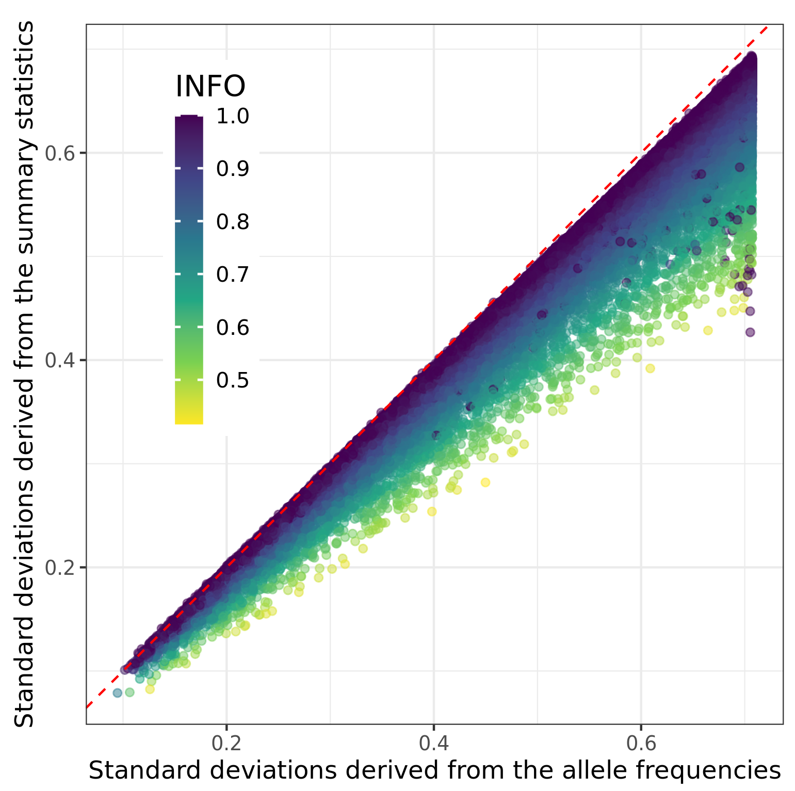

```{r setup, include=FALSE}
# renderthis::to_pdf("ldpred2-wcpg2023.Rmd", partial_slides = TRUE)
options(htmltools.dir.version = FALSE, width = 70)
knitr::opts_chunk$set(fig.align = 'center', dev = "svg", out.width = "70%",
                      echo = FALSE, comment = "", fig.width = 5, global.par = TRUE)
ICON_R_PROJECT <- icons::fontawesome$brands$`r-project`
ICON_TRI_EXCL  <- icons::fontawesome$solid$`exclamation-triangle`
ICON_INFO      <- icons::fontawesome$solid$`info-circle`
```

class: title-slide center middle inverse

<br>

# Quality Control of GWAS Summary Statistics

<br>

<br>

## Florian Privé 
### Aarhus Univ, Denmark
#### `r icons::icon_style(fill = "white", icons::fontawesome$brands$twitter)` `r icons::icon_style(fill = "white", icons::fontawesome$brands$github)` privefl

---

### GWAS summary statistics

<br>

- $\hat{\gamma}_j$ &mdash; the GWAS effect size of variant $j$ (marginal effect), 

- $\text{se}(\hat{\gamma}_j)$ &mdash; its standard error,

- $z_j = \frac{\hat{\gamma}_j}{\text{se}(\hat{\gamma}_j)}$ &mdash; the Z-score of variant $j$,

- $n_j$ &mdash; the GWAS sample size associated with variant $j$, 

- $f_j$ &mdash; the allele frequency of variant $j$,

- $\text{INFO}_j$ &mdash; the imputation INFO score of variant $j$

---

### The first quality control I already recommend

**Compare standard deviations** of genotypes estimated in 2 ways:

<br>

1.  - When linear regression was used 
    \begin{equation}
    \text{sd}(G_j) \approx \dfrac{\text{sd}(y)}{\sqrt{n_j \cdot \text{se}(\hat{\gamma}_j)^2 + \hat{\gamma}_j^2}}
    \end{equation}

    - When logistic regression was used (case-control phenotype)
    \begin{equation}\label{eq:approx-sd-log}
    \text{sd}(G_j) \approx \dfrac{2}{\sqrt{n_j^\text{eff} \cdot \text{se}(\hat{\gamma}_j)^2 + \hat{\gamma}_j^2}}
    \end{equation}
<br>
2. \begin{equation}\text{sd}(G_j) \approx \sqrt{2 \cdot f_j \cdot (1 - f_j) \cdot \text{INFO}_j}\end{equation}

---

### Detect differences in per-variant N

```{r, out.width="72%"}
knitr::include_graphics("figures/simu-qc-plot.jpg")
```

---

```{css}
.pull_left {
  float: left;
  width: 65%;
}
.pull_right {
  float: right;
  width: 28%;
}
```

### Detect overestimated effective N from meta-analysis of binary traits

.pull_left[
```{r, out.width="100%"}
knitr::include_graphics("figures/cad_quick_qc.png")
```

<span class="footnote"> $N_\text{eff} = \frac{4}{1 / N_\text{ca} + 1 / N_\text{co}}$ </span>
]

.pull_right[
```{r, out.width="70%"}
knitr::include_graphics("figures/cad_neff_perstudy.png")
```
]

---

### Detect lower imputation INFO scores

```{r, out.width="72%"}

```

---

### Multi-ancestry INFO scores are overestimated (e.g. in the UK Biobank)

```{r, out.width="72%"}
knitr::include_graphics("figures/overestim-info.png")
```

---

### Read more about this

<br>

- Privé, F., et al. (2022) "Identifying and correcting for misspecifications in GWAS summary statistics and polygenic scores." *Human Genetics and Genomics Advances* 3.4. 

- Grotzinger, A.D., et al. (2023) "Pervasive downward bias in estimates of liability-scale heritability in genome-wide association study meta-analysis: a simple solution." *Biological Psychiatry* 93.1.

- Gazal, S., et al. (2018) "Functional architecture of low-frequency variants highlights strength of negative selection across coding and non-coding annotations." *Nature Genetics* 50.11.

- Privé, F. (2022) "Using the UK Biobank as a global reference of worldwide populations: application to measuring ancestry diversity from GWAS summary statistics." *Bioinformatics* 38.13.

---

### Additional (complementary) QC &#8212; DENTIST methodology

<br>

GCTA method which compares reported Z-scores with imputed Z-scores.

It is particularly good at detecting allelic errors (opposite effect).

.footnote[DENTIST citation: Chen, W., et al. (2021) "Improved analyses of GWAS summary statistics by reducing data heterogeneity and errors." *Nature Communications* 12.1.]

--

<br>

$\chi^2(1)$ test statistic:
```{r, out.width="90%"}
knitr::include_graphics("figures/eq-dentist.jpg")
```

where $i$ is the variant of interest, and $t$ the variants used for imputing.

---

### Quick simulation results

<br>

Design:

- Use 145K variants on chromosome 22 with MAF > 0.005 and INFO > 0.8

- Simulate some phenotype with heritability of 0.1 and polygenicity of 0.01

- Compute the GWAS summary statistics using N=50K    
(Z-scores in [-20; 20], mostly in [-10; 10])

- For 1000 variants at random, assign them an opposite effect (allelic error)

--

<br>

Results:

- 802 true positives (TP, real errors) and 3209 false positives (FP)    
with DENTIST

--

- vs 686 TP and 9 FP    
with my alternative methodology

---

### Benefits of this QC 

<br>

**I NEED YOUR HELP**

<br>

I need to find some GWAS summary statistics where I can show this makes a real difference. 

---

### Current project

- Check and improve the DENTIST methodology,    
to ideally get more power and less false positive

- As an `r ICON_R_PROJECT` implementation


<br>
<br>

### Part of a larger project

- Provide some very well quality-controlled GWAS summary statistics

- In a standardized format

- Probably as a GitHub repo of R scripts,    
where each script processes a specific GWAS summary statistics file

---

### Take-home messages

<br>

- There are issues in many GWAS summary statistics

--

- You can detect many of them by comparing SDs estimated in two ways

--

- You can detect other issues (complementary) with DENTIST

--

- DENTIST is currently prone to false positives; it needs to be improved

--

- I hope to provide QCed GWAS summary statistics for everyone to use

---

class: inverse, center, middle

## Thank you for your attention

<br>

Presentation available at [bit.ly/qc_sumstats_EMGM](https://bit.ly/qc_sumstats_EMGM)

<br>

`r icons::icon_style(fill = "white", icons::fontawesome$brands$twitter)` `r icons::icon_style(fill = "white", icons::fontawesome$brands$github)` privefl

.footnote[Slides created via the R package [**xaringan**](https://github.com/yihui/xaringan)]
