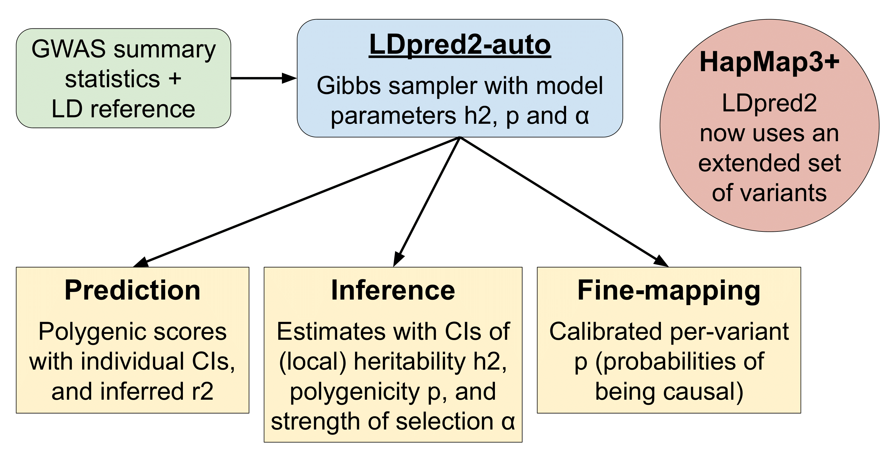

```{r setup, include=FALSE}
options(htmltools.dir.version = FALSE, width = 70)
knitr::opts_chunk$set(fig.align = 'center', dev = "svg", out.width = "70%",
                      echo = FALSE, comment = "", fig.width = 5, global.par = TRUE)
ICON_R_PROJECT <- icons::fontawesome$brands$`r-project`
ICON_TRI_EXCL <- icons::fontawesome$solid$`exclamation-triangle`
```

class: title-slide center middle inverse

<br>

# Inferring disease architecture and predictive ability with LDpred2-auto

<br>

## ESHG 2023 &mdash; P18.039.C &mdash; C23.06

<br>

## Florian Privé (@privefl) 
### Aarhus University (DK)

<br>

---

### Overview of what LDpred2-auto can now provide

<br>

```{r, out.width="95%"}

```

.footnote[Preprint on bioRxiv]

---

### Challenges and future directions

<br>

- Using more variants (several millions)

- $R$ is estimated from a different population (compared to the GWAS)

- $R$ is not positive definite (due to the large number of variants)

- Deciding how much regularization is needed $R^* = sR+ (1-s)I$

- Improving filtering of chains (post-QC)
