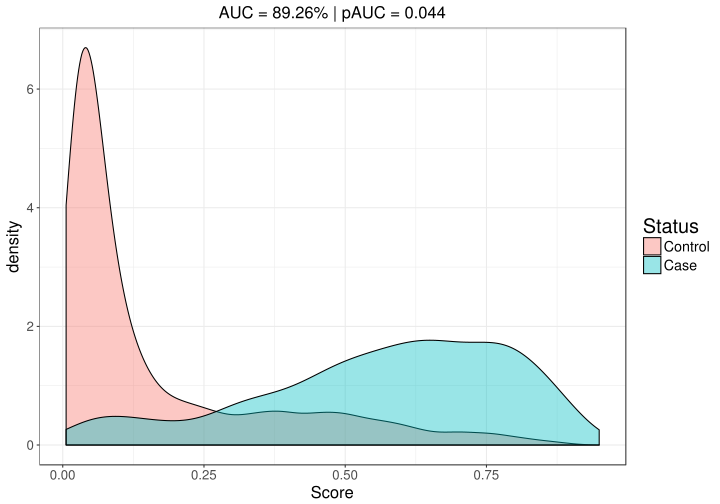

```{r setup, include=FALSE}
options(htmltools.dir.version = FALSE)
knitr::opts_chunk$set(echo = FALSE, fig.align = 'center', dev = "svg")
```

class: title-slide center middle inverse

# Using genetic data to predict disease status<br>based on statistical learning

## Florian Privé (TIMC-IMAG - BCM)

### FADEX IA & Health - June 27, 2018

---

class: center, middle, inverse

# Introduction

---

## The data I work with: very large genotype matrices

<br>

- Each variable (column): number of mutations for **one position of the genome** (generally between 100,000 to several millions) -> **ultra-high dimensional** data

```{r, out.width="70%"}
knitr::include_graphics("https://jmtomko.files.wordpress.com/2015/12/dna-double-helix.png")
```

<br>

- Each observation (row): one individual (generally between 1000 and 1M)

.footnote[Example of a dataset I previously worked with: 15K x 280K, [celiac disease](https://doi.org/10.1038/ng.543) (~30GB)]

---

## Polygenic Risk Scores (PRS) for predictive medicine

### Application: to identify high risk individuals

```{r, out.width="95%"}
knitr::include_graphics("figures/PRS.png")
```

---

## Interest in prediction: polygenic risk scores (PRS)

- Wray, Naomi R., Michael E. Goddard, and Peter M. Visscher. "**Prediction of individual genetic risk** to disease from genome-wide association studies." Genome research 17.10 (**2007**): 1520-1528.

- Wray, Naomi R., et al. "Pitfalls of **predicting complex traits** from SNPs." Nature Reviews Genetics 14.7 (**2013**): 507.

- Dudbridge, Frank. "Power and **predictive accuracy of polygenic risk scores**." PLoS genetics 9.3 (**2013**): e1003348.

- Chatterjee, Nilanjan, Jianxin Shi, and Montserrat García-Closas. "Developing and evaluating **polygenic risk prediction** models for stratified disease prevention." Nature Reviews Genetics 17.7 (**2016**): 392.

- Martin, Alicia R., et al. "Human demographic history impacts **genetic risk prediction** across diverse populations." The American Journal of Human Genetics 100.4 (**2017**): 635-649.

.footnote2[Still a gap between current predictions and clinical utility.</br>Need more optimal predictions + larger sample sizes.]

---

class: center, middle, inverse

# How to analyze large genomic data?

---

## Our two R packages: bigstatsr and bigsnpr

### Statistical tools with big matrices stored on disk

<br>

<a href="https://doi.org/10.1093/bioinformatics/bty185" target="_blank">
```{r, out.width='70%'}
knitr::include_graphics("figures/bty185.png")
```
</a>

<br>

- {bigstatsr} for many types of matrix, to be used by any field of research

- {bigsnpr} for functions that are specific to the analysis of genetic data


<br>

Package {bigstatsr} provides fast PCA, association and predictive models, etc.

---

class: center, middle, inverse

# How to predict disease status<br>based on genotypes?

---

## Penalized logistic regression

We are developing an **efficient implementation** for this problem:

<br>

<Small>$$\arg\!\min_{\beta_0,~\beta}(\lambda, \alpha)\left\{  \underbrace{ -\sum_{i=1}^n \left( y_i \log\left(p_i\right) + (1 - y_i) \log\left(1 - p_i\right) \right) }_\text{Loss function}   +   \underbrace{ \lambda \left((1-\alpha)\frac{1}{2}\|\beta\|_2^2 + \alpha \|\beta\|_1\right) }_\text{Penalization}  \right\}$$</Small>

<br>

***

- $x$ is denoting the genotypes and covariables (e.g. principal components),

- $y$ is the disease status we want to predict,

- $\lambda$ is a regularization parameter that needs to be determined and

- $\alpha$ determines relative parts of the regularization $0 \le \alpha \le 1$.

---

## Predict Celiac disease

<br>

```{r, out.width="90%"}

```

---

class: center, middle, inverse

# Thanks!

<br>

Presentation available at

https://privefl.github.io/thesis-docs/FADEX.html

<br>

`r icon::fa("twitter")` [privefl](https://twitter.com/privefl) &nbsp;&nbsp;&nbsp;&nbsp; `r icon::fa("github")` [privefl](https://github.com/privefl) &nbsp;&nbsp;&nbsp;&nbsp; `r icon::fa("stack-overflow")` [F. Privé](https://stackoverflow.com/users/6103040/f-priv%c3%a9)

.footnote[Slides created via the R package [**xaringan**](https://github.com/yihui/xaringan).]
