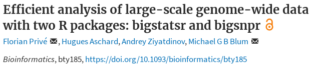
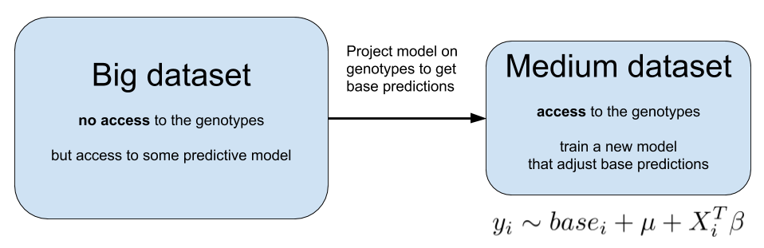

```{r setup, include=FALSE}
options(htmltools.dir.version = FALSE)
knitr::opts_chunk$set(echo = FALSE, fig.align = 'center', dev = "svg")
```

class: title-slide center middle inverse

# Polygenic Risk Scores for<br>Predictive Medecine and Epidemiology

## Florian Privé, Hugues Aschard and Michael Blum

### IAB - June 15, 2018

---

class: center, middle, inverse

# Introduction

---

## From genome-wide association studies (GWAS)<br>to polygenic risk scores (PRS)

<br>


```{r, out.width="95%"}
knitr::include_graphics("https://upload.wikimedia.org/wikipedia/commons/thumb/1/12/Manhattan_Plot.png/546px-Manhattan_Plot.png")
```

<br>

$$PRS_i = \sum_{\substack{j \in S \\ p_j~<~p_T}} \hat\beta_j \cdot G_{i,j}$$

---

## Polygenic Risk Scores (PRS) for epidemiology

<br>

**One application: to provide evidence** for a polygenic contribution to a trait or a shared polygenic relationship between traits.

<br>

```{r, out.width="90%", fig.cap="<small>Source: 10.1111/jcpp.12295</small>"}
knitr::include_graphics("figures/genomic-profile.png")
```

---

## Polygenic Risk Scores (PRS) for epidemiology

```{r, out.width="75%", fig.cap="<small>Source: 10.1038/nature08185</small>"}
knitr::include_graphics("figures/purcell2009.png")
```

---

## Polygenic Risk Scores (PRS) for predictive medicine

### Another application: to identify high risk individuals

```{r, out.width="95%"}
knitr::include_graphics("figures/PRS.png")
```

---

## Interest in prediction: polygenic risk scores (PRS)

- Wray, Naomi R., Michael E. Goddard, and Peter M. Visscher. "**Prediction of individual genetic risk** to disease from genome-wide association studies." Genome research 17.10 (**2007**): 1520-1528.

- Wray, Naomi R., et al. "Pitfalls of **predicting complex traits** from SNPs." Nature Reviews Genetics 14.7 (**2013**): 507.

- Dudbridge, Frank. "Power and **predictive accuracy of polygenic risk scores**." PLoS genetics 9.3 (**2013**): e1003348.

- Chatterjee, Nilanjan, Jianxin Shi, and Montserrat García-Closas. "Developing and evaluating **polygenic risk prediction** models for stratified disease prevention." Nature Reviews Genetics 17.7 (**2016**): 392.

- Martin, Alicia R., et al. "Human demographic history impacts **genetic risk prediction** across diverse populations." The American Journal of Human Genetics 100.4 (**2017**): 635-649.

.footnote2[Still a gap between current predictions and clinical utility.</br>Need more optimal predictions + larger sample sizes.]


---

## Very large genotype matrices

- previously: 15K x 280K, [celiac disease](https://doi.org/10.1038/ng.543) (~30GB)

- currently: 500K x 500K, [UK Biobank](https://doi.org/10.1101/166298) (~2TB)
 
```{r, out.width='55%'}
knitr::include_graphics("https://media.giphy.com/media/3o7bueyxGydy48Lwgo/giphy.gif")
```

.footnote[But I still want to use `r icon::fa_r_project()`..]

---

class: center, middle, inverse

# How to analyze large genomic data?

---

## Our two R packages: bigstatsr and bigsnpr

### Statistical tools with big matrices stored on disk

<br>

<a href="https://doi.org/10.1093/bioinformatics/bty185" target="_blank">
```{r, out.width='70%'}

```
</a>

<br>

- {bigstatsr} for many types of matrix, to be used by any field of research

- {bigsnpr} for functions that are specific to the analysis of genetic data


<br>

Package {bigstatsr} provides fast PCA, association and predictive models, etc.

---

class: center, middle, inverse

# How to predict disease status<br>based on genotypes?

---

## Standard PRS - part 1: estimating effects

### Genome-wide association studies (GWAS)

In a GWAS, each single-nucleotide polymorphism (SNP) is tested **independently**, resulting in one **effect size** $\hat\beta$ and one **p-value** $p$ for each SNP. 

```{r, out.width="75%"}
knitr::include_graphics("figures/celiac-gwas-cut.png")
```

Easy combining: $PRS_i = \sum \hat\beta_j \cdot G_{i,j}$

---

## Standard PRS - part 2: restricting predictors

### <span style="color:#38761D">Clumping</span> + <span style="color:#1515FF">Thresholding</span> ("C+T" or just "PRS")

<br>

```{r, out.width="90%"}
knitr::include_graphics("figures/GWAS2PRS.png")
```

$$PRS_i = \sum_{\substack{j \in S_\text{clumping} \\ p_j~<~p_T}} \hat\beta_j \cdot G_{i,j}$$

---

## A more optimal approach to computing PRS?

In C+T: weights learned independently and heuristics for correlation and regularization.

#### Statistical learning

- joint models of all SNPs at once

- use regularization to account for correlated and null effects

- already proved useful in the litterature (Abraham et al. 2013; Okser et al. 2014; Spiliopoulou et al. 2015)

#### Our contribution

- a memory- and computation-efficient implementation to be used for biobank-scale data

- an automatic choice of the regularization hyper-parameter

- a comprehensive comparison for different disease architectures

---

## Comparison of methods for computing PRS

### Penalized Logistic Regression

<br>

$$\arg\!\min_{\beta_0, \beta}(\lambda, \alpha)\left\{\underbrace{\frac{1}{n}\sum_{i=1}^n \log\left(1+e^{-y_i (\beta_0+x_i^T\beta)}\right)}_\text{Loss function} + \underbrace{\lambda \left((1-\alpha)\frac{1}{2}\|\beta\|_2^2 + \alpha \|\beta\|_1\right)}_\text{Penalization}\right\}$$

<br>

***

- $x$ is denoting the genotypes and covariables (e.g. principal components),

- $y$ is the disease status we want to predict,

- $\lambda$ is a regularization parameter that needs to be determined and

- $\alpha$ determines relative parts of the regularization $0 \le \alpha \le 1$.

<!-- --- -->

<!-- ### Efficient algorithm -->


<!-- - Strong rules for discarding predictors in lasso-type problems (Tibshirani et al., 2012) -->

<!-- - implemented in R package {biglasso} (Zeng et al., 2017) -->

<!-- - reimplemented in R package {bigstatsr} (Privé et al., 2018) with an early stopping criterion. -->

---

### Higher predictive performance with penalized logistic regression

<br>

```{r, out.width="75%"}
knitr::include_graphics("figures/pres-AUC-logit.svg")
```

---

### Results: real Celiac phenotypes

```{r, out.width="55%"}
knitr::include_graphics("figures/celiac-roc.svg")
```

```{r, out.width="90%"}
knitr::include_graphics("figures/results-celiac-prs-logit.png")
```

---

### Results: real Celiac phenotypes

<br>

```{r, out.width="90%"}
knitr::include_graphics("figures/density-scores.svg")
```

---

class: center, middle, inverse

# How to combine the information<br>of multiple studies?

## (possibly of different populations)

---

## Genetics are different between populations

<br>

```{r, out.width="75%"}
knitr::include_graphics("figures/PC-1-2.png")
```

---

## which makes predictions fail on external populations

```{r, out.width="63%", fig.cap="<small>Source: 10.1016/j.ajhg.2017.03.004</small>"}
knitr::include_graphics("figures/pred-pops.jpg")
```

---

## Genomics is failing on diversity

```{r, out.width="70%", fig.cap="<small>Source: 10.1038/538161a</small>"}

```

---

## What can we do about it?

<br>

We can use information from other studies (possibly in other populations)

<br>

```{r, out.width="95%"}

```

<br>

**Will this improve prediction?**

<!-- .footnote[This is the topic of our next paper.] -->

---

## Can we learn more than just prediction?

<br>

1. Imagine you learn a model on a large european population

1. You project this predictive model on an african population in order to get a base predictor

1. You learn another model on this african population to adjust from this base predictor $$y_i \sim base_i + \mu + X_i^T \beta$$

<br>

 **What can we tell about the SNPs that are used in the new model?**

<!-- --- -->

<!-- ## Future work: UK Biobank -->

<!-- UK Biobank is an extremely large dataset with  -->

<!--  - genetic data -->

<!--  - clinical data -->

<!--  - environmental data -->

<!-- <br> -->

<!-- ## Prospects -->

<!-- - training in one population to improve training and prediction in another population -->

<!-- - assess how can we combine the information provided by genetic data with clinical and environmental data, possibly in a non-linear way -->

---

class: center, middle, inverse

# Thanks!

<br>

Presentation available at

https://privefl.github.io/thesis-docs/IAB.html

<br>

`r icon::fa("twitter")` [privefl](https://twitter.com/privefl) &nbsp;&nbsp;&nbsp;&nbsp; `r icon::fa("github")` [privefl](https://github.com/privefl) &nbsp;&nbsp;&nbsp;&nbsp; `r icon::fa("stack-overflow")` [F. Privé](https://stackoverflow.com/users/6103040/f-priv%c3%a9)

.footnote[Slides created via the R package [**xaringan**](https://github.com/yihui/xaringan).]
