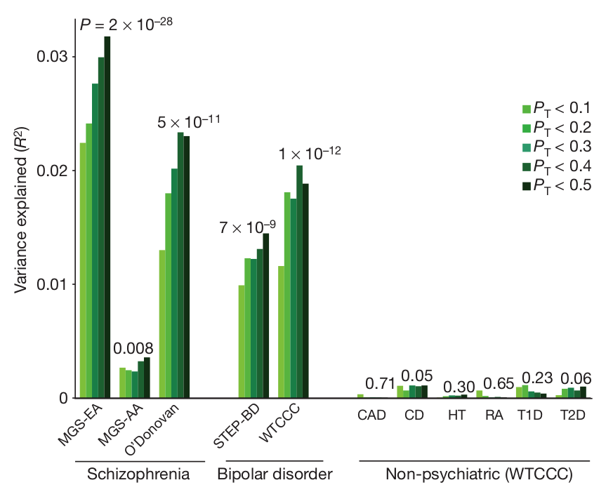

```{r setup, include=FALSE}
options(htmltools.dir.version = FALSE)
knitr::opts_chunk$set(echo = FALSE, fig.align = 'center', dev = "svg")
```

class: title-slide center middle inverse

# Polygenic Risk Scores for Predictive Medecine and Epidemiology

## Florian Privé & Michael Blum

### IAB - June 15, 2018

---

class: center, middle, inverse

# Introduction

<!-- --- -->

<!-- ## Disease architectures -->

<!-- <br> -->

<!-- ```{r, out.width="70%"} -->
<!-- knitr::include_graphics("figures/disease-archi.gif") -->
<!-- ``` -->

<!-- .footnote[Source: 10.1126/science.338.6110.1016]  -->

---

## From genome-wide association studies (GWAS)
## to polygenic risk scores (PRS)

```{r, out.width="95%"}
knitr::include_graphics("https://upload.wikimedia.org/wikipedia/commons/thumb/1/12/Manhattan_Plot.png/546px-Manhattan_Plot.png")
```

$$PRS_i = \sum_{\substack{j \in S_\text{clumping} \\ p_j~<~p_T}} \hat\beta_j \cdot G_{i,j}$$

---

## Polygenic Risk Scores (PRS)

### One application: to provide genetic evidence

```{r, out.width="60%"}

```

.footnote[Source: 10.1038/nature08185] 

---

## Polygenic Risk Scores (PRS)

### Another application: to identify high risk individuals

```{r, out.width="95%"}
knitr::include_graphics("figures/PRS.png")
```

---

## Interest in prediction: polygenic risk scores (PRS)

- Wray, Naomi R., Michael E. Goddard, and Peter M. Visscher. "**Prediction of individual genetic risk** to disease from genome-wide association studies." Genome research 17.10 (**2007**): 1520-1528.

- Wray, Naomi R., et al. "Pitfalls of **predicting complex traits** from SNPs." Nature Reviews Genetics 14.7 (**2013**): 507.

- Dudbridge, Frank. "Power and **predictive accuracy of polygenic risk scores**." PLoS genetics 9.3 (**2013**): e1003348.

- Chatterjee, Nilanjan, Jianxin Shi, and Montserrat García-Closas. "Developing and evaluating **polygenic risk prediction** models for stratified disease prevention." Nature Reviews Genetics 17.7 (**2016**): 392.

- Martin, Alicia R., et al. "Human demographic history impacts **genetic risk prediction** across diverse populations." The American Journal of Human Genetics 100.4 (**2017**): 635-649.

.footnote2[Still a gap between current predictions and clinical utility.</br>Need more optimal predictions + larger sample sizes.]


---

## Very large genotype matrices

- previously: 15K x 280K, [celiac disease](https://doi.org/10.1038/ng.543) (~30GB)

- currently: 500K x 500K, [UK Biobank](https://doi.org/10.1101/166298) (~2TB)
 
```{r, out.width='55%'}
knitr::include_graphics("https://media.giphy.com/media/3o7bueyxGydy48Lwgo/giphy.gif")
```

.footnote[But I still want to use `r icon::fa_r()`..]

---

## Our two R packages: bigstatsr and bigsnpr

### Statistical tools with big matrices stored on disk

<br>

<a href="https://doi.org/10.1093/bioinformatics/bty185" target="_blank">
```{r, out.width='70%'}
knitr::include_graphics("bty185.png")
```
</a>

<br>

- {bigstatsr} for many types of matrix, to be used by any field of research

- {bigsnpr} for functions that are specific to the analysis of genetic data


<br>

Package {bigstatsr} provides a **fast penalized logistic regression**.

---

## Methods compared

### The C+T method, from GWAS results

$$PRS_i = \sum_{j \in S_\text{clumping}} \mathbf{1}\{p_j < p_T\} \cdot \beta_j \cdot G_{i,j}$$

```{r, out.width="70%"}
knitr::include_graphics("figures/celiac-gwas-cut.png")
```

Pitfalls: weights learned independently and heuristics for correlation and regularization.

---

---

## Methods compared

### Penalized Logistic Regression

<br>

$$\arg\!\min_{\beta_0, \beta}(\lambda, \alpha)\left\{\underbrace{\frac{1}{n}\sum_{i=1}^n \log\left(1+e^{-y_i (\beta_0+x_i^T\beta)}\right)}_\text{Loss function} + \underbrace{\lambda \left((1-\alpha)\frac{1}{2}\|\beta\|_2^2 + \alpha \|\beta\|_1\right)}_\text{Penalization}\right\}$$ 

<br>

***

- $x$ is denoting the genotypes and covariables (e.g. principal components), 

- $y$ is the disease status we want to predict, 

- $\lambda$ is a regularization parameter that needs to be determined and

- $\alpha$ determines relative parts of the regularization $0 \le \alpha \le 1$. 

---

### Efficient algorithm


- Strong rules for discarding predictors in lasso-type problems (Tibshirani et al., 2012)

- implemented in R package {biglasso} (Zeng et al., 2017)

- reimplemented in R package {bigstatsr} (Privé et al., 2018) with an early stopping criterion.

---

class: center, middle, inverse

# Results

---

### Higher predictive performance with logit-simple

<br>

```{r}
knitr::include_graphics("figures/pres-AUC-logit.svg")
```

---

---

### Results: real Celiac phenotypes

```{r, out.width="55%"}
knitr::include_graphics("figures/celiac-roc.svg")
```

```{r, out.width="80%"}
knitr::include_graphics("figures/results-celiac.png")
```

---

class: center, middle, inverse

# Discussion

---

## Genomics is failing on diversity

```{r, out.width="80%"}
knitr::include_graphics("figures/Genomics_ethnicity_2016_COMMENT_WEB.jpg")
```

.footnote[Source: 10.1038/538161a]

---

## What can we do about it?

- use train of other studies (possibly in other populations)

---

## Future work: UK Biobank

UK Biobank is an extremely large dataset with 

 - genetic data
 
 - clinical data
 
 - environmental data

<br>

## Prospects

- training in one population to improve training and prediction in another population

- assess how can we combine the information provided by genetic data with clinical and environmental data, possibly in a non-linear way

---

class: center, middle, inverse

# Thanks!

<br>

Presentation available at

https://privefl.github.io/thesis-docs/IAB.html

<br>

`r icon::fa("twitter")` [privefl](https://twitter.com/privefl) &nbsp;&nbsp;&nbsp;&nbsp; `r icon::fa("github")` [privefl](https://github.com/privefl) &nbsp;&nbsp;&nbsp;&nbsp; `r icon::fa("stack-overflow")` [F. Privé](https://stackoverflow.com/users/6103040/f-priv%c3%a9)

.footnote[Slides created via the R package [**xaringan**](https://github.com/yihui/xaringan).]
