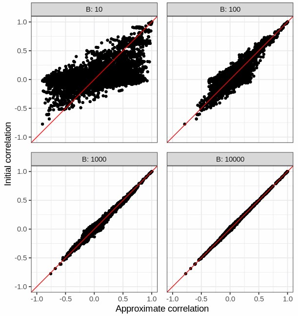

```{r setup, include=FALSE}
# renderthis::to_pdf("ldpred2-wcpg2023.Rmd", partial_slides = TRUE)
options(htmltools.dir.version = FALSE, width = 70)
knitr::opts_chunk$set(fig.align = 'center', dev = "svg", out.width = "70%",
                      echo = FALSE, comment = "", fig.width = 5, global.par = TRUE)
ICON_R_PROJECT <- icons::fontawesome$brands$`r-project`
ICON_TRI_EXCL  <- icons::fontawesome$solid$`exclamation-triangle`
ICON_INFO      <- icons::fontawesome$solid$`info-circle`
```

class: title-slide center middle inverse

<br>

# StocSum & how to get LD matrices 
# for millions of variants

<br>

<br>

## Florian Privé
### `r icons::icon_style(fill = "white", icons::fontawesome$brands$twitter)` `r icons::icon_style(fill = "white", icons::fontawesome$brands$github)` privefl

---

### Their motivation

- Scale many sumstats methods to using millions of variants (WGS)

- (sumstats method: using GWAS summary statistics + some LD reference)

- Provide LD for admixed or underrepresented genetic ancestries

--

<br>
<br>

### My motivation

- Scale LDpred2 to millions of variants

- The current main limitation is storing the LD matrix for that many variants

- Even when using a block-diagonal matrix

---

### StocSum's principle

<br>

- You have a genotype matrix $G$ with $N$ samples and $M$ variants

- Generate $B$ vectors $R_b \sim N(0, P)$ of size $N$    
to get $R = (R_1 ... R_B)$, a $N \times B$ matrix 

- $P$ is a projection matrix accounting for structure in your data

- Let us simply assume $P = I$ here

--

- Compute $U = R^T \widetilde{G}$, a $B \times M$ matrix    
and its scaled version $U_2 = \widetilde{U} / \sqrt{B-1}$

- Then you can approximate the LD matrix by $U_2^T U_2$

- This approximation is better with increasing $B$

- $U_2$ is not individual-level data so that it can easily be shared

---

### LD approximation results (MAF > 0.01)

```{r, out.width="68%"}

```

---

### LD approximation results (MAF < 0.01)

```{r, out.width="68%"}

```

---

### Remarks

<br>

- Estimation of correlations for low-frequency variants seems okay

- Correlations can be overestimated (in magnitude) when $B$ is small    
$\Longrightarrow$ need some correction?

---

### The cost of using $U_2$

<br>

- Let us say we use $B$=2000

- And have $M$=10M variants

- Then storing $U_2$ takes 149 GB

- To get one column $j$ of the LD matrix (required in LDpred2),    
we need to compute $U_2^T U_2^{(j)}$    
instead of simply accessing a few thousands non-zero values (block)

---

### Discussion

<br>

- Is this technique worth using?

- What alternatives are there?

---

class: inverse, center, middle

# Thanks!

<br>

Presentation available at https://privefl.github.io/thesis-docs/JC-StocSum.html

<br>

`r icons::icon_style(fill = "white", icons::fontawesome$brands$twitter)` `r icons::icon_style(fill = "white", icons::fontawesome$brands$github)` privefl

.footnote[Slides created via the R package [**xaringan**](https://github.com/yihui/xaringan)]
