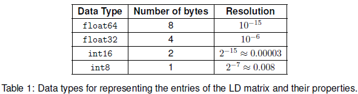
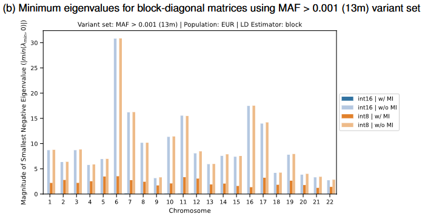
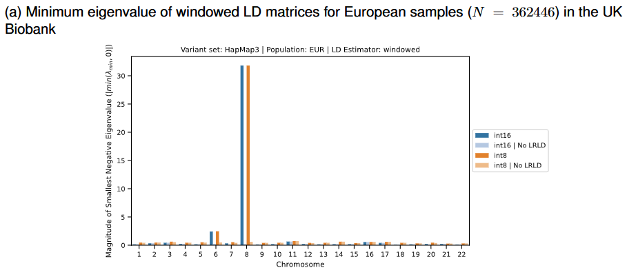
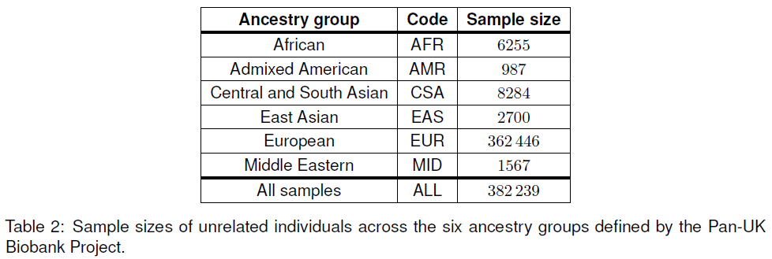
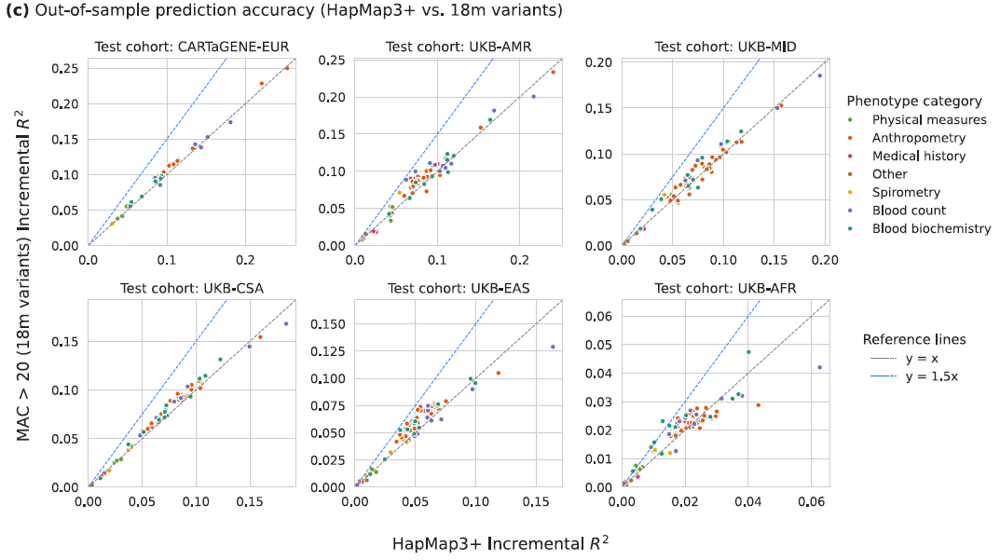

```{r setup, include=FALSE}
# renderthis::to_pdf("ldpred2-wcpg2023.Rmd", partial_slides = TRUE)
options(htmltools.dir.version = FALSE, width = 70)
knitr::opts_chunk$set(fig.align = 'center', dev = "svg", out.width = "70%",
                      echo = FALSE, comment = "", fig.width = 5, global.par = TRUE)
ICON_R_PROJECT <- icons::fontawesome$brands$`r-project`
ICON_TRI_EXCL  <- icons::fontawesome$solid$`exclamation-triangle`
ICON_INFO      <- icons::fontawesome$solid$`info-circle`
```

class: title-slide center middle inverse

<br>

# Journal Club 13/02/25

## Towards whole-genome inference of polygenic scores<br>with fast and memory-efficient algorithms

<br>

## Florian Privé 
### Aarhus University
#### <svg xmlns="http://www.w3.org/2000/svg" viewBox="0 0 576 512" width="1em" height="1em"><path d="M407.8 294.7c-3.3-.4-6.7-.8-10-1.3c3.4 .4 6.7 .9 10 1.3zM288 227.1C261.9 176.4 190.9 81.9 124.9 35.3C61.6-9.4 37.5-1.7 21.6 5.5C3.3 13.8 0 41.9 0 58.4S9.1 194 15 213.9c19.5 65.7 89.1 87.9 153.2 80.7c3.3-.5 6.6-.9 10-1.4c-3.3 .5-6.6 1-10 1.4C74.3 308.6-9.1 342.8 100.3 464.5C220.6 589.1 265.1 437.8 288 361.1c22.9 76.7 49.2 222.5 185.6 103.4c102.4-103.4 28.1-156-65.8-169.9c-3.3-.4-6.7-.8-10-1.3c3.4 .4 6.7 .9 10 1.3c64.1 7.1 133.6-15.1 153.2-80.7C566.9 194 576 75 576 58.4s-3.3-44.7-21.6-52.9c-15.8-7.1-40-14.9-103.2 29.8C385.1 81.9 314.1 176.4 288 227.1z" fill="white"/></svg> `r icons::icon_style(fill = "white", icons::fontawesome$brands$github)` privefl

---

### Abstract

<br>

- developing PRS from millions of variants remain challenging

- people have used either C+T or restricted to 1M HapMap3 variants

- they present a set of algorithmic improvements and compact data structures that enable scaling PRS to use 18M variants

- especially compression of LD matrices (also good for sharing)

- incorporate these changes in their VIPRS method

- now much faster and more memory-efficient

- better prediction when using more variants?

---

### Introduction

<br>

- LD matrices are very large (e.g. 15 GB for 1M variants in LDpred2 with 3cM window; twice if not using the compact format)

- running PGS methods can take up to a few hours for 1M variants

- they propose to

    - quantize and compress LD matrices (size /50)
    
    - assess the spectral properties of different LD matrices
    
    - optimize VIPRS to use the compressed LD matrices
    
    - use two layers of parallelism in VIPRS
    
---

### Efficient LD matrices (methods)

<br>

- two types: either banded (windowed) or block-diagonal (LD blocks)

- can reduce size by

    - storing the upper triangle only (/2)
    
    - storing correlations with less bytes    
    ($r^\text{q} = round(r \cdot s)$ and $r^\text{dq} = r^\text{q} / s$ with $s = 127$ or $s = 32767$) 
    
    ```{r, out.width = "85%"}
    
    ```
    
    - storing in compressed chunks (*Zarr* format, also cloud-native) 

---

### Efficient LD matrices (results)

<br>

```{r, out.width = "50%"}
knitr::include_graphics("figures/JC-VIPRS2-fig2a.png")
```

---

### Optimizations in VIPRS

<br>

- now use C++ instead of Python (speed x10)

- now use optimized matrix operations    
(not sure exactly where, since they use coordinate ascent)

- use 32-bit floats instead of 64-bit doubles for parameters (speed x2!?)

- accommodate the new triangular format for LD + quantized versions

- parallelize over chromosomes (but more memory needed)

- parallelize the coordinate ascent (difficult)

- don't parallelize over LD blocks?    
(want to also accommodate windowed LD)

---

### Investigating numerical instabilities

<br>

- LD is often not positive semi-definite (PSD), i.e. min(eigval) is negative

- the larger are the negative eigenvalues, the more numerical instabilities there are

- three main contributing factors that can impact the spectrum of estimated LD matrices: 

    - sparsification pattern (e.g. windowed, but not LD blocks), 
    
    - pairwise correlation estimator in the presence of missing data    
    (use mean imputation or imputed data instead),
    
    - approximation error (e.g. thresholding or quantization).

--

<br>

- their solution: use $\tilde{R} - \min(0, \lambda_\text{min}) I$ instead of $\tilde{R}$    
(actually they test {0, 0.01, 0.1, 1, 2} * $\lambda_\text{min}$)
    
---

### Minimum eigenvalues for block-diagonal LD

<br>

```{r, out.width = "90%"}

```

.footnote[MI: mean imputation before computing LD    
(instead of using pairwise complete observations)]

---

### Minimum eigenvalues for windowed LD

<br>

```{r, out.width = "100%"}

```

.footnote[LRLD: long-range LD regions (e.g. HLA)]

---

### Numbers of samples and variants

<br>

```{r, out.width = "95%"}

```

--

<br>

Sets of variants considered:

- 18M variants with INFO > 0.8 and MAC > 20 (in the whole cohort `r ICON_TRI_EXCL`)

- 13M variants with additionally MAF > 0.1%

- HapMap3+ (1.4M)

---

### Predictive performance

<br>

```{r, out.width = "100%"}

```

---

### My thoughts on this paper

What I liked:

- They used many axes of optimization, for both speed and memory

- They looked at different LD matrices and their spectral properties

--

<br>

What I didn't like or didn't understand:

- Runtime results are too-good-to-be-true? e.g. it takes one minute to fit VIPRS on 1.1M variants (uncompressing should take more time)

- I think int8-quantization is too much, but int16 takes 4x more space (because of less efficient compression I guess)

- using more variants may not be beneficial    
when cannot distinguish between correlated variants    
(need e.g. functional annotations and multi-ancestry)

- LD blocks are imperfect, especially for large set of variants

- using one triangle is more difficult for nothing? (compression)

---

class: title-slide center middle inverse

# Any other questions or comments?
