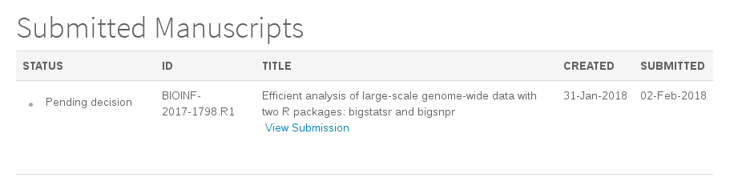

```{r setup, include=FALSE}
options(htmltools.dir.version = FALSE)
knitr::opts_chunk$set(fig.align = "center", dev = "svg",
                      fig.asp = 0.7, out.width = "80%", echo = FALSE)
```

## Outline 

### 1. Main objective of the thesis

### 2. R packages

### 3. Ongoing paper

### 4. Future work

---

class: center, middle, inverse

# Main objective

---

## Compute Polygenic Risk Scores (PRS) 

### in order to identify high risk individuals

```{r, out.width="95%"}
knitr::include_graphics("figures/PRS.png")
```

---

## 4 main difficulties

<br>

- Size of the data (dozens to hundreds of GB)

- Hundreds of thousands of correlated variables (variables with overlapping information)

- Generalization of models on different populations

- Integration of non-genetic data in the models

---

class: center, middle, inverse

# Big Data

### Simpler solutions are easier to implement

---

## What I want to be able to do

### Data analysis on large-scale genotype matrices!

- Be fast to test many ideas quickly

    - code should be fast
    - I shouldn't have to make many conversions
    - it should be easily to combine multiple functions
    
- Not be restricted in my analysis
   
    - Basically use all I already know in R
    
- Work on my computer

    - I have 64 GB of RAM and 12 cores
    - Working on a server is not as easy as on my computer

<br><center>**Smooth and fast analysis!**

<!-- --- -->

<!-- ## Memory problem when working in R -->

<!-- <br> -->

<!-- ```{r} -->
<!--  -->
<!-- ``` -->

<!-- --- -->

<!-- ## Memory solution when working in R -->

<!-- <br> -->

<!-- ```{r} -->
<!-- knitr::include_graphics("figures/memory-solution.svg") -->
<!-- ``` -->

<!-- .footnote[I don't use **bigmemory** anymore but still something very similar.] -->

---

## Two R packages: bigstatsr and bigsnpr

### Statistical tools with big matrices stored on disk

<br>

- **bigstatsr** for many types of matrix, to be used by any field of research

- **bigsnpr** for functions that are specific to the analysis of genetic data

<br>

```{r, out.width="95%"}

```

---

## Comparative performance

### Computing partial SVD

```{r}
knitr::include_graphics("figures/benchmark-pca.png")
```

---

class: center, middle, inverse

# Ongoing paper

### Comparison of methods for computing PRS

#### (will be submitted by the end of April)

---

## Recall of what we want to achieve

### Predict a phenotype: pitfalls of the widely-used model

- Weights learned independently

- Correlation is taken care of heuristically

- Regularization is taken care of heuristically

### A better solution?

We can use **statistical learning methods**.

For example, we can use logistic regression on all variables at once by using a clever implementation.

---

class: center, middle, inverse

# Future work

### UK Biobank

---

## UK Biobank

It is an extremely large dataset with 

 - genetic data
 
 - clinical data
 
 - environmental data

## Prospects

- [Paper 3, before the end of 2018] training in one population to improve training and prediction in another population

- [Paper 4, in 2019, while writing the thesis] assess how can we combine the information provided by genetic data with clinical and environmental data, possibly in a non-linear way

- find a job in Machine Learning in some company

---

class: center, middle, inverse

# Thanks!

<br>

Presentation available at

https://privefl.github.io/thesis-docs/JDD.html

<br>

`r icon::fa("twitter")` [privefl](https://twitter.com/privefl) &nbsp;&nbsp;&nbsp;&nbsp; `r icon::fa("github")` [privefl](https://github.com/privefl) &nbsp;&nbsp;&nbsp;&nbsp; `r icon::fa("stack-overflow")` [F. Privé](https://stackoverflow.com/users/6103040/f-priv%c3%a9)

.footnote[Slides created via the R package [**xaringan**](https://github.com/yihui/xaringan).]
