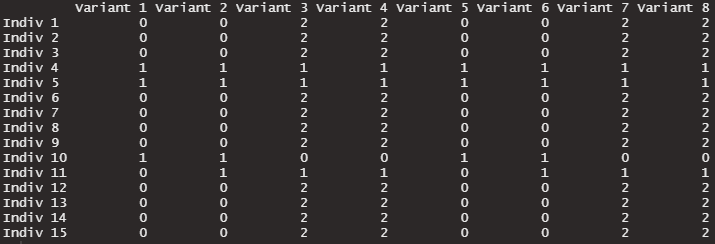
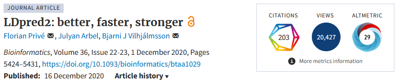
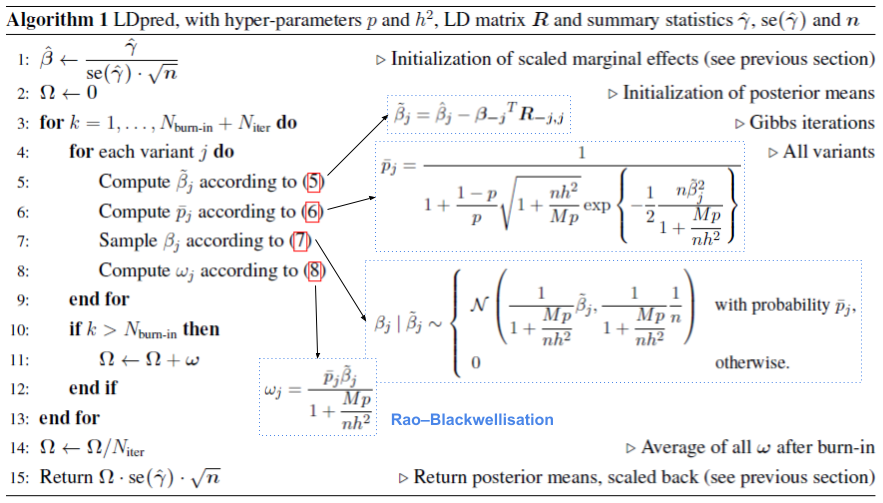

```{r setup, include=FALSE}
options(htmltools.dir.version = FALSE, width = 70)
knitr::opts_chunk$set(fig.align = 'center', dev = "svg", out.width = "70%",
                      echo = FALSE, comment = "", fig.width = 5, global.par = TRUE)
ICON_R_PROJECT <- icons::fontawesome$brands$`r-project`
ICON_TRI_EXCL <- icons::fontawesome$solid$`exclamation-triangle`
QUESTION <- icons::fontawesome$solid$`question-circle`
```

class: title-slide center middle inverse

<br>

# Inference from GWAS summary statistics using a Gibbs sampler

<br>

## Statify seminars at INRIA

<br>

### Florian Privé

<br>

---

class: center middle inverse

# Introduction

---

### Genotype data

Matrix of genetic variants (DNA mutations)

- Each observation (row): one individual (generally between 1K and 1M)

- Each variable (column): one position of the genome (generally between 100K to several millions)

- Each value: the number of alternative alleles (**0, 1, or 2**)    
or imputed dosages (between 0 and 2)

```{r, out.width="100%"}

```


---

### Genome-wide association study (GWAS)

Simply running association tests between 
- a phenotype (for the same individuals, e.g. case-control status) and
- each genetic variant **independently**
- and some additional covariates (e.g. sex and age).

--

<br>

```{r, out.width="100%"}
knitr::include_graphics("figures/gwas-height-20K.png")
```

---

### Example of GWAS summary statistics

<br>

```{r, out.width="90%"}
knitr::include_graphics("figures/GWAS-sumstats.png")
```

--

<br>

The effects have been learning independently from each other.   
Many genetic variants are correlated.    

$\Longrightarrow$ Which are the true causal variants? What are their effects?

---

### From GWAS summary statistics to joint models

It is assumed that the marginal (GWAS) effects $\hat{\gamma} = S^{-1} \hat{\beta}$ follow
$$\hat{\beta} | R, \beta \sim \mathcal{N}(R \beta, R) ~, \text{or}$$
$$S \hat{\gamma} | R, S, \gamma \sim \mathcal{N}(R S \gamma, R) ~,$$

where
- $\boldsymbol{\beta}$ the (true) effect sizes of the scaled genotypes,
- $\boldsymbol{\gamma}$ the (true) effect sizes on the allele scale,
- $\boldsymbol{S}$ the standard deviations of the genotypes,
- $\boldsymbol{R}$ is the correlation matrix of genotypes.

--

In practice, 
- we want to estimate joint effects $\boldsymbol{\gamma}$ from marginal effects $\boldsymbol{\hat{\gamma}}$ and the correlation matrix $R$
- we only have estimates for $S$ and $R$, which causes some model misspecifications
- ubiquitous correlations between the large number of variants may cause a Gibbs sampler or any iterative approach to fail properly estimating genetic effect sizes

---

class: center middle inverse

# Inference with LDpred2's Gibbs sampler

<br>
<br>

```{r, out.width="100%"}

```

---

### Prior model

<br>

LDpred2 assumes the following model for effect sizes,

<div class="math">
\[
\beta_j = S_j \gamma_j \sim \left\{
\begin{array}{ll}
\mathcal N\left(0, \dfrac{h^2}{M p}\right) & \mbox{with probability } p,\\
0 & \mbox{otherwise,}\end{array}
\right.
\]
</div>

where 
- $p$ is the proportion of causal variants (aka polygenicity), 
- $M$ the number of variants, 
- $h^2$ the (SNP) heritability, 
- $\boldsymbol{\gamma}$ the effect sizes on the allele scale,
- $\boldsymbol{S}$ the standard deviations of the genotypes,
- $\boldsymbol{\beta}$ the effects of the scaled genotypes.

<br>

LDpred2 uses a Gibbs sampler to sample causal variants and their effects.

---

### LDpred2 algorithm

<br>

```{r, out.width="100%"}

```

---

### Two versions of LDpred2

<br>

- LDpred2-grid, which tests different values for hyper-parameters $h^2$ and $p$ and choose the best predictive model in some validation/tuning set.

- LDpred2-auto, which directly estimates $h^2$ and $p$ from the Gibbs sampler.

--

<br>

#### Estimation of parameters

- Assuming $M_c = \sum_j(\beta_j \neq 0) \sim \text{Binom}(M, p)$ and $p \sim \text{Beta}(1, 1) \equiv \mathcal{U}(0, 1)$, we can sample $p$ from the posterior $p \sim \text{Beta}(1 + M_c, 1 + M - M_c)$.

- We did not derive a Bayesian estimator of $h^2$. Instead, we estimate $h^2 = \boldsymbol{\beta}^T \boldsymbol{R} \boldsymbol{\beta}$. Others have assumed a scaled inverse chi-square prior distribution.

- We estimate these two parameters at each (outer) iteration of the Gibbs sampler.

---

### Multiple chains

<br>

In practice, we run 50 chains with different starting values for $p$, in parallel.

Then we filter for chains that provide top imputed marginal effects $\check{\beta} = R \beta$.

`r QUESTION` Any way to better choose the chains we keep??

--

<br>

#### Estimation of CIs

We use quantiles at 2.5% and 97.5% of the distribution of all parameter values after burn-in, from all chains kept.

---

### Robustness parameters

<br>

- `allow_jump_sign`, when disabled, it prevents effect sizes from changing sign without going through 0 first, which prevents oscillations and makes $p$ converge faster.

- `coef_shrink`, a multiplicative coefficient for shrinking/regularizing off-diagonal elements of the LD matrix (using 1 means no regularization)

---

### Estimation of predictive performance

<br>

To infer the out-of-sample predictive performance $r^2$ (and CI) of the resulting PGS from LDpred2-auto, we use the distribution of $$\boldsymbol{\beta_1}^T \boldsymbol{R} \boldsymbol{\beta_2} ~,$$
where $\boldsymbol{\beta_1}$ and $\boldsymbol{\beta_2}$ are two sampled vectors of causal effect sizes (after scaling) from two different chains of the Gibbs sampler.

Intuitively, if prediction is perfect then $\boldsymbol{\beta_1}$ and $\boldsymbol{\beta_2}$ are the same and $r^2 = h^2$; when power is very low, these two are uncorrelated and $r^2 \approx 0$.

---

class: inverse, center, middle

# Thanks!

<br>

Presentation available at [bit.ly/ldpred2_inria](https://bit.ly/ldpred2_inria)

<br>

`r icons::icon_style(fill = "white", icons::fontawesome$brands$twitter)` `r icons::icon_style(fill = "white", icons::fontawesome$brands$github)` privefl

.footnote[Slides created via the R package [**xaringan**](https://github.com/yihui/xaringan)]

