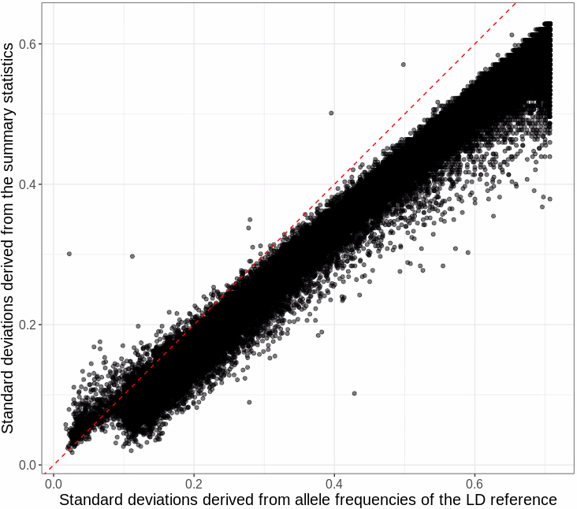

```{r setup, include=FALSE}
options(htmltools.dir.version = FALSE, width = 70)
knitr::opts_chunk$set(fig.align = 'center', dev = "svg", out.width = "70%",
                      echo = FALSE, comment = "", fig.width = 5, global.par = TRUE)
ICON_R_PROJECT <- icons::fontawesome$brands$`r-project`
ICON_TRI_EXCL <- icons::fontawesome$solid$`exclamation-triangle`
```

class: title-slide center middle inverse

<br>

# Inferring disease architecture and predictive ability with LDpred2-auto

<br>

## London Genetics Network

<br>

### Florian Privé

<br>

---

### Initial LDpred model

<br>

LDpred / LDpred2 originally assumed the following model for effect sizes,

<div class="math">
\[
\beta_j = S_j \gamma_j \sim \left\{
\begin{array}{ll}
\mathcal N\left(0, \dfrac{h^2}{M p}\right) & \mbox{with probability } p,\\
0 & \mbox{otherwise,}\end{array}
\right.
\]
</div>

where 
- $p$ is the proportion of causal variants, 
- $M$ the number of variants, 
- $h^2$ the (SNP) heritability, 
- $\boldsymbol{\gamma}$ the effect sizes on the allele scale,
- $\boldsymbol{S}$ the standard deviations of the genotypes,
- $\boldsymbol{\beta}$ the effects of the scaled genotypes.

<br>

LDpred uses a Gibbs sampler to sample causal variants and their effects.    
LDpred2-auto directly estimates $h^2$ and $p$ (cf. [this paper](https://doi.org/10.1093/bioinformatics/btaa1029)).

---

### Overview of what LDpred2-auto can now provide

<br>

```{r, out.width="90%"}
knitr::include_graphics("figures/overview-ldpred2-auto.png")
```

.footnote[Preprint: [Inferring disease architecture and predictive ability with LDpred2-auto](https://doi.org/10.1101/2022.10.10.511629)]

---

class: center middle inverse

## How to run LDpred2-auto?

---

### Input data

<br>

Have a look at [the tutorial](https://privefl.github.io/bigsnpr/articles/LDpred2.html)

<br>

- Need GWAS summary statistics (with `beta`, `beta_se`, and `n_eff`)

- Need a LD reference (matching the GWAS population)

    - You can infer ancestry proportions from allele frequencies in the GWAS (cf. [this paper](https://doi.org/10.1093/bioinformatics/btac348))
    
    - You can assume local correlations between variants (e.g. within 3cM)
    
    - Defining independent LD blocks (cf. [this paper](https://doi.org/10.1093/bioinformatics/btab519)) adds some sparsity and improves robustness (cf. [this paper](https://doi.org/10.1016/j.xhgg.2022.100136))
    
    - Precomputed LD is provided for (NW) Europeans
    
- Need to match these two with `snp_match()` (does strand flipping and allele switching) using `chr`, `pos` (or `rsid`), `a0`, `a1`

---

### Which sets of variants to use?

<br>

`r ICON_TRI_EXCL` Using more variants does not mean that you will get e.g. better polygenic scores.

<br>

For now, we recommend to use

- a set of 1,054,330 HapMap3 variants, because they provide a good coverage of the genome and are generally well imputed and available in most studies

- if you have a good power, you can use an extended set with 37% more variants, which we called HapMap3+ (cf. [this preprint](https://doi.org/10.1101/2022.10.10.511629))

- if you do not have imputed data, use your genotyped data to get enough variants

---

### Quality control of GWAS summary statistics

You can estimate SDs (of genotypes) from GWAS summary statistics:

$$\text{sd}(G_j) \approx \dfrac{\text{sd}(y)}{\sqrt{n_j ~ \text{se}(\hat{\gamma}_j)^2 + \hat{\gamma}_j^2}} ~,$$

or, for a binary trait for which logistic regression is used, we have instead
$$\text{sd}(G_j) \approx \dfrac{2}{\sqrt{n_j^\text{eff} ~ \text{se}(\hat{\gamma}_j)^2 + \hat{\gamma}_j^2}}, \text{ where } n^\text{eff} = \dfrac{4}{1 / n^\text{case} + 1 / n^\text{control}}.$$
<br>

--

Then, you should compare them to $\text{sd}(G_j) \approx \sqrt{2 \cdot f_j \cdot (1 - f_j) \cdot \text{INFO}_j}$.

You get a better fit if you have the allele frequencies $f_j$ from the GWAS.    
Then you can also compare these allele frequencies with the ones from the reference.

.footnote[See [this paper](https://doi.org/10.1016/j.xhgg.2022.100136) to read more, and [this other tutorial](https://privefl.github.io/bigsnpr-extdoc/polygenic-scores-pgs.html#preparing-the-data).]
    
---

### This QC can also detect issues with sample sizes

```{r, out.width="60%", fig.cap="Example with Neff overestimated by 20%"}

```

.footnote[Possible reasons: meta-analysis, loss of power (SAIGE) (cf. [this paper](https://doi.org/10.1016/j.xhgg.2022.100136))]

---

### LD score regression

<br>

- Reimplemented in `r ICON_R_PROJECT` package {bigsnpr} with same input data as LDpred2-auto

- Provide a good starting value for the $h^2$ parameter in LDpred2-auto

- Can also check the intercept

---

### LDpred2-auto

<br>

```r
coef_shrink <- 0.95

multi_auto <- snp_ldpred2_auto(
  corr, df_beta, h2_init = h2_est, # LDSc estimate
  vec_p_init = seq_log(1e-4, 0.2, length.out = 50), # 50 chains
  burn_in = 500, num_iter = 500, report_step = 20,
  allow_jump_sign = FALSE, shrink_corr = coef_shrink, # robustness
  # uncomment if you have convergence issues (need v1.11.9)
  # use_MLE = FALSE,  
  ncores = NCORES)
```

<br>

This runs 50 chains with different starting values for $p$ in parallel (`ncores`).

---

### Robustness parameters

<br>

- `allow_jump_sign`, which was proposed in [this paper](https://doi.org/10.1016/j.xhgg.2022.100136) for robustness. When disabled, it prevents effect sizes from changing sign without going through 0 first, which prevents oscillations and makes $p$ converge faster.

- `coef_shrink`, a multiplicative coefficient for shrinking/regularizing off-diagonal elements of the LD matrix (using 1 means no regularization)

---

### New 3-parameter model

<br>

<div class="math">
\[
\beta_j \sim \left\{
\begin{array}{ll}
\mathcal N\left(0, ~\sigma_\beta^2 \cdot (S_j^2)^{(\alpha + 1)} \right) & \mbox{with probability } p,\\
0 & \mbox{otherwise.}
\end{array}
\right.
\]
</div>

<br>

Therefore, it was earlier assumed that $\alpha = -1$ and $\sigma_\beta^2 = \frac{h^2}{M p}$.

This is similar to the model assumed in SBayesS.

$\sigma_\beta^2$ and $\alpha$ are estimated using maximum likelihood estimation (MLE), which can become unstable when power is low (or when the model is really off).

`r ICON_TRI_EXCL` More flexibility is not always better. This new model can be disabled by setting `use_MLE = FALSE`.

---

### Take-home messages

<br>

- 


---

### Future development

---

class: inverse, center, middle

# Thanks!

<br>

Presentation available at [bit.ly/ldpred2_london](https://bit.ly/ldpred2_london)

<br>

`r icons::icon_style(fill = "white", icons::fontawesome$brands$twitter)` `r icons::icon_style(fill = "white", icons::fontawesome$brands$github)` privefl

.footnote[Slides created via the R package [**xaringan**](https://github.com/yihui/xaringan)]

