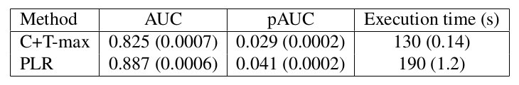
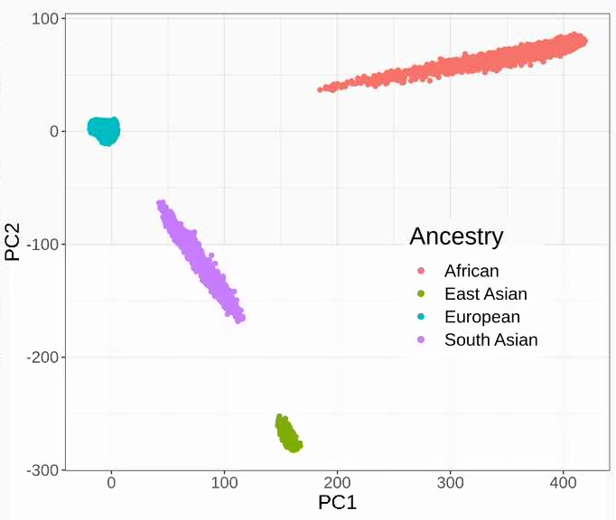
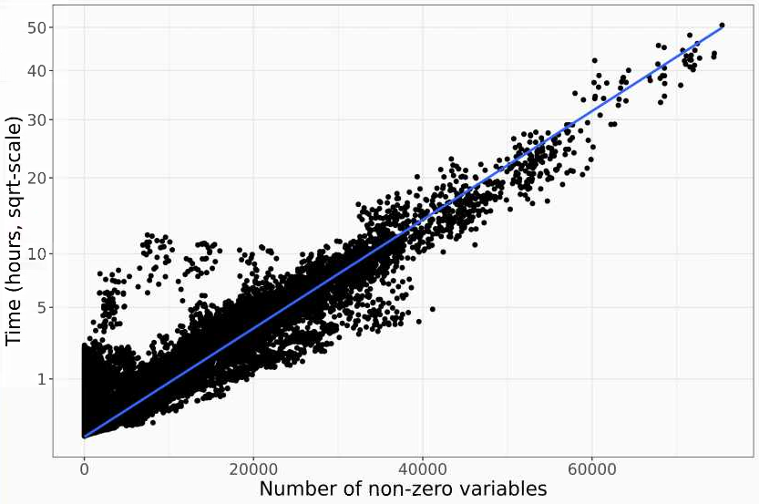
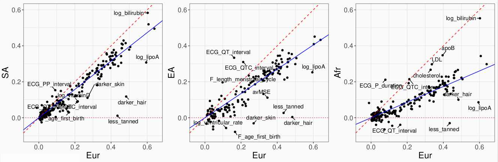

```{r setup, include=FALSE}
knitr::opts_chunk$set(fig.align = 'center', dev = "svg", out.width = "70%",
                      echo = FALSE, comment = "", fig.width = 5)
options(width = 70)
knitr::opts_knit$set(global.par = TRUE)
```

class: title-slide center middle inverse

<br>

# Efficient penalized regression methods<br>for genetic prediction

<br>

## Florian Privé

### Prediction Modelling Presentations -- October 14, 2020

<br>

<br>

**Slides:** `https://privefl.github.io/thesis-docs/PLR-genetics.html`

---

class: inverse, center, middle

# Introduction to penalized regression models

---

## Multiple linear regression

We want to solve

$$y = \beta_0 + \beta_1 G_1 + \cdots + \beta_p G_p + \gamma_1 COV_1 + \cdots + \gamma_q COV_q + \epsilon~.$$
--

Let $\beta = (\beta_0, \beta_1, \dots, \beta_p, \gamma_1, \dots, \gamma_q)$ and $X = [1; G_1; \dots;G_p; COV_1; \dots; COV_q]$, then

$$y = X \beta + \epsilon~.$$

--

This is equivalent to minimizing

$$||y - X \beta||_2^2 =  ||\epsilon||_2^2~,$$
--

whose solution is 

$$\beta = (X^T X)^{-1} X^T y~.$$

--

<br>

**What is the problem when analyzing genotype data?**

--

$$n < p$$

---

## Penalization term -- $L_2$ regularization

<br>

Instead, we can minimize

$$||y - X \beta||_2^2 + \lambda ||\beta||_2^2~,$$
--

whose solution is 

$$\beta = (X^T X + \lambda I)^{-1} X^T y~.$$

--

<br>

This is the L2-regularization ("**ridge**", Hoerl and Kennard, 1970); **it shrinks coefficients $\beta$ towards 0**.

.footnote[https://doi.org/10.1080/00401706.1970.10488634]

---

## Penalization term -- $L_1$ regularization

<br>

Instead, we can minimize

$$||y - X \beta||_2^2 + \lambda ||\beta||_1~,$$
--

which does not have any closed form but can be solved using iterative algorithms.

--

<br>

This is the L1-regularization ("**lasso**", Tibshirani, 1996); **it forces some of the coefficients to be equal to 0** and can be used as a means of variable selection, leading to sparse models.

.footnote[https://doi.org/10.1111/j.2517-6161.1996.tb02080.x]

---

## Penalization term -- $L_1$ and $L_2$ regularization

<br>

Instead, we can minimize

$$||y - X \beta||_2^2 + \lambda (\alpha ||\beta||_1 + (1 - \alpha) ||\beta||_2^2)~,$$
--

which does not have any closed form but can be solved using iterative algorithms ( $0 \le \alpha \le 1$ ).

--

<br>

This is the L1- and L2-regularization ("**elastic-net**", Zou and Hastie, 2005); it is a compromise between the two previous penalties.

.footnote[https://doi.org/10.1111/j.1467-9868.2005.00503.x]

---

## Advantages and drawbacks of penalization

--

### Advantages

- Makes it possible to solve linear problems when $n < p$

- Generally prevents overfitting (because of smaller effects)

--

### Drawback

- Add at least one hyper-parameter ( $\lambda$ ) that needs to be chosen and another one if using the elastic-net regularization ( $\alpha$ )

--

### Alternative

- Select a few variables before fitting the linear model (e.g. using marginal significance/p-values); heuristic: $p = n / 10$

---

## Cross-validation for choosing hyper-parameters

<br>

```{r, echo=FALSE}
knitr::include_graphics("https://privefl.github.io/R-presentation/crossval.png")
```

However, if using e.g. R package {glmnet}, it can take a long time to run for genetic data.

---

class: inverse, center, middle

# A slightly different approach in {bigstatsr}

<br>

https://doi.org/10.1093/bioinformatics/bty185

https://doi.org/10.1534/genetics.119.302019

---

## Cross-Model Selection and Averaging (CMSA)

```{r, echo=FALSE, out.width="75%"}
knitr::include_graphics("https://raw.githubusercontent.com/privefl/paper2-PRS/master/figures/simple-CMSA.png")
```

---

## Advantages of using {bigstatsr}

<br>

- automatic choice for the two hyper-parameters $\lambda$ and $\alpha$

- faster (mainly because of early-stopping criterion)

- memory efficient (because data is stored on disk)

- parallelization of fitting (easy because data on disk)

<br>

So, can be easily applied to huge data.

--

<br>

- also two new options:

    - use of different scaling (default is dividing variants by SD)
    
    - adaptive lasso (larger marginal effects are penalized less)

---

## Application to predicting height

Height is up to 80% heritable. 
Here we can predict ~40% variance using genetics (400K individuals $\times$ 560K genetic variants).


```{r, out.width="78%"}
knitr::include_graphics("https://privefl.github.io/blog/images/UKB-final-pred.png")
```

---


## Application to predicting celiac disease

Gluten intolerance, autoimmune disease with large effects on chromosome 6.


```{r, out.width="70%"}

```

```{r, out.width="50%"}
knitr::include_graphics("figures/celiac-roc3.svg")
```

---

class: inverse, center, middle

# Application to 240 phenotypes within the UK Biobank

---

## Genetic data


- **1,117,182** variants (HapMap3)

- Training based on **434,868** individuals of European ancestry +    
testing in 8636 South Asians, 1803 East Asians and 6983 Africans

```{r, out.width="62%"}

```

---

## Phenotypic data

<br>

111 continuous + 129 binary = **240 phenotypes**
    
<br>

Some examples:

- multiple diseases: cancers, diabetes, autoimmune, etc.

- body measures: height, BMI, BMD, etc.

- blood biochemistry: cholesterol, vitamin D, etc.

- ECG measures

- misc

---

## How fast is the LASSO implementation?

<br>

```{r, out.width="75%"}

```

<br>

Running time is quadratic with the number of non-zero variables.

---
---

## Limitation of polygenic scores: prediction in different ancestries

<br>

```{r, out.width="100%"}

```

<br>

Robust slope of pcor_other ~ pcor_eur, squared:

- 62.3% for South Asians
- 45.5% for East Asians
- 18.8% for Africans

---

class: inverse, center, middle

# Thanks!

<br>

Presentation available at    
https://privefl.github.io/thesis-docs/PLR-genetics.html

<br>
<br>

`r icon::fa("twitter")` [privefl](https://twitter.com/privefl) &nbsp;&nbsp;&nbsp;&nbsp; `r icon::fa("github")` [privefl](https://github.com/privefl) &nbsp;&nbsp;&nbsp;&nbsp; `r icon::fa("stack-overflow")` [F. Privé](https://stackoverflow.com/users/6103040/f-priv%c3%a9)

.footnote[Slides created via the R package [**xaringan**](https://github.com/yihui/xaringan).]
