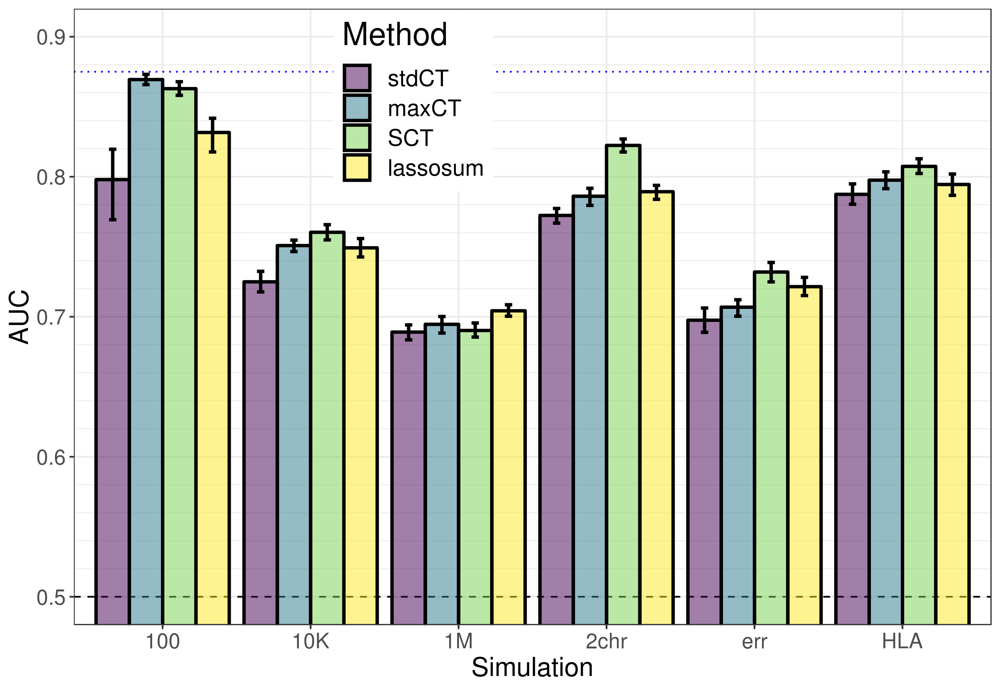

```{r setup, include=FALSE}
options(htmltools.dir.version = FALSE)
knitr::opts_chunk$set(echo = FALSE, fig.align = 'center', dev = "svg")
```

class: title-slide center middle inverse

# Stacked Clumping and Thresholding (SCT)

## Making the most of C+T for polygenic scores

<br>

### Florian Privé

#### Copenhagen, June 2019

---

## Standard PRS - part 1: estimating effects

### Genome-wide association studies (GWAS)

In a GWAS, each single-nucleotide polymorphism (SNP) is tested **independently**, resulting in one **effect size** $\hat\beta$ and one **p-value** $p$ for each SNP. 

```{r, out.width="95%"}
knitr::include_graphics("figures/gwas-height-20K.png")
```

Easy combining: $PRS_i = \sum_j \hat\beta_j \cdot G_{i,j}$

---

## Standard PRS - part 2: restricting predictors

### <span style="color:#38761D">Clumping</span> + <span style="color:#1515FF">Thresholding</span> (C+T)

<br>

```{r, out.width="100%"}
knitr::include_graphics("figures/GWAS2PRS3.png")
```

<br>

$$PRS_i = \sum_{\substack{j \in S_\text{clumping} \\ p_j~<~p_T}} \hat\beta_j \cdot G_{i,j}$$

---

## Hyper-parameters in C+T

- threshold on squared correlation of clumping ( $r_c^2 \sim 0.2$ ) and    
window size for LD computation ( $w_c \sim 500 kb$ )

- p-value threshold ( $p_T$ between $1$ and $10^{-8}$ and choose the best one )

--

- threshold of imputation quality score ( $INFO_T \sim 0.3$ )

--

$\Longrightarrow$ *stdCT* (standard C+T)

<br>

--

#### Our contribution

- an efficient implementation to compute many C+T scores for different hyper-parameters (5600 sets of hyper-parameters $\times$ 22 chromosomes)    
$\Longrightarrow$ *maxCT* (maximized C+T)

--

- going further by stacking all C+T models (instead of just choosing the best model)    
$\Longrightarrow$ *SCT* (Stacked C+T)

---

## Stacking with penalized logistic regression

<br>

<Small>$$\arg\!\min_{\beta_0,~\beta}(\lambda, \alpha)\left\{  \underbrace{ -\sum_{i=1}^n \left( y_i \log\left(p_i\right) + (1 - y_i) \log\left(1 - p_i\right) \right) }_\text{Loss function}   +   \underbrace{ \lambda \left((1-\alpha)\frac{1}{2}\|\beta\|_2^2 + \alpha \|\beta\|_1\right) }_\text{Penalization}  \right\}$$</Small>

<br>

***

- $p_i=1/\left(1+\exp\left(-(\beta_0 + x_i^T\beta)\right)\right)$

- $x$ is denoting the **C+T scores** and covariates (e.g. principal components), 

- $y$ is the disease status we want to predict, 

- $\lambda$ is a regularization parameter that needs to be determined and

- $\alpha$ determines relative parts of the regularization $0 \le \alpha \le 1$. 

---

## Results (simulations)

```{r}

```

---

## Results (real data)

```{r}
knitr::include_graphics("figures/SCT-AUC-real.png")
```

---

## Results (grid of hyper-parameters for MDD and T2D)

```{r, out.width="100%"}
knitr::include_graphics("https://raw.githubusercontent.com/privefl/simus-PRS/master/figures/grid-MDD.png")
```

<br>

```{r, out.width="100%"}
knitr::include_graphics("https://raw.githubusercontent.com/privefl/simus-PRS/master/figures/grid-T2D.png")
```

---

class: title-slide center middle inverse

# Beyond predicting one disease

## Differentiating type 1 from type 2 diabetes

---

## Stacking C+T scores for both types of diabetes

<br>

<Small>$$\arg\!\min_{\beta_0,~\beta}(\lambda, \alpha)\left\{  \underbrace{ -\sum_{i=1}^n \left( y_i \log\left(p_i\right) + (1 - y_i) \log\left(1 - p_i\right) \right) }_\text{Loss function}   +   \underbrace{ \lambda \left((1-\alpha)\frac{1}{2}\|\beta\|_2^2 + \alpha \|\beta\|_1\right) }_\text{Penalization}  \right\}$$</Small>

<br>

***

- $p_i=1/\left(1+\exp\left(-(\beta_0 + {x_1}_i^T\beta_1 + {x_2}_i^T\beta_2)\right)\right)$

- $x_1$ is denoting the C+T scores derived from **T1D** summary statistics

- $x_2$ is denoting the C+T scores derived from **T2D** summary statistics

- $y$ (restricting to people with diabetes) is 

    - 1 for type 2 diabetes and
    - 0 for type 1 diabetes 

---

## Predictive power of PRS

```{r, out.width="95%"}

```

---

## Investigating age of diagnosis

```{r, out.width="90%"}

```

---

## Predictive power of PRS + age at diagnosis

```{r, out.width="95%"}

```

---

## Investigating age of diagnosis

```{r, out.width="95%"}

```

---

## Other useful variables?

```{r, out.width="95%"}

```

---

## Conclusion / limitations

<br>

- PRS is of relative improvement over "age at diagnosis" alone    
(AUC of 91.0 [87.8-93.9] vs 88.7 [85.1-92.0])

--

- Small sample size    
(493 T1D / 7507 T2D in training and 149 / 2139 in test set)

--

- Use of other variables?    
(available at diagnosis: BMI, sex, others?)

--

- Consider other types of diabetes?

--

- Possible misdiagnosis errors in the dataset used

--

- Try a different method?

    - build one PRS for each type of diabetes separately    
    and merge them after with other variables?
    
    - prefer individual-level data methods?    
    (works best for T1D because of large effects in HLA region)

---

class: center, middle, inverse

# Thanks!

<br>

Presentation available at

https://privefl.github.io/thesis-docs/SCT-diabetes.html

<br>

`r icon::fa("twitter")` [privefl](https://twitter.com/privefl) &nbsp;&nbsp;&nbsp;&nbsp; `r icon::fa("github")` [privefl](https://github.com/privefl) &nbsp;&nbsp;&nbsp;&nbsp; `r icon::fa("stack-overflow")` [F. Privé](https://stackoverflow.com/users/6103040/f-priv%c3%a9)

.footnote[Slides created via R package [**xaringan**](https://github.com/yihui/xaringan).]
