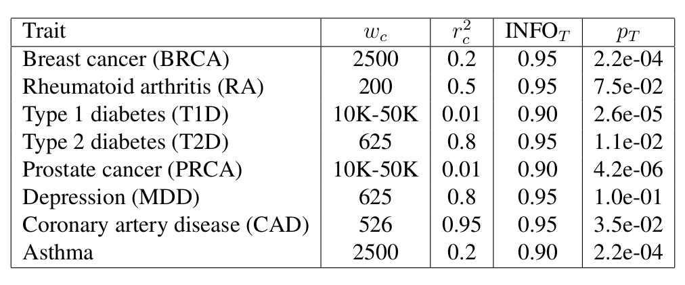

```{r setup, include=FALSE}
options(htmltools.dir.version = FALSE)
knitr::opts_chunk$set(echo = FALSE, fig.align = 'center', dev = "svg")
```

class: title-slide center middle inverse

# Stacked Clumping and Thresholding (SCT)

<br>

### **Privé, F.**, Vilhjálmsson, B. J., Aschard, H., & Blum, M. G. (2019).<br>*Making the most of Clumping and Thresholding for polygenic scores.*

[soon in AJHG (the American Journal of Human Genetics)]

---
class: center, middle, inverse

# Introduction and Methods

---

## Using summary statistics from large GWAS

<br>

```{r, out.width="80%"}
knitr::include_graphics("figures/PRS-sumstats.png")
```

---

## Predictive methods based on summary statistics

<br>

When you have only summary statistics (and a small individual-level dataset), you can use:

- C+T

<!-- -- -->

- LDpred (*Vilhjálmsson, Bjarni J., et al. "Modeling linkage disequilibrium increases accuracy of polygenic risk scores." The American Journal of Human Genetics 97.4 (2015): 576-592*).

<!-- -- -->

- lassosum (*Mak, Timothy Shin Heng, et al. "Polygenic scores via penalized regression on summary statistics." Genetic epidemiology 41.6 (2017): 469-480.*)

<!-- -- -->

- Other methods in development, such as NPS, PRS-CS and SBayesR.

<!-- -- -->

The idea of LDpred, lassosum and the other methods is to use a reference panel to **account for correlation** between variants, instead of clumping (removing) variants.

---

## Standard PRS - part 1: estimating effects

### Genome-wide association studies (GWAS)

In a GWAS, each single-nucleotide polymorphism (SNP) is tested **independently**, resulting in one **effect size** $\hat\beta$ and one **p-value** $p$ for each SNP. 

```{r, out.width="95%"}
knitr::include_graphics("figures/gwas-height-20K.png")
```

Easy combining: $PRS_i = \sum_j \hat\beta_j \cdot G_{i,j}$

---

## Standard PRS - part 2: restricting predictors

### <span style="color:#38761D">Clumping</span> + <span style="color:#1515FF">Thresholding</span> (C+T)

<br>

```{r, out.width="100%"}
knitr::include_graphics("figures/GWAS2PRS3.png")
```

<br>

$$PRS_i = \sum_{\substack{j \in S_\text{clumping} \\ p_j~<~p_T}} \hat\beta_j \cdot G_{i,j}$$

---

### Making the most of C+T

#### Hyper-parameters in C+T

<!-- -- -->

- threshold of imputation quality score ( $INFO_T \sim 0.3$ )

<!-- -- -->

- threshold on squared correlation of clumping ( $r_c^2 \sim 0.2$ ) and    
window size for LD computation ( $w_c \sim 500 kb$ )

<!-- -- -->

- p-value threshold ( $p_T$ between $1$ and $10^{-8}$ and choose the best one )

<!-- -- -->

$\Longrightarrow$ *stdCT* (standard C+T)

--

#### Our contribution

- an efficient implementation to compute many C+T scores for different hyper-parameters (**5600 sets of hyper-parameters** $\times$ 22 chromosomes)    
$\Longrightarrow$ *maxCT* (maximized C+T)

<!-- -- -->

- going further by **stacking** (*Breiman, Leo. "Stacked regressions." Machine learning 24.1 (1996): 49-64.*) with a linear combination of all C+T models (instead of just choosing the best model)    
$\Longrightarrow$ *SCT* (Stacked C+T)

---

## Grid of hyper-parameters and Stacking

We compute C+T scores *for each chromosome separately* and for several parameters:

- **Threshold on imputation** INFO score $\text{INFO}_T$ within **\{0.3, 0.6, 0.9, 0.95\}**.

<!-- -- -->

- Squared correlation **threshold of clumping** $r_c^2$ within **\{0.01, 0.05, 0.1, 0.2, 0.5, 0.8, 0.95\}**.

<!-- -- -->

- Base **size of clumping window** within \{50, 100, 200, 500\}. The window size $w_c$ is then computed as the base size divided by $r_c^2$. For example, for $r_c^2 = 0.2$, we test values of $w_c$ within \{250, 500, 1000, 2500\} (in kb).

<!-- -- -->

- A sequence of **50 thresholds on p-values** between the least and the most significant p-values, equally spaced on a log-log scale.

--

<br>

Then, we **stack these 123,200 C+T scores** by using them as variables in the efficient penalized regressions we implemented previously.

---

## Stacking with penalized logistic regression

<br>

<Small>$$\arg\!\min_{\beta_0,~\beta}(\lambda, \alpha)\left\{  \underbrace{ -\sum_{i=1}^n \left( y_i \log\left(p_i\right) + (1 - y_i) \log\left(1 - p_i\right) \right) }_\text{Loss function}   +   \underbrace{ \lambda \left((1-\alpha)\frac{1}{2}\|\beta\|_2^2 + \alpha \|\beta\|_1\right) }_\text{Penalization}  \right\}$$</Small>

<br>

***

- $p_i=1/\left(1+\exp\left(-(\beta_0 + x_i^T\beta)\right)\right)$

- $x$ is denoting the **C+T scores** and covariates (e.g. principal components), 

- $y$ is the disease status we want to predict, 

- $\lambda$ is a regularization parameter that needs to be determined and

- $\alpha$ determines relative parts of the regularization $0 \le \alpha \le 1$. 

---
class: center, middle, inverse

# Data and Results

---

## Data (simulations)

#### Real genotypes

UK Biobank data for 1M variants and:

- 315,609 individuals for computing summary
statistics (GWAS), 

- a set of 10,000 individuals for training hyper-parameters and lastly 

- a test set of
10,000 individuals for evaluating models.

--

#### Simulate new phenotypes

- 100, 10K, or 1M random causal variants with Gaussian effects

- Three additional scenarios with more complex architectures:

    - "2chr": 100 variants of chromosome 1 and all variants of chromosome 2 are causal
    - "err": (not presented)
    - "HLA": 7105 causal variants are chosen in one long-range LD region

---

## Results (simulations)

```{r}
knitr::include_graphics("figures/SCT-AUC-simus.png")
```

---

## Data (real phenotypes)

<br>

- Include 8 common disorders

- Real genotypes + phenotypes (UK Biobank) for training/validation/test

- External published summary statistics (that did not use UK Biobank)

--

<br>

```{r}
knitr::include_graphics("figures/data-SCT.png")
```

---

## Results (small training set)

500 cases and 2000 controls in training

```{r}
knitr::include_graphics("figures/AUC-real-small.png")
```

---

## Results (large training set)

Between 120K and 350K individuals in training

```{r}
knitr::include_graphics("figures/AUC-real.png")
```

---

## Results (optimal parameters for C+T)

<br>

<br>

```{r, out.width="85%"}

```

---

## Results (grid of hyper-parameters for MDD)

```{r, out.width="98%"}
knitr::include_graphics("https://raw.githubusercontent.com/privefl/simus-PRS/master/figures/grid-MDD.png")
```

```{r, out.width="60%"}
knitr::include_graphics("https://raw.githubusercontent.com/privefl/simus-PRS/master/figures/grid-MDD-with-MAF.png")
```

---
class: center, middle, inverse

# Conclusion

---

## Summary

<br>

- We improved C+T by tuning more hyper-parameters    
(this is important because optimal thresholds are very different)

<!-- -- -->

- maxCT is on par with lassosum, while being more robust (no model)

--

- stacking makes C+T more flexible and potentially much more predictive

<!-- -- -->

- predictive power of SCT is increasing with sample size    
(very useful if both sumstats and genotypes are large)

- C+T and lassosum (and LDpred) can use small genotype sample sizes    
(they just the validation data to choose optimal hyper-parameters) 

--

- SCT is more calibrated (because uses logistic regression when stacking)

- can extend SCT to account for other parameters (e.g. MAF)

<!-- -- -->

- can extend SCT to use multiple summary statistics

---

class: center, middle, inverse

# Thanks!

<br>

Presentation available at

https://privefl.github.io/thesis-docs/SCT.html

<br>

`r icon::fa("twitter")` [privefl](https://twitter.com/privefl) &nbsp;&nbsp;&nbsp;&nbsp; `r icon::fa("github")` [privefl](https://github.com/privefl) &nbsp;&nbsp;&nbsp;&nbsp; `r icon::fa("stack-overflow")` [F. Privé](https://stackoverflow.com/users/6103040/f-priv%c3%a9)

.footnote[Slides created via R package [**xaringan**](https://github.com/yihui/xaringan).]
