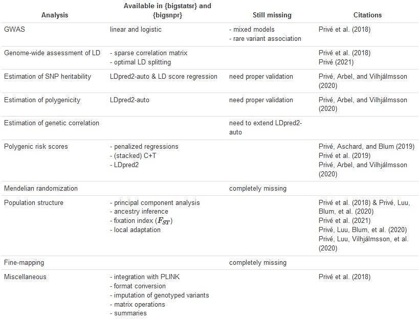

```{r setup, include=FALSE}
options(htmltools.dir.version = FALSE, width = 70)
knitr::opts_chunk$set(fig.align = 'center', dev = "svg", out.width = "70%",
                      echo = FALSE, comment = "", fig.width = 5, global.par = TRUE)
```

class: title-slide center middle inverse

<br>

# iPSYCH2015 data 

## and my R packages

<br>

### Florian Privé

---

### About me

<br>

- Engineer in Informatics and Applied Mathematics

- PhD in computational biology (statistical genetics)    
working mostly on PCA and polygenic scores

- Visiting PhD student at NCRR in 2019 (May - August)

- Postdoc with Bjarni (Oct 2019 - Sep 2021) -> will probably be extended

- Working remotely from France since Dec 2020

- Getting my first shot next Tuesday

- Visiting week 34 (teaching with Clara)

---

### Imputed data on GenomeDK

<br>

- comes from imputation using the RICOPILI pipeline

- imputation has been performed **separately** for the previous (2012) data and the new (2015) data 

- outputs in IMPUTE2 Oxford format storing imputation probabilities (to be 0, 1, or 2)

- qc1: with an INFO score > 0.1 and MAF > 0.005

---

### Imputed data in my format

<br>

- R object to access genotype data stored in a binary file, with matrix-like accessors

- This stores dosage data (rounded to 2 decimal places)    
dosage = expected genotype value (between 0 and 2)    
P(0) = 0.5, P(1) = 0.3, P(2) = 0.2 -> dosage = 0.7

- I merged the two datasets, for variants passing qc on both    
-> almost 134K individuals and 8.8M variants    
-> one big file (1.1 TB), but can easily access only a subset in R and C++

---

### Preparing data for Denmark Statistics

<br>

- I splitted the dosage data into 137 parts with at most 70K variants

- I wrote these to text files

- Then Sussie converted these to SAS format to be sent to DST

- Also two files with information on variants and individuals

- Also 4 parts for chromosome X

---

### What needs to be done on DST

<br>

- Emil is helping me convert these 137 SAS files back to my format

- **We are missing files, especially information on the variants**    

- Information on individuals can be retrieved from somewhere else?    
(e.g. which cohort they are from)

- This might take one week, depending on how easily we can parallelize this

- Then you can either use my R packages to analyze the data,    
or write bed files (possible loss of information -> rounded 0/1/2)


---

### What can be done with my R packages

```{r, out.width="92%"}

```

---

### Warnings about the data

<br>

- Only dosage data is available on DST

- Imputation is far from perfect (due to small chips)

- Imputation accuracies are not the same for 2012 / 2015

- Some frequencies not the same?

<br>

-> may need to perform some QC and analyze the two cohorts separately (or at least add an indicator variable)

---

### Other data available

<br>

- PCs computed on the combined data, restricting to 120K variants genotyped on both chips, and following best practices from https://doi.org/10.1093/bioinformatics/btaa520

- homogeneous subset derived from PCs

- relatedness KING coefficients (> 2^-4.5) computed between pairs of individuals
    - 0.5 = duplicates or monozygotic twins
    - 0.25 = siblings and parents
    - 2^-3 = second-degree relatives (e.g. grandparents, uncles)
    - 2^-4 (e.g. cousins)

- polygenic scores for 215 different traits and diseases, based on the UK Biobank indiivdual-level data

- 900+ external polygenic scores, derived from published sumstats by Clara

---

class: inverse, center, middle

# Thanks!

<br>

Presentation available at    
https://privefl.github.io/thesis-docs/WIP.html

<br>

Some documentation and examples at    
https://privefl.github.io/bigsnpr-extdoc/

<br>

`r icon::fa("twitter")` [privefl](https://twitter.com/privefl) &nbsp;&nbsp;&nbsp;&nbsp; `r icon::fa("github")` [privefl](https://github.com/privefl) &nbsp;&nbsp;&nbsp;&nbsp; `r icon::fa("stack-overflow")` [F. Privé](https://stackoverflow.com/users/6103040/f-priv%c3%a9)

.footnote[Slides created via the R package [**xaringan**](https://github.com/yihui/xaringan).]

