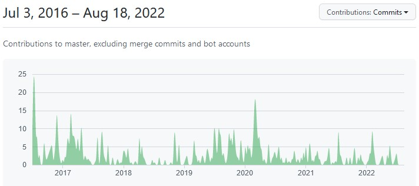
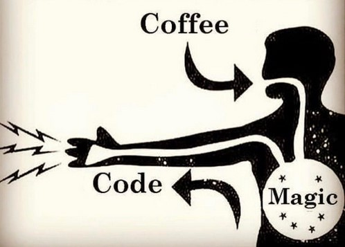
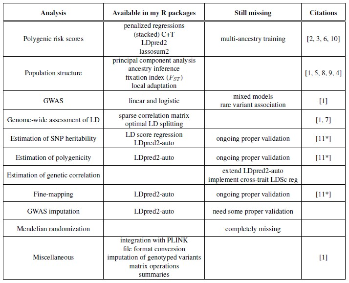

```{r setup, include=FALSE}
options(htmltools.dir.version = FALSE, width = 70)
knitr::opts_chunk$set(fig.align = 'center', dev = "svg", out.width = "70%",
                      echo = FALSE, comment = "", fig.width = 5, global.par = TRUE)
```

class: title-slide center middle inverse

<br>

# `r icon::fa_r_project()` package bigsnpr for genetic analyses, 

# 6 years in the making, and still a WIP

<br>

### Florian Privé

---

### Motivations

<br>

- being able to run all my analyses within `r icon::fa_r_project()`

- frustration of having to use all these different software, with different input formats, and requiring text files for parameters

- making it easier to build a chain of analyses, to perform some exploratory analyses, and to use  `r icon::fa_r_project()` packages I am already familiar with

- making it easier to develop new methods, which seemed very hard to do without using a simple matrix-like format

<br>

$\rightarrow$ I have been the first user of my packages, and it has made my work so much easier 

---

### Continuous coding for the package

<br>

https://github.com/privefl/bigsnpr

<br>

```{r, out.width="95%"}

```

---

### How to code efficiently

<br>

```{r, out.width="80%"}

```

---

### Overview of methods implemented

```{r, out.width="88%"}

```

---

### References

```{css}
.small { font-size: 75% }
```


.small[
[10] Privé, Florian, et al. "Identifying and correcting for misspecifications in GWAS summary statistics and polygenic scores." *bioRxiv* (2022). [[preprint]](https://doi.org/10.1101/2021.03.29.437510) (accepted in HGG Advances)

[9] Privé, Florian. "Using the UK Biobank as a global reference of worldwide populations: application to measuring ancestry diversity from GWAS summary statistics." *Bioinformatics* 38.13 (2022): 3477-3480. [[Open Access]](https://doi.org/10.1093/bioinformatics/btac348)

[8] Privé, Florian, et al. "Portability of 245 polygenic scores when derived from the UK Biobank and applied to 9 ancestry groups from the same cohort." *The American Journal of Human Genetics* 109.1 (2022): 12-23. [[Open Access]](https://doi.org/10.1016/j.ajhg.2021.11.008)

[7] Privé, Florian. "Optimal linkage disequilibrium splitting." *Bioinformatics* 38.1 (2022): 255–256. [[Open Access]](https://doi.org/10.1093/bioinformatics/btab519)

[6] Privé, Florian, et al. "LDpred2: better, faster, stronger." *Bioinformatics* 36.22-23 (2020): 5424-5431. [[Open Access]](https://doi.org/10.1093/bioinformatics/btaa1029)

[5] Privé, Florian, et al. "Efficient toolkit implementing best practices for principal component analysis of population genetic data." *Bioinformatics* 36.16 (2020): 4449-4457. [[Open Access]](https://doi.org/10.1093/bioinformatics/btaa520)

[4] Privé, Florian, et al. "Performing highly efficient genome scans for local adaptation with R package pcadapt version 4." *Molecular biology and evolution* 37.7 (2020): 2153-2154. [[Open access]](https://doi.org/10.1093/molbev/msaa053)

[3] Privé, Florian, et al. "Making the most of Clumping and Thresholding for polygenic scores." *The American Journal of Human Genetics* 105.6 (2019): 1213-1221. [[Open access]](https://doi.org/10.1016/j.ajhg.2019.11.001)

[2] Privé, Florian, et al. "Efficient implementation of penalized regression for genetic risk prediction." *Genetics* 212.1 (2019): 65-74. [[Open access]](https://doi.org/10.1534/genetics.119.302019)

[1] Privé, Florian, et al. "Efficient analysis of large-scale genome-wide data with two R packages: bigstatsr and bigsnpr." *Bioinformatics* 34.16 (2018): 2781-2787. [[Open access]](https://doi.org/10.1093/bioinformatics/bty185)

]

---

### Questions

<br>

- Anything else to be implemented?

- How to get more users?

- How to get contributions? (e.g. extensions of the package)
