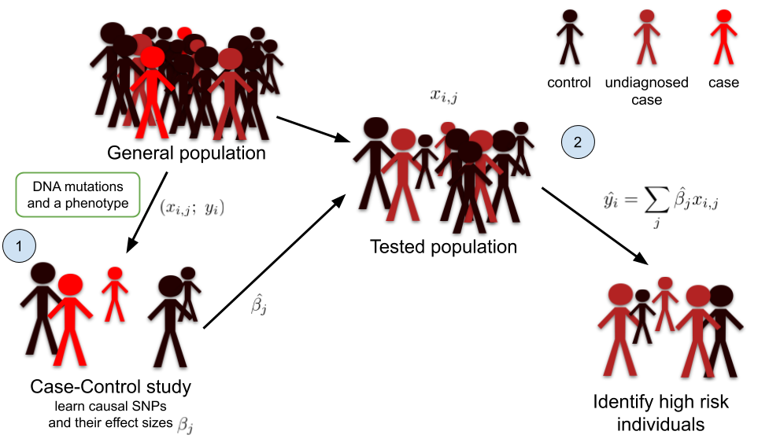
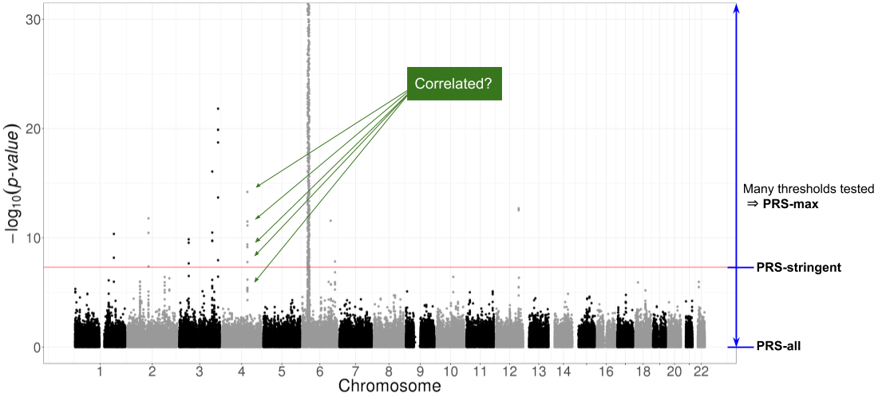

```{r setup, include=FALSE}
options(htmltools.dir.version = FALSE)
knitr::opts_chunk$set(echo = FALSE, fig.align = 'center', dev = "svg")
```

class: title-slide center middle inverse

## Efficient statistical tools for analyzing omics data 

### with a focus on polygenic risk prediction

<br>

### Florian Privé

#### Aarhus - January 2019

---

class: center middle inverse

# Introduction & Motivation

---

## About

I'm a PhD Student (2016-2019) in **Predictive Human Genetics** in Grenoble.

$$\boxed{\Large{\text{Disease} \sim \text{DNA mutations} + \cdots}}$$

```{r}
knitr::include_graphics("https://r-in-grenoble.github.io/cover.jpg")
```

---

class: center, middle, inverse

# Introduction

---


## From genome-wide association studies (GWAS)<br>to polygenic risk scores (PRS)

<br>


```{r, out.width="95%"}
knitr::include_graphics("https://upload.wikimedia.org/wikipedia/commons/thumb/1/12/Manhattan_Plot.png/546px-Manhattan_Plot.png")
```

<br>

$$PRS_i = \sum_{\substack{j \in S \\ p_j~<~p_T}} \hat\beta_j \cdot G_{i,j}$$

---

## Polygenic Risk Scores (PRS) for epidemiology

<br>

**One application: to provide evidence** for a polygenic contribution to a trait or a shared polygenic relationship between traits.

<br>

```{r, out.width="90%", fig.cap="<small>Source: 10.1111/jcpp.12295</small>"}
knitr::include_graphics("figures/genomic-profile.png")
```

---

## Polygenic Risk Scores (PRS) for epidemiology

```{r, out.width="75%", fig.cap="<small>Source: 10.1038/nature08185</small>"}
knitr::include_graphics("figures/purcell2009.png")
```

---

## Polygenic Risk Scores (PRS) for predictive medicine

### Another application: to identify high risk individuals

```{r, out.width="95%"}

```

---

## Interest in prediction: polygenic risk scores (PRS)

- Wray, Naomi R., Michael E. Goddard, and Peter M. Visscher. "**Prediction of individual genetic risk** to disease from genome-wide association studies." Genome research 17.10 (**2007**): 1520-1528.

- Wray, Naomi R., et al. "Pitfalls of **predicting complex traits** from SNPs." Nature Reviews Genetics 14.7 (**2013**): 507.

- Dudbridge, Frank. "Power and **predictive accuracy of polygenic risk scores**." PLoS genetics 9.3 (**2013**): e1003348.

- Chatterjee, Nilanjan, Jianxin Shi, and Montserrat García-Closas. "Developing and evaluating **polygenic risk prediction** models for stratified disease prevention." Nature Reviews Genetics 17.7 (**2016**): 392.

- Martin, Alicia R., et al. "Human demographic history impacts **genetic risk prediction** across diverse populations." The American Journal of Human Genetics 100.4 (**2017**): 635-649.

.footnote2[Still a gap between current predictions and clinical utility.</br>Need more optimal predictions + larger sample sizes.]


---

## Very large genotype matrices

- previously: 15K x 280K, [celiac disease](https://doi.org/10.1038/ng.543) (~30GB)

- currently: 500K x 500K, [UK Biobank](https://doi.org/10.1101/166298) (~2TB)
 
```{r, out.width='55%'}
knitr::include_graphics("https://media.giphy.com/media/3o7bueyxGydy48Lwgo/giphy.gif")
```

.footnote[But I still want to use `r icon::fa_r_project()`..]

---

class: center, middle, inverse

# How to analyze large genomic data?

---

## Our two R packages: bigstatsr and bigsnpr

### Statistical tools with big matrices stored on disk

<br>

<a href="https://doi.org/10.1093/bioinformatics/bty185" target="_blank">
```{r, out.width='70%'}
knitr::include_graphics("figures/bty185.png")
```
</a>

<br>

- {bigstatsr} for many types of matrix, to be used by any field of research

- {bigsnpr} for functions that are specific to the analysis of genetic data


<br>

Package {bigstatsr} provides fast PCA, association and predictive models, etc.

---

## The solution I found

```{r, out.width='90%'}
knitr::include_graphics("https://raw.githubusercontent.com/privefl/RR18/master/memory-solution.svg?sanitize=true")
```

.footnote[Format `FBM` is very similar to format `filebacked.big.matrix` from package {bigmemory} (details in [this vignette](https://privefl.github.io/bigstatsr/articles/bigstatsr-and-bigmemory.html)).]

---

## Multiple association testing

The idea behind Genome-Wide Association Studies (GWAS) is simple: test each variant one by one for association with the phenotype of interest.
For a continuous phenotype (e.g. height), linear regression is used and a t-test is performed for each SNP $j$ on $\beta^{(j)}$ where
$$\hat{y} = \alpha^{(j)} + \beta^{(j)} SNP^{(j)} + \gamma_1^{(j)} COV_1 + \cdots + \gamma_K^{(j)} COV_K~,$$
and $K$ is the number of covariables, including **principal components** and other covariates such as age and gender. 

Similarly, for a binary phenotype (e.g. disease status), logistic regression is used and a Z-test is performed for each SNP $j$ on $\beta^{(j)}$ where
$$\log{\left(\frac{\hat{p}}{1-\hat{p}}\right)} = \alpha^{(j)} + \beta^{(j)} SNP^{(j)} + \gamma_1^{(j)} COV_1 + \cdots + \gamma_K^{(j)} COV_K~,$$
and $\hat{p} = \mathbb{P}(Y = 1)$ and $Y$ denotes the binary phenotype.

---

### Which DNA mutations are associated with one disease?

<br>

```{r, out.width='90%'}
knitr::include_graphics("figures/celiac-gwas-cut.png")
```

---

## Partial Singular Value Decomposition

15K $\times$ 100K -- 10 first PCs -- 6 cores -- **1 min** (vs 2h in base R)

</br>

```{r, out.width='90%'}
knitr::include_graphics("https://raw.githubusercontent.com/privefl/RR18/master/PC1-4.png")
```

.footnote[Implemented in `big_randomSVD()`, powered by R packages {RSpectra} and {Rcpp}.]

---

## Benchmarks (GWAS)

```{r, out.width='80%'}
knitr::include_graphics("figures/table-bench.png")
```

---

## Benchmarks (PCA)

.pull-left[
```{r, out.width='100%'}

```
]

.pull-right[
```{r, out.width='100%'}
knitr::include_graphics("figures/approx-pca.png")
```
]

---

class: center, middle, inverse

# How to predict disease status<br>based on genotypes?

---

## Standard PRS - part 1: estimating effects

### Genome-wide association studies (GWAS)

In a GWAS, each single-nucleotide polymorphism (SNP) is tested **independently**, resulting in one **effect size** $\hat\beta$ and one **p-value** $p$ for each SNP. 

```{r, out.width="75%"}
knitr::include_graphics("figures/celiac-gwas-cut.png")
```

Easy combining: $PRS_i = \sum \hat\beta_j \cdot G_{i,j}$

---

## Standard PRS - part 2: restricting predictors

### <span style="color:#38761D">Clumping</span> + <span style="color:#1515FF">Thresholding</span> ("C+T" or just "PRS")

<br>

```{r, out.width="90%"}

```

$$PRS_i = \sum_{\substack{j \in S_\text{clumping} \\ p_j~<~p_T}} \hat\beta_j \cdot G_{i,j}$$

---

## A more optimal approach to computing PRS?

In C+T: weights learned independently and heuristics for correlation and regularization.

#### Statistical learning

- joint models of all SNPs at once

- use regularization to account for correlated and null effects

- already proved useful in the litterature (Abraham et al. 2013; Okser et al. 2014; Spiliopoulou et al. 2015)

#### Our contribution

- a memory- and computation-efficient implementation to be used for biobank-scale data

- an automatic choice of the regularization hyper-parameter

- a comprehensive comparison for different disease architectures

---

## Penalized Logistic Regression (PLR)

<br>

<Small>$$\arg\!\min_{\beta_0,~\beta}(\lambda, \alpha)\left\{  \underbrace{ -\sum_{i=1}^n \left( y_i \log\left(p_i\right) + (1 - y_i) \log\left(1 - p_i\right) \right) }_\text{Loss function}   +   \underbrace{ \lambda \left((1-\alpha)\frac{1}{2}\|\beta\|_2^2 + \alpha \|\beta\|_1\right) }_\text{Penalization}  \right\}$$</Small>

<br>

***

- $p_i=1/\left(1+\exp\left(-(\beta_0 + x_i^T\beta)\right)\right)$

- $x$ is denoting the genotypes and covariables (e.g. principal components), 

- $y$ is the disease status we want to predict, 

- $\lambda$ is a regularization parameter that needs to be determined and

- $\alpha$ determines relative parts of the regularization $0 \le \alpha \le 1$. 

---

### Prediction with logit-simple is improving faster

<br>

```{r, out.width="80%"}
knitr::include_graphics("figures/pres-AUC-ntrain2.svg")
```

.foonote["Efficient implementation of penalized regression for genetic risk prediction" -- under revision]

---

## Real data

<br>

#### Celiac disease

- intolerance to gluten

- only treatment: gluten-free diet

- heritability: 57-87% (Nisticò et al. 2006)

- prevalence: 1-6%

<br>

#### Case-control study for the celiac disease (WTCCC, Dubois et al. 2010)

- ~15,000 individuals

- ~280,000 SNPs

- ~30% cases

---

### Results: real Celiac phenotypes

```{r, out.width="95%"}

```

```{r, out.width="55%"}
knitr::include_graphics("figures/celiac-roc3.svg")
```

---

## LASSO for predicting height

- 350K individuals x 656K SNPs in less than one day

- Within each sex category, 65.5% of correlation between predicted and true height (56% max with C+T // 58.8% with lassosum)

```{r, out.width="65%"}
knitr::include_graphics("https://privefl.github.io/blog/images/UKB-final-pred.png")
```

.footnote[[(blog post)](https://privefl.github.io/blog/predicting-height-based-on-dna-mutations/)]

---

class: center, middle, inverse

# Using summary statistics

---

## Predictive methods based on summary statistics

- C+T (already presented)

- LDpred (Vilhjálmsson, Bjarni J., et al. "Modeling linkage disequilibrium increases accuracy of polygenic risk scores." The American Journal of Human Genetics 97.4 (2015): 576-592).

- lassosum (Mak, Timothy Shin Heng, et al. "Polygenic scores via penalized regression on summary statistics." Genetic epidemiology 41.6 (2017): 469-480.)

The idea of LDpred and lassosum is to use a reference panel to accound for LD between SNPs, instead of pruning (removing) SNPs. Lassosum also adds some sparsity.

---

## Could those models be improved?

- linear models; optimal for binary phenotypes?

- support PLINK bed files only; what about BGEN files such as for the UK Biobank?

- scalable to which extent?

- take into account quality of imputation?

- combine with individual-level datasets? (of possibly different populations)

---

class: center, middle, inverse

# Thanks!

<br>

Presentation available at

https://privefl.github.io/thesis-docs/aarhus.html

<br>

`r icon::fa("twitter")` [privefl](https://twitter.com/privefl) &nbsp;&nbsp;&nbsp;&nbsp; `r icon::fa("github")` [privefl](https://github.com/privefl) &nbsp;&nbsp;&nbsp;&nbsp; `r icon::fa("stack-overflow")` [F. Privé](https://stackoverflow.com/users/6103040/f-priv%c3%a9)

.footnote[Slides created via R package [**xaringan**](https://github.com/yihui/xaringan).]
