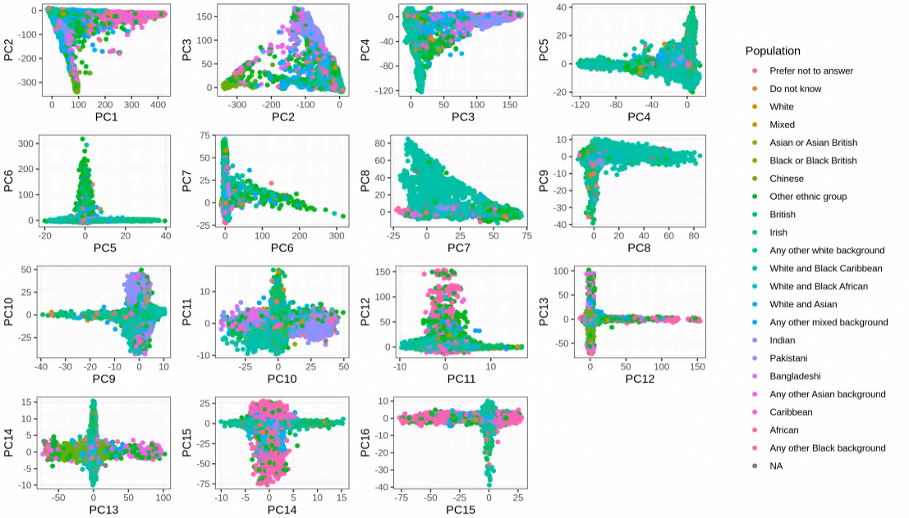
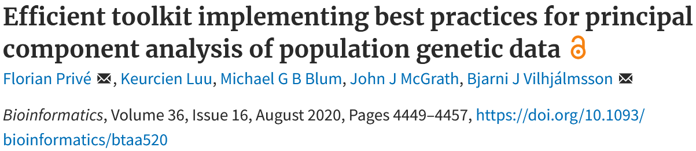

```{r setup, include=FALSE}
# renderthis::to_pdf("ldpred2-wcpg2023.Rmd", partial_slides = TRUE)
options(htmltools.dir.version = FALSE, width = 70)
knitr::opts_chunk$set(fig.align = 'center', dev = "svg", out.width = "70%",
                      echo = FALSE, comment = "", fig.width = 5, global.par = TRUE)
ICON_R_PROJECT <- icons::fontawesome$brands$`r-project`
ICON_TRI_EXCL  <- icons::fontawesome$solid$`exclamation-triangle`
ICON_INFO      <- icons::fontawesome$solid$`info-circle`
```

class: title-slide center middle inverse

<br>

# Improved ancestry and admixture detection<br>using principal component analysis<br>of genetic data

<br>

## Florian Privé 
### Aarhus University (DK)
#### <svg xmlns="http://www.w3.org/2000/svg" viewBox="0 0 576 512" width="1em" height="1em"><path d="M407.8 294.7c-3.3-.4-6.7-.8-10-1.3c3.4 .4 6.7 .9 10 1.3zM288 227.1C261.9 176.4 190.9 81.9 124.9 35.3C61.6-9.4 37.5-1.7 21.6 5.5C3.3 13.8 0 41.9 0 58.4S9.1 194 15 213.9c19.5 65.7 89.1 87.9 153.2 80.7c3.3-.5 6.6-.9 10-1.4c-3.3 .5-6.6 1-10 1.4C74.3 308.6-9.1 342.8 100.3 464.5C220.6 589.1 265.1 437.8 288 361.1c22.9 76.7 49.2 222.5 185.6 103.4c102.4-103.4 28.1-156-65.8-169.9c-3.3-.4-6.7-.8-10-1.3c3.4 .4 6.7 .9 10 1.3c64.1 7.1 133.6-15.1 153.2-80.7C566.9 194 576 75 576 58.4s-3.3-44.7-21.6-52.9c-15.8-7.1-40-14.9-103.2 29.8C385.1 81.9 314.1 176.4 288 227.1z" fill="white"/></svg> `r icons::icon_style(fill = "white", icons::fontawesome$brands$github)` privefl

---

### About me

--

***

Grenoble:

- [2013&#8211;2016] Engineer in Informatics and Mathematics (**ENSIMAG**)

- [2016&#8211;2019] **PhD** in **statistical human genetics**,    
with Michael Blum (**TIMC**) and Hugues Aschard (Institut Pasteur),    
working mostly on polygenic scores and population structure 

--

***

Aarhus, Denmark:

- [2019&#8211;2022] Postdoc

- [2022&#8211;] Senior Researcher (same place)

--

***

France:

- [2021&#8211;] Working remotely from France

--

- [2025] Applied as 'Chargé de Recherche' at CNRS (CID 51) and INSERM

***

---

class: inverse, center, middle

# Principal Component Analysis (PCA) of genetic data captures population structure

---

### PCA of genetic data captures continental population structure

<br>

```{r, out.width="100%", fig.cap="in the UK Biobank data"}
knitr::include_graphics("figures/PCA-UKBB-Bycroft.png")
```

---

### PCA also captures sub-continental population structure

```{r, out.width="75%", fig.cap="in the POPRES data (European subset)"}
knitr::include_graphics("figures/PCA-POPRES-EUR.png")
```

---

### Distance in PCA measures genetic distance

```{r, out.width="100%", fig.cap="in the 1000 Genomes data"}
knitr::include_graphics("figures/compare-Euclidean-to-Fst.png")
```

.footnote[Source: 10.1016/j.ajhg.2021.11.008]


---

class: inverse, center, middle

# Genetic Ancestry Deconvolution

## (with reference populations)

---

### Summix: ancestry estimation from GWAS allele frequencies (AF)

Source: 10.1016/j.ajhg.2021.05.016

<br>

Estimate ancestry proportions $q$ such that

```{css}
.small2 {
  font-size: 17px;
}
```

<span class="small2"> $$AF = q_\text{AFR} AF_\text{AFR} + q_\text{EAS} AF_\text{EAS} + q_\text{EUR} AF_\text{EUR} + q_\text{SAS} AF_\text{SAS} + q_\text{IAM} AF_\text{IAM} + \epsilon ~,$$ </span>

where all $q$ are positive and sum to 1.

--

<br>

More general formulation:

<span class="small2"> $$\min_{\forall l,~q_l \ge 0 \\ \sum_l {q_l}=1} ~~ \sum_{j=1}^M \left( AF_j - \sum_{l=1}^L q_l AF_j^{\text{ref}~(l)} \right)^2$$ </span>

<!-- = \min_{q \ge 0 \\ \mathbb{1}^Tq=1} ~~ ||AF - AF^{\text{ref}} \cdot q||_2^2 -->

<br>

$\Rightarrow$ Quadratic programming with linear constraints

---

```{r, out.width="100%"}
knitr::include_graphics("figures/paper9-2.png")
```

--

<br>

- Curate the UK Biobank to define 18 worldwide reference groups

--

- Use PCA to maximize power to distinguish between these populations:

    <span class="small2"> $$\min_{\forall l,~q_l \ge 0 \\ \sum_l {q_l}=1} ~~ \sum_{j=1}^M \left( AF_j - \sum_{l=1}^L q_l AF_j^{\text{ref}~(l)} \right)^2$$ </span>
    
    is replaced by
    
    <span class="small2"> $$\min_{\forall l,~q_l \ge 0 \\ \sum_l {q_l}=1} ~~ \sum_{k=1}^K \left( PC_k - \sum_{l=1}^L q_l PC_k^{\text{ref}~(l)} \right)^2$$ </span>
    
---

With my improved method:

```{r, out.width="95%"}
knitr::include_graphics("figures/ancestry-bigsnpr.png")
```

--

With Summix:

```{r, out.width="95%"}
knitr::include_graphics("figures/ancestry-summix.png")
```

---

### Admixture coefficients for individual-level data

<br>

**My developed method also works for individual-level data!**

(by simply using genotypes, divided by 2, in place of allele frequencies)

This is similar to the projection analysis from ADMIXTURE,    
but should have more power..

--

<br>

Application to iPSYCH (genetic study in Denmark):

Out of 134K individuals, can identify many non-European individuals:

- Middle East: 2600
- East Africa: 450
- North Africa: 330
- South Asia: 840
- East Asia: 280

---

class: inverse, center, middle

# Genetic Ancestry Deconvolution

## (without reference populations)

---

### My proposed deconvolution method

$$G \approx Q \cdot 2F$$

$$PC \approx Q \cdot PC^\text{ref}$$
--

<br>

Iterate between 

- estimating ancestry coefficients $Q_{i,.}$ (for each individual $i$) with
    <span class="small2"> $$\min_{\forall l,~Q_{i,l} \ge 0 \\ \sum_l Q_{i,l}=1} ~~ \sum_{k=1}^K \left( PC_{i,k} - \sum_{l=1}^L Q_{i,l} PC_{l,k}^{\text{ref}} \right)^2$$ </span>
    
--

<br>

- estimating reference positions (for each $l$) with
    <span class="small2"> $$PC_{l,.}^{\text{ref}} = \dfrac{\sum_i {Q_{i,l}}^m \cdot PC_{i,.}}{\sum_i {Q_{i,l}}^m} ~,$$ </span>
  
---

### Iterative algorithm with warm starts

<br>

A naive approach would pick L initial $PC_{l,.}^{\text{ref}}$ at random.

--

<br>

Instead,

- I start with L=2 reference populations using K=1 PC,

- and iteratively add one more reference (L+1) with each new PC (K+1)

- with some well-chosen starting value for the new reference

--

<br>

This makes the algorithm

- deterministic and more stable

- faster to converge

- easy to choose L based on K (L=K+1)

---

### PCA of the UK Biobank

<br>

```{r, out.width="100%"}

```


---

### One prototyped method (with m = 1.5)

<br>

```{r, out.width="100%"}

```

---

### One prototyped method (with m = 1.5)

<br>

```{r, out.width="100%"}

```

---

### One prototyped method (with m = 1.5)

<br>

```{r, out.width="100%"}
knitr::include_graphics("figures/clust_myalgo_4.png")
```

---

### One prototyped method (with m = 1.5)

<br>

```{r, out.width="100%"}
knitr::include_graphics("figures/clust_myalgo_5.png")
```

---

### One prototyped method (with m = 1.5)

<br>

```{r, out.width="100%"}

```

---

### One prototyped method (with m = 1.5)

<br>

```{r, out.width="100%"}
knitr::include_graphics("figures/clust_myalgo_7.png")
```

---

### One prototyped method (with m = 1.5)

<br>

```{r, out.width="100%"}
knitr::include_graphics("figures/clust_myalgo_8.png")
```

---

### One prototyped method (with m = 1.5)

<br>

```{r, out.width="100%"}
knitr::include_graphics("figures/clust_myalgo_9.png")
```

---

### One prototyped method (with m = 1.5)

<br>

```{r, out.width="100%"}
knitr::include_graphics("figures/clust_myalgo_10.png")
```

---

### One prototyped method (with m = 1.5)

<br>

```{r, out.width="100%"}

```

---

### One prototyped method (with m = 3)

<br>

```{r, out.width="100%"}

```

---

### Corresponding admixture coefficients (by GPS coordinates)

<br>

```{r, out.width="100%"}
knitr::include_graphics("figures/sgdp_anc3.png")
```

---

class: inverse, center, middle

# Distortion in PCA

---

### The effect of uneven sampling on PCA ([McVean 2009](https://doi.org/10.1371/journal.pgen.1000686))

```{r, out.width="52%"}
knitr::include_graphics("figures/PCA-distortion.png")
```

---

### Two solutions to this problem

--

<br>

- weighted PCA    
(less straightforward to compute)

- subsampling of overrepresented group(s)    
(what I tried)

---

class: inverse, center, middle

# Capturing more population structure
# with less individuals

---

```{r, out.width="100%"}

```

--

<br>

In the UK Biobank,

- only 16 PCs actually capture population structure 

- PC 19--40 capture LD; do not use these!

--

<br>

When subsampling British and Irish individuals 

- can obtain 40 PCs that capture some population structure

---

### PCA after subsampling, in the UK Biobank

- Subsampling 10,000 British individuals (2.3%) 
- and 5000 Irish individuals (39,2%), 
- while keeping all indiv with other or unknown self-reported ancestry.

```{r, out.width="100%"}
knitr::include_graphics("https://github.com/privefl/paper4-bedpca/blob/master/UKBB-scores-restricted.png?raw=true")
```

---

### Can we do better than this?

<br>

- the numbers kept are a bit arbitrary

- what if the self-reported ancestry is missing or inaccurate?

<br>

$\Longrightarrow$ design an algorithm that does not use this information

---

### Idea: discard points/individuals in dense regions

<br>

Using 16 PCs in the UK Biobank,

1. Compute densities of all points    
as the sum of inverse of squared Euclidean distances with all other points

2. Discard the point (individual) with the largest density

3. Update the densities 

4. Iterate 2. and 3. until N points are left

---

### Initial density in PCA

<br>

```{r, out.width="100%"}

```

---

### Ancestry composition of subsamples

<br>

```{r, out.width="100%"}

```

---

### Density and subsample of "Prefer not to answer" individuals 

<br>

```{r, out.width="100%"}

```

---

### Density and subsample of "White" individuals 

<br>

```{r, out.width="100%"}

```

---

### PCA after subsampling, in the UK Biobank (2.1)

<br>

```{r, out.width="100%"}
knitr::include_graphics("figures/PCA2-restricted3-26.png")
```

---

### PCA after subsampling, in the UK Biobank (2.2)

<br>

```{r, out.width="100%"}
knitr::include_graphics("figures/PCA2-restricted27-50.png")
```

---

### Future work

<br>

- understand why I get less added population structure

- consider infinity distance and scaling

--

- use another solution for subsampling (adxmiture-like grouping)

--

- have some other criterion for assessing the "amount" of ancestry captured

---

class: inverse, center, middle

## Thank you for your attention

<br>
<br>
<br>

<svg xmlns="http://www.w3.org/2000/svg" viewBox="0 0 576 512" width="1em" height="1em"><path d="M407.8 294.7c-3.3-.4-6.7-.8-10-1.3c3.4 .4 6.7 .9 10 1.3zM288 227.1C261.9 176.4 190.9 81.9 124.9 35.3C61.6-9.4 37.5-1.7 21.6 5.5C3.3 13.8 0 41.9 0 58.4S9.1 194 15 213.9c19.5 65.7 89.1 87.9 153.2 80.7c3.3-.5 6.6-.9 10-1.4c-3.3 .5-6.6 1-10 1.4C74.3 308.6-9.1 342.8 100.3 464.5C220.6 589.1 265.1 437.8 288 361.1c22.9 76.7 49.2 222.5 185.6 103.4c102.4-103.4 28.1-156-65.8-169.9c-3.3-.4-6.7-.8-10-1.3c3.4 .4 6.7 .9 10 1.3c64.1 7.1 133.6-15.1 153.2-80.7C566.9 194 576 75 576 58.4s-3.3-44.7-21.6-52.9c-15.8-7.1-40-14.9-103.2 29.8C385.1 81.9 314.1 176.4 288 227.1z" fill="white"/></svg> `r icons::icon_style(fill = "white", icons::fontawesome$brands$github)` privefl
