```{r setup, include=FALSE}
# renderthis::to_pdf("ldpred2-wcpg2023.Rmd", partial_slides = TRUE)
options(htmltools.dir.version = FALSE, width = 70)
knitr::opts_chunk$set(fig.align = 'center', dev = "svg", out.width = "70%",
                      echo = FALSE, comment = "", fig.width = 5, global.par = TRUE)
ICON_R_PROJECT <- icons::fontawesome$brands$`r-project`
ICON_TRI_EXCL  <- icons::fontawesome$solid$`exclamation-triangle`
ICON_INFO      <- icons::fontawesome$solid$`info-circle`
```

class: title-slide center middle inverse

<br>

# Improved ancestry and admixture detection<br>using principal component analysis<br>of genetic data

<br>

## Florian Privé 

#### <svg xmlns="http://www.w3.org/2000/svg" viewBox="0 0 576 512" width="1em" height="1em"><path d="M407.8 294.7c-3.3-.4-6.7-.8-10-1.3c3.4 .4 6.7 .9 10 1.3zM288 227.1C261.9 176.4 190.9 81.9 124.9 35.3C61.6-9.4 37.5-1.7 21.6 5.5C3.3 13.8 0 41.9 0 58.4S9.1 194 15 213.9c19.5 65.7 89.1 87.9 153.2 80.7c3.3-.5 6.6-.9 10-1.4c-3.3 .5-6.6 1-10 1.4C74.3 308.6-9.1 342.8 100.3 464.5C220.6 589.1 265.1 437.8 288 361.1c22.9 76.7 49.2 222.5 185.6 103.4c102.4-103.4 28.1-156-65.8-169.9c-3.3-.4-6.7-.8-10-1.3c3.4 .4 6.7 .9 10 1.3c64.1 7.1 133.6-15.1 153.2-80.7C566.9 194 576 75 576 58.4s-3.3-44.7-21.6-52.9c-15.8-7.1-40-14.9-103.2 29.8C385.1 81.9 314.1 176.4 288 227.1z" fill="white"/></svg> `r icons::icon_style(fill = "white", icons::fontawesome$brands$github)` privefl

---

class: inverse, center, middle

# Principal Component Analysis (PCA) of genetic data captures population structure

---

### PCA of genetic data captures continental population structure

<br>

```{r, out.width="100%", fig.cap="in the UK Biobank data"}
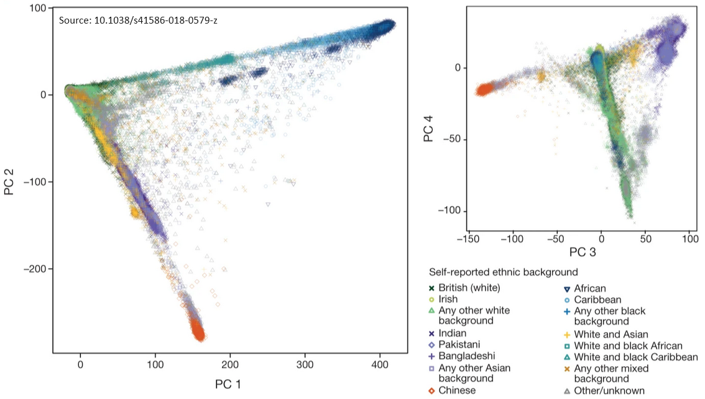
```

---

### PCA also captures sub-continental population structure

```{r, out.width="75%", fig.cap="in the POPRES data (European subset)"}
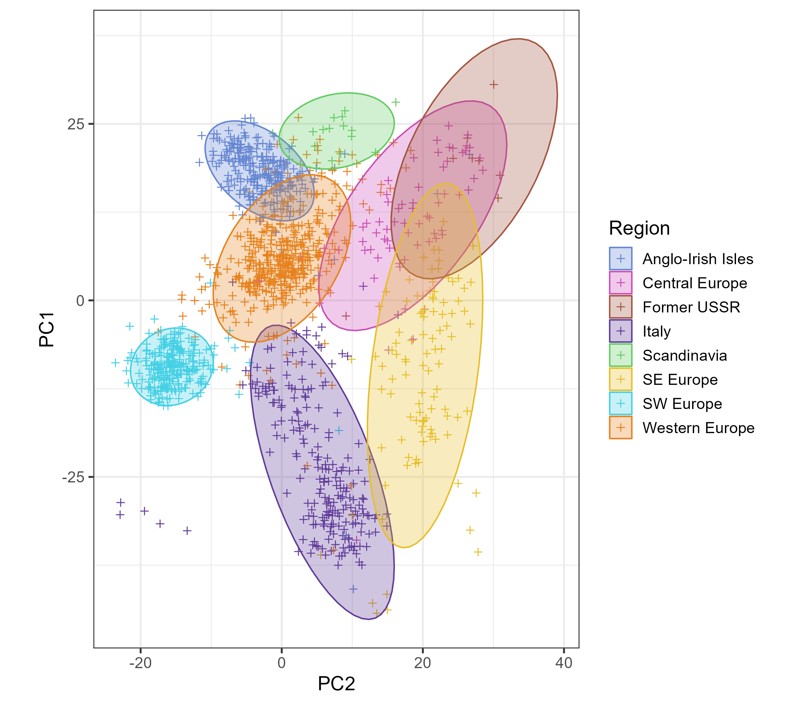
```

---

### Distance in PCA measures genetic distance

```{r, out.width="100%", fig.cap="in the 1000 Genomes data"}
knitr::include_graphics("figures/compare-Euclidean-to-Fst.png")
```

.footnote[Source: 10.1016/j.ajhg.2021.11.008]


---

class: inverse, center, middle

# Genetic Ancestry Deconvolution

## (with reference populations)

---

### Summix: ancestry estimation from GWAS allele frequencies (AF)

Source: 10.1016/j.ajhg.2021.05.016

<br>

Estimate ancestry proportions $q$ such that

```{css}
.small2 {
  font-size: 17px;
}
```

<span class="small2"> $$AF = q_\text{AFR} AF_\text{AFR} + q_\text{EAS} AF_\text{EAS} + q_\text{EUR} AF_\text{EUR} + q_\text{SAS} AF_\text{SAS} + q_\text{IAM} AF_\text{IAM} + \epsilon ~,$$ </span>

where all $q$ are positive and sum to 1.

--

<br>

More general formulation:

<span class="small2"> $$\min_{\forall l,~q_l \ge 0 \\ \sum_l {q_l}=1} ~~ \sum_{j=1}^M \left( AF_j - \sum_{l=1}^L q_l AF_j^{\text{ref}~(l)} \right)^2$$ </span>

<!-- = \min_{q \ge 0 \\ \mathbb{1}^Tq=1} ~~ ||AF - AF^{\text{ref}} \cdot q||_2^2 -->

<br>

$\Rightarrow$ Quadratic programming with linear constraints

---

```{r, out.width="100%"}
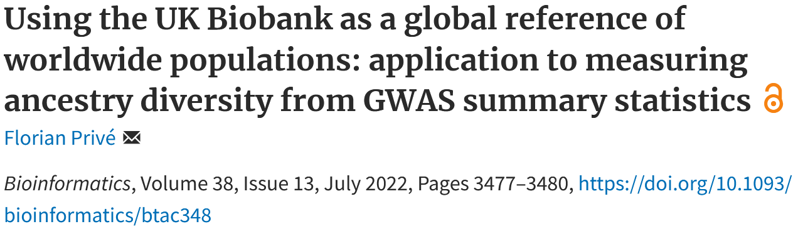
```

--

<br>

- Curate the UK Biobank to define 18 worldwide reference groups

--

- Use PCA to maximize power to distinguish between these populations:

    <span class="small2"> $$\min_{\forall l,~q_l \ge 0 \\ \sum_l {q_l}=1} ~~ \sum_{j=1}^M \left( AF_j - \sum_{l=1}^L q_l AF_j^{\text{ref}~(l)} \right)^2$$ </span>
    
    is replaced by
    
    <span class="small2"> $$\min_{\forall l,~q_l \ge 0 \\ \sum_l {q_l}=1} ~~ \sum_{k=1}^K \left( PC_k - \sum_{l=1}^L q_l PC_k^{\text{ref}~(l)} \right)^2$$ </span>
    
---

With my improved method:

```{r, out.width="95%"}
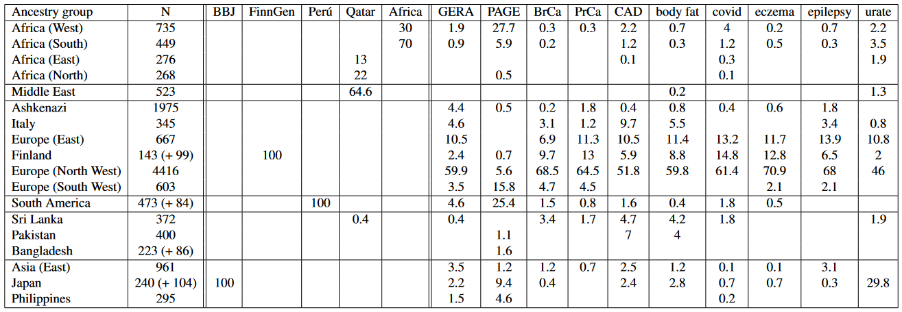
```

--

With Summix:

```{r, out.width="95%"}
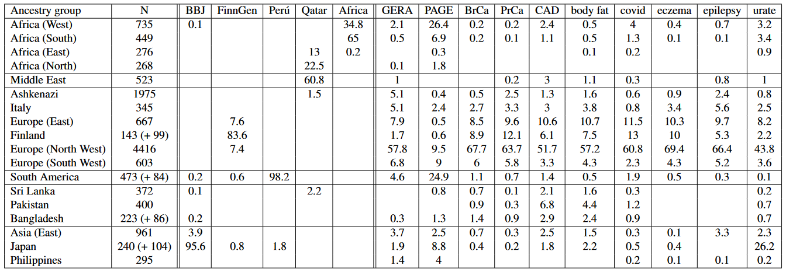
```

---

### Admixture coefficients for individual-level data

<br>

**My developed method also works for individual-level data!**

(by simply using genotypes, divided by 2, in place of allele frequencies)

This is similar to the projection analysis from ADMIXTURE,    
but should have more power..

--

<br>

Application to iPSYCH (genetic study in Denmark):

Out of 134K individuals, can identify many non-European individuals:

- Middle East: 2600
- East Africa: 450
- North Africa: 330
- South Asia: 840
- East Asia: 280

---

class: inverse, center, middle

# Genetic Ancestry Deconvolution

## (without reference populations)

---

### My proposed deconvolution method

$$G \approx Q \cdot 2F$$

$$PC \approx Q \cdot PC^\text{ref}$$
--

<br>

Iterate between 

- estimating ancestry coefficients $Q_{i,.}$ (for each individual $i$) with
    <span class="small2"> $$\min_{\forall l,~Q_{i,l} \ge 0 \\ \sum_l Q_{i,l}=1} ~~ \sum_{k=1}^K \left( PC_{i,k} - \sum_{l=1}^L Q_{i,l} PC_{l,k}^{\text{ref}} \right)^2$$ </span>
    
--

<br>

- estimating reference positions (for each $l$) with
    <span class="small2"> $$PC_{l,.}^{\text{ref}} = \dfrac{\sum_i {Q_{i,l}}^m \cdot PC_{i,.}}{\sum_i {Q_{i,l}}^m} ~,$$ </span>
  
---

### Iterative algorithm with warm starts

<br>

A naive approach would pick L initial $PC_{l,.}^{\text{ref}}$ at random.

--

<br>

Instead,

- I start with L=2 reference populations using K=1 PC,

- and iteratively add one more reference (L+1) with each new PC (K+1)

- with some well-chosen starting value for the new reference

--

<br>

This makes the algorithm

- deterministic and more stable

- faster to converge

- easy to choose L based on K (L=K+1)

---

### PCA of the UK Biobank

<br>

```{r, out.width="100%"}
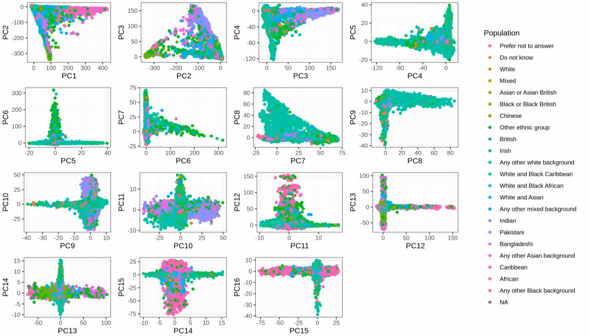
```

---

### Add 3rd reference when considering 2 PCs

```{r, out.width="90%"}
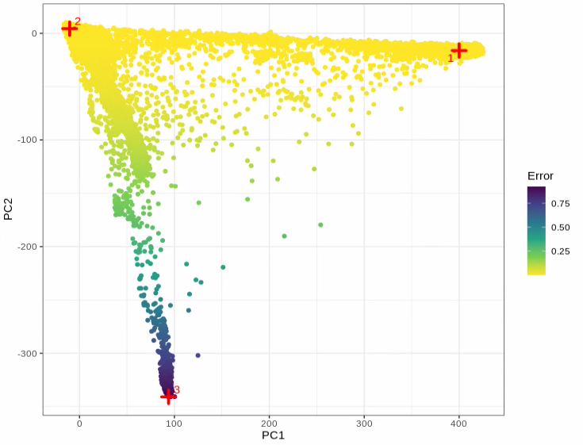
```

---

### After convergence with 3 references and 2 PCs

<br>

```{r, out.width="95%"}
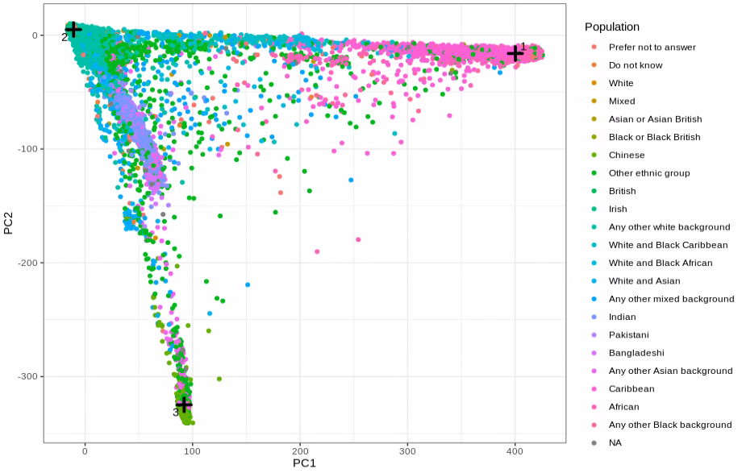
```

---

### Add 4th reference when considering 3 PCs

<br>

```{r, out.width="100%"}
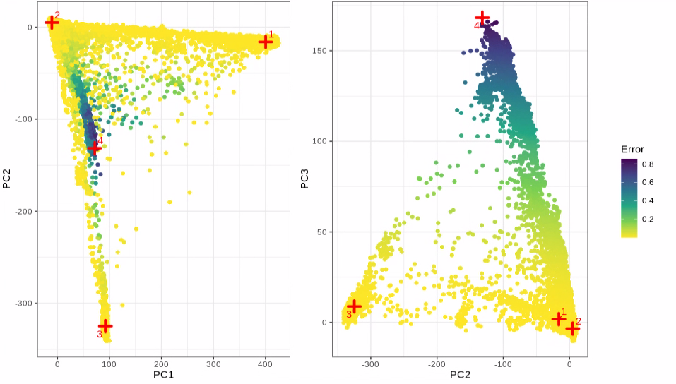
```

---

### Add 5th reference when considering 4 PCs

<br>

```{r, out.width="95%"}
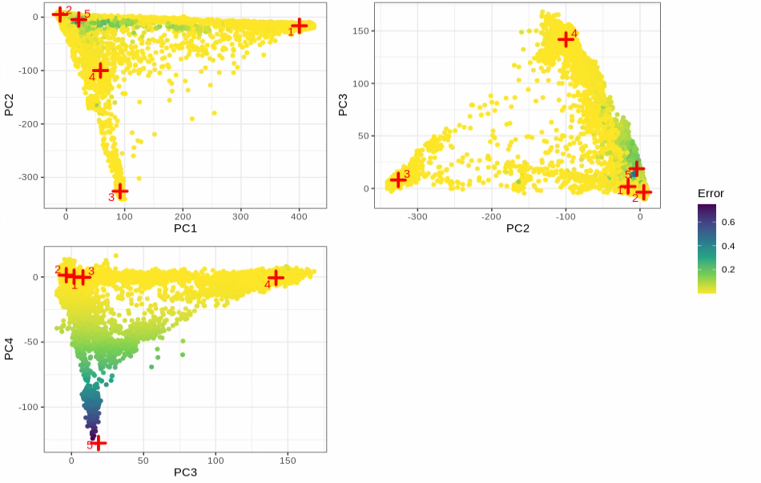
```

---

### After convergence with 17 references and 16 PCs

<br>

```{r, out.width="100%"}
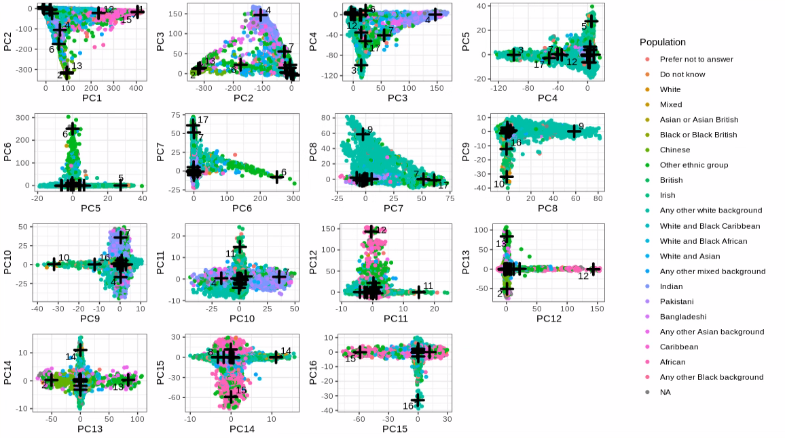
```

---

### Country (of birth) counts with ancestry > 0.6 for each reference

<ul class="small2">
    <li>United Kingdom: 126045 &#8211; NA: 1352 &#8211; Germany: 915 &#8211; South Africa: 477 &#8211; Netherlands: 443 &#8211; USA: 400 &#8211; France: 300 &#8211; Australia: 226 &#8211; Denmark: 197 &#8211; Canada: 195 &#8211; ...</li>
    <li>United Kingdom: 22206 &#8211; NA: 86 &#8211; Germany: 16 &#8211; Ireland: 14</li>
    <li>United Kingdom: 32123 &#8211; Ireland: 289 &#8211; NA: 265 &#8211; New Zealand: 75 &#8211; Canada: 58 &#8211; India: 54 &#8211; Germany: 47 &#8211; South Africa: 43 &#8211; Australia: 40 &#8211; Kenya: 36 &#8211; Malaysia: 29 &#8211; ...</li>
    <li>United Kingdom: 10647 &#8211; Ireland: 9360 &#8211; NA: 290 &#8211; USA: 47 &#8211; Australia: 43 &#8211; ...</li>
    <li>United Kingdom: 1347 &#8211; NA: 30</li>
    <li>United Kingdom: 4080 &#8211; NA: 77</li>
    <li>NA: 752 &#8211; Poland: 599 &#8211; United Kingdom: 415 &#8211; Russia: 131 &#8211; Finland: 105 &#8211; Germany: 87 &#8211; Lithuania: 71 &#8211; Ukraine: 55 &#8211; Czech Republic: 53 &#8211; Latvia: 52 &#8211; Slovakia: 28 &#8211; ...</li>
    <li>India: 1852 &#8211; Kenya: 782 &#8211; Sri Lanka: 653 &#8211; NA: 547 &#8211; Pakistan: 410 &#8211; Mauritius: 273 &#8211; Bangladesh: 235 &#8211; Uganda: 231 &#8211; Tanzania: 175 &#8211; Caribbean: 114 &#8211; The Guianas: 83 &#8211; ...</li>
    <li>Caribbean: 2110 &#8211; NA: 2100 &#8211; Nigeria: 1017 &#8211; Ghana: 866 &#8211; Barbados: 255 &#8211; Sierra Leone: 202 &#8211; The Guianas: 151 &#8211; Gambia: 39 &#8211; Ivory Coast: 32 &#8211; ...</li>
    <li>Italy: 389 &#8211; NA: 353 &#8211; Cyprus: 170 &#8211; United Kingdom: 168 &#8211; Egypt: 147 &#8211; Malta: 116 &#8211; Greece: 99 &#8211; Algeria: 68 &#8211; Lebanon: 50 &#8211; Morocco: 46 &#8211; Libya: 40 &#8211; Palestine: 30 &#8211; ...</li>
    <li>United Kingdom: 1844 &#8211; NA: 830 &#8211; USA: 169 &#8211; South Africa: 95 &#8211; Israel: 41 &#8211; ...</li>
    <li>Iran: 476 &#8211; Iraq: 140 &#8211; NA: 59 &#8211; Turkey: 54 &#8211; India: 36 &#8211; Afghanistan: 13 &#8211; Pakistan: 10</li>
    <li>China: 287 &#8211; Japan: 241 &#8211; Malaysia: 185 &#8211; Hong Kong: 161 &#8211; Nepal: 123 &#8211; NA: 63 &#8211; Singapore: 56 &#8211; South Korea: 26 &#8211; Mauritius: 25 &#8211; Taiwan: 25 &#8211; Indonesia: 15 &#8211; ...</li>
    <li>Zimbabwe: 268 &#8211; Congo: 133 &#8211; Uganda: 115 &#8211; Kenya: 73 &#8211; South Africa: 59 &#8211; Zambia: 56 &#8211; NA: 41 &#8211; Tanzania: 26 &#8211; Angola: 23 &#8211; Burundi: 17 &#8211; Rwanda: 16 &#8211; Seychelles: 14 &#8211; ...</li>
    <li>Philippines: 315 &#8211; Malaysia: 20 &#8211; NA: 17 &#8211; Indonesia: 15 &#8211; Thailand: 13</li>
    <li>Peru: 33 &#8211; Ecuador: 25 &#8211; Mexico: 20 &#8211; Colombia: 17 &#8211; Bolivia: 14 &#8211; Chile: 11</li>
    <li>Somalia: 81 &#8211; Ethiopia: 58 &#8211; Sudan: 51 &#8211; Eritrea: 45 &#8211; NA: 20</li>
</ul>


---

class: inverse, center, middle

# Capturing more population structure
# with less individuals

---

```{r, out.width="100%"}
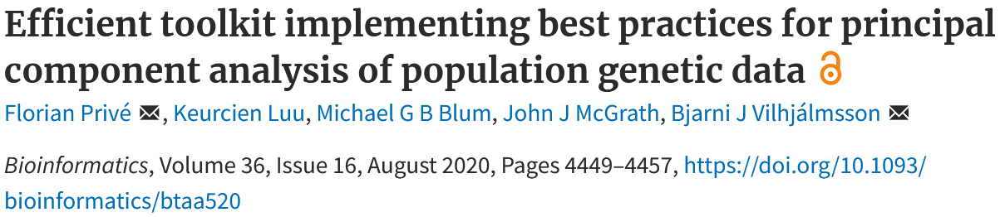
```

--

<br>

In the UK Biobank data,

- only the first 16 PCs actually capture population structure 

--

<br>

When subsampling British and Irish individuals 

- can obtain 40 PCs that capture some population structure

---

### PCA after subsampling, in the UK Biobank

- Subsampling 10,000 British individuals (2.3%) 
- and 5000 Irish individuals (39,2%), 
- while keeping all indiv with other or unknown self-reported ancestry.

```{r, out.width="100%"}
knitr::include_graphics("https://github.com/privefl/paper4-bedpca/blob/master/UKBB-scores-restricted.png?raw=true")
```

---

### Can we use Q to get something better? 

```{r, out.width="100%"}
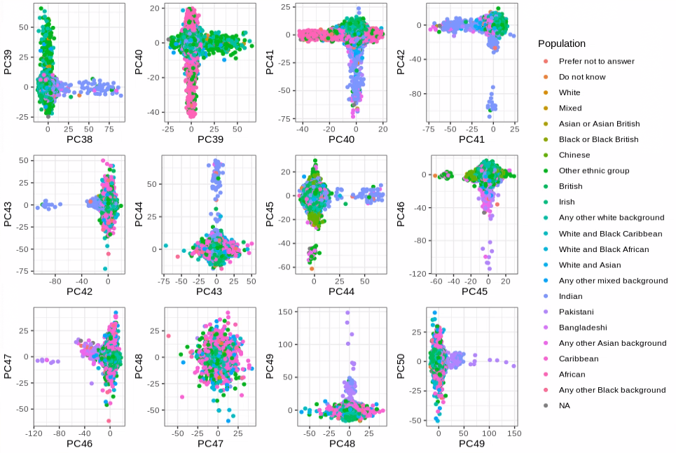
```

---

### Rerun the algorithm with new PCs (K=41)

<style>
    .grid-container {
        display: grid;
        grid-template-columns: 1fr 1fr;
        margin: auto;
        font-size: 14px;
    }
</style>

<div class="grid-container">
<ul>
    <li>United Kingdom: 414629 &#8211; Ireland: 12416 &#8211; NA: 4731 &#8211; Germany: 1498 &#8211; South Africa: 970 &#8211; USA: 956 &#8211; Australia: 853 &#8211; New Zealand: 656 &#8211; Canada: 644 &#8211; ...</li>
    <li>NA: 709 &#8211; Poland: 592 &#8211; United Kingdom: 389 &#8211; Russia: 123 &#8211; Germany: 71 &#8211; Lithuania: 71 &#8211; Ukraine: 53 &#8211; Latvia: 52&#8211; ..</li>
    <li>Italy: 34</li>
    <li>Spain: 30</li>
    <li>United Kingdom: 1838 &#8211; NA: 831 &#8211; USA: 170 &#8211; South Africa: 95 &#8211; Israel: 40 &#8211; Canada: 18 &#8211; Hungary: 18 &#8211; France: 12</li>
    <li>Finland: 125</li>
    <li>Nigeria: 975 &#8211; NA: 292 &#8211; Caribbean: 155 &#8211; Sierra Leone: 42 &#8211; Ghana: 13</li>
    <li>Sri Lanka: 635 &#8211; India: 493 &#8211; Mauritius: 190 &#8211; NA: 156 &#8211; Kenya: 90 &#8211; Caribbean: 71 &#8211; Malaysia: 67 &#8211; The Guianas: 52 &#8211; ...</li>
    <li>Malta: 114 &#8211; United Kingdom: 15 &#8211; NA: 12 &#8211; Egypt: 10</li>
    <li>Iran: 494 &#8211; Iraq: 247 &#8211; Turkey: 114 &#8211; NA: 58 &#8211; Syria: 11 &#8211; United Kingdom: 10</li>
    <li>Ghana: 817 &#8211; NA: 68 &#8211; Ivory Coast: 27</li>
    <li>India: 571 &#8211; NA: 207 &#8211; Kenya: 40 &#8211; Pakistan: 28 &#8211; Malaysia: 23 &#8211; Singapore: 13</li>
    <li>India: 28</li>
    <li>Yemen: 26 &#8211; Egypt: 18 &#8211; NA: 12</li>
    <li>Congo: 129 &#8211; Angola: 30 &#8211; Zambia: 30 &#8211; NA: 25 &#8211; Cameroon: 24</li>
    <li>India: 224 &#8211; Kenya: 179 &#8211; NA: 55 &#8211; Uganda: 28 &#8211; Pakistan: 21 &#8211; Tanzania: 21</li>
</ul>

<ul>
    <li>Japan: 241 &#8211; South Korea: 26</li>
    <li>Thailand: 61 &#8211; Vietnam: 40 &#8211; Malaysia: 10</li>
    <li>Algeria: 69 &#8211; Morocco: 66 &#8211; Libya: 27 &#8211; NA: 10</li>
    <li>Kenya: 18 &#8211; India: 13</li>
    <li>Philippines: 310 &#8211; NA: 16</li>
    <li>Pakistan: 76 &#8211; NA: 20</li>
    <li>Kenya: 36 &#8211; India: 25</li>
    <li>India: 70 &#8211; Afghanistan: 25 &#8211; NA: 19</li>
    <li>India: 17 &#8211; NA: 11 &#8211; Malawi: 10</li>
    <li>Colombia: 115</li>
    <li>Sierra Leone: 38 &#8211; Gambia: 33</li>
    <li>India: 90 &#8211; NA: 32</li>
    <li>Tanzania: 24</li>
    <li>Pakistan: 146 &#8211; NA: 42 &#8211; India: 22 &#8211; Kenya: 18</li>
    <li>India: 135 &#8211; Kenya: 120 &#8211; Uganda: 80 &#8211; NA: 37 &#8211; Tanzania: 24</li>
    <li>Nepal: 125 &#8211; NA: 14</li>
    <li>Peru: 31 &#8211; Ecuador: 20 &#8211; Bolivia: 14 &#8211; Mexico: 13</li>
    <li>Uganda: 69 &#8211; Tanzania: 43 &#8211; Kenya: 40 &#8211; India: 24</li>
    <li>Kenya: 42 &#8211; India: 39 &#8211; NA: 16 &#8211; Tanzania: 14</li>
    <li>Uganda: 101 &#8211; Kenya: 28 &#8211; Tanzania: 11</li>
    <li>Kenya: 114</li>
    <li>India: 43 &#8211; Kenya: 38 &#8211; NA: 19</li>
    <li>South Africa: 48 &#8211; Zimbabwe: 25</li>
    <li>Sudan: 17</li>
    <li></li>
    <li>Somalia: 78</li>
</ul>
</div>

---

### Conclusion

- A very efficient ancestry deconvolution algorithm

- Also very powerful; it can identify many reference groups

- One can (should) check the results visually

--

- Subsampling before PCA is beneficial to capture even more structure

--

- The algorithm is not specific to genetic data    
(merely a deconvolution algorithm based on PCA)

--

- I will provide a new set of reference populations for people to use directly

--

- More than just an improved ADMIXTURE    
**How can I further motivate the need for this new method?**

--

<br>

.center[
### Thank you for your attention

Presentation available at [bit.ly/privefl110325](https://bit.ly/privefl110325)
]