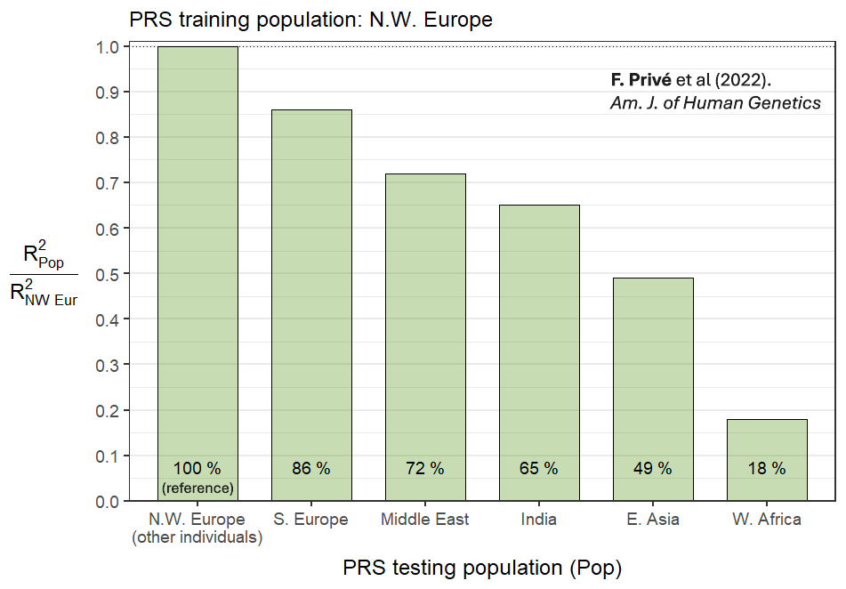
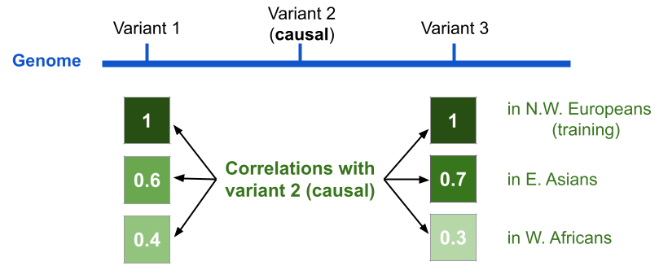
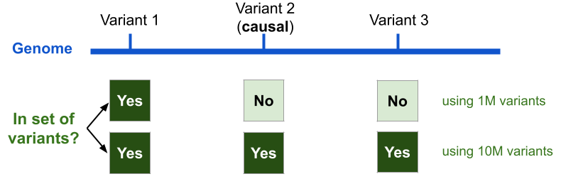
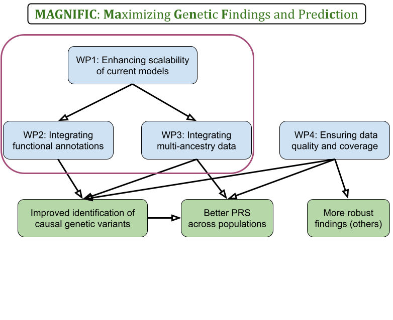

```{r setup, include=FALSE}
# chromote::local_chrome_version(binary = "chrome-headless-shell")
# renderthis::to_pdf("cnrs-cid51.Rmd", partial_slides = TRUE, complex_slides = TRUE, delay = 2)
options(htmltools.dir.version = FALSE, width = 70)
knitr::opts_chunk$set(fig.align = 'center', dev = "svg", out.width = "70%",
                      echo = FALSE, comment = "", fig.width = 5, global.par = TRUE)
ICON_R_PROJECT <- icons::fontawesome$brands$`r-project`
ICON_TRI_EXCL  <- icons::fontawesome$solid$`exclamation-triangle`
ICON_INFO      <- icons::fontawesome$solid$`info-circle`
```

class: title-slide center middle inverse

# &mdash;**MAGNIFIC**&mdash;
# <u>Ma</u>ximizing <u>G</u>e<u>n</u>et<u>i</u>c <u>F</u>indings and Pred<u>ic</u>tion

<br>

.left[
### $\Rightarrow$ improving the genetic prediction of common diseases

### $\Rightarrow$ identifying the genetic variants contributing to disease risk
]

<br>

## Florian Privé 

---

```{css}
.footnote2 {
  position: absolute;
  bottom: 1.6em;
  padding-right: 4em;
  font-size: 16.3px;
}
.small2 {
  font-size: 85%;
}
.small2 li {
  margin-bottom: 7px;
  line-height: 1.5;
}
```

### Education and professional background

<br>

- 2013–2016: Engineer in Computer Science & Applied Mathematics

- 2016–2019: PhD in Computational Biology (Grenoble)

- 2019–2021: Postdoc at Aarhus University (Denmark)

- 2022–2028: Senior Researcher (promotion at the same place)

---

class: center middle inverse

# &mdash;Introduction&mdash;
## Genetic data
## Genome-Wide Association Studies (GWAS)
## Polygenic Risk Scores (PRS)

---

### Genetic variants and GWAS

```{r, out.width="100%"}
knitr::include_graphics("figures/Overview_geneticvariants_GWAS.png")
```

---

### GWAS and polygenic risk scores (PRS)

**Studying common diseases**, such as heart diseases, cancers, diabetes

<br>

Thanks to GWAS, we know that

- many **common** genetic variants are causal $\left(\beta_j \neq 0\right)$

- but, they usually have a **small effect size** $\beta_j$ on their own
    
    $\Rightarrow$ a common causal variant is not useful as a standalone risk factor

- in contrast to rare mutations causing rare monogenic diseases

--

<br>

From GWAS data to **polygenic risk scores (PRS)**:

- variants can be aggregated in a joint predictive model: $PRS = \sum_j \hat\gamma_j~G_j$

- by aggregating many small effects, the PRS can have a large effect 

    $\Rightarrow$ the $PRS$ is useful as a risk factor

---

### Public Health: refining risk assessment from traditional risk factors

<u>Traditional risk factors</u>: age, smoking, pollution, low SES, diet, physical inactivity, family history, (low-frequency large-effect) genetic mutations, etc

```{r, out.width="85%"}
knitr::include_graphics("figures/PRS-risk2.png")
```

.footnote2[
***
PRS clinical utility in a **clinical trial**: A. Fuat et al (2024). *Eur. J. of Preventive Cardiology*
]

---

### My main research focus

<center><h3>Improving PRS methods</h3></center>

<br>

**Interdisciplinary** research focused on **method development**:

- **Mathematics/Statistics**: statistical models

- **Computer Science**: highly optimized and reliable software

- **Machine Learning**: predictive models

- **Biology/Health** applications

---

class: center, middle, inverse

# Some of my previous work

---

### Developing PRS methods

```{r, out.width="100%"}

```

--

<br>

### Improving robustness of PRS methods

- **F. Privé** (2022). *Bioinformatics*

- **F. Privé** (2022). *Bioinformatics*

- **F. Privé** et al (2022). *Human Genetics and Genomics Advances*

(two sole-author publications to show my independence in grant applications)

---

class: center, middle, inverse

# A major limitation of PRS:

## their poor portability across populations

## risks exacerbating health disparities

.footnote2[6]

---

### PRS performance drops with distance from training population

```{r, out.width="88%", fig.align='left'}

```

.footnote2[
***
Follow-up analysis with collaborators from UCLA: Y. Ding et al (2023). *Nature*
]

---

### Explanation: tagging variants don't retain causal effects

<br>

```{r, out.width="90%"}

```

<br>

- effect of a causal variant is similar for all populations

- all 3 variants have same effect in N.W. Europeans (perfect correlation)

- in E. Asians, variant 1 retains only 60% of the causal effect

---

class: center, middle, inverse

# The solution $\Rightarrow$ my proposed project:

## identifying causal variants and using them

## in polygenic risk scores (PRS)

---

### Scaling methods to using 10M genetic variants (WP1)

There are ~10M common variants, but most PRS methods use ~1M

<br>

```{r, out.width="90%"}

```

.center[**We need to use 10M to make sure most causal variants are present**

<br>

`r icons::fontawesome("laptop")` I will optimize both methods and data structures to use 10M variants `r icons::fontawesome("laptop")`

(using quantization + compression, or sparse inverse covariance matrices)]

---

### Prioritizing causal variants thanks to functional annotations (WP2)

<br>

```{r, out.width="95%"}
knitr::include_graphics("figures/LD-func-anno.png")
```

.center[**Variants in some functional categories are more likely to be causal**

<br>

`r icons::fontawesome("laptop")` I will integrate this information into my Bayesian PRS methodology `r icons::fontawesome("laptop")`

(to update non-informative prior probabilities of being causal)]

---

### Prioritizing causal variants thanks to multi-ancestry data (WP3)

<br>

```{r, out.width="98%"}
knitr::include_graphics("figures/LD-multi-GWAS.png")
```

<br>

.center[`r icons::fontawesome("laptop")` I will integrate multi-ancestry data into my PRS methodology `r icons::fontawesome("laptop")`]


---

```{r, out.width="95%"}

```

---

count: false

```{r, out.width="95%"}

```

---

count: false

```{r, out.width="95%"}

```

---

### Feasability

<br>

- I have developed **many efficient & competitive methods** 

    - LDpred2, widely used for constructing PRS + often ranked best
    
    - bigstatsr and bigsnpr, R(cpp) packages for large-scale analyses

- My methods are **used and cited a lot (2000+)**

- I have **co-supervised several young researchers**

    - two PhD students who graduated (**co-last author on 4 papers**)
    
    - ongoing: two PhD students, one research assistant, one postdoc

- I have identified **several collaborators** interested in my project    
(Broad, UCLA, Oxford, Helsinki, Pasteur, INRIA, etc)
    
---

class: inverse

<center>
<h1>Thank you for your attention</h1>

<br>

<h3>Florian Privé</h3>
</center>

- **large international impact**

- a total of 29 publications (2900+ citations)

- 11 first-author publications (2000+ citations)

- 12 oral presentations at international scientific conferences (1 invited)

- invited to 16 seminar or lecture presentations

- reviewer for    
    - 64 manuscripts across 31 scientific journals
    - Amsterdam UMC Fellowship 2022
    - European Mathematical Genetics Meeting (EMGM) 2025
    - European Human Genetics Conference (ESHG) 2025

---

count: false

### Integration into INSERM U1220 in Toulouse

<br>

- **Collaboration**:

  - **Sarah Djebali (CR INSERM)**: Expert in functional genome annotation, supporting integration of annotations
  
  - **Jean Monlong (CR INSERM)**: Specialist in pangenomes and structural variants, expanding from simply using single-nucleotide polymorphisms (SNPs)
  
  - **Other lab members**: validation of causal variants using experimental models (e.g., mice, organoids)
  
- Technical support and computational resources via **Genotoul compute cluster** (5000 cores, 83 TB RAM, 7.5 PB storage)

- **Collaborative Environment**: Toulouse bioinformatics, biostatistics, mathematics and informatics network (INRAE, CNRS, INSERM, Uni)

---

count: false

### LDpred2 vs some state-of-the-art multi-ancestry PRS methods

```{r, out.width="62%"}
knitr::include_graphics("figures/LDpred2-vs-SotA-multiancestry.jpg")
```

.footnote2[O. Pain (2025). Leveraging Global Genetics Resources to Enhance Polygenic Prediction Across Ancestrally Diverse Populations. *medRxiv*]

---

count: false

### WP4: Ensuring the quality and coverage of GWAS summary statistics

Synergy between quality control (QC) and imputation:

- imputation is used in QC
    
- QC is needed before imputation so that errors don't propagate

- imputation can recover QCed variants

<br>

```{r, out.width="100%"}
knitr::include_graphics("figures/Imputation-QC-method-v2.png")
```

<br>

.center[`r icons::fontawesome("laptop")` I will develop a new method for both QC and imputation `r icons::fontawesome("laptop")`]
