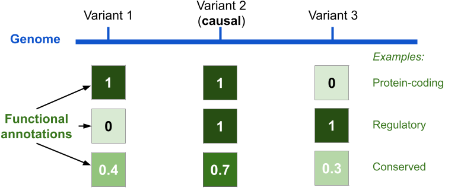
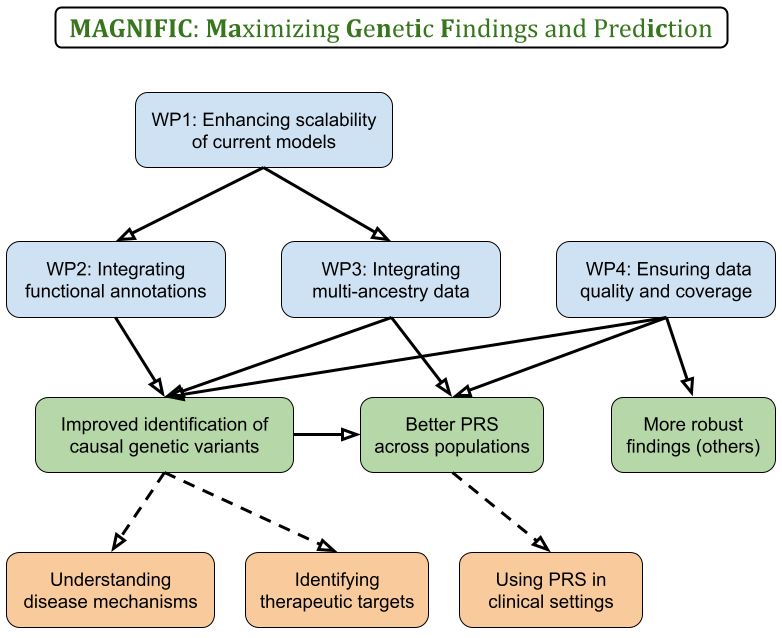
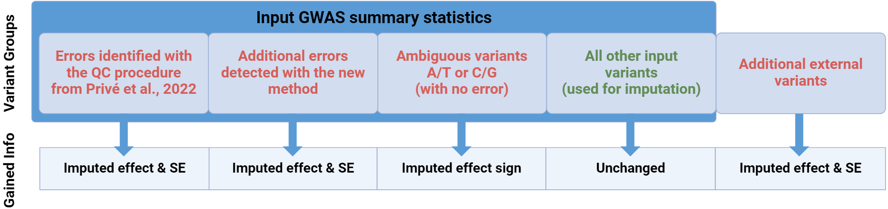

```{r setup, include=FALSE}
# chromote::local_chrome_version(binary = "chrome-headless-shell")
# renderthis::to_pdf("ldpred2-wcpg2023.Rmd", partial_slides = TRUE)
options(htmltools.dir.version = FALSE, width = 70)
knitr::opts_chunk$set(fig.align = 'center', dev = "svg", out.width = "70%",
                      echo = FALSE, comment = "", fig.width = 5, global.par = TRUE)
ICON_R_PROJECT <- icons::fontawesome$brands$`r-project`
ICON_TRI_EXCL  <- icons::fontawesome$solid$`exclamation-triangle`
ICON_INFO      <- icons::fontawesome$solid$`info-circle`
```

class: title-slide center middle inverse

background-image: url("figures/logo-cnrs.png")
background-position: center 95%
background-repeat: no-repeat
background-size: 11%

# &mdash;**MAGNIFIC**&mdash;
# <u>Ma</u>ximizing <u>G</u>e<u>n</u>et<u>i</u>c <u>F</u>indings and Pred<u>ic</u>tion

<br>

## Florian Privé 

<br>

### CRCN CNRS&ndash;CID51 application  

<br>

---

```{css}
.footnote2 {
  position: absolute;
  bottom: 1.6em;
  padding-right: 4em;
  font-size: 16.3px;
}
.small2 {
  font-size: 85%;
}
.small2 li {
  margin-bottom: 7px;
  line-height: 1.5;
}
```

### Professional background

<br>

- 2010–2013: Preparatory school in Mathematics & Physics

- 2013–2016: Engineer in Computer Science & Applied Mathematics

- 2016–2019: PhD in Computational Biology (Grenoble)

- 2019–2021: Postdoc at Aarhus University (Denmark)

- 2022–2028: Senior Researcher (promotion at the same place)

---

### Research focus

<br>

- Statistical human genetics

- Development of statistical methods and R/C++ packages    
for efficient and powerful analyses of large-scale genetic data 

- Particularly for deriving **polygenic risk scores (PRS)**

<br>

**Interdisciplinary** work:

- **Mathematics/Statistics**: statistical models and numerical methods

- **Computer Science**: efficient code, algorithms and data structures

- **Machine Learning**: predictive models, hyper-parameter tuning, stacking

- **Biology/Health**: genetic associations, predictions and inferences

---

class: center middle inverse

# Genetic data
# Genome-Wide Association Studies (GWAS)
# Polygenic Risk Scores (PRS)

---

### Genetic variants and GWAS

```{r, out.width="100%"}
knitr::include_graphics("figures/Overview_geneticvariants_GWAS.png")
```

---

### GWAS and polygenic risk scores (PRS)

**Studying common diseases**, such as heart diseases, cancers, diabetes

<br>

Thanks to GWAS, we know that

- many **common** genetic variants are causal $\left(\beta_j \neq 0\right)$

- but, they usually have a **small effect size** $\beta_j$ on their own   
    
    $\Rightarrow$ <u>a common causal variant is not useful as a risk factor</u>

--

<br>

From GWAS data to **polygenic risk scores (PRS)**:

- variants can be aggregated in a joint predictive model: $PRS = \sum_j \hat\gamma_j~G_j$

- by aggregating many small effects, the PRS can have a large effect 

    $\Rightarrow$ the $PRS$ can be useful as a risk factor

---

### Public Health: refining risk assessment from traditional risk factors

<u>Traditional risk factors</u>: age, smoking, pollution, low SES, diet, physical inactivity, family history, (low-frequency large-effect) genetic mutations, etc

```{r, out.width="85%"}
knitr::include_graphics("figures/PRS-risk2.png")
```

.footnote2[
***
PRS clinical utility in a **clinical trial**: A. Fuat et al, Eur. J. of Preventive Cardiology (2024)
]

---

class: center, middle, inverse

# Some of my previous work

---

### Developing PRS methods (1/3)

<br>

**F. Privé**, H. Aschard, & M.G.B. Blum (2019). "Efficient implementation of penalized regression for genetic risk prediction." *Genetics*.

<br>

- **based on individual-level data** (genotypes and phenotype)

- **faster and on-disk** implementation of penalized regressions (> glmnet)

- **alternative to cross-validation** to choose hyper-parameters    
    $\rightarrow$ avoids refitting and allows for early-stopping criterion

---

### Developing PRS methods (2/3)

<br>

**F. Privé**, B.J. Vilhjálmsson, H. Aschard, & M.G.B. Blum (2019). "Making the most of Clumping and Thresholding for polygenic scores." *The American Journal of Human Genetics*.

<br>

- **based on GWAS summary statistics** (effect sizes and p-values)

- reimplemented an existing widely-used PRS method 

- efficiently investigated **5600 combinations of four hyper-parameters**    
(only one hyper-parameter was considered usually)

- further improved predictive performance with **stacking**

---

### Developing PRS methods (3/3)

<br>

**F. Privé**, J. Arbel, & B.J. Vilhjálmsson (2020). "LDpred2: better, faster, stronger." *Bioinformatics*.

<br>

- Bayesian PRS model, based on GWAS summary statistics

- **faster and more robust** to numerical issues than LDpred

- developed an on-disk sparse matrix format for more efficient parallelism

- two new versions:

    - **a 'sparse' option**, which truly fits some effects to zero
    
    - **an 'auto' option**, which can infer the two hyper-parameters
    
- **post-hoc quality control** of Gibbs sampler chains

---

### Robustness of PRS models using GWAS summary statistics

A joint model from summary statistics: $$\hat\beta = (\underbrace{X^T X}_\text{covariance})^{-1} \underbrace{X^T y}_\text{GWAS effect sizes}$$

- In practice, we use $(G_2^T G_2)^{-1} G_1^T y_1$ (misspecification: $G_2 \neq G_1$)

- Another issue comes from using GWAS meta-analyses (errors, $\neq$ N's)

<br>

--

- **F. Privé** (2022). "Optimal linkage disequilibrium splitting." *Bioinformatics*.

    $\rightarrow$ using **dynamic programming to identify a block-diagonal structure** in the covariance/correlation matrix  
    $\rightarrow$ to **improve the robustness and speed** of PRS methods like LDpred2


- **F. Privé**, J. Arbel, H. Aschard, &  B.J. Vilhjálmsson (2022). "Identifying and correcting for misspecifications in GWAS summary statistics and polygenic scores." *Human Genetics and Genomics Advances*.

---

class: center, middle, inverse

# A major limitation of PRS:

## their poor portability across populations

## risks exacerbating health disparities

---

### PRS performance drops with distance from training population

```{r, out.width="98%", fig.align='left'}
knitr::include_graphics("figures/ratio-dist-4.png")
```

---

### Explanation: we often don't use causal variants in practice 

<br>

```{r, out.width="88%"}
knitr::include_graphics("figures/LD-multipop2.png")
```

---

class: center, middle, inverse

# The solution $\Rightarrow$ my proposed project:

## identifying causal variants and using them

## in polygenic risk scores (PRS)

---

### Scaling methods to using 10M genetic variants (WP1)

- there are ~10M common variants

- but most PRS methods (including mine) use ~1M variants    
(mostly for computational reasons and due to redundancy)

.small2[<br>]

```{r, out.width="85%"}
knitr::include_graphics("figures/variants_in_set.png")
```

.center[**We need to use 10M to make sure most causal variants are present**

<br>

`r icons::fontawesome("laptop")` I will optimize both methods and data structures to use 10M variants `r icons::fontawesome("laptop")`

(using quantization + compression, or sparse inverse covariance matrices)]

---

### Prioritizing causal variants thanks to functional annotations (WP2)

<br>

```{r, out.width="95%"}

```

.center[**Variants in some functional categories are more likely to be causal**

<br>

`r icons::fontawesome("laptop")` I will integrate this information into my Bayesian PRS methodology `r icons::fontawesome("laptop")`

(to update non-informative prior probabilities of being causal)]

---

### Prioritizing causal variants thanks to multi-ancestry data (WP3)

<br>

```{r, out.width="98%"}
knitr::include_graphics("figures/LD-multi-GWAS.png")
```

<br>

.center[`r icons::fontawesome("laptop")` I will integrate multi-ancestry data into my PRS methodology `r icons::fontawesome("laptop")`]


---

```{r, out.width="95%"}

```

---

### Feasability

- **I have developed many efficient & competitive methods** 

    - LDpred2, widely used for constructing PRS + often ranked best
    
    - bigstatsr and bigsnpr, R(cpp) packages for large-scale analyses

- My methods are used and cited a lot (2000+)

- My **funding strategy** to recruit people:

  - ANR JCJC
  
  - local fundings (MIAI, university, region)

- I have **co-supervised several young researchers**

    - two PhD students who graduated (**co-last author on 4 papers**)
    
    - ongoing: two PhD students, one research assistant, one postdoc

- I have found **several collaborators** for these work packages    
(Broad, UCLA, Oxford, Helsinki, Pasteur, INRIA, etc)
    
---

### Integration in Grenoble

<br>

- The **TIMC** laboratory (**CNRS Informatique**, UMR 5525)

- The **LJK**, Jean Kuntzmann Laboratory (**CNRS Mathématiques**, UMR 5224)

- The **IAB**, Institute for Advanced Biosciences (**CNRS Biologie**, UMR 5309)


<br>

- The TIMC offers an energetic bioinformatics environment, and collaborations to integrate other omic data to my Research

- Julyan Arbel (LJK) has already helped with his Bayesian expertise  
    \+ the SVH team (Statistique pour les sciences du Vivant et de l'Homme)

- Julien Thévenon (IAB) will help implement my improved methodologies into clinical practices

- I will join the Bioinformatics collaborative network of Grenoble (BiGre)

---

class: inverse

<center>
<h1>Thank you for your attention</h1>

<h3>Florian Privé</h3>
</center>

- large international impact

- a total of 28 publications (2900+ citations)

- 11 first-author publications (2000+ citations)

- 12 oral presentations at international scientific conferences (1 invited)

- invited to 16 seminar or lecture presentations

- founder and organizer of the R User Group of Grenoble    
(19 sessions in 2017&#8211;2019)

- reviewer for    
    - 63 manuscripts across 31 scientific journals
    - Amsterdam UMC Fellowship 2022
    - European Mathematical Genetics Meeting (EMGM) 2025
    - European Human Genetics Conference (ESHG) 2025

---

count: false

### WP1: Using millions of genetic variants (possible solutions)

<br>

**The main bottleneck is storing and using the matrix of covariances/correlations between variants.**

<br>

Possible solutions:

- quantization: storing correlations with two bytes only (divide size by 4) 

- compression on top of quantization

- matrix seriation $\rightarrow$ reordering variants to make blocks smaller

- eigendecomposition

- adapt methods to use very sparse *inverse* covariance matrices 

---

count: false

### LDpred2 vs some state-of-the-art multi-ancestry PRS methods

```{r, out.width="62%"}
knitr::include_graphics("figures/LDpred2-vs-SotA-multiancestry.jpg")
```

.footnote2[O. Pain (2025). Leveraging Global Genetics Resources to Enhance Polygenic Prediction Across Ancestrally Diverse Populations. *medRxiv*]

---

count: false

### WP4: Ensuring the quality and coverage of the training data

<br>

- there are lots of problems with the input data (GWAS summary statistics)

- which can causes lots of misspecifications and biases in the methods

.footnote2[**F. Privé** et al (2022). Identifying and correcting for misspecifications in GWAS summary statistics and polygenic scores. *Human Genetics and Genomics Advances*.]
<br>

```{r, out.width="92%"}

```

- I propose to implement a quality control and imputation method (synergistic)

- and to provide a set of highly refined GWAS summary statistics

---

count: false

### Cross-Model Selection and Averaging (CMSA)

#### A faster alternative to cross-validation

```{r, out.width="72%"}
knitr::include_graphics("https://raw.githubusercontent.com/privefl/paper2-PRS/master/figures/simple-CMSA.png")
```
