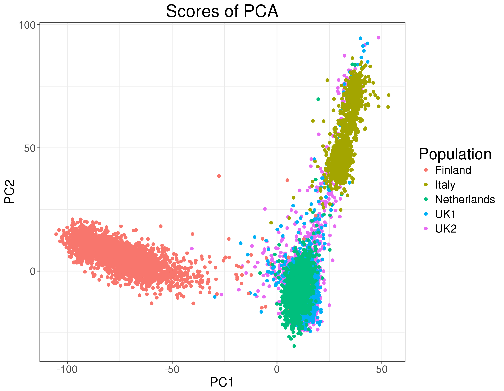
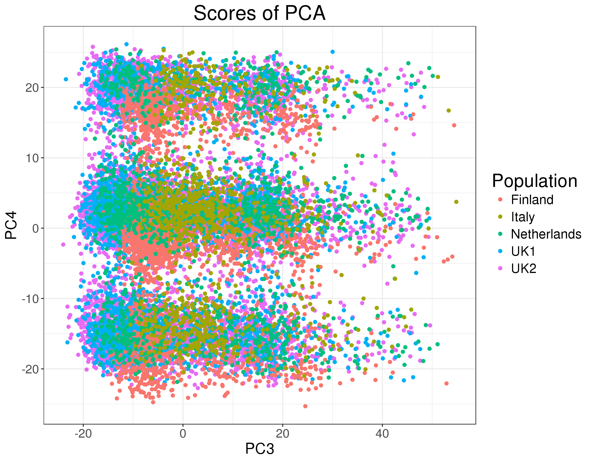
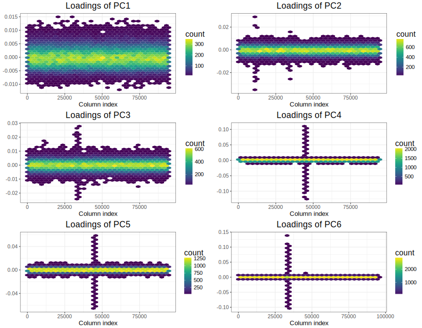
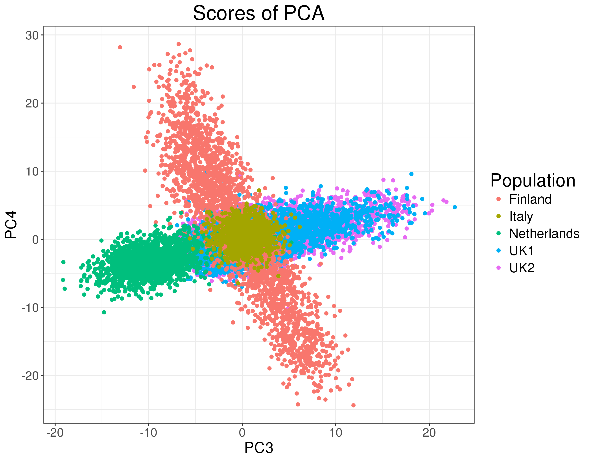
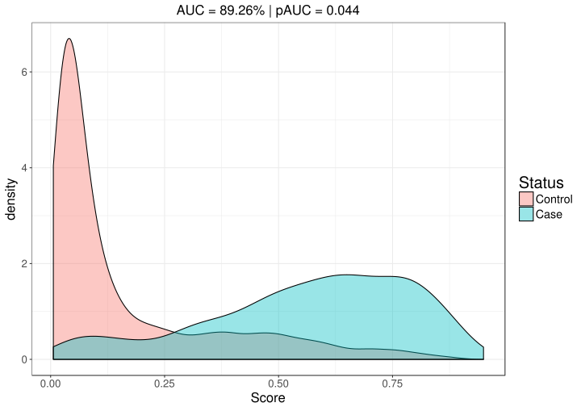

```{r setup, include=FALSE}
options(htmltools.dir.version = FALSE)
knitr::opts_chunk$set(echo = FALSE, fig.align = 'center', dev = "svg")
```

class: title-slide center middle inverse

# High-dimensional data:<br>a different kind of big data

## Florian Privé

### Data Club - June 27, 2018

---

class: center, middle, inverse

# Introduction

---

## The data I work with: very large genotype matrices

<br>

- Each variable (column): number of mutations for **one position of the genome** (generally between 100,000 to several millions) -> **ultra-high dimensional** data

```{r, out.width="70%"}
knitr::include_graphics("https://jmtomko.files.wordpress.com/2015/12/dna-double-helix.png")
```

<br>

- Each observation (row): one individual (generally between 1000 and 1M)

.footnote[Example of a dataset I previously worked with: 15K x 280K, [celiac disease](https://doi.org/10.1038/ng.543) (~30GB)]

---

class: center, middle, inverse

# What types of analysis we do?

## (and how?)

---

## Principal Component Analysis (PCA)<br>captures population structure

<br>

```{r, out.width="70%"}

```

---

## Partial PCA algorithm

<br>

You have a matrix $X$ with $n$ observations (rows) and $p$ variables (columns).

<br>

- Usually, $p$ is small and you can get the SVD from the eigen decomposition of $X^T X$. In bioinformatics, $p$ is usually too large, so you can't use this standard algorithm.

- If $n$ is not to large (say $n < 10,000$), you can use the eigen decomposition of $X X^T$ instead (an $n \times n$ matrix). 

- **Now, n is also large** (both dimensions of the matrix are large), so we use algorithms based on random projections to get first PCs (usually we are interested in only first 10-20 PCs).

<br>

With my implementation, you can get first 10 PCs of a 15K x 100K matrix in one minute only.

---

## Still, we can't do PCA naively

<br>

```{r, out.width="80%"}

```

---

## Cause of the problem

<br>

```{r, out.width="78%"}

```

---

## After some filtering

<br>

```{r, out.width="80%"}

```

---

## Genome-wide association studies

For linear regression, a t-test is performed **for each variable** $j$ on $\beta^{(j)}$ where
\begin{multline}
  \hat{y} = \alpha^{(j)} + \beta^{(j)} X^{(j)} + \gamma_1^{(j)} PC_1 + \cdots + \gamma_K^{(j)} PC_K \\ + \delta_1^{(j)} COV_1 + \cdots + \delta_K^{(j)} COV_L~,
\end{multline}
and $K$ is the number of principal components and $L$ is the number of other covariates (such as age and gender). 

<br>

Similarly, for logistic regression, a Z-test is performed for each variable $j$ on $\beta^{(j)}$ where
\begin{multline}
  \log{\left(\frac{\hat{p}}{1-\hat{p}}\right)} = \alpha^{(j)} + \beta^{(j)} X^{(j)} + \gamma_1^{(j)} PC_1 + \cdots + \gamma_K^{(j)} PC_K \\ + \delta_1^{(j)} COV_1 + \cdots + \delta_K^{(j)} COV_L~,
\end{multline}
and $\hat{p} = \mathbb{P}(Y = 1)$ and $Y$ denotes the binary phenotype.

---

## Genome-wide association studies

### Which genes are associated with the disease?

<br>

```{r, out.width='80%'}
knitr::include_graphics("figures/celiac-gwas-cut.png")
```

.footnote[Here, you do ~1M tests, so beware **multiple testing**!]

---

## Prediction

Can you fit a statistical learning model when you have more variables than observations ( $n > p$ )?

<br>

### Quiz

How can you fit a prediction model when you have too many variables?

---

## Regularization / Penalization

Minimize

$$F(\lambda, \alpha) = \text{Loss function}   +   \underbrace{ \lambda \left((1-\alpha)\frac{1}{2}\|\beta\|_2^2 + \alpha \|\beta\|_1\right) }_\text{Penalization}$$

Different regularizations can be used to make the problem solvable and to prevent overfitting: 

- the L2-regularization ("ridge") shrinks coefficients and is ideal if there are many predictors drawn from a Gaussian distribution (corresponds to $\alpha = 0$ in the previous equation)

- the L1-regularization ("lasso") forces some of the coefficients to be equal to zero and can be used as a means of variable selection, leading to sparse models (corresponds to $\alpha = 1$)

- the L1- and L2-regularization ("elastic-net") is a compromise between the two previous penalties and is particularly useful in the $p \gg n$ situation, or any situation involving many correlated predictors (corresponds to $0 < \alpha < 1$).

---

### Predict Celiac disease based on penalized logistic regression

<br>

```{r, out.width="90%"}

```

---

class: center, middle, inverse

# How to analyze large genomic data?

---

## Our two R packages: bigstatsr and bigsnpr

### Statistical tools with big matrices stored on disk

<br>

<a href="https://doi.org/10.1093/bioinformatics/bty185" target="_blank">
```{r, out.width='70%'}
knitr::include_graphics("figures/bty185.png")
```
</a>

<br>

- {bigstatsr} for many types of matrix, to be used by any field of research

- {bigsnpr} for functions that are specific to the analysis of genetic data

---

class: center, middle, inverse

# High-dimensional data<br>come with their own problems

---

class: center, middle, inverse

# Data are becoming larger and larger

# Will we all need skills in computer science?

---

class: center, middle, inverse

# Thanks!

<br>

Presentation available at

https://privefl.github.io/thesis-docs/data-club.html

<br>

`r icon::fa("twitter")` [privefl](https://twitter.com/privefl) &nbsp;&nbsp;&nbsp;&nbsp; `r icon::fa("github")` [privefl](https://github.com/privefl) &nbsp;&nbsp;&nbsp;&nbsp; `r icon::fa("stack-overflow")` [F. Privé](https://stackoverflow.com/users/6103040/f-priv%c3%a9)

.footnote[Slides created via R package [**xaringan**](https://github.com/yihui/xaringan).]
