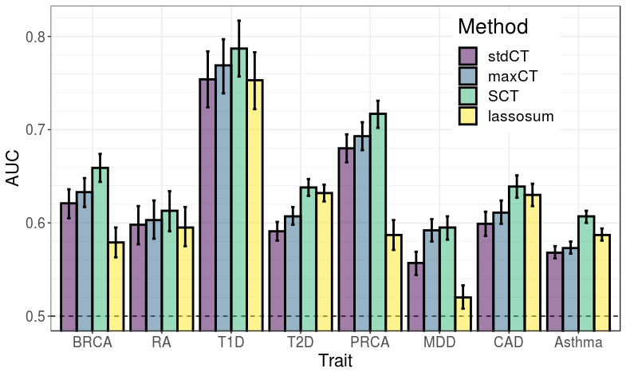

```{r setup, include=FALSE}
options(htmltools.dir.version = FALSE)
knitr::opts_chunk$set(echo = FALSE, fig.align = 'center', dev = "svg")
```

class: title-slide

background-image: url("figures/defense-cover.png")
background-position: center top
background-size: contain

---

class: center middle inverse

# Introduction & Motivation

### Data, application and research interest 

---

## Disease architecture

<br>

```{r, out.width="70%"}
knitr::include_graphics("figures/disease-archi.png")
```

.footnote[Source: 10.1126/science.338.6110.1016] 

---

## Polygenic Risk Scores (PRS)

A simple model: $y_i = \sum_j \beta_j x_{i,j} + \epsilon$    
$y_i$: phenotypes, $x_{i,j}$: genotypes, $\beta_j$: effect sizes.

```{r, out.width="90%"}
knitr::include_graphics("figures/PRS.png")
```

---

## PRS define lifetime trajectories

<br>

```{r, out.width="95%"}

```

.footnote[Source: 10.1093/hmg/ddz187]

---

## Data

<br>

**Matrices** of Single Nucleotide Polymorphisms (SNPs, DNA mutations)

counting the number of alternative alleles (**0, 1, or 2**) 

for each individual (row) and each genome position (column)

<br>

\+ some phenotype(s) (e.g. disease status you want to predict)

\+ other metadata 

<br>

$$\boxed{\Large{\text{Disease} \sim \text{DNA mutations} + \cdots}}$$

---

## Interest in prediction: polygenic risk scores (PRS)

- Wray, Naomi R., Michael E. Goddard, and Peter M. Visscher. "**Prediction of individual genetic risk** to disease from genome-wide association studies." Genome research 17.10 (**2007**): 1520-1528.

- Wray, Naomi R., et al. "Pitfalls of **predicting complex traits** from SNPs." Nature Reviews Genetics 14.7 (**2013**): 507.

- Dudbridge, Frank. "Power and **predictive accuracy of polygenic risk scores**." PLoS genetics 9.3 (**2013**): e1003348.

- Chatterjee, Nilanjan, Jianxin Shi, and Montserrat García-Closas. "Developing and evaluating **polygenic risk prediction** models for stratified disease prevention." Nature Reviews Genetics 17.7 (**2016**): 392.

- Martin, Alicia R., et al. "Human demographic history impacts **genetic risk prediction** across diverse populations." The American Journal of Human Genetics 100.4 (**2017**): 635-649.

.footnote2[Still a gap between current predictions and clinical utility.</br>Need more optimal predictions + larger sample sizes.]


---

## Very large genotype matrices

- previously: 15K x 280K, [celiac disease](https://doi.org/10.1038/ng.543) (~30GB)

- currently: 500K x 500K, [UK Biobank](https://doi.org/10.1101/166298) (~2TB)
 
```{r, out.width='55%'}
knitr::include_graphics("https://media.giphy.com/media/3o7bueyxGydy48Lwgo/giphy.gif")
```

.footnote[But I still want to use `r icon::fa_r_project()`..]

---

class: center, middle, inverse

# How to analyze large genomic data?

<br>

### **Privé, F.**, Aschard, H., Ziyatdinov, A., & Blum, M. G.B. (2018).<br>*Efficient analysis of large-scale genome-wide data with two R packages: bigstatsr and bigsnpr.* Bioinformatics, 34(16), 2781-2787.

---

## What I want to be able to do

### Data analysis on large-scale genotype matrices!

- Be fast to test many ideas quickly

    - code should be fast
    - I shouldn't have to make many conversions between formats
    - easily combine multiple functions
    
- Not be restricted in my analysis
   
    - Basically use all I already know in `r icon::fa_r_project()`
    
- Work on my computer (interactively)

    - I have 64 GB of RAM and 12 cores
    - Working on a server is not as easy as on my computer

<br><center>**Smooth and fast analysis!**

---

## The solution I found

```{r, out.width='90%'}
knitr::include_graphics("https://raw.githubusercontent.com/privefl/RR18/master/memory-solution.svg?sanitize=true")
```

.footnote[Format `FBM` is very similar to format `filebacked.big.matrix` from package {bigmemory} (details in [this vignette](https://privefl.github.io/bigstatsr/articles/bigstatsr-and-bigmemory.html)).]

---

## Partial Singular Value Decomposition

15K $\times$ 100K -- 10 first PCs -- 6 cores -- **1 min** (vs 2h in base R)

</br>

```{r, out.width='90%'}
knitr::include_graphics("https://raw.githubusercontent.com/privefl/RR18/master/PC1-4.png")
```

.footnote[Implemented in `big_randomSVD()`, powered by R packages {RSpectra} and {Rcpp}.]

---

## Multiple association testing

The idea behind Genome-Wide Association Studies (GWAS) is simple: test each variant one by one for association with the phenotype of interest.
For a continuous phenotype (e.g. height), linear regression is used and a t-test is performed for each SNP $j$ on $\beta^{(j)}$ where
$$\hat{y} = \alpha^{(j)} + \beta^{(j)} SNP^{(j)} + \gamma_1^{(j)} COV_1 + \cdots + \gamma_K^{(j)} COV_K~,$$
and $K$ is the number of covariates, including **first principal components** and other covariates such as age and gender. 

Similarly, for a binary phenotype (e.g. disease status), logistic regression is used and a Z-test is performed for each SNP $j$ on $\beta^{(j)}$ where
$$\log{\left(\frac{\hat{p}}{1-\hat{p}}\right)} = \alpha^{(j)} + \beta^{(j)} SNP^{(j)} + \gamma_1^{(j)} COV_1 + \cdots + \gamma_K^{(j)} COV_K~,$$
and $\hat{p} = \mathbb{P}(Y = 1)$ and $Y$ denotes the binary phenotype.

---

### Which DNA mutations are associated with one disease?

<br>

<br>

```{r, out.width='100%'}
knitr::include_graphics("figures/gwas-height-20K.png")
```

---

## Benchmarks (GWAS)

```{r, out.width='80%'}
knitr::include_graphics("figures/table-bench.png")
```

---

## Precision (approximate PCA)

```{r, out.width='80%'}

```

---

## Easy development of (two) new algorithms

<br>

- *fastImpute*: fast imputation of genotyped SNPs using XGBoost. 

    $\Longrightarrow$ 15x faster than BEAGLE (no phasing) / almost same accuracy / imputation error estimation.

- *autoSVD*: Automatic detection of long-range LD regions in PCA.

```{r, out.width="60%"}

```

---

class: center, middle, inverse

# How to predict disease status<br>based on genotypes?

<br>

### **Privé, F.**, Aschard, H., & Blum, M. G.B. (2019).<br>*Efficient implementation of penalized regression for genetic risk prediction.* Genetics, 212(1), 65-74.

---

## Standard PRS - part 1: estimating effects

### Genome-wide association studies (GWAS)

In a GWAS, each single-nucleotide polymorphism (SNP) is tested **independently**, resulting in one **effect size** $\hat\beta$ and one **p-value** $p$ for each SNP. 

```{r, out.width="95%"}
knitr::include_graphics("figures/gwas-height-20K.png")
```

Easy combining: $PRS_i = \sum_j \hat\beta_j \cdot G_{i,j}$

---

## Standard PRS - part 2: restricting predictors

### <span style="color:#38761D">Clumping</span> + <span style="color:#1515FF">Thresholding</span> ("C+T" or just "PRS")

<br>

```{r, out.width="100%"}
knitr::include_graphics("figures/GWAS2PRS3.png")
```

<br>

$$PRS_i = \sum_{\substack{j \in S_\text{clumping} \\ p_j~<~p_T}} \hat\beta_j \cdot G_{i,j}$$

---

## A more optimal approach to computing PRS?

In C+T: weights learned independently and heuristics for correlation and regularization.

#### Statistical learning

- joint models of all SNPs at once

- use regularization to account for correlated and null effects

- already proved useful in the litterature (Abraham et al. 2013; Okser et al. 2014; Spiliopoulou et al. 2015)

#### Our contribution

- a memory- and computation-efficient implementation to be used for biobank-scale data

- an automatic choice of the regularization hyper-parameter

- a comprehensive comparison for different disease architectures

---

## Penalized Logistic Regression (PLR)

<br>

<Small>$$\arg\!\min_{\beta_0,~\beta}(\lambda, \alpha)\left\{  \underbrace{ -\sum_{i=1}^n \left( y_i \log\left(p_i\right) + (1 - y_i) \log\left(1 - p_i\right) \right) }_\text{Loss function}   +   \underbrace{ \lambda \left((1-\alpha)\frac{1}{2}\|\beta\|_2^2 + \alpha \|\beta\|_1\right) }_\text{Penalization}  \right\}$$</Small>

<br>

***

- $p_i=1/\left(1+\exp\left(-(\beta_0 + x_i^T\beta)\right)\right)$

- $x$ is denoting the **genotypes** and covariates (e.g. principal components), 

- $y$ is the disease status we want to predict, 

- $\lambda$ is a regularization parameter that needs to be determined and

- $\alpha$ determines relative parts of the regularization $0 \le \alpha \le 1$. 

---

### Choice of the hyper-parameter $\lambda$ 

```{r, out.width="80%"}
knitr::include_graphics("figures/simple-CMSA.png")
```

---

## Comprehensive simulations: varying many parameters

#### Simulation models

```{r, out.width="80%"}
knitr::include_graphics("figures/table2-simus.png")
```

#### Methods

- C+T: 
    - C+T-all (no p-value thresholding), 
    - C+T-stringent (GWAS threshold of significance) and
    - C+T-max (best prediction for all thresholds, considered as an upper-bound)

- PLR: penalized logistic regression with automatic selection of hyper-parameters

---

## Predictive performance measures

**AUC** (Area Under the ROC Curve) and partial AUC (FPR < 10%) are used.

```{r, out.width="50%"}
knitr::include_graphics("https://i.stack.imgur.com/5x3Xj.png")
```

<br>

$$\text{AUC} = P(S_\text{case} > S_\text{control})$$

---

### Prediction with PLR is improving faster


```{r, out.width="80%"}

```

---

## Real data

<br>

#### Celiac disease

- intolerance to gluten

- only treatment: gluten-free diet

- heritability: 57-87% (Nisticò et al. 2006)

- prevalence: 1-6%

<br>

#### Case-control study for the celiac disease (WTCCC, Dubois et al. 2010)

- ~15,000 individuals

- ~280,000 SNPs

- ~30% cases

---

### Results: real Celiac phenotypes

```{r, out.width="95%"}
knitr::include_graphics("figures/results-celiac2.png")
```

```{r, out.width="55%"}

```

---

## LASSO for predicting height

- 350K individuals x 656K SNPs in less than one day

- Within each sex category, 65.5% of correlation between predicted and true height (56% with C+T-max)

```{r, out.width="70%"}
knitr::include_graphics("https://privefl.github.io/blog/images/UKB-final-pred.png")
```

---

### Summary of our penalized regression as compared to the C+T method

<br>

- A more **optimal** approach for predicting complex diseases, providing more predictive models as long as one of 

    - there are moderate effects, 
    - there is some correlation between causal variants
    - sample size if large enough

- models are **linear** and **sparse** 

- very **fast** and scalable to very large datasets such as the UK Biobank

- **automatic choice** for the regularization parameter

- can be extended to capture also recessive and dominant effects

- can be extended to integrate external summary statistics information

---

class: center, middle, inverse

# Using summary statistics

<br>

### **Privé, F.**, Vilhjálmsson, B. J., Aschard, H., & Blum, M. G. (2019).<br>*Making the most of Clumping and Thresholding for polygenic scores.* bioRxiv, 653204. [soon in AJHG]

---

## Standard PRS: C+T

In a GWAS, each SNP is tested independently, resulting in one **effect size** $\hat\beta$ and one **p-value** $p$ for each SNP (**summary statistics**). 

<br>

```{r, out.width="85%"}
knitr::include_graphics("figures/gwas-height-20K.png")
```

<br>

$$PRS_i = \sum_{\substack{j \in S_\text{clumping} \\ p_j~<~p_T}} \hat\beta_j \cdot G_{i,j}$$

---

## Predictive methods based on summary statistics

<br>

When you have only summary statistics (and a small individual-level dataset), you can use:

- C+T

- LDpred (*Vilhjálmsson, Bjarni J., et al. "Modeling linkage disequilibrium increases accuracy of polygenic risk scores." The American Journal of Human Genetics 97.4 (2015): 576-592*).

- lassosum (*Mak, Timothy Shin Heng, et al. "Polygenic scores via penalized regression on summary statistics." Genetic epidemiology 41.6 (2017): 469-480.*)

- NPS (*Chun, Sung, et al. "Non-parametric polygenic risk prediction using partitioned GWAS summary statistics." bioRxiv (2018): 370064.*)

<br>

The idea of LDpred, lassosum and NPS is to use a reference panel to **account for correlation** between SNPs, instead of pruning (removing) SNPs. Lassosum also adds some sparsity.

---

## Could those models be improved?

<br>

- take into account quality of imputation?

```{r, out.width="50%"}

```

- support PLINK bed files only; what about BGEN files such as for the UK Biobank?

- scalable to which extent?

---

## Hyper-parameters in C+T


- p-value threshold ( $p_T$ between $1$ and $10^{-8}$ and choose the best one )

--

- threshold on squared correlation of clumping ( $r_c^2 \sim 0.2$ ) and    
window size for LD computation ( $w_c \sim 500 kb$ )

--

- threshold of imputation quality score ( $INFO_T \sim 0.3$ )

--

$\Longrightarrow$ *stdCT* (standard C+T)

<br>

--

#### Our contribution

- an efficient implementation to compute many C+T scores for different hyper-parameters (**5600 sets of hyper-parameters** $\times$ 22 chromosomes)    
$\Longrightarrow$ *maxCT* (maximized C+T)

--

- going further by **stacking** (with an optimal linear combination of) all C+T models (instead of just choosing the best model)    
$\Longrightarrow$ *SCT* (Stacked C+T)

---

## Stacking with penalized logistic regression

<br>

<Small>$$\arg\!\min_{\beta_0,~\beta}(\lambda, \alpha)\left\{  \underbrace{ -\sum_{i=1}^n \left( y_i \log\left(p_i\right) + (1 - y_i) \log\left(1 - p_i\right) \right) }_\text{Loss function}   +   \underbrace{ \lambda \left((1-\alpha)\frac{1}{2}\|\beta\|_2^2 + \alpha \|\beta\|_1\right) }_\text{Penalization}  \right\}$$</Small>

<br>

***

- $p_i=1/\left(1+\exp\left(-(\beta_0 + x_i^T\beta)\right)\right)$

- $x$ is denoting the **C+T scores** and covariates (e.g. principal components), 

- $y$ is the disease status we want to predict, 

- $\lambda$ is a regularization parameter that needs to be determined and

- $\alpha$ determines relative parts of the regularization $0 \le \alpha \le 1$. 

---

## Results (simulations)

```{r}
knitr::include_graphics("figures/SCT-AUC-simus.png")
```

---

## Results (real data)

<br>

```{r}

```

---

## Results (optimal parameters in maxCT)

<br>
<br>

```{r, out.width="120%"}
knitr::include_graphics("figures/opt-param-maxCT.png")
```

---
class: center, middle, inverse

# Conclusion

---

## My thesis work

<br>

1. Developping two `r icon::fa_r_project()` packages for the analysis of large-scale genomic data.    

    (https://doi.org/10.1093/bioinformatics/bty185) 
    
    Package bigstatsr can be used for any data encoded as matrices.

2. Including an implementation of penalized regression for very large individual-level datasets \+ assess the potential gain in prediction over the simple standard model (C+T).
    
    (https://doi.org/10.1101/403337) 

3. Including summary statistics from large GWAS to improve prediction. 

    (TODO) 

---

## Current and future work

TODO

---
class: center, middle, inverse

# Thanks!

<br>

Presentation available at

https://privefl.github.io/thesis-docs/defense.html

<br>

`r icon::fa("twitter")` [privefl](https://twitter.com/privefl) &nbsp;&nbsp;&nbsp;&nbsp; `r icon::fa("github")` [privefl](https://github.com/privefl) &nbsp;&nbsp;&nbsp;&nbsp; `r icon::fa("stack-overflow")` [F. Privé](https://stackoverflow.com/users/6103040/f-priv%c3%a9)

.footnote[Slides created via R package [**xaringan**](https://github.com/yihui/xaringan).]
