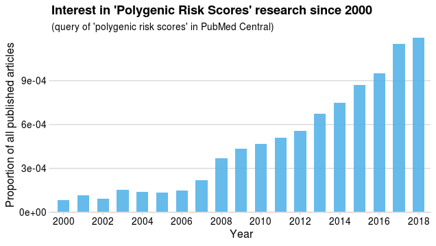
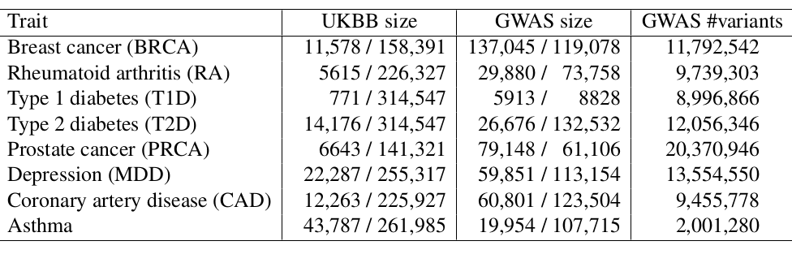

```{r setup, include=FALSE}
options(htmltools.dir.version = FALSE)
knitr::opts_chunk$set(echo = FALSE, fig.align = 'center', dev = "svg")
```

class: title-slide

background-image: url("figures/defense-cover.png")
background-position: center top
background-size: contain

---

class: center middle inverse

# Introduction & Motivation

### Data, application and research interest 

---

## Disease architecture

<br>

```{r, out.width="70%"}
knitr::include_graphics("figures/disease-archi.png")
```

.footnote[Source: 10.1126/science.338.6110.1016] 

---

## Polygenic Risk Scores (PRS)

A simple model: $y_i = \sum_j \beta_j x_{i,j} + \epsilon$    
$y_i$: phenotypes, $x_{i,j}$: genotypes, $\beta_j$: effect sizes.

```{r, out.width="90%"}
knitr::include_graphics("figures/PRS.png")
```

---

## Identify high-risk individuals

<br>

```{r, out.width="80%"}
knitr::include_graphics("figures/PRS-utility.png")
```

.footnote[Source: 10.1093/hmg/ddz187]

---

## Interest in Polygenic Risk Scores (PRS)

```{r, out.width="80%"}

```

<br>


However, current predictions fall short from clinical utility.

We need more optimal predictions and larger sample sizes.


---

## Data

<br>

**Matrices** of Single Nucleotide Polymorphisms (SNPs, DNA mutations)

counting the number of alternative alleles (**0, 1, or 2**) 

for each individual (row) and each genome position (column)

<br>

\+ some phenotype(s) (e.g. disease status you want to predict)

\+ other metadata 

<br>

$$\boxed{\Large{\text{Disease} \sim \text{DNA mutations} + \cdots}}$$

---

## Very large genotype matrices

- previously: 15K x 280K, [celiac disease](https://doi.org/10.1038/ng.543) (~30GB)

- currently: 500K x 500K, [UK Biobank](https://doi.org/10.1101/166298) (~2TB)
 
```{r, out.width='55%'}
knitr::include_graphics("https://media.giphy.com/media/3o7bueyxGydy48Lwgo/giphy.gif")
```

.footnote[But I still want to use `r icon::fa_r_project()`..]

---

class: center, middle, inverse

# How to analyze large genomic data?

<br>

### **Privé, F.**, Aschard, H., Ziyatdinov, A., & Blum, M. G.B. (2018).<br>*Efficient analysis of large-scale genome-wide data with two R packages: bigstatsr and bigsnpr.* Bioinformatics, 34(16), 2781-2787.

---

## What I want to be able to do

### Data analysis on large-scale genotype matrices!

- Be fast to test many ideas quickly

    - code should be fast
    - I shouldn't have to make many conversions between formats
    - easily combine multiple functions
    
- Not be restricted in my analysis
   
    - Basically use all I already know in `r icon::fa_r_project()`
    
- Work on my computer (interactively)

<br><center>**Smooth and fast data analysis!**

---

## The solution I found

```{r, out.width='90%'}
knitr::include_graphics("https://raw.githubusercontent.com/privefl/RR18/master/memory-solution.svg?sanitize=true")
```

.footnote[Format `FBM` is very similar to format `filebacked.big.matrix` from package {bigmemory} (details in [this vignette](https://privefl.github.io/bigstatsr/articles/bigstatsr-and-bigmemory.html)).]

---

## Benchmarks (example with PCA/GWAS)

#### I have spent a lot of time optimizing all functions

```{r, out.width='80%'}

```

---

class: center, middle, inverse

# How to predict disease status<br>based on genotypes?

---

class: center, middle, inverse

# Prediction using individual-level data

<br>

### **Privé, F.**, Aschard, H., & Blum, M. G.B. (2019).<br>*Efficient implementation of penalized regression for genetic risk prediction.* Genetics, 212(1), 65-74.

---

## Standard PRS - part 1: estimating effects

### Genome-wide association studies (GWAS)

In a GWAS, each single-nucleotide polymorphism (SNP) is tested **independently**, resulting in one **effect size** $\hat\beta$ and one **p-value** $p$ for each SNP. 

```{r, out.width="95%"}
knitr::include_graphics("figures/gwas-height-20K.png")
```

Easy combining: $PRS_i = \sum_j \hat\beta_j \cdot G_{i,j}$

---

## Standard PRS - part 2: restricting predictors

### <span style="color:#38761D">Clumping</span> + <span style="color:#1515FF">Thresholding</span> ("C+T" or just "PRS")

<br>

```{r, out.width="100%"}
knitr::include_graphics("figures/GWAS2PRS3.png")
```

<br>

$$PRS_i = \sum_{\substack{j \in S_\text{clumping} \\ p_j~<~p_T}} \hat\beta_j \cdot G_{i,j}$$

---

```{r}
knitr::include_graphics("figures/fig-GWAS-C+T.jpg")
```
--
```{r}
knitr::include_graphics("figures/fig-GWAS-C+T-clumping.jpg")
```
--
```{r}
knitr::include_graphics("figures/fig-GWAS-C+T-clumping-thresholding.jpg")
```


---

## A more optimal approach to computing PRS?

In C+T, weights are learned independently and we use heuristics for correlation and regularization.

--

#### Statistical learning

- joint models of all SNPs at once

- use regularization to account for correlated and null effects

- already proved useful in the litterature (Abraham et al. 2013; Okser et al. 2014; Spiliopoulou et al. 2015)

--

#### Our contribution

- a memory- and computation-efficient implementation to be used for biobank-scale data

- an automatic choice of the regularization hyper-parameter

- a comprehensive comparison for different disease architectures

---

## Penalized Logistic Regression (PLR)

<br>

<Small>$$\arg\!\min_{\beta_0,~\beta}(\lambda, \alpha)\left\{  \underbrace{ -\sum_{i=1}^n \left( y_i \log\left(p_i\right) + (1 - y_i) \log\left(1 - p_i\right) \right) }_\text{Loss function}   +   \underbrace{ \lambda \left((1-\alpha)\frac{1}{2}\|\beta\|_2^2 + \alpha \|\beta\|_1\right) }_\text{Penalization}  \right\}$$</Small>

<br>

***

- $p_i=1/\left(1+\exp\left(-(\beta_0 + x_i^T\beta)\right)\right)$

- $x$ is denoting the **genotypes** and covariates (e.g. principal components), 

- $y$ is the disease status we want to predict, 

- $\lambda$ is a regularization parameter that needs to be determined and

- $\alpha$ determines relative parts of the regularization $0 \le \alpha \le 1$. 

---

### Choice of the hyper-parameter $\lambda$ 

```{r, out.width="80%"}
knitr::include_graphics("figures/simple-CMSA.png")
```

---

## Comprehensive simulations: varying many parameters

#### Simulation models (real genotypes & simulated phenotypes)

```{r, out.width="99%"}

```

--

#### Methods compared

- C+T-max: best prediction for all thresholds, considered as an upper-bound

- PLR: penalized logistic regression with automatic selection of hyper-parameters

- (T-trees and PLR3)

---

### Prediction in different simulation scenarios

$$\text{AUC (Area Under the ROC Curve)} = Prob(PRS_\text{case} > PRS_\text{control})$$

```{r, out.width="80%"}

```

---

### Prediction with PLR is improving faster

<br>

```{r, out.width="85%"}
knitr::include_graphics("figures/pres-AUC-ntrain2.svg")
```

---

## Real data

<br>

#### Celiac disease

- intolerance to gluten

- only treatment: gluten-free diet

- heritability: 57-87% (Nisticò et al. 2006)

- prevalence: 1-6%

<br>

--

#### Case-control study for the celiac disease (WTCCC, Dubois et al. 2010)

- ~15,000 individuals

- ~280,000 SNPs

- ~30% cases

---

### Results: real Celiac phenotypes

```{r, out.width="95%"}

```

```{r, out.width="55%"}
knitr::include_graphics("figures/celiac-roc3.svg")
```

---

## PLR for predicting height

- 350K individuals x 656K SNPs in less than one day

- Within each sex category, 65.5% of correlation between predicted and true height (56% with C+T-max)

```{r, out.width="70%"}
knitr::include_graphics("https://privefl.github.io/blog/images/UKB-final-pred.png")
```

---

### Summary of our penalized regression as compared to the C+T method

<br>

- A more **optimal** approach for predicting complex diseases, providing more predictive models as long as one of 

    - there are moderate effects, 
    - there is some correlation between causal variants
    - sample size if large enough
    
<!-- -- -->

- models are **linear** and **sparse** 

<!-- -- -->

- very **fast** and scalable to very large datasets such as the UK Biobank

<!-- -- -->

- **automatic choice** for the two hyper-parameters of PLR

--

- can be extended to capture also recessive and dominant effects

<!-- -- -->

- can be extended to integrate external summary statistics information

<!-- -- -->

<br>

**However, need to have access to large individual-level data.**

---

class: center, middle, inverse

# Prediction using summary statistics

<br>

### **Privé, F.**, Vilhjálmsson, B. J., Aschard, H., & Blum, M. G. (2019).<br>*Making the most of Clumping and Thresholding for polygenic scores.* bioRxiv, 653204. 

[in revision in the American Journal of Human Genetics]

---

### Using summary statistics from large GWAS

```{r, out.width="85%"}
knitr::include_graphics("figures/PRS-sumstats.png")
```

---

## Predictive methods based on summary statistics

<br>

When you have only summary statistics (and a small individual-level dataset), you can use:

- C+T

<!-- -- -->

- LDpred (*Vilhjálmsson, Bjarni J., et al. "Modeling linkage disequilibrium increases accuracy of polygenic risk scores." The American Journal of Human Genetics 97.4 (2015): 576-592*).

<!-- -- -->

- lassosum (*Mak, Timothy Shin Heng, et al. "Polygenic scores via penalized regression on summary statistics." Genetic epidemiology 41.6 (2017): 469-480.*)

<!-- -- -->

- Other methods in development, such as NPS, PRS-CS and SBayesR.

<!-- -- -->

The idea of LDpred, lassosum and the other methods is to use a reference panel to **account for correlation** between SNPs, instead of pruning (removing) SNPs.

---

### Making the most of C+T

#### Hyper-parameters in C+T

<!-- -- -->

- p-value threshold ( $p_T$ between $1$ and $10^{-8}$ and choose the best one )

<!-- -- -->

- threshold on squared correlation of clumping ( $r_c^2 \sim 0.2$ ) and    
window size for LD computation ( $w_c \sim 500 kb$ )

<!-- -- -->

- threshold of imputation quality score ( $INFO_T \sim 0.3$ )

<!-- -- -->

$\Longrightarrow$ *stdCT* (standard C+T)

--

#### Our contribution

- an efficient implementation to compute many C+T scores for different hyper-parameters (**5600 sets of hyper-parameters** $\times$ 22 chromosomes)    
$\Longrightarrow$ *maxCT* (maximized C+T)

<!-- -- -->

- going further by **stacking** (*Breiman, Leo. "Stacked regressions." Machine learning 24.1 (1996): 49-64.*) with a linear combination of all C+T models (instead of just choosing the best model)    
$\Longrightarrow$ *SCT* (Stacked C+T)

---

## Grid of hyper-parameters and Stacking

We compute C+T scores *for each chromosome separately* and for several parameters:

- **Threshold on imputation** INFO score $\text{INFO}_T$ within **\{0.3, 0.6, 0.9, 0.95\}**.

<!-- -- -->

- Squared correlation **threshold of clumping** $r_c^2$ within **\{0.01, 0.05, 0.1, 0.2, 0.5, 0.8, 0.95\}**.

<!-- -- -->

- Base **size of clumping window** within \{50, 100, 200, 500\}. The window size $w_c$ is then computed as the base size divided by $r_c^2$. For example, for $r_c^2 = 0.2$, we test values of $w_c$ within \{250, 500, 1000, 2500\} (in kb).

<!-- -- -->

- **A sequence of 50 thresholds on p-values** between the least and the most significant p-values, equally spaced on a log-log scale.

--

<br>

Then, we **stack these 123,200 C+T scores** by using them as variables in the efficient penalized regressions we implemented previously.

---

## Data (simulations)

#### Real genotypes

UK Biobank data for 1M variants and:

- 315,609 individuals for computing summary
statistics (GWAS), 

- a set of 10,000 individuals for training hyper-parameters and lastly 

- a test set of
10,000 individuals for evaluating models.

--

#### Simulate new phenotypes

- 100, 10K, or 1M random causal variants with Gaussian effects

- Three additional scenarios with more complex architectures:

    - "2chr": 100 variants of chromosome 1 and all variants of chromosome 2 are causal
    - "err": we use 10K random causal variants but 10% of the GWAS effects are reported with an opposite effect in the summary statistics
    - "HLA": 7105 causal variants are chosen in one long-range LD region

---

## Results (simulations)

```{r}
knitr::include_graphics("figures/SCT-AUC-simus.png")
```

---

## Data (real phenotypes)

- Include 8 common disorders

- Real genotype + phenotype data (UK Biobank)

- External published summary statistics (that did not use UK Biobank)

--

<br>

```{r}

```

---

## Results (small training set)

500 cases and 2000 controls in training

```{r}

```

---

## Results (large training set)

Between 120K and 350K individuals in training

```{r}
knitr::include_graphics("figures/SCT-AUC-real.png")
```

---

## Results (optimal parameters in maxCT)

<br>
<br>

```{r, out.width="120%"}
knitr::include_graphics("figures/opt-param-maxCT.png")
```

---

## Summary

<br>

- We improved C+T by tuning more hyper-parameters

<!-- -- -->

- maxCT is on par with lassosum, while being more robust (no model)

--

- stacking makes C+T more flexible and potentially much more predictive

<!-- -- -->

- predictive power of SCT is increasing with sample size

--

- can extend SCT to account for other parameters (e.g. MAF)

<!-- -- -->

- can extend SCT to use multiple summary statistics


---
class: center, middle, inverse

# Conclusion

---

## My thesis work

<br>

1. Developping two `r icon::fa_r_project()` packages for the analysis of large-scale genomic data.    

    (https://doi.org/10.1093/bioinformatics/bty185) 
    
    Package bigstatsr can be used for any data encoded as matrices.

--
2. Including an implementation (in bigstatsr) of penalized regression for very large individual-level datasets \+ assess the potential gain in prediction over the simple standard model (C+T).
    
    (https://doi.org/10.1534/genetics.119.302019) 

--
3. Extending the set of parameters tested in C+T (implemented in bigsnpr) to achieve higher predictive performance with C+T. Extension via stacking. Comparison with standard C+T, lassosum and LDpred.

    (https://doi.org/10.1101/653204)

---

## Directions of future work

- Revisions for C+T/SCT paper

    - add LDpred to the comparisons
    - investigate MAF parameter

--

- Coding in bigsnpr

    - clumping and PCA directly on PLINK files with missing values
    - improving autoSVD algorithm, including automatic detection of outlier samples on top of long-range LD regions

--

- multi-phenotype prediction with SCT (e.g. for schizophrenia, bipolar disorder and depression)

--

- testing of different scaling functions in penalized regressions

--

- inclusion of summary statistics information in penalized regressions

--

- coding of penalized Cox regression

--

- comparison of PRS methods (via data challenge?)

--

- comparison of PRS models with clinical and environmental factors

---
class: center, middle, inverse

# I thank you for your attention

<br>

Presentation available at

https://privefl.github.io/thesis-docs/defense.html

<br>

`r icon::fa("twitter")` [privefl](https://twitter.com/privefl) &nbsp;&nbsp;&nbsp;&nbsp; `r icon::fa("github")` [privefl](https://github.com/privefl) &nbsp;&nbsp;&nbsp;&nbsp; `r icon::fa("stack-overflow")` [F. Privé](https://stackoverflow.com/users/6103040/f-priv%c3%a9)

.footnote[Slides created via R package [**xaringan**](https://github.com/yihui/xaringan).]
