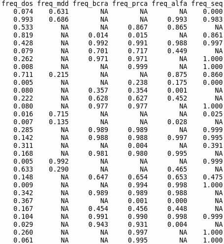
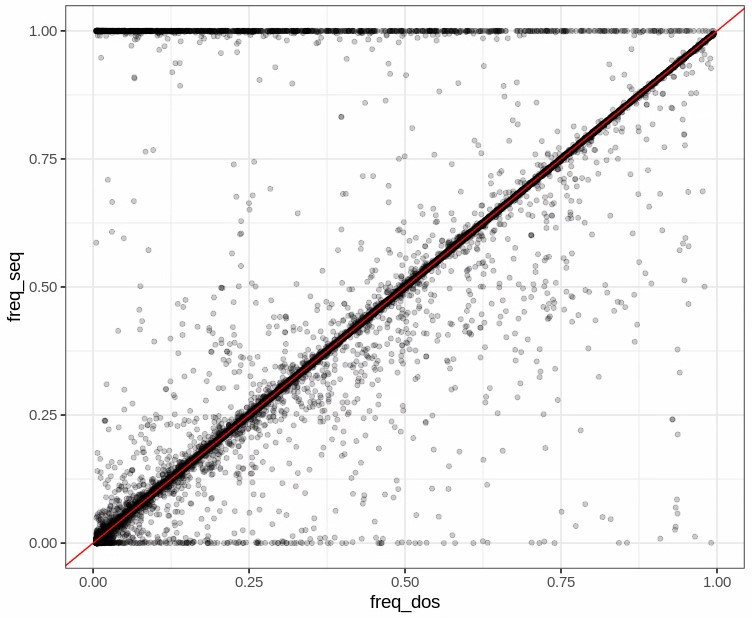

```{r setup, include=FALSE}
# renderthis::to_pdf("ldpred2-wcpg2023.Rmd", partial_slides = TRUE)
options(htmltools.dir.version = FALSE, width = 70)
knitr::opts_chunk$set(fig.align = 'center', dev = "svg", out.width = "70%",
                      echo = FALSE, comment = "", fig.width = 5, global.par = TRUE)
ICON_R_PROJECT <- icons::fontawesome$brands$`r-project`
ICON_TRI_EXCL  <- icons::fontawesome$solid$`exclamation-triangle`
ICON_INFO      <- icons::fontawesome$solid$`info-circle`
```

class: title-slide center middle inverse

<br>

# Checking the quality of the UK Biobank data

<br>

<br>

## Florian Privé 

#### `r icons::icon_style(fill = "white", icons::fontawesome$brands$twitter)` `r icons::icon_style(fill = "white", icons::fontawesome$brands$github)` privefl

---

### Current work: QC and imputation of GWAS summary statistics

<br>

```{r, out.width="100%", fig.cap="Thanks to Ole for his help in crafting this figure!"}
knitr::include_graphics("figures/Imputation-QC-method-v2.png")
```

<br>

--

<br>

#### Some LD reference is needed for both QC and imputation

I thought I would provide some LD matrices derived from the UK Biobank

---

### Checking the quality of the UK Biobank data

#### Comparing allele frequencies with other datasets

```{r, out.width="80%"}

```

---

### Checking the quality of the UK Biobank data

#### Comparing allele frequencies between imputed and sequenced data

```{r, out.width="80%"}

```

---

### Next step: using the WGS data

<br>

- the WGS data is available is vcf format (not easy to work with for us)

--

- it has been converted to bed and to BGEN, but multiallelic variants are missing (35%)

--

- Working with Léo & Hugues at Pasteur so see if can rederive BGEN data

--

<br>

- Compare the individual-level imputed and sequencing data (to filter variants)

--

- Finally, use the WGS data to derive the LD matrices for ~11M variants

