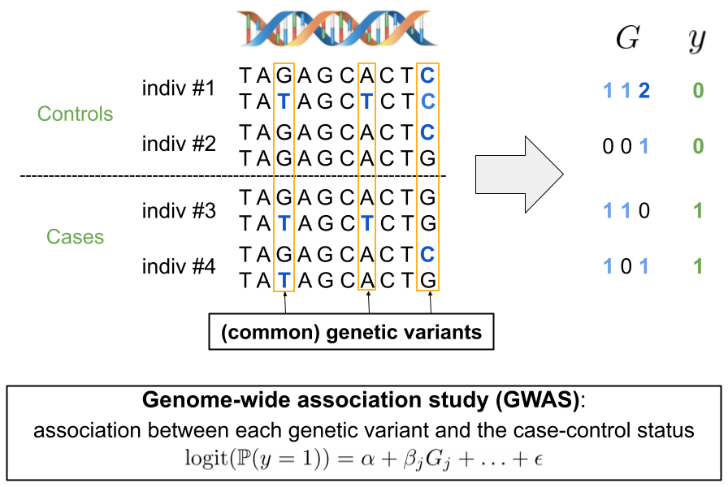
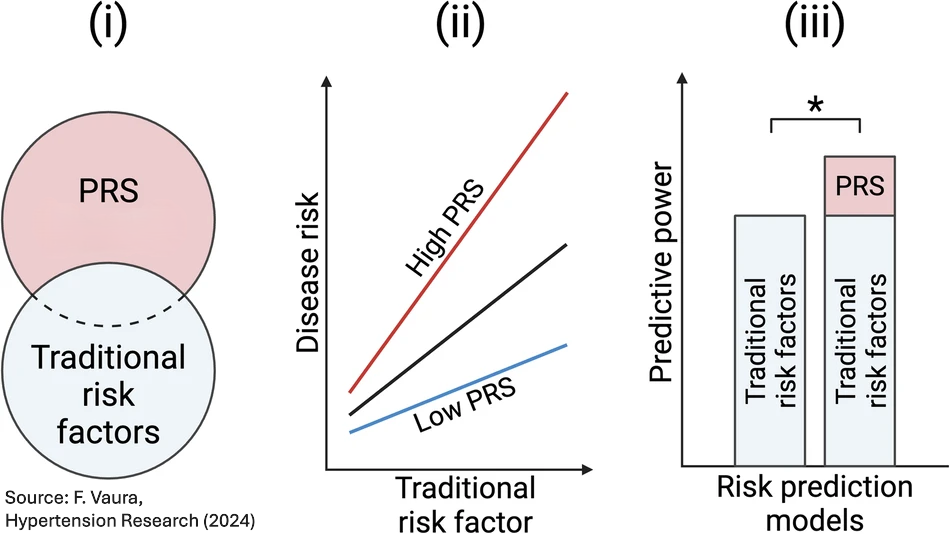
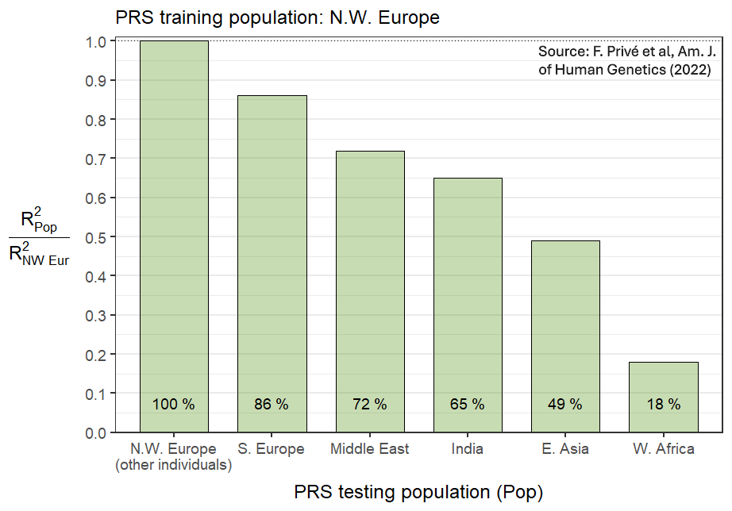
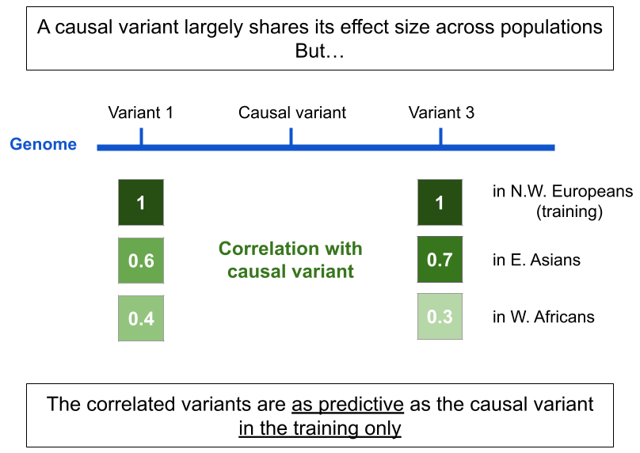
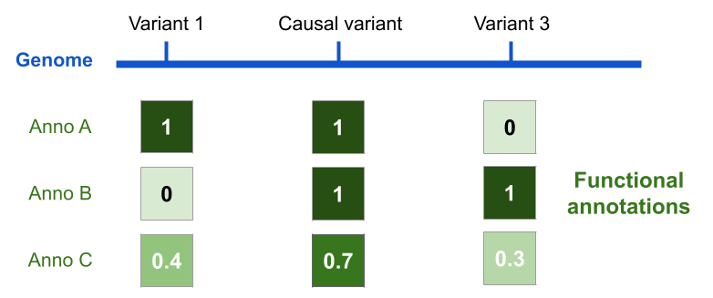
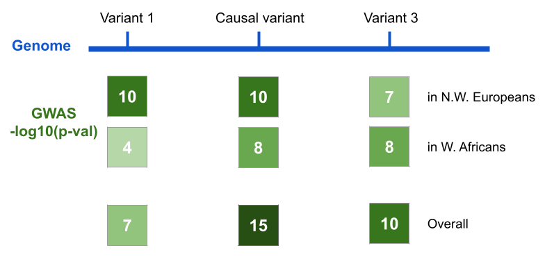
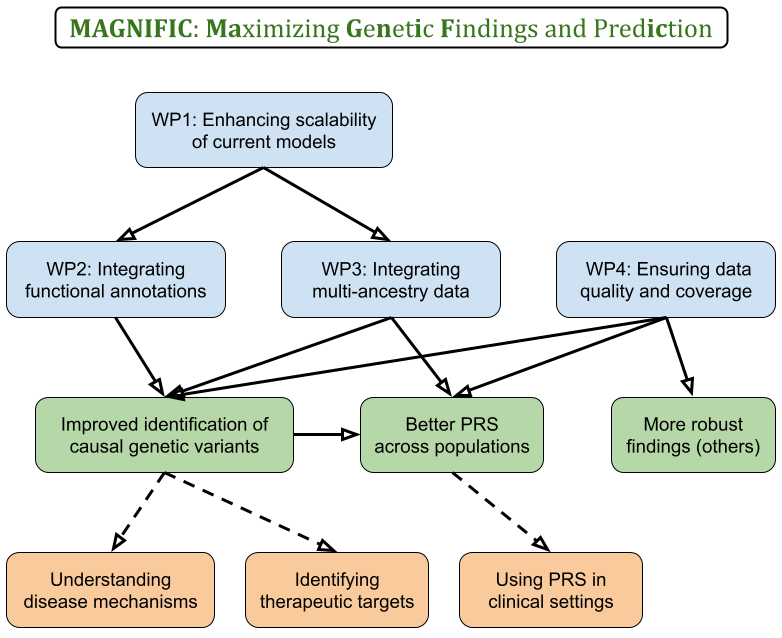
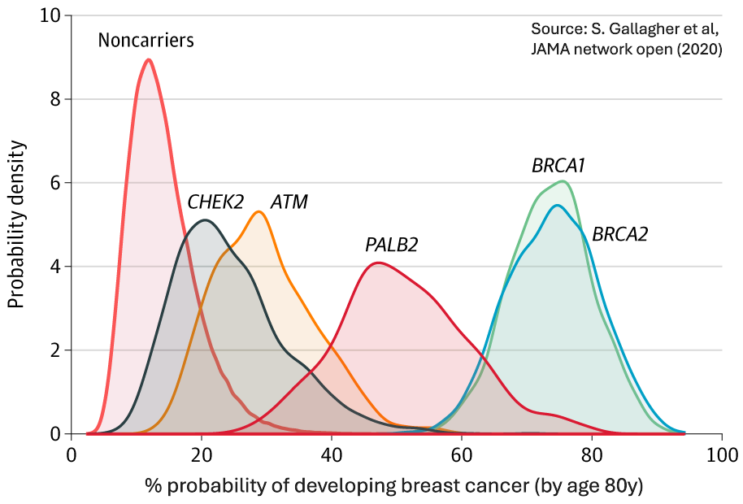

```{r setup, include=FALSE}
# renderthis::to_pdf("ldpred2-wcpg2023.Rmd", partial_slides = TRUE)
options(htmltools.dir.version = FALSE, width = 70)
knitr::opts_chunk$set(fig.align = 'center', dev = "svg", out.width = "70%",
                      echo = FALSE, comment = "", fig.width = 5, global.par = TRUE)
ICON_R_PROJECT <- icons::fontawesome$brands$`r-project`
ICON_TRI_EXCL  <- icons::fontawesome$solid$`exclamation-triangle`
ICON_INFO      <- icons::fontawesome$solid$`info-circle`
```

class: title-slide center middle

background-image: url("figures/logo-inserm.jpeg")
background-position: center 95%
background-repeat: no-repeat
background-size: 25%

# &mdash;**MAGNIFIC**&mdash;
# <u>Ma</u>ximizing <u>G</u>e<u>n</u>et<u>i</u>c <u>F</u>indings and Pred<u>ic</u>tion

<br>

## Florian Privé 

<br>

### CRCN INSERM&ndash;CSS6 application  

<br>

---

```{css}
.footnote2 {
  position: absolute;
  bottom: 1.6em;
  padding-right: 4em;
  font-size: 16.3px;
}
```

### About me

#### Professional background

- 2013–2016: Engineer in Computer Science & Applied Mathematics

- 2016–2019: PhD in Computational Biology (Grenoble)

- 2019–2021: Postdoc at Aarhus University (Denmark)

- 2022–2025: Senior Researcher (promotion at the same place)

<br>

#### Research focus

- Statistical human genetics

- Development of statistical methods and R/C++ packages    
for efficient and powerful analyses of large-scale genetic data 

- Particularly for deriving **polygenic risk scores (PRS)**

---

class: center middle inverse

# Genetic data
# Genome-Wide Association Studies (GWAS)
# Polygenic Risk Scores (PRS)

---

### Genetic variants and GWAS

```{r, out.width="100%"}

```

---

### GWAS and polygenic risk scores (PRS)

**Studying common diseases**, such as heart diseases, cancers, diabetes

<br>

Thanks to GWAS, we know that

- many **common** genetic variants are causal $\left(\beta_j \neq 0\right)$

- but, they usually have a **small effect size** $\beta_j$ on their own   
    
    $\Rightarrow$ <u>a common causal variant is not useful as a risk factor</u>

--

<br>

From GWAS data to **polygenic risk scores (PRS)**:

- variants can be aggregated in a joint predictive model: $PRS = \sum_j \hat\gamma_j~G_j$

- by aggregating many small effects, the PRS can have a large effect 

    $\Rightarrow$ the $PRS$ can be useful as a risk factor

---

### <u>Public Health</u>: refining risk assessment from traditional risk factors

<u>Traditional risk factors</u>: age, smoking, pollution, low SES, diet, physical inactivity, family history, (low-frequency large-effect) genetic mutations, etc

```{r, out.width="82%"}

```

--

.footnote2[
***
PRS clinical utility in a **clinical trial**: A. Fuat et al, Eur. J. of Preventive Cardiology (2024)

Refining breast cancer genetic risk using a PRS **in France**: Y. Jiao et al, Eur. J. of Cancer (2023)
]

---

class: center, middle, inverse

# A major limitation of PRS:

## their poor portability across populations

## risks exacerbating health disparities

---

### PRS performance drops with distance from training population

```{r, out.width="98%", fig.align='left'}

```

---

### Explanation: we often don't use causal variants in practice 

<br>

```{r, out.width="88%"}

```

---

class: center, middle, inverse

# The solution $\Rightarrow$ my proposed project:

## identifying causal variants and using them

## in polygenic risk scores (PRS)

---

### Scaling methods to using 10M genetic variants (WP1)

<br>

- there are ~10M common variants

- but many PRS methods have been restricted to using ~1M variants

<br>

.center[`r icons::fontawesome("laptop")` I will optimize both methods and data structures to use 10M variants `r icons::fontawesome("laptop")`]

---

### Prioritizing causal variants thanks to functional annotations (WP2)

<br>

```{r, out.width="95%"}

```

<br>

.center[**Variants in some functional categories are more likely to be causal**

`r icons::fontawesome("laptop")` I will integrate this information into my Bayesian PRS methodology `r icons::fontawesome("laptop")`]

---

### Prioritizing causal variants thanks to multi-ancestry data (WP3)

<br>

```{r, out.width="98%"}

```

<br>

.center[`r icons::fontawesome("laptop")` I will integrate multi-ancestry data into my Bayesian PRS methodology `r icons::fontawesome("laptop")`]


---

```{r, out.width="95%"}

```

---

### Feasability

- **I have developed many efficient & powerful methods** in past 9 years  

    - LDpred2, widely used for constructing PRS + often ranked best
    
    - bigstatsr and bigsnpr, R(cpp) packages for large-scale analyses

- I have published 28 papers with 2800 citations in total,    
including **2000 for my 11 first-author papers**

- My **funding strategy** for building a group:

  - ANR JCJC
  
  - ATIP-Avenir

- I have **co-supervised several young researchers**

    - two PhD students who graduated (**co-last author on 4 papers**)
    
    - ongoing: two PhD students, one research assistant, one postdoc

- I have found **several collaborators** for these work packages    
(Broad, UCLA, Oxford, Helsinki, Pasteur, INRIA, etc)
    
---

### Integration into INSERM Toulouse Laboratory

- **Host Team**: "GenoFun: <u>Fun</u>ctional impact of <u>Geno</u>mic variations on disease", a Bioinformatics team at IRSD, INSERM U1220

- **Collaboration**:

  - **Sarah Djebali (CR INSERM)**: Expert in functional genome annotation, supporting integration of annotations
  
  - **Jean Monlong (CR INSERM)**: Specialist in pangenomes and structural variants, expanding from simply using single-nucleotide polymorphisms (SNPs)
  
  - **Other lab members**: validation of causal variants using experimental models (e.g., mice, organoids)
  
- Technical support and computational resources via **Genotoul compute cluster** (5000 cores, 83 TB RAM, 7.5 PB storage)

- **Collaborative Environment**: Toulouse bioinformatics, biostatistics, mathematics and informatics network (INRAE, CNRS, INSERM, Uni)

---

class: inverse, center, middle

<br>

# Thank you for your attention

<br>
<br>

## Florian Privé 

---

count: false

### Refining breast cancer genetic risk using a 86-variant PRS

<br>

```{r, out.width="85%"}

```

---

count: false

### WP1: Using millions of genetic variants (possible solutions)

<br>

**The main bottleneck is storing and using the matrix of correlations between variants.**

<br>

Possible solutions:

- quantization: storing correlations with two bytes only (divide size by 4) 

- compression on top of quantization

- matrix seriation $\longrightarrow$ reordering variants to make blocks smaller

- eigendecomposition or compression of the matrix

- adapt methods to use very sparse *inverse* covariance matrices 

---

count: false

### WP4: Ensuring the quality and coverage of the training data

<br>

- there are lots of problems with the input data (GWAS summary statistics)

- which can causes lots of misspecifications and biases in the methods

.footnote2[F. Privé et al (2022). Identifying and correcting for misspecifications in GWAS summary statistics and polygenic scores. *Human Genetics and Genomics Advances*.]
<br>

```{r, out.width="92%"}
knitr::include_graphics("figures/Imputation-QC-method-v2.png")
```

- I propose to implement a QC and imputation method (synergistic)

- and to provide a set of highly refined GWAS summary statistics
