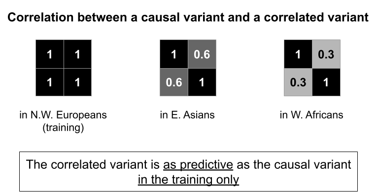
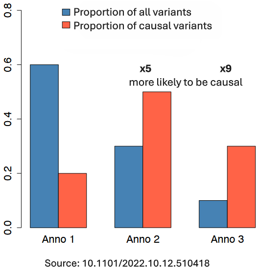

```{r setup, include=FALSE}
# renderthis::to_pdf("ldpred2-wcpg2023.Rmd", partial_slides = TRUE)
options(htmltools.dir.version = FALSE, width = 70)
knitr::opts_chunk$set(fig.align = 'center', dev = "svg", out.width = "70%",
                      echo = FALSE, comment = "", fig.width = 5, global.par = TRUE)
ICON_R_PROJECT <- icons::fontawesome$brands$`r-project`
ICON_TRI_EXCL  <- icons::fontawesome$solid$`exclamation-triangle`
ICON_INFO      <- icons::fontawesome$solid$`info-circle`
```

class: title-slide center middle

background-image: url("figures/logo-inserm.jpeg")
background-position: center 95%
background-repeat: no-repeat
background-size: 25%

# &mdash;**MAGNIFIC**&mdash;
# <u>Ma</u>ximizing <u>G</u>e<u>n</u>et<u>i</u>c <u>F</u>indings and Pred<u>ic</u>tion

<br>

## Florian Privé 

<br>

### CRCN INSERM&ndash;CSS6 application  

<br>

---

```{css}
.footnote2 {
  position: absolute;
  bottom: 1.6em;
  padding-right: 4em;
  font-size: 16.3px;
}
```

### About me

<br>

#### Research Interests

- Statistical human genetics, especially polygenic risk scores (PRS)

- Development of statistical methods and R/C++ packages    
for efficient and powerful analyses of large-scale genetic data 

--

<br>

#### Professional background

- 2013–2016: Engineer in Computer Science & Applied Mathematics

- 2016–2019: PhD in Computational Biology (Grenoble)

- 2019–2021: Postdoc at Aarhus University (Denmark)

- 2022–2025: Senior Researcher (promotion at the same place)

---

class: center middle inverse

# Introduction & Motivation

---

### Genetic variants and GWAS

```{r, out.width="100%"}
knitr::include_graphics("figures/Overview_geneticvariants_GWAS.png")
```

---

### GWAS and polygenic risk scores (PRS)

**Studying common diseases**, such as heart diseases, cancers, diabetes

<br>

Thanks to GWAS, we know that

- many **common** genetic variants are causal/pathogenic

- but, they usually have a **small effect size** $\beta_j$ on their own

- $\Rightarrow$ a single common variant *cannot* be used as a risk factor

--

<br>

From GWAS data to polygenic risk scores (PRS):

- variants can be aggregated in a joint predictive model: $PRS = \sum_j \hat\gamma_j~G_j$

- $\Rightarrow$ the $PRS$ has a much larger effect size than each $G_j$    
and *can* be used as a risk factor

---

### <u>Public Health</u><br>Using a PRS to refine risk assessment from traditional risk factors

```{r, out.width="85%"}
knitr::include_graphics("figures/PRS-risk2.png")
```

.footnote2[
***
PRS clinical acceptance & utility demonstrated in a **clinical trial**:    
A. Fuat et al, European journal of preventive cardiology (2024)
]

---

### Refining breast cancer risk using a PRS (of 86 common variants)

```{r, out.width="83%"}
knitr::include_graphics("figures/PRS-cancer-risk2.png")
```

.footnote2[
***
Similar results from a study **in France**: Y. Jiao et al, European Journal of Cancer (2023)
]

---

class: center, middle, inverse

# A major limitation of PRS:

## their poor portability across populations

## risks exacerbating health disparities

---

### PRS performance drops with distance from training population

```{r, out.width="100%"}
knitr::include_graphics("figures/ratio-dist-4.png")
```

---

### How to explain this drop in predictive performance of PRS?

Counter-intuitive, because it has been shown that 

- **causal variants are mostly similar** across populations

- **their effect sizes are also very similar**

--

<br>

<u>The issue</u>: we often don't use causal variants in practice 

```{r, out.width="78%"}

```

---

class: center, middle, inverse

# The solution:

# precisely identifying causal variants

---

### An overview of my proposed project MAGNIFIC

<br>

```{r, out.width="100%"}
knitr::include_graphics("figures/Overview_MAGNIFIC.png")
```

---

### Prioritizing causal variants thanks to functional annotations (WP2)

For example, protein-coding variants, regulatory variants, conserved variants (in regions with little evolutionary change)

```{r, out.width="55%"}

```

---

### Prioritizing causal variants thanks to multi-ancestry data (WP3)

<br>

```{r, out.width="100%"}
knitr::include_graphics("figures/multiancestry-finemapping2.png")
```

---

### WP1 and WP4 to ensure causal variants are available

<br>

```{r, out.width="100%"}
knitr::include_graphics("figures/Overview_MAGNIFIC.png")
```

---

### Feasability

- Already **developed many state-of-the-art methods** in past 9 years  

    - LDpred2, widely used for constructing PRS
    
    - bigstatsr and bigsnpr, R(cpp) packages for large-scale analyses

- Published 28 papers with 2800 citations in total,    
including **2000 for my 11 first-author papers**

--

- **Funding Strategy:**

  - ATIP-Avenir (applied)
  
  - ANR JCJC (planned)

--

- Already have **experience supervising** 

    - two PhD students who graduated, with **4 co-last-author papers**
    
    - ongoing: two PhD students, one research assistant, one postdoc
    
--

- Already found **several collaborators** for these work packages    
(Broad, UCLA, Helsinki, Pasteur, INRIA, etc)
    
---

### Integration into INSERM Toulouse Laboratory

<br>

- **Host Team**: "GenoFun: <u>Fun</u>ctional impact of <u>Geno</u>mic variations on disease", a Bioinformatics team at IRSD, INSERM U1220

--

- **Collaboration**:

  - **Sarah Djebali (CR INSERM)**: Expert in functional genome annotation, supporting integration of annotations
  
  - **Jean Monlong (CR INSERM)**: Specialist in pangenomes and structural variants, expanding from simply using single-nucleotide polymorphisms (SNPs)
  
  - **Other lab members**: validation of causal variants using experimental models (e.g., mice, organoids)
  
--
  
- Technical support and computational resources via **Genotoul compute cluster** (5000 cores, 83 TB RAM, 7.5 PB storage)

--

- **Collaborative Environment**: Toulouse bioinformatics, biostatistics, mathematics and informatics network (INRAE, CNRS, INSERM, Uni)

---

### Relevance to INSERM's mission

<br>

My project aligns closely with INSERM's commitment to advancing public health through biomedical and bioinformatics innovation:

- **Precision medicine**: enabling earlier and more accurate disease risk assessment

- **Reducing health disparities**: improving risk models for all worldwide populations

- **Bridging research and clinical practice**: facilitating the integration of PRS into clinical and public health strategies

- **Enhancing genetic discoveries**: Improving the identification of causal variants to identify disease mechanisms and therapeutic targets

---

class: inverse, center, middle

<br>

# Thank you for your attention

<br>
<br>

## Florian Privé 

