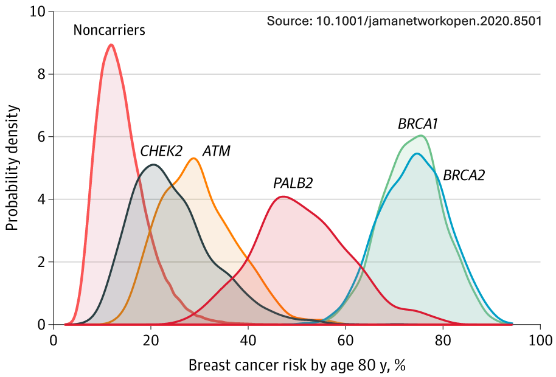

```{r setup, include=FALSE}
# renderthis::to_pdf("ldpred2-wcpg2023.Rmd", partial_slides = TRUE)
options(htmltools.dir.version = FALSE, width = 70)
knitr::opts_chunk$set(fig.align = 'center', dev = "svg", out.width = "70%",
                      echo = FALSE, comment = "", fig.width = 5, global.par = TRUE)
ICON_R_PROJECT <- icons::fontawesome$brands$`r-project`
ICON_TRI_EXCL  <- icons::fontawesome$solid$`exclamation-triangle`
ICON_INFO      <- icons::fontawesome$solid$`info-circle`
```

class: title-slide center middle

background-image: url("figures/logo-inserm.jpeg")
background-position: center 95%
background-repeat: no-repeat
background-size: 25%

# &mdash;**MAGNIFIC**&mdash;
# <u>Ma</u>ximizing <u>G</u>e<u>n</u>et<u>i</u>c <u>F</u>indings and Pred<u>ic</u>tion

<br>

## Florian Privé 

<br>

### CRCN INSERM&ndash;CSS6 application  

<br>

---

```{css}
.footnote2 {
  position: absolute;
  bottom: 1.6em;
  padding-right: 4em;
  font-size: 16.3px;
}
```

### About me

<br>

#### Research Interests

- Statistical human genetics, polygenic scores, ancestry inference

- Development of scalable statistical methods and open-source software for large-scale genetic data analyses

--

<br>

#### Professional background

- 2013–2016: Engineer in Computer Science & Applied Mathematics

- 2016–2019: PhD in Computational Biology (Grenoble)

- 2019–2021: Postdoc at Aarhus University (Denmark)

- 2022–2025: Senior Researcher (promotion at the same place)

---

class: center middle inverse

# Introduction & Motivation

---

### Genetic variants and GWAS

```{r, out.width="100%"}

```

---

### Disease genetic architecture and polygenic scores

```{r, out.width="75%"}
knitr::include_graphics("figures/disease-archi.png")
```

--

- many common genetic variants are causal/pathogenic
- but, they usually have a small effect on their own
- however, aggregating many small effects can result in a large effect
- this is called a polygenic (risk) score (PGS or PRS)

---

### <u>Public Health</u><br>Using PRS to modify risk assessment from traditional risk factors

```{r, out.width="85%"}
knitr::include_graphics("figures/PRS-risk.PNG")
```

--

.footnote2[
***
**In a randomized clinical trial** in the UK, a PRS added to a QRISK®2 cardiovascular disease risk calculator demonstrated robust clinical acceptance and clinical utility in the primary care setting.
]

---

### Modification of breast cancer risk using a 86-SNP PRS

```{r, out.width="80%"}

```

--

.footnote2[
***
Another similar study, **in France**:    
Association and performance of polygenic risk scores for breast cancer among French women presenting or not a familial predisposition to the disease. *European Journal of Cancer* (2023).
]

---

class: center, middle, inverse

# A major limitation of polygenic scores:

# their poor portability across ancestries

---

### Predictive performance drops with genetic distance to training

```{r, out.width="92%"}

```

---

### How to explain this drop in predictive performance?

<br>

Counter-intuitive, because it has been shown recently that 

- **causal variants are mostly similar** across many populations

- **their effect sizes are also very similar**

--

<br>

The issue: 

- in practice, we often don't use causal variants 

- instead, we use tagging/proxy variants,    
highly correlated with the causal variants **in the training population**

--

- but correlations between tagging and causal variants **varies across populations**
  
- which reduces the predictive power of tagging variants **in other populations**

---

class: center, middle, inverse

# The solution:

# precisely identifying causal variants

---

### An overview of my proposed project MAGNIFIC

<br>

```{r, out.width="100%"}
knitr::include_graphics("figures/Overview_MAGNIFIC.png")
```

---

### Feasability

- Already **developed many state-of-the-art methods** in past 9 years  

    - LDpred2, widely used for constructing polygenic scores
    - bigstatsr and bigsnpr, R packages for large-scale analyses

- Published 28 papers, including **9 as first author and 2 as sole author**    
(around 2750 citations in total, 2000 for my 11 first-author papers)

--

- **Funding Strategy:**
  - ATIP-Avenir (applied)
  - ANR Young Researchers Grant (planned)
  - ERC Starting Grant (planned)

--

- Already have **experience supervising** 

    - two PhD students who graduated, with **4 co-last-author papers**
    - ongoing: two PhD students, one research assistant, one postdoc
    
--

- Already found **several collaborators** for these work packages    
(Broad, UCLA, Helsinki, Pasteur, INRIA, etc)
    
---

### Integration into INSERM Toulouse Laboratory

<br>

- **Host Team**: "GenoFun: <u>Fun</u>ctional impact of <u>Geno</u>mic variations on disease", a Bioinformatics team at IRSD, INSERM U1220

--

- **Collaboration**:

  - **Sarah Djebali (INSERM CR)**: Expert in functional genome annotation, supporting integration of annotations
  
  - **Jean Monlong (INSERM CR)**: Specialist in pangenomes and structural variants, expanding from simply using single-nucleotide polymorphisms (SNPs)
  
  - **Other lab members**: validation of causal variants using experimental models (e.g., mice, organoids)
  
--
  
- Technical support and computational resources via **Genotoul compute cluster** (5000 cores, 83 TB RAM, 7.5 PB storage)

--

- **Collaborative Environment**: Toulouse bioinformatics, biostatistics, mathematics and informatics network (INRAE, CNRS, INSERM, Uni)

---

### Relevance to INSERM's Mission

<br>

My project aligns closely with INSERM's commitment to advancing public health through biomedical and bioinformatics innovation:

- **Precision Medicine**: enabling earlier and more accurate disease risk prediction

- **Reducing Health Disparities**: improving risk models for all worldwide populations

- **Bridging Research and Clinical Practice**: facilitating the integration of polygenic risk scores into clinical and public health strategies

- **Enhancing Genetic Discoveries**: Improving the identification of causal variants to refine disease mechanisms and therapeutic targets

---

class: inverse, center, middle

<br>

# Thank you for your attention

<br>
<br>

## Florian Privé 

