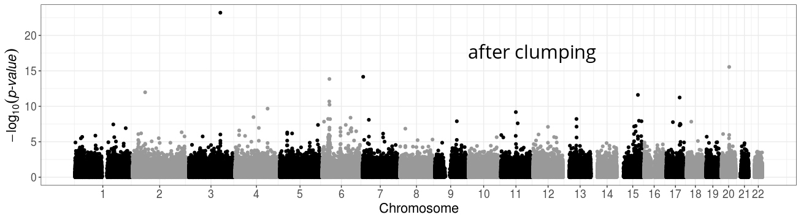
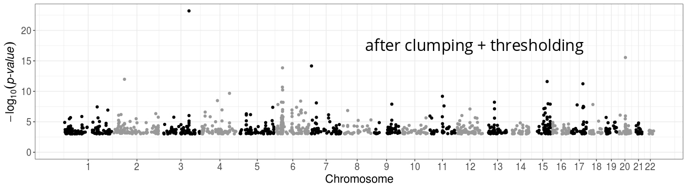

```{r setup, include=FALSE}
options(htmltools.dir.version = FALSE, width = 70)
knitr::opts_chunk$set(fig.align = 'center', dev = "svg", out.width = "70%",
                      echo = FALSE, comment = "", fig.width = 5, global.par = TRUE)
ICON_R_PROJECT <- icons::fontawesome$brands$`r-project`
```

class: title-slide center middle inverse

<br>

# Lecture on Polygenic Scores 

<br>

## NCRR Junior Seminars

<br>

### Florian Privé 
`r icons::icon_style(fill = "white", icons::fontawesome$brands$twitter)` `r icons::icon_style(fill = "white", icons::fontawesome$brands$github)` privefl

<br>

---

class: center middle inverse

# Introduction

---

### Disease architecture

```{r, out.width="80%"}
knitr::include_graphics("figures/disease-archi.png")
```

- many genetic variants contribute to the risk of getting a common disease
- $\Longrightarrow$ build a predictive score that combines many genetic variants
- $\rightarrow$ a polygenic (risk) score (PGS / PRS)

---

<br>

```{r, out.width="100%"}
knitr::include_graphics("figures/PRS-trend22.png")
```

---

class: center, middle, inverse

# How to predict from genetic data?
# = How to train polygenic scores?

<br>

## 1) using individual-level data

---

### GWAS data can be used for prediction

<br>

**Very large matrices** of genetic variants + individual phenotypes

--

<br>

Data I typically work with:

- [UK Biobank](https://doi.org/10.1101/166298) genotyped data: 500K x 800K (~3TB)

- [UK Biobank](https://doi.org/10.1101/166298) imputed data (common variants): 500K x 11M

--

***

<br>

- you can then **use any predictive model** (Machine Learning)

- but it must be scalable to the size of the data

- e.g. in `r ICON_R_PROJECT` package {bigstatsr}, there is a very efficient implementation    
of penalized regression, with automatic choice of hyper-parameters    
[bit.ly/plr-bigstatsr](https://bit.ly/plr-bigstatsr)

---

### Penalized regression for predicting height from genotypes

```{r, out.width="80%"}
knitr::include_graphics("https://privefl.github.io/blog/images/UKB-final-pred.png")
```

Within both males and females, we achieve 65.5% of correlation between predicted and true height

---

class: center, middle, inverse

# How to predict from genetic data?
# = How to train polygenic scores?

<br>

## 2) using GWAS summary statistics

---

### Standard PRS - part 1: estimating effects

#### Genome-wide association studies (GWAS)

In a GWAS, each genetic variant is tested **independently**, resulting in one **effect size** $\hat\beta$ and one **p-value** $p$ for each variant. 

```{r, out.width="100%"}
knitr::include_graphics("figures/gwas-height-20K.png")
```

<br>

Easy combining: $PRS_i = \sum_j \hat\beta_j \cdot G_{i,j}$

---

### Local correlation between variants causes redundant GWAS signals

<br>

```{r, out.width="100%"}
knitr::include_graphics("figures/fig-LD.png")
```

---

### Standard PRS - part 2: restricting predictors

#### <span style="color:#38761D">Clumping</span> + <span style="color:#1515FF">Thresholding</span> (C+T, or P+T) $\Longrightarrow$ heuristics

<br>

```{r, out.width="100%"}
knitr::include_graphics("figures/GWAS2PRS3.png")
```

<br>

$$PRS_i = \sum_{\substack{j \in S_\text{clumping} \\ p_j~<~p_T}} \hat\beta_j \cdot G_{i,j}$$

---

```{r, out.width = "85%"}
knitr::include_graphics("figures/fig-GWAS-C+T.jpg")
```
--
<br>
```{r, out.width = "85%"}

```
--
<br>
```{r, out.width = "85%"}

```

---

### Using summary statistics from large GWAS

```{r, out.width="85%"}
knitr::include_graphics("figures/PRS-sumstats.png")
```

---

### Alternative Methods

<br>

- building C+T scores using R package bigsnpr or software PRSice-2

--

- to more optimally use summary statistics only, i.e.

    - marginal GWAS summary statistics $\hat{\beta}$,
    
    - reference for correlation structure between variants $R$,    
    
    we can solve $\hat{\beta} = R \beta$, i.e. estimate causal effects $\beta$ while
    
      - approximating a penalized regression (lassosum, lassosum2)
        
      - using Bayesian methods (LDpred2, PRS-CS, SBayesR, ...),    
      which can infer model parameters $\Rightarrow$ no tuning set required

<!-- -- -->

<!-- <br> -->

<!-- $\Longrightarrow$ the more advanced methods often scale quadratically with the number of variants, and restrict to a predefined set of 1M genetic variants (called HapMap3) -->

---

class: center, middle, inverse

# What influences predictive power

# of polygenic scores

---

### What influences predictive power?

<br>

- PGS predictive performance $r^2$ is bounded by the (SNP) heritability $h^2$ captured by the set of variants used (with [a few exceptions](https://doi.org/10.1016/j.ajhg.2023.06.006))

- $r^2$ increases with sample size $N$ (of course)

- $r^2$ decreases with polygenicity (proportion of causal variants), because there are more small effects, harder to detect and estimate

***

<br>

$$r^2_\text{max} = \dfrac{h^2}{1 + (1 - r^2_\text{max}) \dfrac{M_c}{N h^2}} ~,$$
where $M_c$ is the number of causal variants.

.footnote[Source: 10.1371/journal.pone.0003395]

---

class: center, middle, inverse

# A major limitation of polygenic scores:

# their poor portability across ancestries

---

### Predictive performance drops with genetic distance to training

```{r, out.width="88%"}
knitr::include_graphics("figures/ratio-dist-2.png")
```

<!-- <span class="footnote">Recall: $\text{dist}_{PC}^2 \propto F_{ST}$</span> -->

---

class: center, middle, inverse

# Conclusion

---

### Take-home messages

<br>

- We can predict traits and diseases from genetic data    
(up to the heritability)

--

- One can use supervised learning methods when individual-level data is available (but, beware scalability)

--

- Many methods using summary statistics only have been developed (because we can easily obtain larger sample sizes through meta-analysis)

--

- For some traits, we have large sample sizes (e.g. 5M for height), but we still need larger sample sizes for most complex traits and diseases

--

- We still need to address the concern of providing PGS that work well in ALL ancestries    
This could be achieved by recruiting more people from non-European ancestries, and developing new methods for multi-ancestry training

---

class: inverse, center, middle


## Thank you for your attention

<br>
<br>

#### Presentation available at [bit.ly/ncrr-pgs](https://bit.ly/ncrr-pgs)

<br>

`r icons::icon_style(fill = "white", icons::fontawesome$brands$twitter)` `r icons::icon_style(fill = "white", icons::fontawesome$brands$github)` privefl

.footnote[Slides created via the R package [**xaringan**](https://github.com/yihui/xaringan)]

