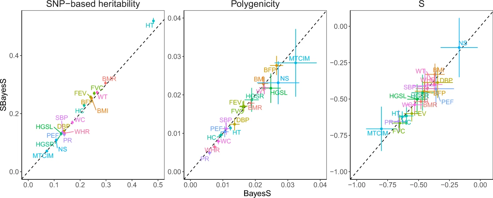
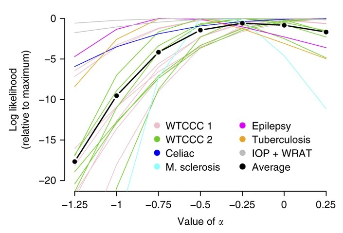
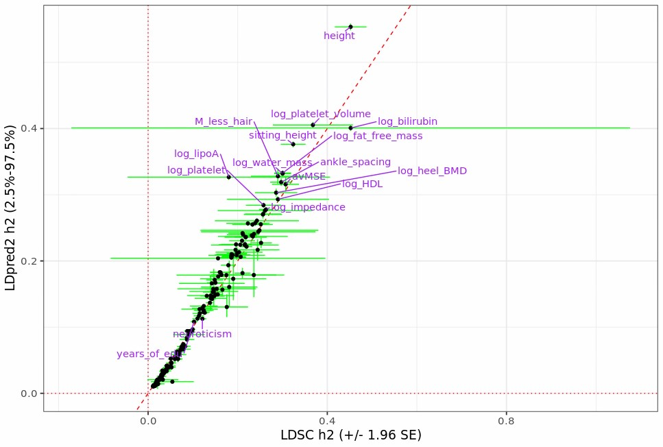
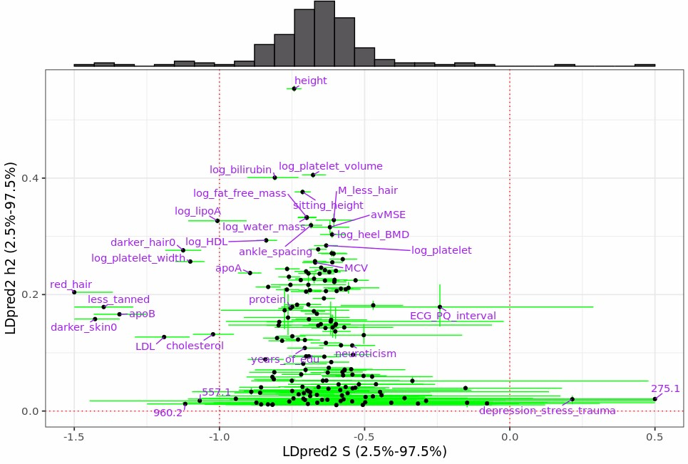
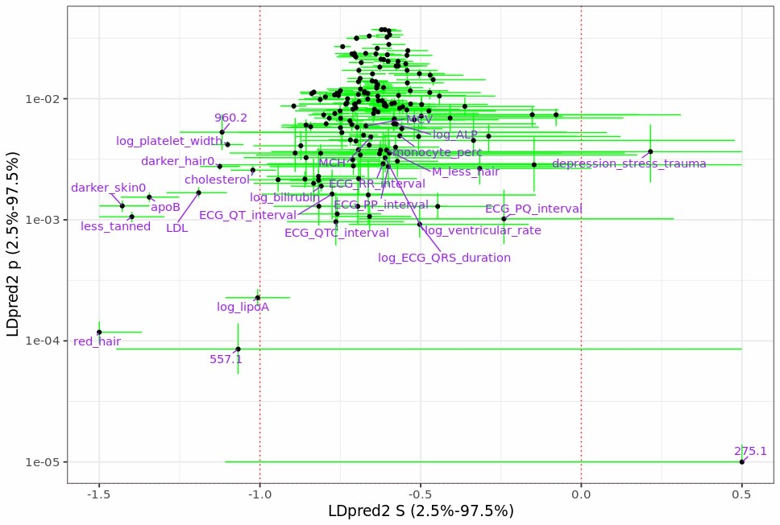

```{r setup, include=FALSE}
options(htmltools.dir.version = FALSE, width = 70)
knitr::opts_chunk$set(fig.align = 'center', dev = "svg", out.width = "70%",
                      echo = FALSE, comment = "", fig.width = 5, global.par = TRUE)
```

class: title-slide center middle inverse

<br>

# Disease architecture estimation<br>with LDpred2-auto

<br>

<!-- ## Focus on the 'S' parameter -->

<br>

### Florian Privé

---

class: title-slide center middle inverse

## Disclaimer:<br><br>I have started this project last Thursday

---

### LDpred2

LDpred2 [[bit.ly/ldpred2-paper](https://bit.ly/ldpred2-paper)] assumes the following model for effect sizes,

<div class="math">
\[
\beta_j = S_j \gamma_j \sim \left\{
\begin{array}{ll}
\mathcal N\left(0, \frac{h^2}{M p}\right) & \mbox{with probability } p,\\
0 & \mbox{otherwise,}\end{array}
\right.
\]
</div>

where 
- $p$ is the proportion of causal variants, 
- $M$ the number of variants,
- $h^2$ the (SNP) heritability.
- $\gamma$ the effect sizes on the allele scale,
- $\beta$ the effects of the scaled genotypes $\rightarrow S$ is their SD.

<br>

LDpred2 is a polygenic score method (i.e. its primary goal is prediction),    
but LDpred2-auto can estimate $h^2$ and $p$ directly from the data     
(i.e. no extra data is needed to tune these two hyper-parameters).

---

### Introducing the S parameter

<br>

LDpred2 should probably assume instead (the BayesS model)

<div class="math">
\[
\beta_j \sim \left\{
\begin{array}{ll}
\mathcal N\left(0, [2 f_j (1 - f_j)]^{S+1} \sigma_\beta^2\right) & \mbox{with probability } p,\\
0 & \mbox{otherwise,}\end{array}
\right.
\]
</div>

<br>

--

- Currently LDpred2 assumes that $S = -1$, i.e. that all causal variants contribute similarly to the heritability on average, whatever their allele frequency $f$. 

- A negative $S$ parameter is often reported as a sign of negative selection.

- $S = 0$ would mean that expected effect sizes (on the allele scale) do not vary with the allele frequencies.

- Should use something in-between?

---

### Results from [BayesS and SBayesS](https://doi.org/10.1038/s41467-021-21446-3)

```{r, out.width="100%"}

```

.footnote[BMR basal metabolic rate &mdash; BMI body mass index &mdash; BFP body fat percentage &mdash; DBP diastolic blood pressure &mdash; FEV forced expiratory volume &mdash; FVC forced vital capacity &mdash; HGSL hand grip strength (left) &mdash; HGSR hand grip strength (right) &mdash; HCadjBMI hip circumference adjusted for BMI &mdash; HT height &mdash; MTCIM mean time to correctly identify matches &mdash; NS neuroticism score &mdash; PEF peak expiratory flow &mdash; PR pulse rate &mdash; SBP systolic blood pressure &mdash; WCadjBMI waist circumference adjusted for BMI &mdash; WHRadjBMI waist–hip ratio adjusted for BMI &mdash; WT weight]

---

### Results from [GRM-MAF-LD](https://doi.org/10.1038/s41467-019-08424-6) <small>(uses lower MAF)</small>

```{r, message=FALSE}
text <- c("Phenotype \tSample size \talpha / S [95% CI]",
          "Age of menarche \t58,329 \t-0.40 [-0.63, -0.11]",
          "Blood pressure (diastolic) \t104,835 \t-0.39 [-0.54, -0.20]",
          "Blood pressure (systolic) \t104,835 \t-0.38 [-0.54, -0.18]",
          "BMI \t113,540 \t-0.24 [-0.38, -0.06]",
          "Bone mineral density \t110,611 \t-0.35 [-0.45, -0.23]",
          "FEV1/FVC \t97,075 \t-0.44 [-0.55, -0.31]","FVC \t97,075 \t-0.15 [-0.31, 0.04]",
          "Height \t113,660 \t-0.45 [-0.52, -0.39]",
          "Smoking status \t113,560 \t-0.16 [-0.43, 0.21]",
          "Waist-hip ratio \t113,668 \t-0.17 [-0.43, 0.19]",
          "Allergic eczema \t113,707 \t-0.60 [-0.85, -0.26]",
          "Asthma \t113,707 \t-0.25 [-0.60, 0.28]",
          "College education \t112,811 \t-0.32 [-0.54, -0.04]",
          "Hypertension \t113,689 \t-0.18 [-0.46, 0.21]",
          "Eosinophil count \t108,957 \t-0.40 [-0.54, -0.24]",
          "High light scatter reticulocyte count \t108,785 \t-0.53 [-0.65, -0.38]",
          "Lymphocyte count \t108,664 \t-0.52 [-0.63, -0.38]",
          "Mean corpuscular hemoglobin \t108,513 \t-0.42 [-0.53, -0.31]",
          "Mean sphered cell volume \t109,523 \t-0.43 [-0.56, -0.28]",
          "Monocyte count \t110,026 \t-0.19 [-0.35, -0.01]",
          "Platelet count \t109,971 \t-0.19 [-0.32, -0.03]",
          "Platelet distribution width \t109,938 \t-0.27 [-0.44, -0.07]",
          "Red blood cell count \t110,054 \t-0.39 [-0.51, -0.25]",
          "Red blood cell distribution width \t109,913 \t-0.20 [-0.36, -0.01]",
          "White blood cell count \t110,186 \t-0.25 [-0.42, -0.03]")
DT::datatable(bigreadr::fread2(text = text)[-2], rownames = FALSE)
```

---

### Results from [LDAK](https://doi.org/10.1038/ng.3865) <small>(maybe not the same parameter exactly)</small>

```{r, out.width="85%", fig.align='left'}

```

.footnote[M. sclerosis, multiple sclerosis &mdash; IOP, intraocular pressure &mdash; WRAT, wide-range achievement test]

---

class: title-slide center middle inverse

## New results from LDpred2-auto<br>in the UK Biobank

---

### New results for $h^2$ from LDpred2-auto in the UK Biobank

```{r, out.width="100%"}

```

---

### New results for $p$ from LDpred2-auto in the UK Biobank

```{r, out.width="100%"}
knitr::include_graphics("figures/ldpred2-p.jpg")
```

---

### New results for $S$ from LDpred2-auto in the UK Biobank

#### (using MLE similar to the one used in SBayesS)

```{r, out.width="90%"}

```

---

### New results for $S$ and $p$ from LDpred2-auto in the UK Biobank

```{r, out.width="100%"}

```

---

### Next analyses

<br>

- Validate in simulations

- Does a better $S$ provide better prediction?

- Is $S=0$ better for portability across ancestries?

- Can we also infer the predictive performance $R^2$?

- Using more than HapMap3 variants

- Find a better way to filter chains from the Gibbs sampler

- What else?

---

class: inverse, center, middle

# Thanks!

<br>

Presentation available at    
https://privefl.github.io/thesis-docs/ldpred2-S.html

<br>

<br>

`r icon::fa("twitter")` `r icon::fa("github")` privefl

.footnote[Slides created via the R package [**xaringan**](https://github.com/yihui/xaringan).]

