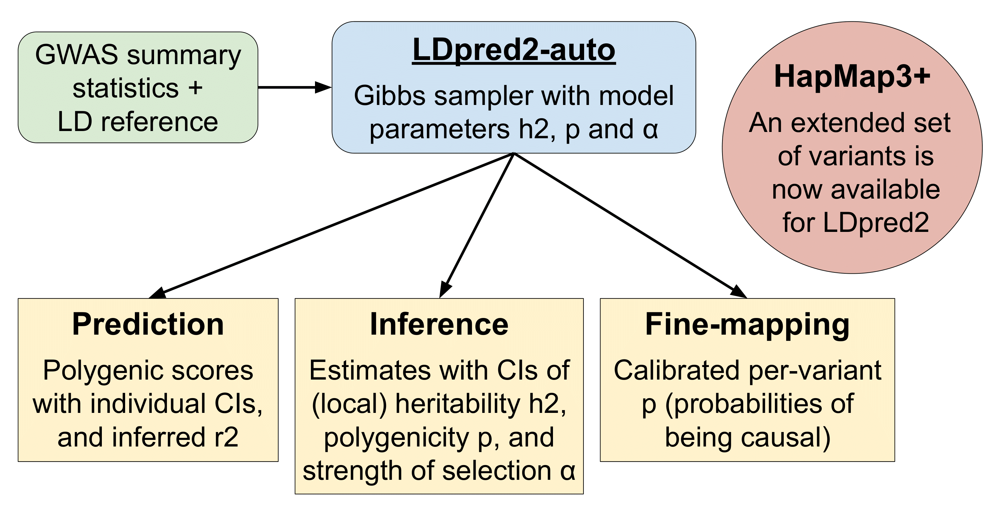
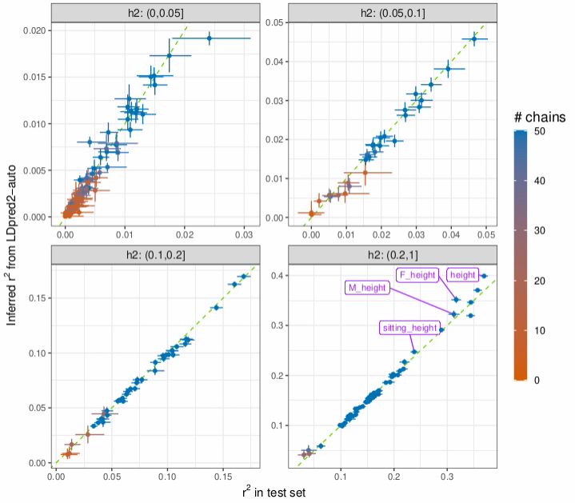
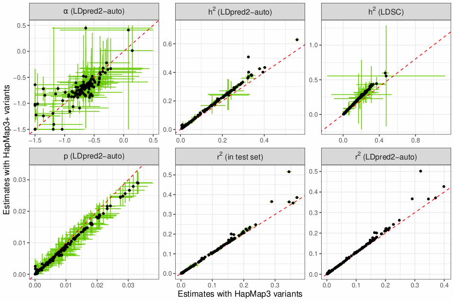

```{r setup, include=FALSE}
# renderthis::to_pdf("ldpred2-wcpg2023.Rmd", partial_slides = TRUE)
options(htmltools.dir.version = FALSE, width = 70)
knitr::opts_chunk$set(fig.align = 'center', dev = "svg", out.width = "70%",
                      echo = FALSE, comment = "", fig.width = 5, global.par = TRUE)
ICON_R_PROJECT <- icons::fontawesome$brands$`r-project`
ICON_TRI_EXCL <- icons::fontawesome$solid$`exclamation-triangle`
ICON_INFO <- icons::fontawesome$solid$`info-circle`
```

class: title-slide center middle inverse

<br>

# Recent and Future Updates to LDpred2 for Polygenic Scores and Inference

<br>

## WCPG 2023

<br>

## Florian Privé (Aarhus Uni, DK)
### `r icons::icon_style(fill = "white", icons::fontawesome$brands$twitter)` `r icons::icon_style(fill = "white", icons::fontawesome$brands$github)` privefl

---

class: title-slide center middle inverse

# Nothing to disclose

---

### Overview of what LDpred2-auto can now provide

<br>

```{r, out.width="100%"}

```

---

### Prior model: spike and slab

<br>

LDpred2 assumes the following model for effect sizes,

<div class="math">
\[
\beta_j = S_j \gamma_j \sim \left\{
\begin{array}{ll}
\mathcal N\left(0, \dfrac{h^2}{M p}\right) & \mbox{with probability } p,\\
0 & \mbox{otherwise,}\end{array}
\right.
\]
</div>

where 
- $p$ is the proportion of causal variants (aka polygenicity), 
- $M$ the number of variants, 
- $h^2$ the (SNP) heritability, 
- $\boldsymbol{\gamma}$ the effect sizes on the allele scale,
- $\boldsymbol{S}$ the standard deviations of the genotypes,
- $\boldsymbol{\beta}$ the effects of the scaled genotypes.

--

<br>

LDpred2 uses a Gibbs sampler to sample causal variants and their effects.    
LDpred2-auto directly estimates $h^2$ and $p$ from the Gibbs sampler.

<!-- --- -->

<!-- ### Three versions of LDpred2 (for prediction) -->

<!-- <br> -->

<!-- - *LDpred2-inf*, which we do not recommend to use. -->

<!-- - *LDpred2-grid*, which **tests different values for hyper-parameters $h^2$ and $p$** and choose the best predictive model in some validation/tuning set. -->

<!-- - *LDpred2-auto*, which **directly estimates $h^2$ and $p$** from the Gibbs sampler. -->

<!-- -- -->

<!-- <br> -->

<!-- #### Estimation of parameters in LDpred2-auto -->

<!-- - $p \sim \text{Beta}(1 + M_c, 1 + M - M_c)$, where $M_c = \sum_j(\beta_j \neq 0)$. -->

<!-- - $h^2 = \boldsymbol{\beta}^T \boldsymbol{R} \boldsymbol{\beta}$. We did not derive a Bayesian estimator of $h^2$; others have assumed a scaled inverse chi-square prior distribution. -->

<!-- - We estimate these two parameters at each (outer) iteration of the Gibbs sampler. -->

---

### Extended 3-parameter model (for LDpred2-auto)

<br>

<div class="math">
\[
\beta_j = S_j \gamma_j \sim \left\{
\begin{array}{ll}
\mathcal N\left(0, ~\sigma_\beta^2 \cdot (S_j^2)^{(\alpha + 1)} \right) & \mbox{with probability } p,\\
0 & \mbox{otherwise.}
\end{array}
\right.
\]
</div>

<br>

- similar to the model assumed in SBayesS

- previous 2-parameter model assumes $\alpha = -1$ and $\sigma_\beta^2 = \frac{h^2}{M p}$

- $\sigma_\beta^2$ and $\alpha$ are estimated using maximum likelihood estimation (MLE)

--

<br>

`r ICON_TRI_EXCL` More flexibility is not always better.    
Inference can become unstable when power is low.    
The 2-parameter model can be used instead by setting `use_MLE = FALSE`.

---

### Inference with LDpred2-auto

<br>

Recent work on:

- properly validating the inference of $h^2$, $p$, and $\alpha$ (and their CIs)    
using extensive simulations

- showing calibrated per-variant probabilities of being causal

- inferring the out-of-sample predictive performance $r^2$    
directly from the Gibbs sampler

--

<br>

<br>

`r ICON_INFO` Soon to be published in AJHG. Stay tuned `r icons::fontawesome$brands$twitter` @privefl.

---

### Inferred $r^2$ estimates vs the ones from a test set

```{r, out.width="78%"}

```

---

### An extended set of variants for LDpred2

<br>

- We have recommended to use a set of 1,054,330 HapMap3 variants
  - good coverage of the genome 
  - generally well imputed and available in most studies

- We now provide an extended set with 37% more variants
  - designed to maximize tagging of 11.5M common variants    
  in diverse genetic ancestries
  - called HapMap3+

- Using this new set of variants, in UK Biobank analyses, *on average*,
  - we capture 12% more SNP heritability $h^2$
  - obtain 6% more predictive performance $r^2$

--

<br>

`r ICON_TRI_EXCL` Using more variants won't necessarily give you better polygenic scores.

---

### UKBB results with HapMap3+ (1.4M) vs HapMap3 (1M)

```{r, out.width="100%"}

```

---

### Overview of what LDpred2-auto can now provide

<br>

```{r, out.width="100%"}

```

---

### Future development

<br>

- Design automated decisions for choosing parameters such as `use_MLE`
    
- Provide means for enhanced quality control of GWAS summary statistics

- Extend LDpred2-auto for

    - using more variants 
    
    - incorporating functional annotations
    
    - multi-ancestry prediction and inference 
    
- and for (smaller priority):

    - using multiple phenotypes and estimating genetic correlation 
    
    - imputing GWAS summary statistics

---

### Acknowledgments

#### Co-authors:

- Bjarni J. Vilhjálmsson (Aarhus Uni, DK)

- Julyan Arbel (INRIA Grenoble, FR)

- Hugues Aschard (Pasteur Institute, FR)

- Bogdan Pasaniuc (UCLA, CA, USA)

- Yi Ding (UCLA)

- Clara Albiñana (Aarhus Uni)

#### Funding:

- Danish National Research Foundation    
(Niels Bohr Professorship to Prof. John McGrath)

- Lundbeck Foundation    
(Fellowship to Prof. B.J. Vilhjálmsson)

---

class: inverse, center, middle

# Thanks!

<br>

Presentation available at [bit.ly/ldpred2_wcpg2023](https://bit.ly/ldpred2_wcpg2023)

<br>

`r icons::icon_style(fill = "white", icons::fontawesome$brands$twitter)` `r icons::icon_style(fill = "white", icons::fontawesome$brands$github)` privefl

.footnote[Slides created via the R package [**xaringan**](https://github.com/yihui/xaringan)]
