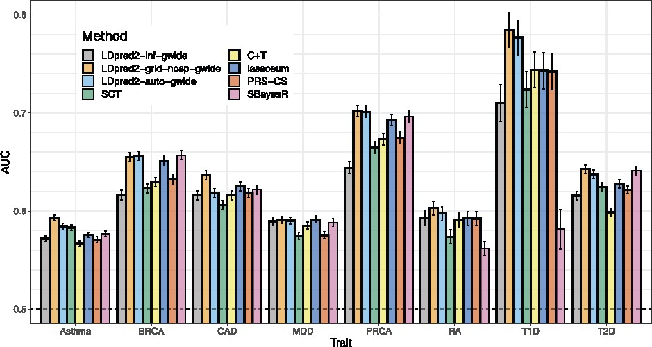

```{r setup, include=FALSE}
options(htmltools.dir.version = FALSE, width = 70)
knitr::opts_chunk$set(fig.align = 'center', dev = "svg", out.width = "70%",
                      echo = FALSE, comment = "", fig.width = 5, global.par = TRUE)
```

class: title-slide center middle inverse

<br>

# Predicting complex traits and diseases<br>from genetic data

<br>

### Course 5308 at KI (March 2022)

<br>

### Florian Privé

#### Senior Researcher, Aarhus University (DK)

---

class: center middle inverse

# Introduction

---

## Disease architecture

```{r, out.width="70%"}
knitr::include_graphics("figures/disease-archi.png")
```

Many genetic variants contribute to the risk of getting a common disease     
$\Longrightarrow$ build a predictive score that combines many genetic variants (polygenic risk score)

.footnote[Source: 10.1126/science.338.6110.1016] 

---

## Interest in Polygenic Scores (PGS)

<br>

```{r, out.width="90%"}
knitr::include_graphics("figures/PRS-trend22.png")
```

---

class: center, middle, inverse

# How to predict from genetic data?

<br>

## 1) using individual-level data

---

## Data: very large genotype matrices

<br>

**Matrices** of genetic variants (DNA mutations)

counting the number of alternative alleles (**0, 1, or 2**)    
or imputed dosages (between 0 and 2)

for each individual (row) and each genome position (column)

<br>

Data I typically work with:

- [UK Biobank](https://doi.org/10.1101/166298) genotyped data: 500K x 800K (~3TB)

- [UK Biobank](https://doi.org/10.1101/166298) imputed data (common variants): 500K x 11M

---

## Penalized Linear/Logistic Regression (PLR)

<br>

<Small>$$\arg\!\min_{\beta_0,~\beta}(\lambda, \alpha)\left\{  \underbrace{ \sum_{i=1}^n \left( y_i -(\beta_0 + x_i^T\beta) \right)^2 }_\text{Loss function (linear reg)}   +   \underbrace{ \lambda \left((1-\alpha)\frac{1}{2}\|\beta\|_2^2 + \alpha \|\beta\|_1\right) }_\text{Penalization}  \right\}$$</Small>

<br>

- $x$ is the **genotypes** and covariates (e.g. sex and principal components), 

- $y$ is the trait / disease status we want to predict, 

- $\lambda$ is a regularization parameter that needs to be determined and

- $\alpha$ determines relative parts of the regularization $0 \le \alpha \le 1$. 

<br>

In `r icon::fa_r_project()` package {bigstatsr}, very fast implementation with automatic choice of $\lambda$ and $\alpha$ [[bit.ly/plr-bigstatsr](https://bit.ly/plr-bigstatsr)]

---

## PLR for predicting height from genotypes

- 350K individuals x 656K variants in less than one day

- Within each both males and females, 65.5% of correlation between predicted and true height

```{r, out.width="70%"}
knitr::include_graphics("https://privefl.github.io/blog/images/UKB-final-pred.png")
```
---

class: center, middle, inverse

# How to predict from genetic data?

<br>

## 2) using GWAS summary statistics

---

## Standard PRS - part 1: estimating effects

### Genome-wide association studies (GWAS)

In a GWAS, each genetic variant is tested **independently**, resulting in one **effect size** $\hat\beta$ and one **p-value** $p$ for each variant. 

```{r, out.width="95%"}
knitr::include_graphics("figures/gwas-height-20K.png")
```

Easy combining: $PRS_i = \sum_j \hat\beta_j \cdot G_{i,j}$

---

### Local correlation between variants causes redundant GWAS signals

<br>

```{r, out.width="100%"}

```

---

## Standard PRS - part 2: restricting predictors

### <span style="color:#38761D">Clumping</span> + <span style="color:#1515FF">Thresholding</span> (C+T, or P+T)

<br>

```{r, out.width="100%"}
knitr::include_graphics("figures/GWAS2PRS3.png")
```

<br>

$$PRS_i = \sum_{\substack{j \in S_\text{clumping} \\ p_j~<~p_T}} \hat\beta_j \cdot G_{i,j}$$

---

```{r, out.width = "85%"}
knitr::include_graphics("figures/fig-GWAS-C+T.jpg")
```
--
<br>
```{r, out.width = "85%"}
knitr::include_graphics("figures/fig-GWAS-C+T-clumping.jpg")
```
--
<br>
```{r, out.width = "85%"}
knitr::include_graphics("figures/fig-GWAS-C+T-clumping-thresholding.jpg")
```

---

### Making the most of C+T

#### Hyper-parameters in C+T

<!-- -- -->

<!-- -- -->

- threshold on squared correlation of clumping (e.g. $r_c^2 > 0.2$) and    
window size for LD computation (e.g. $w_c = 500 kb$)

<!-- -- -->

- p-value threshold ( $p_T$ between $1$ and $10^{-8}$ and choose the best one )

- other parameters such as the threshold of imputation quality score (e.g. $INFO > 0.3$) or minor allele frequency (e.g. $MAF > 0.01$)

<!-- -- -->

$\Longrightarrow$ *stdCT* (standard C+T)

--

***

#### Our contribution [[bit.ly/sct-paper](https://bit.ly/sct-paper)]

- an efficient implementation to compute thousands of C+T scores corresponding to different sets of hyper-parameters   
$\Longrightarrow$ *maxCT* (maximized C+T)

<!-- -- -->

- going further by **stacking** with a linear combination of all C+T models (instead of just choosing the best model)    
$\Longrightarrow$ *SCT* (Stacked C+T)

---

### Using summary statistics from large GWAS

```{r, out.width="85%"}
knitr::include_graphics("figures/PRS-sumstats.png")
```

---

## Alternative: approximating a penalized regression

A linear model with elastic-net regularization using coordinate descent by iteratively updating: 

$$
\beta_j^{(t+1)} =
\begin{cases}
\text{sign}\left(u_j^{(t)}\right) \left(\left|u_j^{(t)}\right| - \lambda_1\right) / \left(1 + \lambda_2\right) & \text{if } \left|u_j^{(t)}\right| > \lambda_1 ~, \\
0 & \text{otherwise.}
\end{cases}
$$

where 

$$u_j^{(t)} = \sum_i \left[ G_{i,j} \left( y_i - \sum_{k \neq j} G_{i,k} \beta_k^{(t)} \right) \right] = \sum_i G_{i,j} y_i - \sum_{k \neq j} \left( \sum_i G_{i,j} G_{i,k} \right) \beta_k^{(t)} ~.$$

--

***

- $\sum_i G_{i,j} y_i$ can be obtained from GWAS summary statistics 
- $\sum_i G_{i,j} G_{i,k}$ can be estimated from another dataset

$\Longrightarrow$ we can use summary statistics only (no individual-level data).

This idea is used in lassosum <small>(TSH Mak et al. "Polygenic scores via penalized regression on summary statistics." Genetic epidemiology (2017))</small>

---

### Computational considerations

- correlation between genetic variants is local ( $\sum_i G_{i,j} G_{i,k}$, when $G$ is appropriately scaled)
 
- the correlation matrix $G^T G$ is very sparse (banded)

- $\Rightarrow$ we can use e.g. 1M variants without too much difficulty

--

<br>

***

### Other methods for polygenic prediction from summary statistics

Many other methods have been developed, lots being Bayesian.

They all use the same idea of approximating the linear regression model using GWAS summary statistics and an external reference for the correlation between variants.

For example, we have developed LDpred2 [[bit.ly/ldpred2-paper](https://bit.ly/ldpred2-paper)].

---

### LDpred2

LDpred2 [[bit.ly/ldpred2-paper](https://bit.ly/ldpred2-paper)] assumes the following model for effect sizes,

<div class="math">
\[
\beta_j \sim \left\{
\begin{array}{ll}
\mathcal N\left(0, \dfrac{h^2}{M p}\right) & \mbox{with probability } p,\\
0 & \mbox{otherwise,}\end{array}
\right.
\]
</div>

where $p$ is the proportion of causal variants, $M$ the number of variants and $h^2$ the (SNP) heritability.

--

```{r, out.width="75%"}

```

---

class: center, middle, inverse

# What influences predictive power

# of polygenic scores

---

### What influences predictive power?

<br>

- Predictive power $r^2$ is bounded by the heritability $h^2$ captured by the set of variants used.

- $r^2$ increases with sample size $N$ (of course)

- $r^2$ decreases with polygenicity (proportion of causal variants), because there are more small effects, harder to detect and estimate.    
Let's denote $M_c$ the number of causal variants.

--

***

<br>

$$r^2_\text{max} = \dfrac{h^2}{1 + (1 - r^2_\text{max}) \dfrac{M_c}{N h^2}}$$


.footnote[Source: 10.1371/journal.pone.0003395]

---

class: center, middle, inverse

# A major limitation of polygenic scores:

# their poor portability across ancestries

---


### Portability across 245 phenotypes and 9 ancestry groups

```{r, out.width="95%"}
knitr::include_graphics("https://github.com/privefl/UKBB-PGS/blob/main/docs/figures/lasso-ancestry-2.png?raw=true")
```

.footnote[Percentage in figure title = squared slope (in blue) -- Source: [[bit.ly/portability-paper](https://bit.ly/portability-paper)]]

---

### Predictive performance drops with genetic distance

<br>

```{r, out.width="82%"}
knitr::include_graphics("https://github.com/privefl/UKBB-PGS/blob/main/docs/figures/ratio-dist-2.png?raw=true")
```

<!-- <span class="footnote">Recall: $\text{dist}_{PC}^2 \propto F_{ST}$</span> -->

---

### One possible explanation: different tagging

<br>

```{r, out.width="65%"}
knitr::include_graphics("https://github.com/privefl/thesis/blob/master/figures/indirect-association.png?raw=true")
```

***

Linkage disequilibrium = correlation between genetic variants    
(can be different across populations)

.footnote[Source: 10.1214/09-STS307]

---

class: center, middle, inverse

# Conclusion

---

### Take-home messages

<br>

- We can predict traits and diseases from genetic data (up to the heritability)

- One can use supervised learning methods when individual-level data is available (but, beware scalability)

- Many methods using summary statistics only have been developed (because we can easily obtain larger sample sizes through meta-analysis)

- For some traits, we have large sample sizes (e.g. 5M for height), but we still need larger sample sizes for most complex traits and diseases

- We still need to address the concern of providing PGS that work well in ALL ancestries    
This could be achieved by recruiting more people from non-European ancestries, and developing new methods for multi-ancestry training

---

class: inverse, center, middle

# Thanks!

<br>

Presentation available at    
https://privefl.github.io/thesis-docs/lecture-KI.html

<br>

<br>

`r icon::fa("twitter")` `r icon::fa("github")` privefl

.footnote[Slides created via the R package [**xaringan**](https://github.com/yihui/xaringan).]

