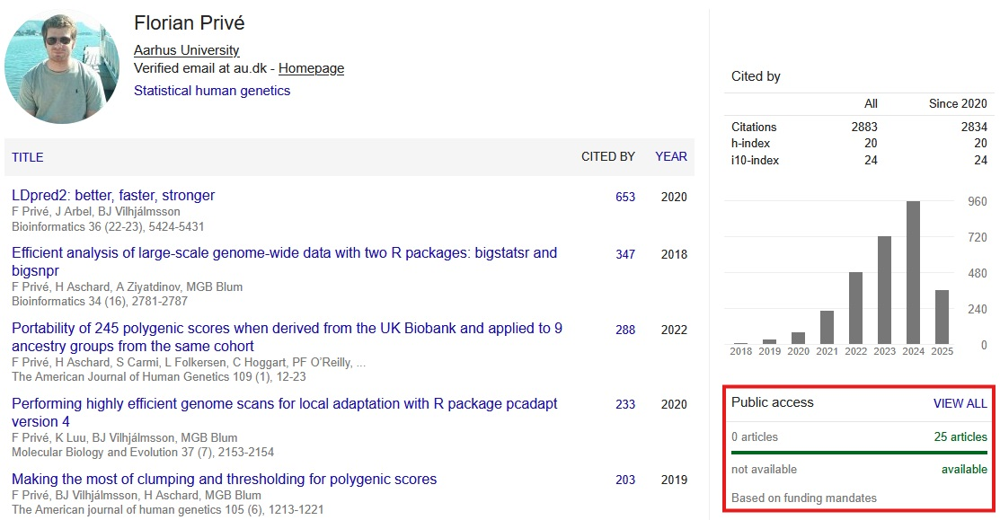

```{r setup, include=FALSE}
options(htmltools.dir.version = FALSE, width = 70)
knitr::opts_chunk$set(fig.align = 'center', dev = "svg", out.width = "70%",
                      echo = FALSE, comment = "", fig.width = 5, global.par = TRUE)
ICON_R_PROJECT <- icons::fontawesome$brands$`r-project`
ICON_TRI_EXCL <- icons::fontawesome$solid$`exclamation-triangle`
```

class: title-slide center middle inverse

<br>

# Open Science and FAIR principles

<br>

## NCRR Junior Seminars

<br>

## Florian Privé

#### <svg xmlns="http://www.w3.org/2000/svg" viewBox="0 0 576 512" width="1em" height="1em"><path d="M407.8 294.7c-3.3-.4-6.7-.8-10-1.3c3.4 .4 6.7 .9 10 1.3zM288 227.1C261.9 176.4 190.9 81.9 124.9 35.3C61.6-9.4 37.5-1.7 21.6 5.5C3.3 13.8 0 41.9 0 58.4S9.1 194 15 213.9c19.5 65.7 89.1 87.9 153.2 80.7c3.3-.5 6.6-.9 10-1.4c-3.3 .5-6.6 1-10 1.4C74.3 308.6-9.1 342.8 100.3 464.5C220.6 589.1 265.1 437.8 288 361.1c22.9 76.7 49.2 222.5 185.6 103.4c102.4-103.4 28.1-156-65.8-169.9c-3.3-.4-6.7-.8-10-1.3c3.4 .4 6.7 .9 10 1.3c64.1 7.1 133.6-15.1 153.2-80.7C566.9 194 576 75 576 58.4s-3.3-44.7-21.6-52.9c-15.8-7.1-40-14.9-103.2 29.8C385.1 81.9 314.1 176.4 288 227.1z" fill="white"/></svg> `r icons::icon_style(fill = "white", icons::fontawesome$brands$github)` privefl

---

### Open Science definition
#### by the French Ministry of Higher Education, Research and Innovation

<br>

- Open science refers to the unhindered dissemination of results, methods and products from scientific research. 

- It draws on the opportunity provided by recent digital progress to develop open access to publications and – as much as possible – data, source code and research methods. 

- It is a means for publicly funded research projects to retain control over the results they produce. 

- It builds an ecosystem in which science becomes better substantiated and more transparent, reproducible, effective and cumulative. 

- It aims to democratize access to knowledge, which is useful for teaching and training, and for the economy, public policy, citizens and society as a whole. 

- It is a lever for scientific integrity and builds citizen trust in science.

---

### Research from public fundings has to be open-access

...usually within six months of publication

<br>

```{r, out.width="100%"}

```

---

### High costs of open-access publication

```{r, out.width="55%", fig.align='center'}
knitr::include_graphics("https://pbs.twimg.com/media/F5z3E3RXMAAlhpk?format=jpg&name=small")
```

Nature: 10,690 EUR – Nature Neuroscience: 10,690 EUR – <br>Nature Communications: 5,890 EUR – Bioinformatics: 4,200 EUR – <br>AJHG: 5,150 USD (but 0 if you are willing to wait for six months)

---

### New publishing solutions are arising

<br>

E.g. [COMPUTO](https://computo.sfds.asso.fr/), a journal of the French Statistical Society

**Computo is free for both readers and authors**

<br>

Computo has been created in the context of a **reproducibility crisis in science**, which calls for higher standards in the publication of scientific results.

Computo aims at promoting computational/algorithmic contributions in statistics and machine learning that provide insight into which models or methods are the most appropriate to address a specific scientific question.

Code must be provided and is checked thoroughly during the review process.

---

### Before publication: preprint

<br>

- Put your preprints out there: bioRxiv, medRxiv, PsyArXiv

- Share the main results in a thread on social media

- I usually wait two weeks before submitting, to leave the opportunity for feedback before submission

<br>

- An additional benefit:

> Releasing a preprint is associated with more attention and citations for the peer-reviewed article
>
> – https://elifesciences.org/articles/52646

---

### The analysis code must be shared

Reproducibility is still a problem, and not much has changed.

Code is the ONLY way to reproduce an analysis. The Methods section cannot ensure reproducibility, because written instructions are too subjective.    
An example:

<center>
<iframe width="650" height="370" src="https://www.youtube.com/embed/FN2RM-CHkuI?si=xNRzc2Q069_6IVj2&amp;start=12&amp;end=264" title="YouTube video player" frameborder="0" allow="accelerometer; autoplay; clipboard-write; encrypted-media; gyroscope; picture-in-picture; web-share" referrerpolicy="strict-origin-when-cross-origin" allowfullscreen></iframe>
</center>

---

## FAIR principles for data

[reused from [here](https://nbisweden.github.io/module-open-science-dm-practices/02-fair/index.html)]

To try to guide the scientific community on how to ensure that the research data is useful for others in the digital age, [the FAIR principles](https://doi.org/10.1038/sdata.2016.18) were published in 2016.

"To be useful for others data should be FAIR - Findable, Accessible, Interoperable, and Reusable ... for both Machines and Humans"

***

So what does this mean? A brief condensed summary:

--

#### Findable

- Data have a globally unique persistent identifier
    - e.g. a DOI, database accession number, etc
- Data are described by metadata
    - Information that explains the data
- Data and metadata are findable in a search resource
    - There must be ways of searching for the data

---

#### Accessible

- Data is retrievable through a standardised communication protocol (open, free, allowing authentication & authorisation where necessary)
    - e.g. http, sftp, etc
- Metadata are accessible, even if data is no longer available
    - Information about the data can be found even if data is no longer available

--
<br>

#### Interoperable

- Metadata use a formal, accessible, shared language for knowledge representation
    - Metadata is available in a form that even a computer can make use of
- Metadata use vocabularies that follow the FAIR principles
    - Standardised ways of capturing information about the data, that in themselves is FAIR
- Metadata include qualified references to other metadata
    - If the data relies on other data, there must be links to those

---

#### Reusable

- Data have a clear data usage license
    - It is obvious under what conditions the data can be reused
- Metadata are associated with detailed provenance
    - The metadata is detailed enough to understand for what research questions it is relevant to reuse
- Metadata meet domain-relevant community standards
    - Metadata is described according to existing standards in the research field
    
--

<br>

<br>

A few things to note about FAIR:

- Both humans and machines are intended users of data
- The principles are not necessarily about open data
    - "As open as possible, as closed as necessary"
- FAIRness is not something absolute
    - Different levels of FAIR maturity
- FAIR does not force any particular technical standards

---

### "Data available on reasonable request"

...only 7% of the time (cf. [this study](https://doi.org/10.1016/j.jclinepi.2022.05.019))

```{r, out.width="70%", fig.align='center'}
knitr::include_graphics("https://ars.els-cdn.com/content/image/1-s2.0-S089543562200141X-gr2_lrg.jpg")
```

---

### My current practices

- I mostly use the UK Biobank data, which is broadly used and available to any researcher that applies for it

- All my statistical methods have their code open sourced on GitHub (usually as R packages)

- I always share the analysis code of papers on GitHub

    - when accessing data from the internet, I always try to have some code doing the download, rather than manually doing it, e.g. with `runonce::download_file()` in R
    
    - use relative paths instead of absolute paths
    
    - people should be able to see when you make some changes to your code (e.g. from the Git history) $\longrightarrow$ more transparency = more trust

- Key results are shared via GitHub or FigShare

- Specific results such as GWAS summary statistics and PGS effect sizes are shared through dedicated databases such as the GWAS and PGS Catalogs

- As a reviewer, I always ask for the analysis code

---

class: inverse, center, middle

## Thank you for your attention

<br>

Presentation available at [bit.ly/ncrr_open_science](https://bit.ly/ncrr_open_science)

<br>

#### <svg xmlns="http://www.w3.org/2000/svg" viewBox="0 0 576 512" width="1em" height="1em"><path d="M407.8 294.7c-3.3-.4-6.7-.8-10-1.3c3.4 .4 6.7 .9 10 1.3zM288 227.1C261.9 176.4 190.9 81.9 124.9 35.3C61.6-9.4 37.5-1.7 21.6 5.5C3.3 13.8 0 41.9 0 58.4S9.1 194 15 213.9c19.5 65.7 89.1 87.9 153.2 80.7c3.3-.5 6.6-.9 10-1.4c-3.3 .5-6.6 1-10 1.4C74.3 308.6-9.1 342.8 100.3 464.5C220.6 589.1 265.1 437.8 288 361.1c22.9 76.7 49.2 222.5 185.6 103.4c102.4-103.4 28.1-156-65.8-169.9c-3.3-.4-6.7-.8-10-1.3c3.4 .4 6.7 .9 10 1.3c64.1 7.1 133.6-15.1 153.2-80.7C566.9 194 576 75 576 58.4s-3.3-44.7-21.6-52.9c-15.8-7.1-40-14.9-103.2 29.8C385.1 81.9 314.1 176.4 288 227.1z" fill="white"/></svg> `r icons::icon_style(fill = "white", icons::fontawesome$brands$github)` privefl

<br>
<br>

## What do you do for Open Science?
