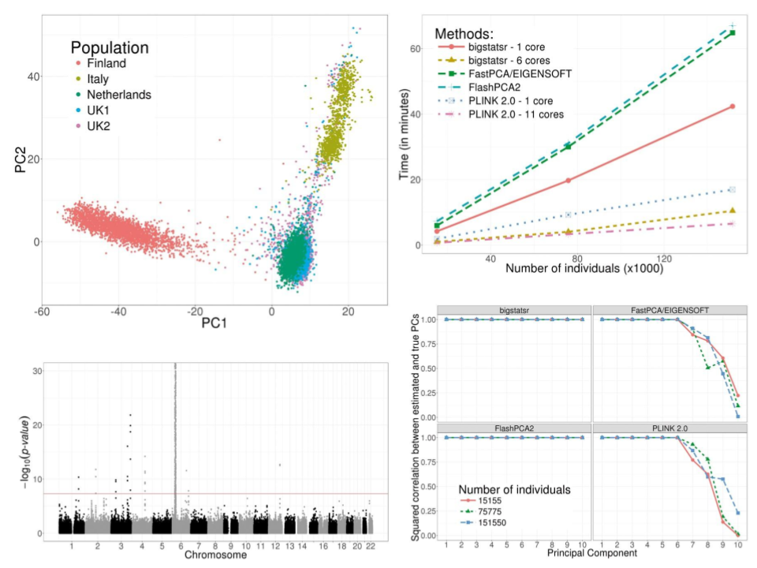
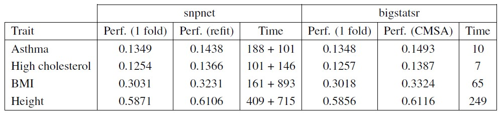
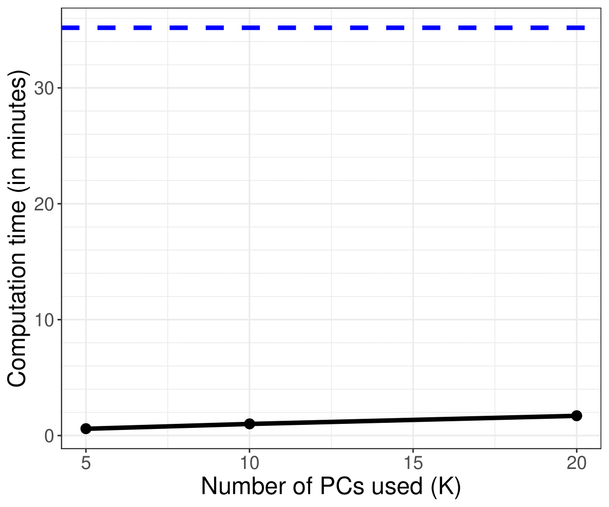
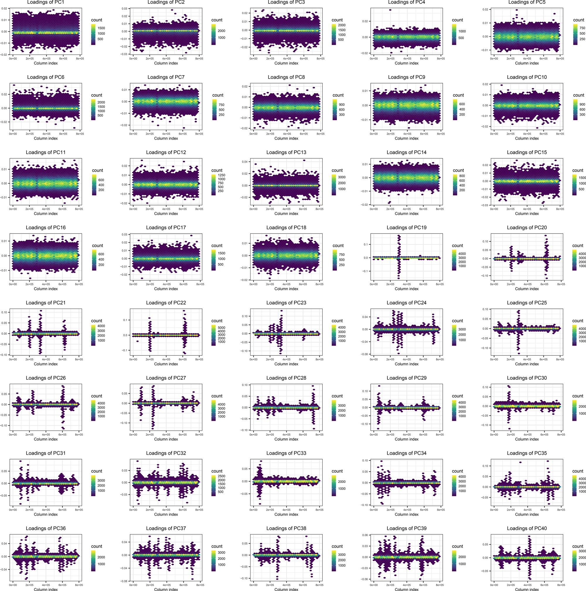
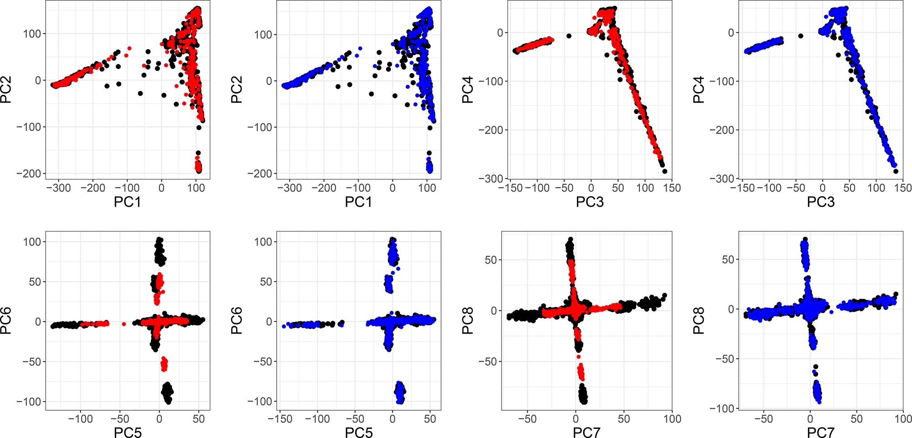
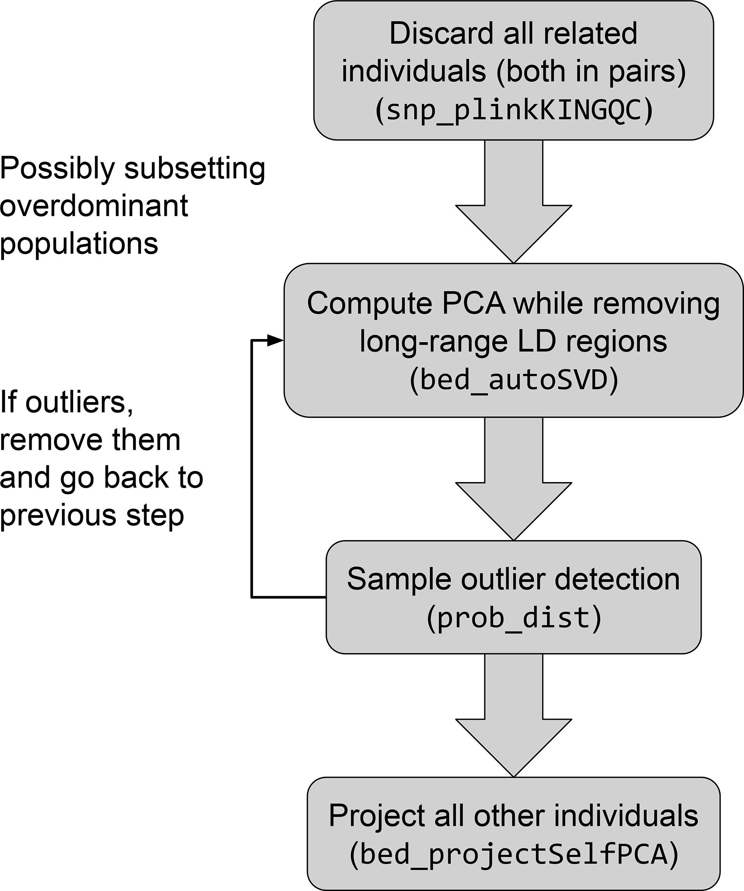
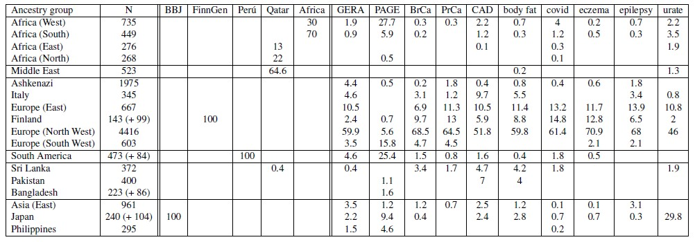

```{r setup, include=FALSE}
options(htmltools.dir.version = FALSE, width = 70)
knitr::opts_chunk$set(fig.align = 'center', dev = "svg", out.width = "70%",
                      echo = FALSE, comment = "", fig.width = 5, global.par = TRUE)
```

class: title-slide center middle inverse

<br>

# Overview of my work

<br>

## Statistical methods & tools for human genetics

### (focus on prediction and ancestry inference)

<br>

### Florian Privé

---

#### [1] Efficient analysis of large-scale genome-wide data with two R packages: bigstatsr and bigsnpr

```{r, out.width="95%"}

```

---

#### Main motivations for developing these two packages

<br>

- being able to run all my analyses within `r icon::fa_r_project()`

- frustration of having to use all these different software, with different input formats, and requiring text files for parameters

- simpler to build a chain of analyses, to perform some exploratory analyses, and to use familiar packages

- simpler to develop new methods, thanks to a simple matrix-like format

<br>

--

Note that many functions (to perform e.g. GWAS, PCA, summary statistics) are not really specific to genotype data; I implemented those in {bigstatsr}. 

This is why there are two packages, where {bigstatsr} can basically be used by any field using matrices, while {bigsnpr} provides some tools rather specific to genotype data, largely building on top of {bigstatsr}. 

Learn more about {bigstatsr} and the Filebacked Big Matrix (FBM) format in [this webinar](https://t.co/LUQQp7INlX).

---

#### [2] Efficient Implementation of Penalized Regression for Genetic Risk Prediction

<br>

<Small>$$\arg\!\min_{\beta_0,~\beta}(\lambda, \alpha)\left\{  \underbrace{ \sum_{i=1}^n \left( y_i -(\beta_0 + x_i^T\beta) \right)^2 }_\text{Loss function (linear reg)}   +   \underbrace{ \lambda \left((1-\alpha)\frac{1}{2}\|\beta\|_2^2 + \alpha \|\beta\|_1\right) }_\text{Penalization}  \right\}$$</Small>

<br>

- $x$ is the **genotypes** and covariates (e.g. sex and principal components), 

- $y$ is the trait / disease status we want to predict, 

- $\lambda$ is a regularization parameter that needs to be determined and

- $\alpha$ determines relative parts of the regularization $0 \le \alpha \le 1$. 

<br>

In `r icon::fa_r_project()` package {bigstatsr}, very fast implementation with automatic choice of $\lambda$ and $\alpha$ [[bit.ly/plr-bigstatsr](https://bit.ly/plr-bigstatsr)]

---

#### Benchmark against snpnet

```{r, out.width="100%"}

```

- 337K individuals (including 20% kept for testing), 504K genotyped variants and 10 cores used

- snpnet uses 60% of the data for initial training, then 80% for refitting (with best hyper-parameters)

- reporting partial correlations, and timings in minutes

- timings for bigstatsr report the time taken by the CMSA procedure (fitting K=4 models here)

.footnote[Our paper was published 1.5y before snpnet, before snpnet was even a preprint.]

---

#### [3] Making the Most of Clumping and Thresholding for Polygenic Scores

Hyper-parameters in C+T:

- threshold on squared correlation of clumping (e.g. $r_c^2 > 0.2$) and    
window size for LD computation (e.g. $w_c = 500 kb$)

- p-value threshold ( $p_T$ between $1$ and $10^{-8}$ and choose the best one )

- other parameters such as the threshold of imputation quality score (e.g. $INFO > 0.3$) or minor allele frequency (e.g. $MAF > 0.01$)

$\Longrightarrow$ *stdCT* (standard C+T)

--

<br>

Our contribution:

- an efficient implementation to compute thousands of C+T scores corresponding to different sets of hyper-parameters   
$\Longrightarrow$ *maxCT* (maximized C+T)

- going further by **stacking** with a linear combination of all C+T models (instead of just choosing the best model)    
$\Longrightarrow$ *SCT* (Stacked C+T)

---

#### [4] Performing Highly Efficient Genome Scans for Local Adaptation with R Package pcadapt Version 4

Basically performs a GWAS for population structure $\rightarrow$ faster implementation

```{r, out.width="75%"}

```

---

#### [5] Efficient toolkit implementing best practices for principal component analysis of population genetic data

PC loadings of the UK Biobank:

```{r, out.width="100%"}

```

---

#### PCA projection is biased

```{r, out.width="100%"}

```

PC scores 1–8 of the 1000 Genomes project

- black points: individuals for PCA training (60%)

- red points: simple projection of other individuals

- blue points: corrected projection

---

#### Our proposed pipeline

```{r, out.width="60%"}

```

---

#### [6] LDpred2: better, faster, stronger

<br>

LDpred2 assumes the following model for effect sizes,

<div class="math">
\[
\beta_j = S_j \gamma_j \sim \left\{
\begin{array}{ll}
\mathcal N\left(0, \frac{h^2}{M p}\right) & \mbox{with probability } p,\\
0 & \mbox{otherwise,}\end{array}
\right.
\]
</div>

where 
- $p$ is the proportion of causal variants, 
- $M$ the number of variants,
- $h^2$ the (SNP) heritability.
- $\gamma$ the effect sizes on the allele scale,
- $\beta$ the effects of the scaled genotypes $\rightarrow S$ is their SD.

<br>

LDpred2 is a polygenic score method (i.e. its primary goal is prediction),    
but LDpred2-auto can estimate $h^2$ and $p$ directly from the data     
(i.e. no extra data is needed to tune these two hyper-parameters).

---

#### LDpred2 is a very competitive PGS method

<br>

```{r, out.width="100%"}
knitr::include_graphics("figures/ldpred2-comparison.jpeg")
```

---

#### [7] Optimal linkage disequilibrium splitting

```{r, out.width="78%"}
knitr::include_graphics("https://github.com/privefl/paper-ldsplit/raw/main/illu.png")
```

$$C(i, k) = \min_j \left\lbrace E(i, j) + C(j + 1, k - 1) \right\rbrace$$
---

#### [8] Portability of 245 polygenic scores when derived from the UK Biobank and applied to 9 ancestry groups from the same cohort

<br>

```{r, out.width="100%"}
knitr::include_graphics("https://pbs.twimg.com/media/FIe2G4wWYAEYWwA?format=png&name=4096x4096")
```

---

#### Predictive power decreases with genetic distance to training population

<br>

```{r, out.width="90%"}
knitr::include_graphics("https://pbs.twimg.com/media/FIe3e0PXMAQ04rF?format=png&name=large")
```

---

#### [9] Using the UK Biobank as a global reference of worldwide populations: application to measuring ancestry diversity from GWAS summary statistics

<br>

- defined 21 ancestry groups in the UK Biobank (later merged into 18)

- use PCA projection and quadratic programming to infer ancestry proportions from allele frequencies alone

```{r, out.width="100%"}

```

---

<!-- ### Introducing the S parameter -->

<!-- <br> -->

<!-- LDpred2 should probably assume instead (the BayesS model) -->

<!-- <div class="math"> -->
<!-- \[ -->
<!-- \beta_j \sim \left\{ -->
<!-- \begin{array}{ll} -->
<!-- \mathcal N\left(0, [2 f_j (1 - f_j)]^{S+1} \sigma_\beta^2\right) & \mbox{with probability } p,\\ -->
<!-- 0 & \mbox{otherwise,}\end{array} -->
<!-- \right. -->
<!-- \] -->
<!-- </div> -->

<!-- <br> -->

<!-- -- -->

<!-- - Currently LDpred2 assumes that $S = -1$, i.e. that all causal variants contribute similarly to the heritability on average, whatever their allele frequency $f$.  -->

<!-- - A negative $S$ parameter is often reported as a sign of negative selection. -->

<!-- - $S = 0$ would mean that expected effect sizes (on the allele scale) do not vary with the allele frequencies. -->

<!-- - Should use something in-between? -->

---

#### References

```{css}
.small { font-size: 75% }
```


.small[
[10] Privé, Florian, et al. "Identifying and correcting for misspecifications in GWAS summary statistics and polygenic scores." *bioRxiv* (2022). [[preprint]](https://doi.org/10.1101/2021.03.29.437510)

[9] Privé, Florian. "Using the UK Biobank as a global reference of worldwide populations: application to measuring ancestry diversity from GWAS summary statistics." *bioRxiv* (2021). [[preprint]](https://doi.org/10.1101/2021.10.27.466078)

[8] Privé, Florian, et al. "Portability of 245 polygenic scores when derived from the UK Biobank and applied to 9 ancestry groups from the same cohort." *The American Journal of Human Genetics* 109.1 (2022): 12-23. [[Paper]](https://doi.org/10.1016/j.ajhg.2021.11.008)

[7] Privé, Florian. "Optimal linkage disequilibrium splitting." *Bioinformatics* 38.1 (2022): 255–256. [[Open Access]](https://doi.org/10.1093/bioinformatics/btab519)

[6] Privé, Florian, et al. "LDpred2: better, faster, stronger." *Bioinformatics* 36.22-23 (2020): 5424-5431. [[Open Access]](https://doi.org/10.1093/bioinformatics/btaa1029)

[5] Privé, Florian, et al. "Efficient toolkit implementing best practices for principal component analysis of population genetic data." *Bioinformatics* 36.16 (2020): 4449-4457. [[Open Access]](https://doi.org/10.1093/bioinformatics/btaa520)

[4] Privé, Florian, et al. "Performing highly efficient genome scans for local adaptation with R package pcadapt version 4." *Molecular biology and evolution* 37.7 (2020): 2153-2154. [[Open access]](https://doi.org/10.1093/molbev/msaa053)

[3] Privé, Florian, et al. "Making the most of Clumping and Thresholding for polygenic scores." *The American Journal of Human Genetics* 105.6 (2019): 1213-1221. [[Open access]](https://doi.org/10.1016/j.ajhg.2019.11.001)

[2] Privé, Florian, et al. "Efficient implementation of penalized regression for genetic risk prediction." *Genetics* 212.1 (2019): 65-74. [[Open access]](https://doi.org/10.1534/genetics.119.302019)

[1] Privé, Florian, et al. "Efficient analysis of large-scale genome-wide data with two R packages: bigstatsr and bigsnpr." *Bioinformatics* 34.16 (2018): 2781-2787. [[Open access]](https://doi.org/10.1093/bioinformatics/bty185)

]


---

class: inverse, center, middle

# Thanks!

<br>

Presentation available at    
https://privefl.github.io/thesis-docs/overview.html

<br>

<br>

`r icon::fa("twitter")` `r icon::fa("github")` privefl

.footnote[Slides created via the R package [**xaringan**](https://github.com/yihui/xaringan).]

