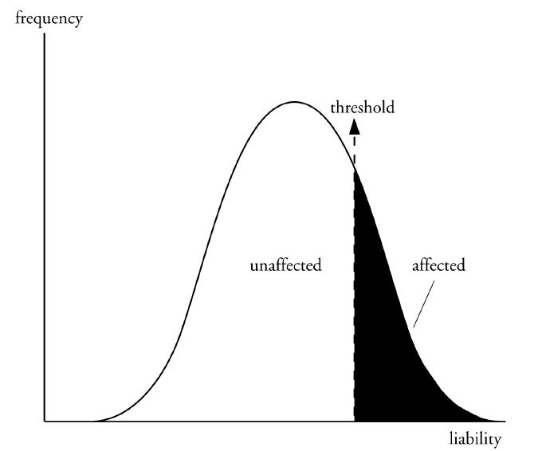
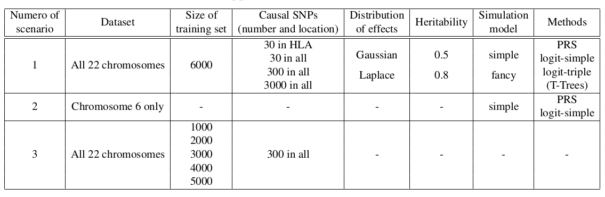

```{r setup, include=FALSE}
options(htmltools.dir.version = FALSE)
knitr::opts_chunk$set(fig.align = "center", dev = "svg",
                      fig.asp = 0.7, out.width = "80%", echo = FALSE)
```

class: center, middle, inverse

# Introduction

---

## Polygenic Risk Scores (PRS)

### Use them to identify high risk individuals

```{r, out.width="95%"}
knitr::include_graphics("figures/PRS.png")
```

---

## Predictive methods 

### Methods already developed by other people

<br>

- **GWAS + Clumping + Thresholding** (C+T)

- Linear Mixed Models (LMM)

- Statistical Learning such as 

    - Logistic Regression (LR)
    
    - Support Vector Machine (SVM)
    
    - Decision tree methods such as Random Forests (RF)

---

## Our two R packages: bigstatsr and bigsnpr

### Statistical tools with big matrices stored on disk

```{r, out.width="95%"}
knitr::include_graphics("figures/bigsnpr-submitted.png")
```

- {bigstatsr} for many types of matrix, to be used by any field of research

- {bigsnpr} for functions that are specific to the analysis of genetic data

<br>

Package {bigstatsr} provides a fast penalized logistic regression.

<!-- --- -->

<!-- ## Comparison of the methods -->

<!-- ###  -->

---

class: center, middle, inverse

# Methods

---

## Data

Use real data from a case-control study for the Celiac disease.

```{r, out.width="95%"}
knitr::include_graphics("figures/PC1-4.png")
```

Keep only **controls** from the **UK** and **not deviating from the robust Malahanobis distance**.

---

## Simulate new phenotypes

### The liability-threshold model

```{r, out.width="65%"}

```

---

### Two models of liability

#### A "simple" model

$$y_i = \underbrace{\sum_{j\in E_\text{causal}} w_j \cdot \widetilde{G_{i,j}}}_\text{genetic effect} + \underbrace{\epsilon_i}_\text{environmental noise}$$ 

#### A "fancy" model

$$y_i = \underbrace{\sum_{j\in E_\text{causal}^{(1)}} w_j \cdot \widetilde{G_{i,j}}}_\text{linear} + \underbrace{\sum_{j\in E_\text{causal}^{(2)}} w_j \cdot \widetilde{D_{i,j}}}_\text{dominant} + \underbrace{\sum_{\substack{k=1 \\ j_1=e_k^{(3.1)} \\ j_2=e_k^{(3.2)}}}^{k=\left|E_\text{causal}^{(3.1)}\right|} w_{j_1} \cdot \widetilde{G_{i,j_1} G_{i,j_2}}}_\text{interaction} + \epsilon_i$$ 

***

- $w_j$ are **weights** (generated with a Gaussian or a Laplace distribution)
- $G_{i,j}$ is the **allele count** of individual $i$ for SNP $j$
- $D_{i,j} = \mathbf{1}\left\{G_{i,j} \neq 0\right\}$

---

## Comprehensive simulations

### Varying many parameters

<br>

```{r, out.width="95%"}

```

---

## Methods compared

### The C+T method, from GWAS results

```{r, out.width="75%"}
knitr::include_graphics("figures/celiac-gwas-cut.png")
```

Pitfalls: weights learned independently and heuristics for correlation and regularization.

$$S_i(T, E_\text{clumping}) = \sum_{j \in E_\text{clumping}} \mathbf{1}\{p_j < T\} \cdot \beta_j \cdot G_{i,j}$$

---

## Methods compared

### T-Trees (*Trees inside Trees*) 

- an algorithm derived from random forests 

- takes into account the correlation structure among the genetic markers implied by linkage disequilibrium in GWAS data 

```{r, out.width="65%"}
knitr::include_graphics("http://journals.plos.org/plosone/article/figure/image?size=large&id=10.1371/journal.pone.0093379.t004")
```

---

## Methods compared

### Penalized Logistic Regression

<br>

$$\arg\!\min_{\beta_0, \beta}(x, y, \lambda, \alpha)\left\{\underbrace{\frac{1}{n}\sum_{i=1}^n \log\left(1+e^{-y_i (\beta_0+x_i^T\beta)}\right)}_\text{Loss function} + \underbrace{\lambda \left((1-\alpha)\frac{1}{2}\|\beta\|_2^2 + \alpha \|\beta\|_1\right)}_\text{Penalization}\right\}$$ 

<br>

***

- $x$ is denoting the genotypes and covariables (e.g. principal components), 

- $y$ is the disease status we want to predict, 

- $\lambda$ is a regularization parameter that needs to be determined and

- $\alpha$ determines relative parts of the regularization $0 \le \alpha \le 1$. 

<!-- --- -->

<!-- ### Different regularizations -->

<!-- Used to prevent overfitting, among other benefits:  -->

<!-- - **the L2-regularization ("ridge") shrinks coefficients** and is ideal if there are many predictors drawn from a Gaussian distribution (corresponds to $\alpha = 0$ in the previous equation); -->

<!-- - **the L1-regularization ("lasso")** forces some of the coefficients to be exactly zero/equal to zero and can be used **as a means of variable selection**, leading to sparse (and therefore more interpretable) models  (corresponds to $\alpha = 1$);  -->

<!-- - **the L1- and L2-regularization ("elastic-net")** is a compromise between the two previous penalties and is **particularly useful in the $m \gg n$** situation ($m$: number of SNPs), or any situation involving many correlated predictors (corresponds to $0 < \alpha < 1$).  -->

<!-- .footnote[In this study, we always use the elastic-net regularization with $\alpha = 0.5$, without trying to tune (e.g. by grid-search and cross-validation) the value of this hyper-parameter $\alpha$.] -->

---

### Efficient algorithm


- Strong rules for discarding predictors in lasso-type problems (Tibshirani et al., 2012)

- implemented in R package {biglasso} (Zeng et al., 2017)

- reimplemented in R package {bigstatsr} (Privé et al., 2017)

<mark>TODO: CMSA + early stop graph</mark>

<!-- To fit this penalized logistic regression, we use a very efficient algorithm \cite[]{friedman2010regularization,tibshirani2012strong,zeng2017efficient} from which we derived our own implementation in the R package bigstatsr \cite[]{prive2017efficient}.  -->
<!-- This type of algorithm builds predictions for many values of $\lambda$ (typically a "regularization path" of 100 values). To obtain an algorithm free of the choice of this hyper-parameter $\lambda$, we developed a procedure that we called Cross-Model Selection and Averaging (CMSA). First, this procedure separates the training set in $K$ folds (e.g.\ 10 folds).  -->
<!-- Secondly, in turn, each fold is considered as an inner validation set and the other ($K - 1$) folds form an inner training set, the model is trained on the inner training set and the corresponding predictions (scores) for the inner validation set are computed, the vector of scores which maximizes the likelihood on the inner validation set is determined and the vector of coefficients corresponding to the previous vector of scores is selected. Finally, the $K$ resulting vectors of coefficients are reported and can be combined into one vector (e.g.\ by using the geometric median) or resulting scores can be combined (e.g.\ by averaging the $K$ probabilities for each individual).  -->
<!-- We also use this procedure to derive an early stopping criterion so that the algorithm does not need to evaluate the whole regularization paths, making this procedure much faster. -->
<!-- Because of the L1-regularization, the resulting vectors of coefficients are typically very sparse and can be used to make a PRS based on a \textit{linear} combination of allele counts. We refer to this method as "logit-simple" in the results section. -->

---

### Extension via feature engineering

We construct a separate dataset with, for each SNP variable, two more variables coding for recessive and dominant effects.

<mark>TODO: new dataset graph</mark>

<!-- This results in a dataset with 3 times as many variables as the initial one, on which we can apply the penalized logistic regression with the CMSA procedure, as described previously. We call this method "logit-triple" in the results. -->

.footnote[We call these two methods "logit-simple" and "logit-triple".]

---

## Predictive performance measures

AUC (Area Under the ROC Curve) is used.

```{r, out.width="45%"}
knitr::include_graphics("https://i.stack.imgur.com/5x3Xj.png")
```

$$\text{AUC} = P(S_\text{case} > S_\text{control})$$

.footnote[As a second measure, the partial AUC for specificities between 90% and 100% is also reported.]

---

class: center, middle, inverse

# Results

---

### Results: two main methods

```{r, out.width="70%"}
knitr::include_graphics("../paper2-PRS/figures/main-AUC-logit.svg")
```

---

### Results: C+T method and threshold

```{r, out.width="70%"}
knitr::include_graphics("../paper2-PRS/figures/main-AUC-PRS.svg")
```

---

### Results: T-Trees, quickly discarded

```{r, out.width="95%"}
knitr::include_graphics("../paper2-PRS/figures/supp-ttrees.svg")
```

---

### Results: with feature engineering

```{r, out.width="95%"}
knitr::include_graphics("../paper2-PRS/figures/supp-triple.svg")
```

---

### Results: varying sample size (300 in all)

```{r, out.width="92%"}
knitr::include_graphics("../paper2-PRS/figures/main-AUC-ntrain.svg")
```

---

### Results: only chromosome 6

```{r, out.width="92%"}
knitr::include_graphics("../paper2-PRS/figures/supp-AUC-chr6.svg")
```

<!-- .footnote[Aims at increasing the polygenicity of the simulated models and at virtually increasing the sample size.] -->

---

### Results: real Celiac phenotypes

```{r, out.width="80%"}
knitr::include_graphics("figures/results-celiac.png")
```

```{r, out.width="50%"}
knitr::include_graphics("../paper2-PRS/figures/celiac-roc.svg")
```

---

class: center, middle, inverse

# Discussion

---

### Summary of our penalized regression as compared to the C+T method

- A more optimal approach for predicting complex diseases

- linear solution and really sparse 

- even faster

- no need to choose the regularization parameter

- can be extended to capture also recessive and dominant effects

<br>

### Prospects: future work

- use of summary statistics

- generalization on external population

- integration of clinical and environmental data

---

## Future work: UK Biobank

UK Biobank is an extremely large dataset with 

 - genetic data
 
 - clinical data
 
 - environmental data

<br>

## Prospects

- [Paper 3] training in one population to improve training and prediction in another population

- [Paper 4] assess how can we combine the information provided by genetic data with clinical and environmental data, possibly in a non-linear way

---

class: center, middle, inverse

# Thanks!

<br>

Presentation available at

https://privefl.github.io/thesis-docs/paper2.html

<br>

`r icon::fa("twitter")` [privefl](https://twitter.com/privefl) &nbsp;&nbsp;&nbsp;&nbsp; `r icon::fa("github")` [privefl](https://github.com/privefl) &nbsp;&nbsp;&nbsp;&nbsp; `r icon::fa("stack-overflow")` [F. Privé](https://stackoverflow.com/users/6103040/f-priv%c3%a9)

.footnote[Slides created via the R package [**xaringan**](https://github.com/yihui/xaringan).]
