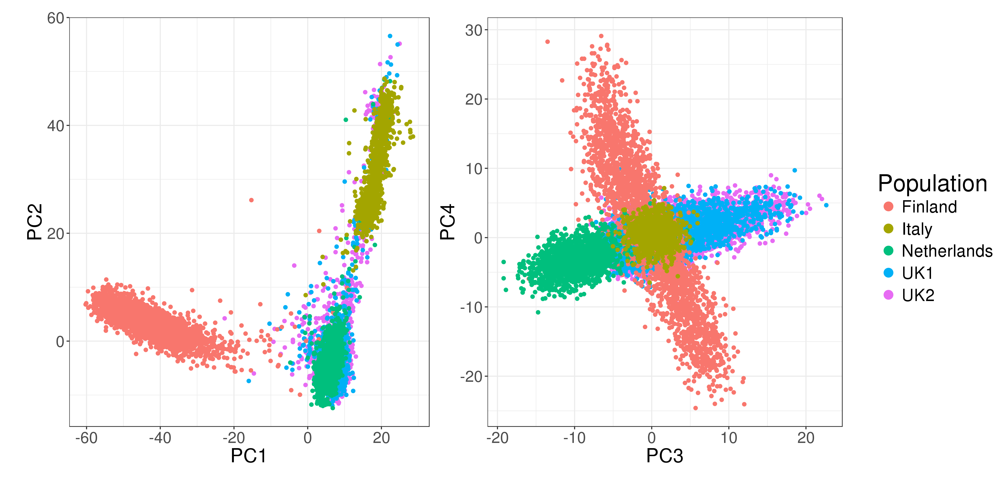

```{r setup, include=FALSE}
options(htmltools.dir.version = FALSE)
knitr::opts_chunk$set(fig.align = "center", dev = "svg",
                      fig.asp = 0.7, out.width = "80%", echo = FALSE)
```

class: center, middle, inverse

# Introduction

---

## Polygenic Risk Scores (PRS)

### Use them to identify high risk individuals

```{r, out.width="95%"}
knitr::include_graphics("figures/PRS.png")
```

---

## Predictive methods 

### Methods already developed by other people

<br>

- **GWAS + Clumping + Thresholding** (C+T)

- Linear Mixed Models (LMM)

- Statistical Learning such as 

    - Logistic Regression (LR)
    
    - Support Vector Machine (SVM)
    
    - Decision tree methods such as Random Forests (RF)

---

## Our two R packages: bigstatsr and bigsnpr

### Statistical tools with big matrices stored on disk

```{r, out.width="95%"}
knitr::include_graphics("figures/bigsnpr-submitted.png")
```

- {bigstatsr} for many types of matrix, to be used by any field of research

- {bigsnpr} for functions that are specific to the analysis of genetic data

<br>

Package {bigstatsr} provides a fast penalized logistic regression.

<!-- --- -->

<!-- ## Comparison of the methods -->

<!-- ###  -->

---

class: center, middle, inverse

# Methods

---

## Data

Use real data from a case-control study for the Celiac disease.

```{r, out.width="95%"}

```

Keep only **controls** from the **UK** and **not deviating from the robust Malahanobis distance**.

---

## Simulate new phenotypes

### The liability-threshold model

```{r, out.width="65%"}
knitr::include_graphics("figures/LTM.png")
```

---

### Two models of liability

#### A "simple" model

$$y_i = \underbrace{\sum_{j\in E_\text{causal}} w_j \cdot \widetilde{G_{i,j}}}_\text{genetic effect} + \underbrace{\epsilon_i}_\text{environmental noise}$$ 

- $w_j$ are **weights** (generated with a Gaussian or a Laplace distribution)
- $G_{i,j}$ is the **allele count** of individual $i$ for SNP $j$

#### A "fancy" model

$$y_i = \underbrace{\sum_{j\in E_\text{causal}^{(1)}} w_j \cdot \widetilde{G_{i,j}}}_\text{linear} + \underbrace{\sum_{j\in E_\text{causal}^{(2)}} w_j \cdot \widetilde{D_{i,j}}}_\text{dominant} + \underbrace{\sum_{\substack{k=1 \\ j_1=e_k^{(3.1)} \\ j_2=e_k^{(3.2)}}}^{k=\left|E_\text{causal}^{(3.1)}\right|} w_{j_1} \cdot \widetilde{G_{i,j_1} G_{i,j_2}}}_\text{interaction} + \epsilon_i$$ 

- $D_{i,j} = \mathbf{1}\left\{G_{i,j} \neq 0\right\}$

---

## Comprehensive simulations

### Varying many parameters

<br>

```{r, out.width="95%"}
knitr::include_graphics("figures/table-scenarios.png")
```

---

## Methods compared

### The C+T method, from GWAS results

```{r, out.width="80%"}
knitr::include_graphics("figures/celiac-gwas-cut.png")
```

- Weights learned independently

- Correlation is taken care of heuristically

- Regularization is taken care of heuristically

---

class: center, middle, inverse

# Results

---

class: center, middle, inverse

# Discussion

---

class: center, middle, inverse

# Future work

### UK Biobank

---

## UK Biobank

It is an extremely large dataset with 

 - genetic data
 
 - clinical data
 
 - environmental data

## Prospects

- [Paper 3] training in one population to improve training and prediction in another population

- [Paper 4] assess how can we combine the information provided by genetic data with clinical and environmental data, possibly in a non-linear way

---

class: center, middle, inverse

# Thanks!

<br>

Presentation available at

https://privefl.github.io/thesis-docs/JDD.html

<br>

`r icon::fa("twitter")` [privefl](https://twitter.com/privefl) &nbsp;&nbsp;&nbsp;&nbsp; `r icon::fa("github")` [privefl](https://github.com/privefl) &nbsp;&nbsp;&nbsp;&nbsp; `r icon::fa("stack-overflow")` [F. Privé](https://stackoverflow.com/users/6103040/f-priv%c3%a9)

.footnote[Slides created via the R package [**xaringan**](https://github.com/yihui/xaringan).]
