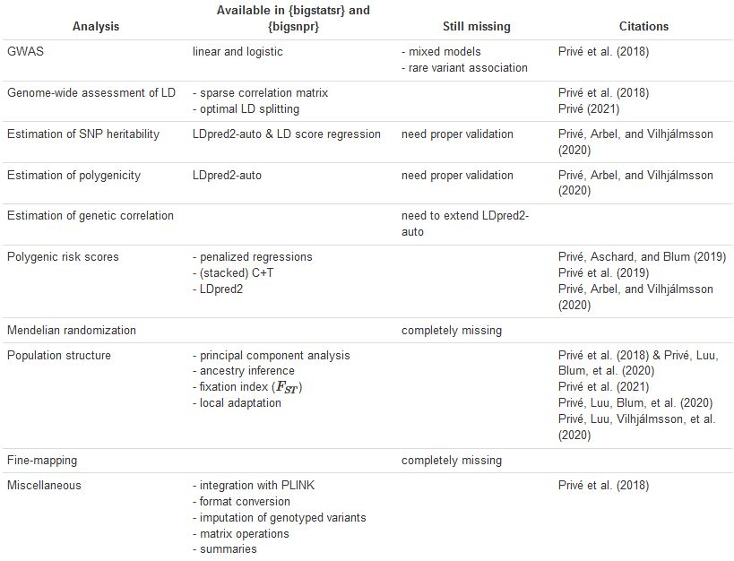
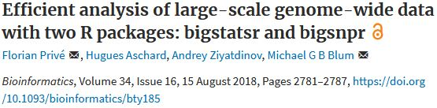
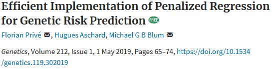
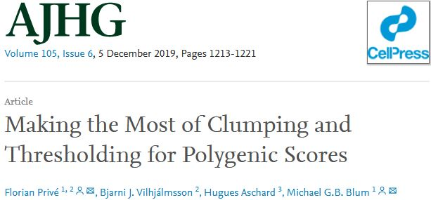
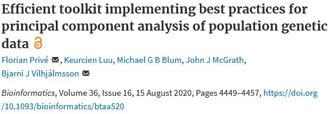
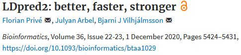
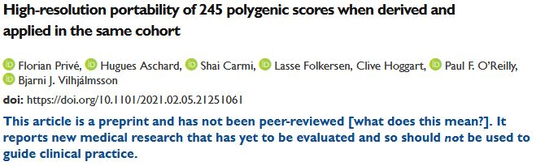
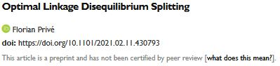

```{r setup, include=FALSE}
options(htmltools.dir.version = FALSE, width = 70)
knitr::opts_chunk$set(fig.align = 'center', dev = "svg", out.width = "70%",
                      echo = FALSE, comment = "", fig.width = 5, global.par = TRUE)
```

class: title-slide center middle inverse

<br>

# Summary of my work so far

<br>

## Florian Privé

---

```{r, out.width="100%"}

```

---

<br>

```{r, out.width="80%"}

```

<br>

Two R packages with

- on-disk matrix format to handle very large datasets

- conversion and integration with PLINK

- very fast PCA and GWAS implementations

- other algos

---

<br>

```{r, out.width="80%"}

```

<br>

- efficient implementation of penalized linear/logistic regression for deriving polygenic scores based on individual-level data (e.g. the UK Biobank)

- show very good prediction for e.g. celiac disease and height

---

```{r, out.width="60%"}

```

<br>

- an efficient implementation to test many parameters for Clumping and Thresholding (C+T), e.g. 

    - size of the window for clumping
    - $r^2$ threshold for clumping
    - p-value threshold
    - split on other parameters such as imputation INFO score or MAF
    
- instead of choosing one model (the best), can also stack (learn a linear combination of all models) using the penalized regression implemented before

- show higher predictive performance than when tuning only the p-value threshold (and using default parameters for clumping)

---

<br>

```{r, out.width="80%"}

```

<br>

- allow for directly using PLINK bed files with a few missing values

- further improved the auto algorithm for PCA (auto = e.g. removing long-range LD regions)

- show how to detect outlier individuals, or how to restrict to some homogeneous samples

- fast and unbiased projection of new individuals into some PCA space

- also talk about potential other issues in PCA (relatedness, sample size imbalance)

---

<br>

```{r, out.width="80%"}

```

<br>

- new implementation of LDpred, now in {bigsnpr}

- more robust (e.g. to long-range LD regions such as HLA) and to large GWAS sample sizes $\Rightarrow$ better polygenic scores

- also add an *auto* version, which directly learns the two parameters of LDpred, the SNP heritability $h^2$ and the proportion of causal variants $p$ (therefore not needing any validation/tuning sample)

---

<br>

```{r, out.width="80%"}

```

<br>

- show how to define many ancestry groups using tools from paper on PCA

- derive polygenic scores (using both penalized regression and LDpred2-auto) for 245 phenotypes in the UK Biobank

- test them in 9 ancestry groups

- show bad predictive performance for other ancestries (especially Africa)

---

<br>

```{r, out.width="70%"}

```

<br>

How to split the genome in independent LD blocks?

- instead of relying on heuristics, derive an optimal algorithm using dynamic programming

---

## Current and future work

<br>

- show and use regularized LD matrix to get even more robust polygenic scores from LDpred2

- proper validation of the estimation of parameters from LDpred2-auto (the LDpred2 paper focused only on prediction, not inference)

- other stuff
