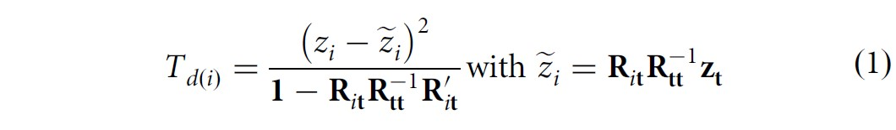

```{r setup, include=FALSE}
# renderthis::to_pdf("ldpred2-wcpg2023.Rmd", partial_slides = TRUE)
options(htmltools.dir.version = FALSE, width = 70)
knitr::opts_chunk$set(fig.align = 'center', dev = "svg", out.width = "70%",
                      echo = FALSE, comment = "", fig.width = 5, global.par = TRUE)
ICON_R_PROJECT <- icons::fontawesome$brands$`r-project`
ICON_TRI_EXCL  <- icons::fontawesome$solid$`exclamation-triangle`
ICON_INFO      <- icons::fontawesome$solid$`info-circle`
```

class: title-slide center middle inverse

<br>

# Quality Control and Imputation<br>of GWAS Summary Statistics

<br>

## Florian Privé 

### Aarhus University, Denmark

#### <svg xmlns="http://www.w3.org/2000/svg" viewBox="0 0 576 512" width="1em" height="1em"><path d="M407.8 294.7c-3.3-.4-6.7-.8-10-1.3c3.4 .4 6.7 .9 10 1.3zM288 227.1C261.9 176.4 190.9 81.9 124.9 35.3C61.6-9.4 37.5-1.7 21.6 5.5C3.3 13.8 0 41.9 0 58.4S9.1 194 15 213.9c19.5 65.7 89.1 87.9 153.2 80.7c3.3-.5 6.6-.9 10-1.4c-3.3 .5-6.6 1-10 1.4C74.3 308.6-9.1 342.8 100.3 464.5C220.6 589.1 265.1 437.8 288 361.1c22.9 76.7 49.2 222.5 185.6 103.4c102.4-103.4 28.1-156-65.8-169.9c-3.3-.4-6.7-.8-10-1.3c3.4 .4 6.7 .9 10 1.3c64.1 7.1 133.6-15.1 153.2-80.7C566.9 194 576 75 576 58.4s-3.3-44.7-21.6-52.9c-15.8-7.1-40-14.9-103.2 29.8C385.1 81.9 314.1 176.4 288 227.1z" fill="#0886FE"/></svg> `r icons::icon_style(fill = "white", icons::fontawesome$brands$github)` privefl

---

### GWAS summary statistics

<br>

- $\hat{\gamma}_j$ &mdash; the GWAS effect size of variant $j$ (marginal effect), 

- $\text{se}(\hat{\gamma}_j)$ &mdash; its standard error,

- $z_j = \frac{\hat{\gamma}_j}{\text{se}(\hat{\gamma}_j)}$ &mdash; the Z-score of variant $j$,

- $n_j$ &mdash; the GWAS sample size associated with variant $j$, 

- $f_j$ &mdash; the allele frequency of variant $j$,

- $\text{INFO}_j$ &mdash; the imputation INFO score of variant $j$

---

### The first quality control I already recommend (e.g. for LDpred2)

**Compare standard deviations** of genotypes estimated in 2 ways:

<br>

1.  - When linear regression was used 
    \begin{equation}
    \text{sd}(G_j) \approx \dfrac{\text{sd}(y)}{\sqrt{n_j \cdot \text{se}(\hat{\gamma}_j)^2 + \hat{\gamma}_j^2}}
    \end{equation}

    - When logistic regression was used (case-control phenotype)
    \begin{equation}\label{eq:approx-sd-log}
    \text{sd}(G_j) \approx \dfrac{2}{\sqrt{n_j^\text{eff} \cdot \text{se}(\hat{\gamma}_j)^2 + \hat{\gamma}_j^2}}
    \end{equation}
<br>
2. \begin{equation}\text{sd}(G_j) \approx \sqrt{2 \cdot f_j \cdot (1 - f_j) \cdot \text{INFO}_j}\end{equation}

---

### Detect differences in per-variant GWAS sample sizes

```{r, out.width="72%"}
knitr::include_graphics("figures/simu-qc-plot.jpg")
```

---

```{css}
.pull_left {
  float: left;
  width: 65%;
}
.pull_right {
  float: right;
  width: 28%;
}
```

### Detect bias in total effective GWAS sample size

.pull_left[
```{r, out.width="100%"}
knitr::include_graphics("figures/cad_quick_qc.png")
```

<span class="footnote"> $N_\text{eff} = \frac{4}{1 / N_\text{ca} + 1 / N_\text{co}}$ </span>
]

.pull_right[
```{r, out.width="70%"}
knitr::include_graphics("figures/cad_neff_perstudy.png")
```
]

---

### Detect low imputation INFO scores & other issues

<br>

```{r, out.width="100%"}
knitr::include_graphics("figures/brca_onco_qc.png")
```

---

### Multi-ancestry INFO scores are overestimated (e.g. in the UK Biobank)

<br>

```{r, out.width="65%"}
knitr::include_graphics("figures/overestim-info.png")
```

---

### Overview of possible errors and misspecifications in GWAS sumstats<br>with possible harmful consequences, as well as possible remedies

<br>

```{r out.width="100%"}
knitr::include_graphics("figures/overview-misspec.jpg")
```

.footnote[F. Privé et al (2022). Identifying and correcting for misspecifications in GWAS summary statistics and polygenic scores. *Human Genetics and Genomics Advances*.]

---

### Read more about this

- Privé, F., et al. (2022) "Identifying and correcting for misspecifications in GWAS summary statistics and polygenic scores." *Human Genetics and Genomics Advances* 3.4. 

- Gazal, S., et al. (2018) "Functional architecture of low-frequency variants highlights strength of negative selection across coding and non-coding annotations." *Nature Genetics* 50.11.

- Grotzinger, A.D., et al. (2023) "Pervasive downward bias in estimates of liability-scale heritability in genome-wide association study meta-analysis: a simple solution." *Biological Psychiatry* 93.1.

- Zou, Y., et al. (2022) "Fine-mapping from summary data with the “Sum of Single Effects” model." *PLoS Genetics* 18.7.

- Chen, W., et al. (2021) "Improved analyses of GWAS summary statistics by reducing data heterogeneity and errors." *Nature Communications* 12.1.

- Privé, F. (2022) "Using the UK Biobank as a global reference of worldwide populations: application to measuring ancestry diversity from GWAS summary statistics." *Bioinformatics* 38.13.

---

class: center middle inverse

<br>

# Ongoing project

<br>

## Disclaimer:

### Started 1.5y ago, but paused for a while

### Will resume after the ancestry deconvolution is submitted

---

### Synergy between quality control (QC) and imputation

<br>

- imputation is used for QC
    
- QC is needed before imputation so that errors don't propagate

- imputation can recover QCed variants

<br>

#### What I propose to do

```{r, out.width="100%"}
knitr::include_graphics("figures/Imputation-QC-method-v2.png")
```

---

### Additional (complementary) QC &#8212; DENTIST methodology

<br>

GCTA method which compares reported Z-scores with imputed Z-scores.

<br>

$\chi^2(1)$ test statistic:
```{r, out.width="90%"}

```

where $i$ is the variant of interest, and $t$ the variants used for imputing.

<br>

It is particularly good at detecting allelic errors (opposite effect).

.footnote[DENTIST citation: Chen, W., et al. (2021) "Improved analyses of GWAS summary statistics by reducing data heterogeneity and errors." *Nature Communications* 12.1.]

---

### Quick simulation to check DENTIST

<br>

Design:

- Use 145K variants on chromosome 22 with MAF > 0.005 and INFO > 0.8

- Simulate some phenotype with heritability of 0.1 and polygenicity of 0.01

- Compute the GWAS summary statistics using N=50K    
(Z-scores in [-20; 20], mostly in [-10; 10])

- For 1000 variants at random, assign them an opposite effect (allelic error)

--

<br>

Results:

- 802 true positives (>80% power), but 3209 false positives

    $\Rightarrow$ improve the DENTIST methodology,    
to get less false positives (and ideally more power)    
    (as an `r ICON_R_PROJECT` implementation)

---

### Details about DENTIST

- Use a sliding window (2 Mb with 500 Kb overlap)

- Separate each window into two groups that are used to impute each other

- Invert $R_{tt}$ using 40% of eigenvectors

- Do not use variants $t$ with $R_{it}^2 > 0.95$ to improve computational stability

- Do 10 iterations to remove variants (max top 0.5% for first 9 iterations)    
so that errors don't propagate

--

#### Possible issues (power and false positives)

- Loss of power by using only half of variants in each window

- Loss of power by not using highly correlated variants

- Eigenvectors can capture components that are not useful for imputation    
(e.g. LD blocks in weak LD with the variant we want to impute)

- Iterative removal and updating might not subtle enough

- Test statistic becomes larger with larger Z-scores

---

### My proposed approach (1/2)

<br>

For a particular variant $i$ to test, 

- consider variants $t$ by decreasing order of $R_{it}^2$, up to $R_{it}^2 > 0.2$

    $\Rightarrow$ we need all $R_{jt}$ such that $R_{it}^2 > 0.2$ and $R_{ij}^2 > 0.2$    
    (not too large: 700 MB for 145K variants of chr22)
    
--

- pick them if their LD score with the variants already picked is <30

    $\Rightarrow$ the set of variants $t$ to impute has maximum power,    
    without being too large nor too redundant

--

- do not consider variants with a potential error

    $\Rightarrow$ do not propagate errors, and faster (less updates when removed)

---

### My proposed approach (2/2)

For the iterations,

- Only remove one variant per iteration

- Update the statistics for those that used this variant for imputation

- Iterate until no variant is significant anymore

--

<br>

Other details:

- Constrain the denominator to be at least 0.01

- Solve the linear system $R_{tt}^{-1} R_{ti}$ (with a bit of regularization)

- Scale the Z-statistic by the maximum Z-score divided by 4

- Compute $n_j^\text{imp} = N \cdot r^2_j$

- Compute $\text{se}(\hat{\gamma}_j)^\text{imp}$ from $\text{sd}(G_j)$, $n_j^\text{imp}$ and $\gamma_j^\text{imp}$

---

### More simulation results

- Use 145K variants on chromosome 22 with MAF > 0.005 and INFO > 0.8
- Simulate some phenotype with h2=0.01 or 0.1 and polygenicity of 0.01
- Compute the GWAS summary statistics using 356K or 200K individuals
- For 500 variants at random, assign them an opposite effect (allelic error)

--

```{r, out.width="92%"}

```

---

### Real data analysis

<br>

Using type-1 diabetes (T1D) GWAS summary statistics with

- $N_\text{eff}$ = 13.5K

- using 16K variants with very large effects

- from a long-range LD region (HLA on chromosome 6)

- genotypes imputed using the 1000G data (mediocre imputation)

<br>

$\Rightarrow$ 12,310 "errors" detected with DENTIST

---

### Impossible imputation

```{r, out.width="95%"}
knitr::include_graphics("figures/impossible-imputation4.jpg")
```

---

### First issue: the assumption of the imputation model

<br>

- the model is assuming $Z \sim N(0, R)$, 

- whereas it should be instead $Z \sim N(R \beta, R)$,    
where $\beta$ are the (scaled) causal effects

- but we do not know the causal effects, and they are assumed to be small

<br>

I tried to estimate causal effects with both SuSiE and LDpred2-auto.

---

### Another impossible imputation

```{r, out.width="95%"}

```

---

### Second issue: duplicates with different estimates

<br>

```{r, out.width="90%"}

```

<br>

Idea: could somehow try to pick the best?

---

### Take-home messages

<br>

- There can be many issues in GWAS summary statistics

--

- You can detect many of them by comparing SDs estimated in two ways

--

- You can detect other (complementary) issues with DENTIST

--

- DENTIST is currently prone to false positives; it needs to be improved

--

- I hope to provide QCed GWAS summary statistics for everyone to use

--

<br>

.center[
### Thank you for your attention

Presentation available at [bit.ly/privefl230525](https://bit.ly/privefl230525)

<svg xmlns="http://www.w3.org/2000/svg" viewBox="0 0 576 512" width="1em" height="1em"><path d="M407.8 294.7c-3.3-.4-6.7-.8-10-1.3c3.4 .4 6.7 .9 10 1.3zM288 227.1C261.9 176.4 190.9 81.9 124.9 35.3C61.6-9.4 37.5-1.7 21.6 5.5C3.3 13.8 0 41.9 0 58.4S9.1 194 15 213.9c19.5 65.7 89.1 87.9 153.2 80.7c3.3-.5 6.6-.9 10-1.4c-3.3 .5-6.6 1-10 1.4C74.3 308.6-9.1 342.8 100.3 464.5C220.6 589.1 265.1 437.8 288 361.1c22.9 76.7 49.2 222.5 185.6 103.4c102.4-103.4 28.1-156-65.8-169.9c-3.3-.4-6.7-.8-10-1.3c3.4 .4 6.7 .9 10 1.3c64.1 7.1 133.6-15.1 153.2-80.7C566.9 194 576 75 576 58.4s-3.3-44.7-21.6-52.9c-15.8-7.1-40-14.9-103.2 29.8C385.1 81.9 314.1 176.4 288 227.1z" fill="#0886FE"/></svg> `r icons::icon_style(fill = "black", icons::fontawesome$brands$github)` privefl
]
