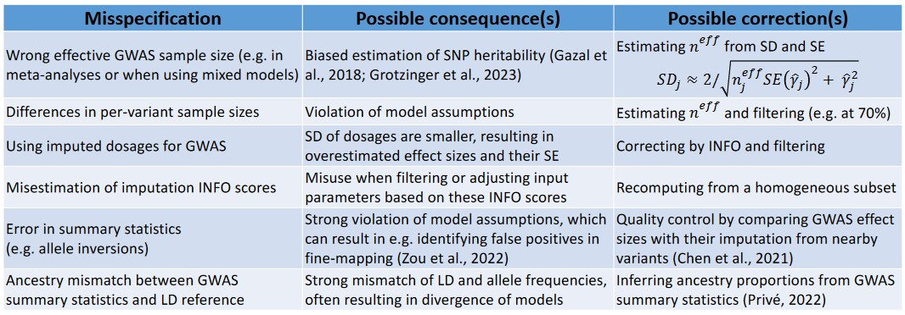
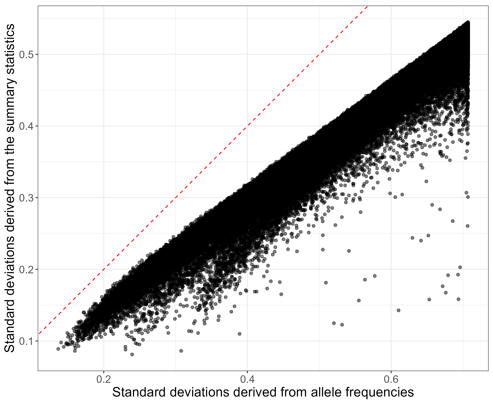
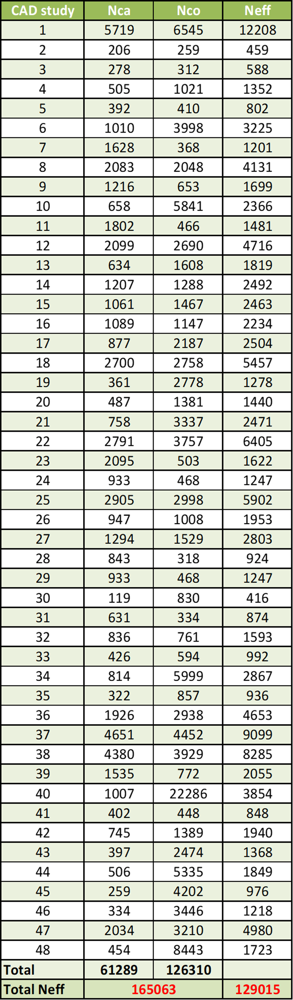
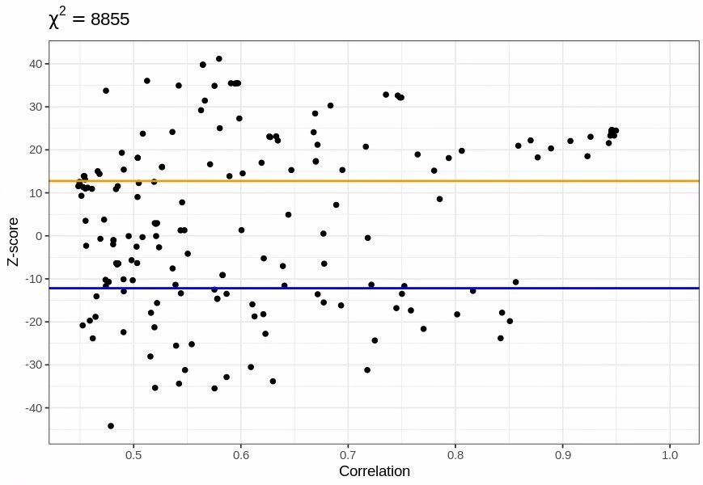

```{r setup, include=FALSE}
# renderthis::to_pdf("ldpred2-wcpg2023.Rmd", partial_slides = TRUE)
options(htmltools.dir.version = FALSE, width = 70)
knitr::opts_chunk$set(fig.align = 'center', dev = "svg", out.width = "70%",
                      echo = FALSE, comment = "", fig.width = 5, global.par = TRUE)
ICON_R_PROJECT <- icons::fontawesome$brands$`r-project`
ICON_TRI_EXCL  <- icons::fontawesome$solid$`exclamation-triangle`
ICON_INFO      <- icons::fontawesome$solid$`info-circle`
```

class: title-slide center middle inverse

<br>

# Quality Control of GWAS Summary Statistics

<br>

<br>

## Florian Privé 
### Aarhus Univ, Denmark
### `r icons::icon_style(fill = "white", icons::fontawesome$brands$twitter)` `r icons::icon_style(fill = "white", icons::fontawesome$brands$github)` privefl

---

### Overview of possible misspecifications<br>when using GWAS summary statistics

<br>

```{r, out.width="100%"}

```

---

### Some quality control I already recommend

.footnote[Check this paper: https://doi.org/10.1016/j.xhgg.2022.100136]

**Compare standard deviations** of genotypes estimated in 2 ways:
 
\begin{equation}
\text{sd}(G_j) \approx \dfrac{\text{sd}(y)}{\sqrt{n_j ~ \text{se}(\hat{\gamma}_j)^2 + \hat{\gamma}_j^2}} ~,
\end{equation}
where $\hat{\gamma}_j$ is the marginal GWAS effect size of variant $j$, $n_j$ is the GWAS sample size associated with variant $j$, $y$ is the vector of phenotypes.

For a binary trait for which logistic regression is used, we have instead
\begin{equation}\label{eq:approx-sd-log}
\text{sd}(G_j) \approx \dfrac{2}{\sqrt{n_j^\text{eff} ~ \text{se}(\hat{\gamma}_j)^2 + \hat{\gamma}_j^2}} ~.
\end{equation}

Compared to $\sqrt{2 \cdot f_j \cdot (1 - f_j) \cdot \text{INFO}_j}$, where $f_j$ is the allele frequency of variant $j$ and $\text{INFO}_j$ is used to correct for the reduced variance of imputed dosages.

---

### Detect smaller N / INFO

```{r, out.width="72%"}
knitr::include_graphics("figures/simu-qc-plot.jpg")
```

---

```{css}
.pull_left {
  float: left;
  width: 65%;
}
.pull_right {
  float: right;
  width: 28%;
}
```

### Detect smaller effective N from meta-analysis 

.pull_left[
```{r, out.width="100%"}

```

<span class="footnote"> $N_\text{eff} = \frac{4}{1 / N_\text{ca} + 1 / N_\text{co}}$ </span>
]

.pull_right[
```{r, out.width="70%"}

```
]

---

### Detect other issues

<br>

```{r, out.width="100%"}
knitr::include_graphics("figures/brca_onco_qc.png")
```

---

### Multi-ancestry INFO scores are overestimated (e.g. in the UK Biobank)

```{r, out.width="70%"}
knitr::include_graphics("figures/overestim-info.png")
```

---

### Overview of possible misspecifications<br>when using GWAS summary statistics

<br>

```{r, out.width="100%"}

```


---

### Additional (complementary) QC &#8212; DENTIST methodology

GCTA method for the quality control of GWAS summary statistics

<br>

$\chi^2$ test statistic:
```{r, out.width="90%"}
knitr::include_graphics("figures/eq-dentist.jpg")
```
where $i$ is the variant of interest, and $t$ the variants used for imputing

--

<br>

- Use a sliding window approach to divide the variants into 2 Mb segments with a 500 kb overlap between two adjacent segments

- Separate each window into two groups that are used to impute each other

- Invert $R_{tt}$ using 40% of eigenvectors

- Do not use variants $t$ with $R_{it}^2 > 0.95$ to improve computational stability (robustness)

- Do 10 iterations to remove variants (max top 0.5% for first 9 iter)

---

### Possible issues

<br>

- Loss of power by using only half of variants in each window

- Loss of power by not using highly correlated variants

- Eigenvectors can capture components that are not very useful for imputation (e.g. LD blocks in weak LD with the variant we want to impute)

---

### My first approach (1/2)

<br>

For a particular variant $i$ to assess, 

- consider variants $t$ by decreasing order of $R_{it}^2$, up to $R_{it}^2 > 0.2$    
    $\Longrightarrow$ we can pre-compute some sparse matrix $R$ that is not too large    
    (all $R_{jt}$ such that $\exists i : R_{it}^2 > 0.2 ~\&~ R_{ij}^2 > 0.2$)    
    (e.g. 700 MB for 145K variants of chr22)    

--

- pick them if their LD score with the variants already picked is lower than e.g. 30    
    $\Longrightarrow$ the set of variants $t$ to impute has maximum power, without being too large nor too redundant

--

- do not consider variants with a potential error    
    $\Longrightarrow$ do not propagate errors and faster (less updates when removed)

---

### My first approach (2/2)

<br>

- Constrain the denominator to be at least 0.01

- Compute the statistics for a range of eigenvectors kept (instead of only 40%)

- Use the median (or lower quantile, to be a bit conservative)

--

<br>

For the iterations

- Only remove one variant per iteration

- Update the statistics for those that used this variant for imputation

- Iterate until no significant variant

---

### Quick simulation results

Design:

- Use 145K variants on chromosome 22 with MAF > 0.005 and INFO > 0.8

- Simulate some phenotype with heritability of 0.1 and polygenicity of 0.05

- Compute the GWAS summary statistics using N=50K

- For 5000 variants at random, assign them an opposite effect (allelic error)

--

<br>

Results:

- 3379 iterations in 32 min (with pre-computed $R$),    
with 3349 true positives (TP, real errors) and 19 false positives (FP)    
when using the median of statistics

- 3254 TP and 9 FP with quantile at 25%

- 3663 TP and 4651 FP in 24 min with DENTIST

---

### Real data analysis

<br>

Using type-1 diabetes (T1D) GWAS summary statistics from Neff=13.5K,   
using 16K variants from a long-range LD region with very large effects

--

<br>

- 4529 "errors" detected with q25% (4871 iter in 24 min) 

- 12,310 "errors" detected with DENTIST (under 20 sec)

---

### Impossible imputation

```{r, out.width="100%"}

```

---

### Difficult imputation

```{r, out.width="100%"}
knitr::include_graphics("figures/difficult-imputation2.jpg")
```

---

### Alternative solvers and equations

<br>

```{r, out.width="90%"}
knitr::include_graphics("figures/eq-dentist.jpg")
```

<br>

Instead of doing an eigendecomposition of $R_{tt}$, we can

- solve the linear system $R_{tt}^{-1} R_{ti}$ (with a bit of regularization)

- or use $1 - R_{it} R_{tt}^{-1} R_{ti} = \bigl(R_{ss}^{-1}\bigr)_{1,1}^{-1}$ and $R_{it} R_{tt}^{-1} = -\bigl(R_{ss}^{-1}\bigr)_{1,1}^{-1} \bigl(R_{ss}^{-1}\bigr)_{1,\text{-}1}$    
where $s = \{i, t\}$

---

### My second approach

<br>

- Use the previous last equation to impute all variants $s = \{i, t\}$ and find the regularization that minimizes $|z_t - \tilde{z}_t|$.

- Use that regularization to impute all variants $s$

- Scale the resulting $\chi_i^2$ using the expected median and the median of $\chi_s^2$ (from all variants $\{i, t\}$)

--

<br>

Results:

- 217 "errors" detected

- for the previous simulations, 2804 TP and 25 FP

---

### Take-home messages

<br>

- GWAS summary statistics can be messy

- This can affect results of sumstats-based methods tremendously

- Quality control of sumstats can be tricky

---

### Current project

<br>

- An `r ICON_R_PROJECT` reimplementation of DENTIST

- Improve the methodology (more power and less false positive)


--

<br>

### What's next

<br>

- Provide some very well quality-controlled GWAS summary statistics

- In a standardized format

- Probably as a GitHub repo of R scripts that can each process a specific GWAS summary statistics file

---

### References

- Privé, F., et al. (2022) "Identifying and correcting for misspecifications in GWAS summary statistics and polygenic scores." *Human Genetics and Genomics Advances* 3.4. 

- Gazal, S., et al. (2018) "Functional architecture of low-frequency variants highlights strength of negative selection across coding and non-coding annotations." *Nature Genetics* 50.11.

- Grotzinger, A.D., et al. (2023) "Pervasive downward bias in estimates of liability-scale heritability in genome-wide association study meta-analysis: a simple solution." *Biological Psychiatry* 93.1.

- Zou, Y., et al. (2022) "Fine-mapping from summary data with the “Sum of Single Effects” model." *PLoS Genetics* 18.7.

- Chen, W., et al. (2021) "Improved analyses of GWAS summary statistics by reducing data heterogeneity and errors." *Nature Communications* 12.1.

- Privé, F. (2022) "Using the UK Biobank as a global reference of worldwide populations: application to measuring ancestry diversity from GWAS summary statistics." *Bioinformatics* 38.13.

---

class: inverse, center, middle

# Thanks!

<br>

Presentation available at [bit.ly/qc_sumstats_UTHSC](https://bit.ly/qc_sumstats_UTHSC)

<br>

`r icons::icon_style(fill = "white", icons::fontawesome$brands$twitter)` `r icons::icon_style(fill = "white", icons::fontawesome$brands$github)` privefl

.footnote[Slides created via the R package [**xaringan**](https://github.com/yihui/xaringan)]
