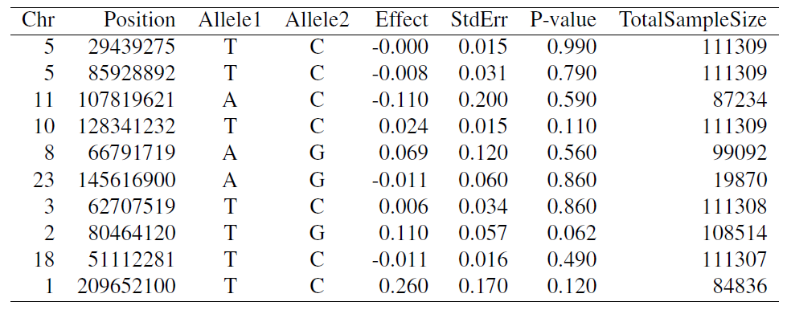
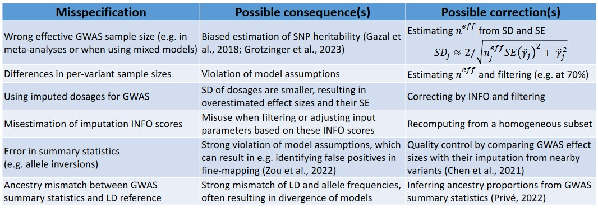
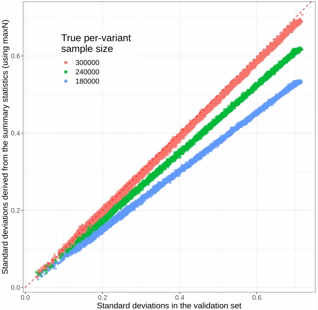
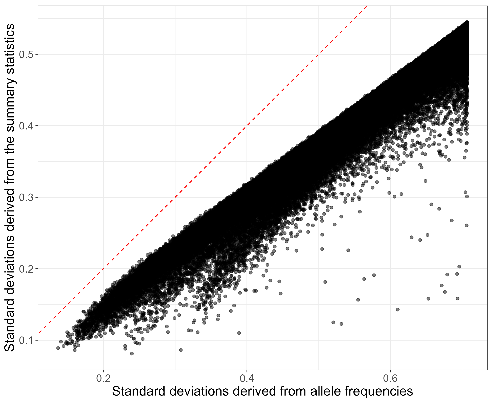
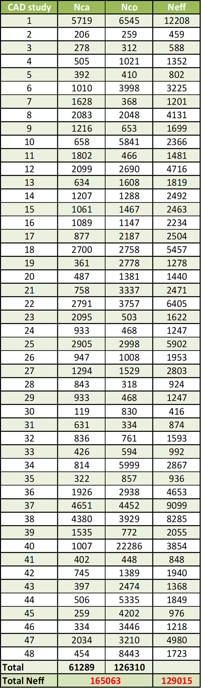
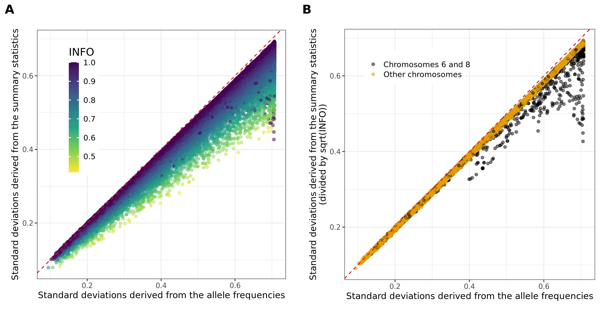
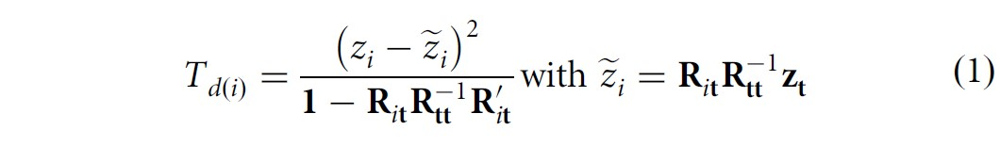

```{r setup, include=FALSE}
# renderthis::to_pdf("ldpred2-wcpg2023.Rmd", partial_slides = TRUE)
options(htmltools.dir.version = FALSE, width = 70)
knitr::opts_chunk$set(fig.align = 'center', dev = "svg", out.width = "70%",
                      echo = FALSE, comment = "", fig.width = 5, global.par = TRUE)
ICON_R_PROJECT <- icons::fontawesome$brands$`r-project`
ICON_TRI_EXCL  <- icons::fontawesome$solid$`exclamation-triangle`
ICON_INFO      <- icons::fontawesome$solid$`info-circle`
```

class: title-slide center middle inverse

<br>

# Quality Control of GWAS Summary Statistics

<br>

<br>

## Florian Privé 
### NCRR, Aarhus Univ
#### `r icons::icon_style(fill = "white", icons::fontawesome$brands$twitter)` `r icons::icon_style(fill = "white", icons::fontawesome$brands$github)` privefl

---

### Example of GWAS summary statistics

<br>

```{r, out.width="100%"}

```

--

<br>

Other information can be available:

- (minor) allele frequencies

- imputation INFO scores

---

### Overview of possible misspecifications<br>when using GWAS summary statistics

<br>

```{r, out.width="100%"}

```

.footnote[More details in<br>Privé, F., et al. (2022) ["Identifying and correcting for misspecifications in GWAS summary statistics and polygenic scores."](https://doi.org/10.1016/j.xhgg.2022.100136) *Human Genetics and Genomics Advances* 3.4.]

---

### Some quality control I recommend

**Compare standard deviations** of genotypes estimated in 2 ways:
 
\begin{equation}
\text{sd}(G_j) \approx \dfrac{\text{sd}(y)}{\sqrt{n_j ~ \text{se}(\hat{\gamma}_j)^2 + \hat{\gamma}_j^2}} ~,
\end{equation}
where $\hat{\gamma}_j$ is the marginal GWAS effect size of variant $j$, $n_j$ is the GWAS sample size associated with variant $j$, $y$ is the vector of phenotypes.

For a binary trait for which logistic regression is used, we have instead
\begin{equation}\label{eq:approx-sd-log}
\text{sd}(G_j) \approx \dfrac{2}{\sqrt{n_j^\text{eff} ~ \text{se}(\hat{\gamma}_j)^2 + \hat{\gamma}_j^2}} ~.
\end{equation}

***

Compared to $\sqrt{2 \cdot f_j \cdot (1 - f_j) \cdot \text{INFO}_j}$, where $f_j$ is the allele frequency of variant $j$ and $\text{INFO}_j$ is used to correct for the reduced variance of imputed dosages.

---

### Detect smaller N / INFO

```{r, out.width="72%"}

```

---

```{css}
.pull_left {
  float: left;
  width: 65%;
}
.pull_right {
  float: right;
  width: 28%;
}
```

### Detect smaller effective N from meta-analysis 

.pull_left[
```{r, out.width="100%"}

```

<span class="footnote"> $N_\text{eff} = \frac{4}{1 / N_\text{ca} + 1 / N_\text{co}}$ </span>
]

.pull_right[
```{r, out.width="70%"}

```
]

---

### Detect other issues

<br>

```{r, out.width="100%"}

```

---

### Multi-ancestry INFO scores are overestimated (e.g. in the UK Biobank)

<br>

```{r, out.width="65%"}
knitr::include_graphics("figures/overestim-info.png")
```

---

### Overview of possible misspecifications<br>when using GWAS summary statistics

<br>

```{r, out.width="100%"}

```

.footnote[More details in<br>Privé, F., et al. (2022) ["Identifying and correcting for misspecifications in GWAS summary statistics and polygenic scores."](https://doi.org/10.1016/j.xhgg.2022.100136) *Human Genetics and Genomics Advances* 3.4.]

---

### References

- Privé, F., et al. (2022) "Identifying and correcting for misspecifications in GWAS summary statistics and polygenic scores." *Human Genetics and Genomics Advances* 3.4. 

- Gazal, S., et al. (2018) "Functional architecture of low-frequency variants highlights strength of negative selection across coding and non-coding annotations." *Nature Genetics* 50.11.

- Grotzinger, A.D., et al. (2023) "Pervasive downward bias in estimates of liability-scale heritability in genome-wide association study meta-analysis: a simple solution." *Biological Psychiatry* 93.1.

- Zou, Y., et al. (2022) "Fine-mapping from summary data with the “Sum of Single Effects” model." *PLoS Genetics* 18.7.

- Chen, W., et al. (2021) "Improved analyses of GWAS summary statistics by reducing data heterogeneity and errors." *Nature Communications* 12.1.

- Privé, F. (2022) "Using the UK Biobank as a global reference of worldwide populations: application to measuring ancestry diversity from GWAS summary statistics." *Bioinformatics* 38.13.

---

### Additional (complementary) QC &#8212; DENTIST methodology

<br>

GCTA method for the quality control of GWAS summary statistics,    
by comparing Z-scores with imputed Z-scores using nearby variants.

--

<br>

$\chi^2$ test statistic:
```{r, out.width="90%"}

```
where $i$ is the variant of interest, and $t$ the variants used for imputing.

<br>

This method assumes $Z \sim N(0, R)$.

---

### Current project

- Check and improve the DENTIST methodology,    
to ideally get more power and less false positive

- As an `r ICON_R_PROJECT` implementation


--

<br>
<br>

### Part of a larger project

- Provide some very well quality-controlled GWAS summary statistics

- In a standardized format

- Probably as a GitHub repo of R scripts,    
where each script processes a specific GWAS summary statistics file

---

### Quick simulation results

<br>

Design:

- Use 145K variants on chromosome 22 with MAF > 0.005 and INFO > 0.8

- Simulate some phenotype with heritability of 0.1 and polygenicity of 0.01

- Compute the GWAS summary statistics using N=50K    
(Z-scores in [-20; 20], mostly in [-10; 10])

- For 1000 variants at random, assign them an opposite effect (allelic error)

--

<br>

Results:

- 802 true positives (TP, real errors) and 3209 false positives (FP)    
with DENTIST

--

- vs 686 TP and 9 FP    
with my alternative methodology

---

### Real data analysis

<br>

Using type-1 diabetes (T1D) GWAS summary statistics with

- $N_\text{eff}$ = 13.5K,

- using 16K variants with very large effects (Z-scores in [-40; 40]) 

- from a long-range LD region (HLA on chromosome 6)

--

<br>

Results:

- 4610 variants QCed from comparing standard deviations.

--

- 7557 additional "errors" detected with DENTIST

--

- vs 41 additional "errors" detected with my current methodology

---

### Benefits of QC 

<br>

**I NEED YOUR HELP**

<br>

I need to find some GWAS summary statistics where I can show this makes a real difference. 

---

### Take-home messages

<br>

- GWAS summary statistics can be messy

- This can affect results of sumstats-based methods tremendously

- Quality control of sumstats can be tricky

- And is therefore very difficult to automate

---

class: inverse, center, middle

# Thanks!

<br>

Presentation available at [bit.ly/qc_sumstats_DBDS](https://bit.ly/qc_sumstats_DBDS)

<br>

`r icons::icon_style(fill = "white", icons::fontawesome$brands$twitter)` `r icons::icon_style(fill = "white", icons::fontawesome$brands$github)` privefl

.footnote[Slides created via the R package [**xaringan**](https://github.com/yihui/xaringan)]
