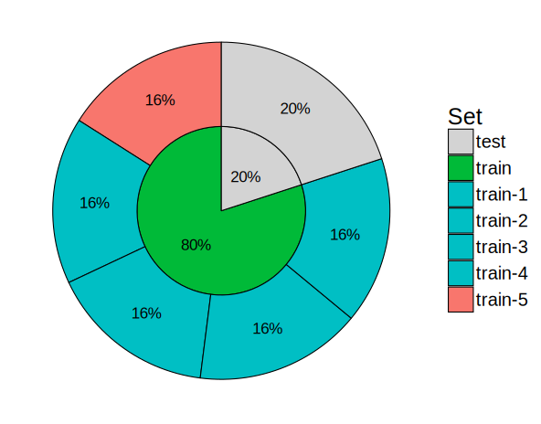

```{r setup, include=FALSE}
options(htmltools.dir.version = FALSE)
knitr::opts_chunk$set(fig.align = "center", dev = "svg",
                      fig.asp = 0.7, out.width = "80%", echo = FALSE)
```

class: center, middle, inverse

# Introduction

---

## Disease architectures

<br>

```{r, out.width="70%"}
knitr::include_graphics("figures/disease-archi.gif")
```

.footnote[Source: 10.1126/science.338.6110.1016] 

---

## Interest in prediction: polygenic risk scores (PRS)

---

## Widely-used method to compute PRS

<br>

<mark>GWAS + Clumping + Thresholding ("C+T" or just "PRS")</mark> (Chatterjee et al. 2013; Dudbridge 2013; Wray et al. 2007)

```{r, out.width="70%"}
knitr::include_graphics("figures/celiac-gwas-cut.png")
```

<br>

$$PRS_i = \sum_{j \in S} \mathbf{1}\{p_j < p_T\} \cdot \beta_j \cdot G_{i,j}$$

---

## Our two R packages: bigstatsr and bigsnpr

### Statistical tools with big matrices stored on disk

<br>

- {bigstatsr} for many types of matrix, to be used by any field of research

- {bigsnpr} for functions that are specific to the analysis of genetic data

<br>

Package {bigstatsr} provides a **fast penalized logistic regression**.

<br>
<br>

```{r, out.width="95%"}

```

<!-- --- -->

<!-- ## Comparison of the methods -->

<!-- ###  -->

---

class: center, middle, inverse

# Methods

---

## Methods compared

### The C+T method, from GWAS results

$$PRS_i = \sum_{j \in S_\text{clumping}} \mathbf{1}\{p_j < p_T\} \cdot \beta_j \cdot G_{i,j}$$

```{r, out.width="90%"}
knitr::include_graphics("figures/GWAS2PRS.png")
```

Pitfalls: weights learned independently and heuristics for correlation and regularization.

---

## Methods compared

### Penalized Logistic Regression

<br>

$$\arg\!\min_{\beta_0, \beta}(\lambda, \alpha)\left\{\underbrace{\frac{1}{n}\sum_{i=1}^n \log\left(1+e^{-y_i (\beta_0+x_i^T\beta)}\right)}_\text{Loss function} + \underbrace{\lambda \left((1-\alpha)\frac{1}{2}\|\beta\|_2^2 + \alpha \|\beta\|_1\right)}_\text{Penalization}\right\}$$ 

<br>

***

- $x$ is denoting the genotypes and covariables (e.g. principal components), 

- $y$ is the disease status we want to predict, 

- $\lambda$ is a regularization parameter that needs to be determined and

- $\alpha$ determines relative parts of the regularization $0 \le \alpha \le 1$. 

---

### Efficient algorithm

- Strong rules for discarding predictors in lasso-type problems (Tibshirani et al., 2012)

- implemented in R package {biglasso} (Zeng et al., 2017)

- reimplemented in R package {bigstatsr} (Privé et al., 2018) with *Cross-Model Selection and Averaging (CMSA)*

TODO: more on bigstatsr and bigsnpr

---

### Cross-Model Selection and Averaging (CMSA)

<br>

```{r, out.width="75%"}

```

---

### CMSA: maximization of one model, in turn

<br>

```{r, out.width="80%"}

```

---

## Comprehensive simulations

### Varying many parameters

<br>

```{r, out.width="95%"}

```

---

## Predictive performance measures

AUC (Area Under the ROC Curve) is used.

```{r, out.width="45%"}
knitr::include_graphics("https://i.stack.imgur.com/5x3Xj.png")
```

$$\text{AUC} = P(S_\text{case} > S_\text{control})$$

.footnote[As a second measure, the partial AUC for specificities between 90% and 100% is also reported.]

---

class: center, middle, inverse

# Results

---

### Higher predictive performance with logit-simple

<br>

```{r}
knitr::include_graphics("figures/pres-AUC-logit.svg")
```

---

### Predictive performance of C+T method varies with threshold

<br>

```{r}
knitr::include_graphics("figures/pres-AUC-PRS.svg")
```

---

### Prediction with logit-simple is improving faster

<br>

```{r}
knitr::include_graphics("figures/pres-AUC-ntrain.svg")
```

---

### Results: real Celiac phenotypes

```{r, out.width="55%"}

```

```{r, out.width="80%"}
knitr::include_graphics("figures/results-celiac.png")
```

---

class: center, middle, inverse

# Discussion

---

### Summary of our penalized regression as compared to the C+T method

- A more **optimal** approach for predicting complex diseases

- models that are **linear** and very **sparse** 

- very **fast**

- **automatic choice** for the regularization parameter

- can be extended to capture also recessive and dominant effects

<br>

### Prospects: future work with the UK Biobank

- use of external summary statistics to improve models

- generalization to external populations

- integration of clinical and environmental data

---

class: center, middle, inverse

# Thanks!

<br>

Presentation: https://privefl.github.io/thesis-docs/recomb18.html

R package {bigstatsr}: https://github.com/privefl/bigstatsr

R package {bigsnpr}: https://github.com/privefl/bigsnpr

<br>

`r icon::fa("twitter")` [privefl](https://twitter.com/privefl) &nbsp;&nbsp;&nbsp;&nbsp; `r icon::fa("github")` [privefl](https://github.com/privefl) &nbsp;&nbsp;&nbsp;&nbsp; `r icon::fa("stack-overflow")` [F. Privé](https://stackoverflow.com/users/6103040/f-priv%c3%a9)

.footnote[Slides created via the R package [**xaringan**](https://github.com/yihui/xaringan).]


---

## Real genotype data

Use real data from a case-control study for the Celiac disease.

```{r, out.width="95%"}
knitr::include_graphics("figures/PC1-4.png")
```

Keep only **controls** from the **UK** and **not deviating from the robust Malahanobis distance**.

---

## Simulate new phenotypes

### The liability-threshold model

```{r, out.width="65%"}
knitr::include_graphics("figures/LTM.png")
```

---

### Two models of liability

#### A "simple" model

$$y_i = \underbrace{\sum_{j\in S_\text{causal}} w_j \cdot \widetilde{G_{i,j}}}_\text{genetic effect} + \underbrace{\epsilon_i}_\text{environmental effect}$$ 

#### A "fancy" model

$$y_i = \underbrace{\sum_{j\in S_\text{causal}^{(1)}} w_j \cdot \widetilde{G_{i,j}}}_\text{linear} + \underbrace{\sum_{j\in S_\text{causal}^{(2)}} w_j \cdot \widetilde{D_{i,j}}}_\text{dominant} + \underbrace{\sum_{\substack{k=1 \\ j_1=e_k^{(3.1)} \\ j_2=e_k^{(3.2)}}}^{k=\left|S_\text{causal}^{(3.1)}\right|} w_{j_1} \cdot \widetilde{G_{i,j_1} G_{i,j_2}}}_\text{interaction} + \epsilon_i$$ 

***

- $w_j$ are **weights** (generated with a Gaussian or a Laplace distribution)
- $G_{i,j}$ is the **allele count** of individual $i$ for SNP $j$
- $D_{i,j} = \mathbf{1}\left\{G_{i,j} \neq 0\right\}$

---

### Extension via feature engineering

<br>

We construct a separate dataset with, for each SNP variable, two more variables coding for recessive and dominant effects.

<br>

```{r, out.width="100%"}
knitr::include_graphics("figures/triple.png")
```

.footnote[We call these two methods "logit-simple" and "logit-triple".]

---

### Feature engineering improves prediction

```{r, out.width="90%"}
knitr::include_graphics("figures/pres-triple.svg")
```

---

### Prediction with logit-simple is improving faster

<br>

```{r}
knitr::include_graphics("figures/pres-AUC-chr6.svg")
```

<!-- .footnote[Aims at increasing the polygenicity of the simulated models and at virtually increasing the sample size.] -->
