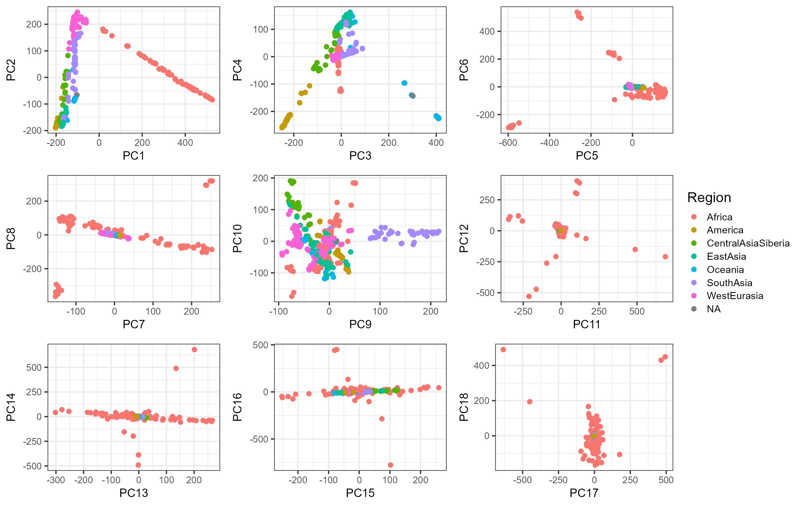
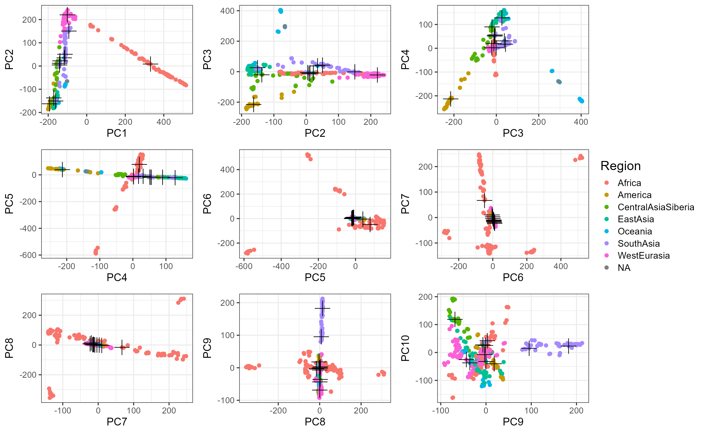
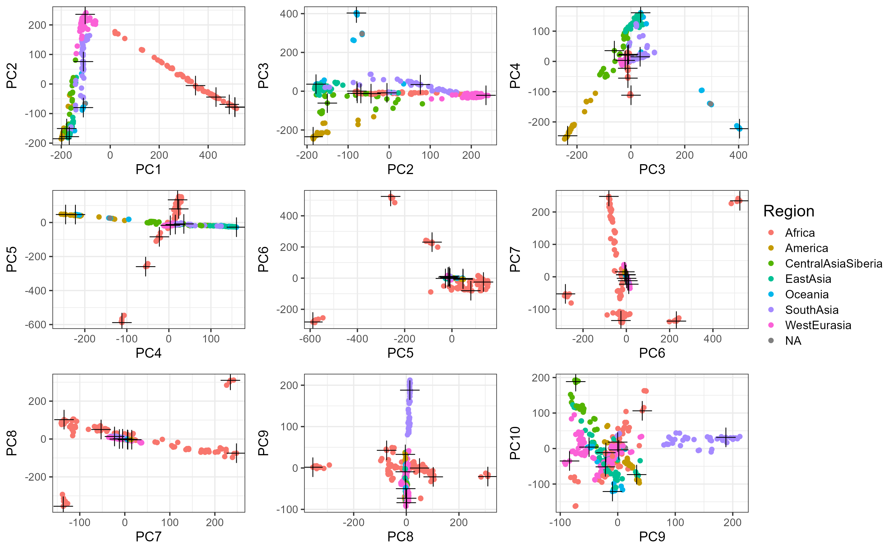
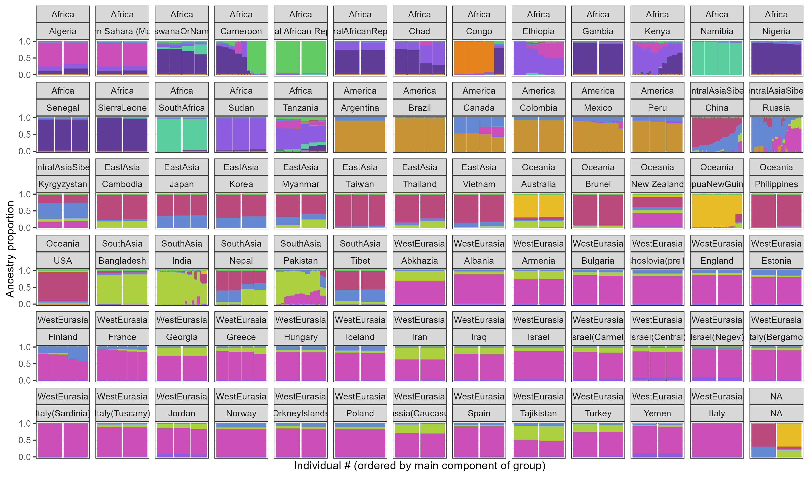

```{r setup, include=FALSE}
# renderthis::to_pdf("ldpred2-wcpg2023.Rmd", partial_slides = TRUE)
options(htmltools.dir.version = FALSE, width = 70)
knitr::opts_chunk$set(fig.align = 'center', dev = "svg", out.width = "70%",
                      echo = FALSE, comment = "", fig.width = 5, global.par = TRUE)
ICON_R_PROJECT <- icons::fontawesome$brands$`r-project`
ICON_TRI_EXCL  <- icons::fontawesome$solid$`exclamation-triangle`
ICON_INFO      <- icons::fontawesome$solid$`info-circle`
```

class: title-slide center middle inverse

<br>

# Genetic Ancestry Deconvolution

<br>

<br>

## Florian Privé 
### NCRR, Aarhus Univ.
#### `r icons::icon_style(fill = "white", icons::fontawesome$brands$twitter)` `r icons::icon_style(fill = "white", icons::fontawesome$brands$github)` privefl

---

class: inverse, center, middle

# Principal Component Analysis (PCA)

---

### PCA of genetic data captures population structure

<br>

```{r, out.width="100%"}
knitr::include_graphics("figures/PCA-UKBB-Bycroft.png")
```

---

<br>

```{r, out.width="100%"}
knitr::include_graphics("figures/paper4-2.png")
```

<br>

--

- Outlier sample detection & relatedness filtering

- Imbalance from ancestry groups

- Projection of individuals onto the PCA space

- Automatic detection and removal of LD

--

<br>

I provide fast & efficient methods to solve all these problems,    
especially `bigsnpr::bed_autoSVD()` & `bigsnpr::snp_autoSVD()`


---

### PC19 to PC40 in UKBB only capture LD!

```{r, out.width="100%"}
knitr::include_graphics("figures/loadings-ukbb.jpeg")
```

---

class: inverse, center, middle

# Genetic Ancestry Deconvolution

## (with reference populations)

---

### Summix: ancestry estimation from GWAS allele frequencies (AF)

Source: 10.1016/j.ajhg.2021.05.016

<br>

Estimate ancestry proportions $\alpha$ such that

```{css}
.small2 {
  font-size: 17px;
}
```

<span class="small2"> $$AF_\text{GWAS} = \alpha_\text{AFR} AF_\text{AFR} + \alpha_\text{EAS} AF_\text{EAS} + \alpha_\text{EUR} AF_\text{EUR} + \alpha_\text{SAS} AF_\text{SAS} + \alpha_\text{IAM} AF_\text{IAM} + \epsilon ~,$$ </span>

where all $\alpha$ are positive and sum to 1.

---

```{r, out.width="100%"}
knitr::include_graphics("figures/paper9-2.png")
```

--

<br>

- Curate the UK Biobank to define 18 worldwide reference groups

- Use PCA to maximize power to distinguish between these populations:

    <span class="small2"> $$\sum_{j=1}^M \left( AF_j^{(0)} - \sum_{l=1}^L \alpha_l AF_j^{(l)} \right)^2$$ </span>
    
    is replaced by
    
    <span class="small2"> $$\sum_{k=1}^K \left( PC_k^{(0)} - \sum_{l=1}^L \alpha_l PC_k^{(l)} \right)^2$$ </span>
    
---

```{r, out.width="100%"}
knitr::include_graphics("figures/ancestry-bigsnpr.png")
```

--

<br>

```{r, out.width="100%"}
knitr::include_graphics("figures/ancestry-summix.png")
```

---

### Admixture coefficients for individual-level data

<br>

**My developed method also works for individual-level data!**

This is similar to the projection analysis from ADMIXTURE,    
but should have more power..

--

<br>

Application to iPSYCH: can identify some non-European individuals:

- Middle East! 2600
- East Africa: 450
- North Africa: 330
- South Asia: 840
- East Asia: 280


---

class: inverse, center, middle

# Genetic Ancestry Deconvolution

## (without reference populations)

---

### Study population: the Simons Genome Diversity Project

345 individuals from 142 worldwide populations

```{r, out.width="100%"}

```

---

### Fuzzy k-medoids clustering

(Alternate estimation) membership degree: QP // medoids: weighted median

```{r, out.width="100%"}

```

---

### My new prototype method

Aim for corners instead of medoids

```{r, out.width="100%"}

```

---

### Corresponding ancestry coefficients

<br>

```{r, out.width="100%"}

```

---

### Admixture-like from R package LEA

(directly on genotype data, not PCs)

```{r, out.width="100%"}

```

---

class: inverse, center, middle

## Thank you for your attention

<br>

Presentation available at [bit.ly/privefl280824](https://bit.ly/privefl280824)

<br>

`r icons::icon_style(fill = "white", icons::fontawesome$brands$twitter)` `r icons::icon_style(fill = "white", icons::fontawesome$brands$github)` privefl

.footnote[Slides created via the R package [**xaringan**](https://github.com/yihui/xaringan)]
