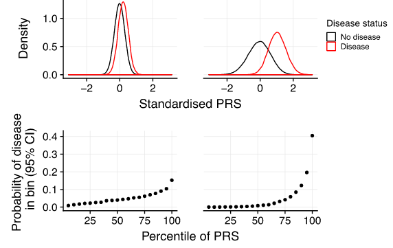

```{r setup, include=FALSE}
options(htmltools.dir.version = FALSE, width = 70)
knitr::opts_chunk$set(fig.align = 'center', dev = "svg", out.width = "70%",
                      echo = FALSE, comment = "", fig.width = 5, global.par = TRUE)
```

class: title-slide center middle inverse

<br>

# Predicting complex traits and diseases<br>from genetic data

## SMPGD 2022

<br>

### Florian Privé

#### Senior Researcher, Aarhus University (DK)

---

class: center middle inverse

# Introduction & Motivation

### Data, application and research interest 

---

## Disease architecture

<br>

```{r, out.width="70%"}
knitr::include_graphics("figures/disease-archi.png")
```

.footnote[Source: 10.1126/science.338.6110.1016] 

---

## Polygenic Risk Scores (PRS)

A simple model: $y_i = \sum_j \beta_j x_{i,j} + \epsilon$    
$y_i$: phenotypes, $x_{i,j}$: genotypes, $\beta_j$: effect sizes, $\epsilon$: environmental effect.

```{r, out.width="90%"}
knitr::include_graphics("figures/PRS.png")
```

---

## Identify high-risk individuals

<br>

```{r, out.width="80%"}

```

.footnote[Source: 10.1093/hmg/ddz187]

---

## Interest in Polygenic Scores (PGS)

<br>

```{r, out.width="90%"}
knitr::include_graphics("figures/PRS-trend22.png")
```

---

## Data: very large genotype matrices

<br>

**Matrices** of genetic variants (DNA mutations)

counting the number of alternative alleles (**0, 1, or 2**)    
or imputed dosages (between 0 and 2)

for each individual (row) and each genome position (column)

<br>

Data I typically work with:

- [UK Biobank](https://doi.org/10.1101/166298) genotyped data: 500K x 800K (~3TB)

- [UK Biobank](https://doi.org/10.1101/166298) imputed data (common variants): 500K x 11M

---

class: center, middle, inverse

# How to predict disease status<br>based on genotypes?

<br>

## 1) using individual-level data

---

## Penalized Linear/Logistic Regression (PLR)

<br>

<Small>$$\arg\!\min_{\beta_0,~\beta}(\lambda, \alpha)\left\{  \underbrace{ \sum_{i=1}^n \left( y_i -(\beta_0 + x_i^T\beta) \right)^2 }_\text{Loss function (linear re)}   +   \underbrace{ \lambda \left((1-\alpha)\frac{1}{2}\|\beta\|_2^2 + \alpha \|\beta\|_1\right) }_\text{Penalization}  \right\}$$</Small>

<br>

- $x$ is the **genotypes** and covariates (e.g. sex and principal components), 

- $y$ is the trait / disease status we want to predict, 

- $\lambda$ is a regularization parameter that needs to be determined and

- $\alpha$ determines relative parts of the regularization $0 \le \alpha \le 1$. 

<br>

In `r icon::fa_r_project()` package {bigstatsr}, very fast implementation with automatic choice of $\lambda$ and $\alpha$ [[bit.ly/plr-bigstatsr](https://bit.ly/plr-bigstatsr)]

---

## PLR for predicting height from genotypes

- 350K individuals x 656K variants in less than one day

- Within each both males and females, 65.5% of correlation between predicted and true height

```{r, out.width="70%"}
knitr::include_graphics("https://privefl.github.io/blog/images/UKB-final-pred.png")
```
---

class: center, middle, inverse

# How to predict disease status<br>based on genotypes?

<br>

## 2) using GWAS summary statistics

---

## Standard PRS - part 1: estimating effects

### Genome-wide association studies (GWAS)

In a GWAS, each genetic variant is tested **independently**, resulting in one **effect size** $\hat\beta$ and one **p-value** $p$ for each variant. 

```{r, out.width="95%"}
knitr::include_graphics("figures/gwas-height-20K.png")
```

Easy combining: $PRS_i = \sum_j \hat\beta_j \cdot G_{i,j}$

---

#### SLIDE ON INDIRECT ASSOCIATION

---

## Standard PRS - part 2: restricting predictors

### <span style="color:#38761D">Clumping</span> + <span style="color:#1515FF">Thresholding</span> (C+T, or P+T)

<br>

```{r, out.width="100%"}
knitr::include_graphics("figures/GWAS2PRS3.png")
```

<br>

$$PRS_i = \sum_{\substack{j \in S_\text{clumping} \\ p_j~<~p_T}} \hat\beta_j \cdot G_{i,j}$$

---

```{r, out.width = "85%"}
knitr::include_graphics("figures/fig-GWAS-C+T.jpg")
```
--
<br>
```{r, out.width = "85%"}
knitr::include_graphics("figures/fig-GWAS-C+T-clumping.jpg")
```
--
<br>
```{r, out.width = "85%"}
knitr::include_graphics("figures/fig-GWAS-C+T-clumping-thresholding.jpg")
```

---

### Making the most of C+T

#### Hyper-parameters in C+T

<!-- -- -->

- threshold of imputation quality score ( $INFO_T \sim 0.3$ )

<!-- -- -->

- threshold on squared correlation of clumping ( $r_c^2 \sim 0.2$ ) and    
window size for LD computation ( $w_c \sim 500 kb$ )

<!-- -- -->

- p-value threshold ( $p_T$ between $1$ and $10^{-8}$ and choose the best one )

<!-- -- -->

$\Longrightarrow$ *stdCT* (standard C+T)

--

#### Our contribution [[bit.ly/sct-paper](https://bit.ly/sct-paper)]

- an efficient implementation to compute many C+T scores for different hyper-parameters (**5600 sets of hyper-parameters** $\times$ 22 chromosomes)    
$\Longrightarrow$ *maxCT* (maximized C+T)

<!-- -- -->

- going further by **stacking** with a linear combination of all C+T models (instead of just choosing the best model)    
$\Longrightarrow$ *SCT* (Stacked C+T)

---

### Using summary statistics from large GWAS

```{r, out.width="85%"}
knitr::include_graphics("figures/PRS-sumstats.png")
```

---

## Alternative: approximating a penalized regression

A linear model with elastic-net regularization using coordinate descent by iteratively updating: 

$$
\beta_j^{(t+1)} =
\begin{cases}
\text{sign}\left(u_j^{(t)}\right) \left(\left|u_j^{(t)}\right| - \lambda_1\right) / \left(1 + \lambda_2\right) & \text{if } \left|u_j^{(t)}\right| > \lambda_1 ~, \\
0 & \text{otherwise.}
\end{cases}
$$

where 

$$u_j^{(t)} = \sum_i \left[ X_{i,j} \left( y_i - \sum_{k \neq j} X_{i,k} \beta_k^{(t)} \right) \right] = \sum_i X_{i,j} y_i - \sum_{k \neq j} \left( \sum_i X_{i,j} X_{i,k} \right) \beta_k^{(t)} ~.$$

--

In this equation, $\sum_i X_{i,j} y_i$ can be obtained from GWAS summary statistics, while $\sum_i X_{i,j} X_{i,k}$ can be estimated from another dataset.
Therefore, we can approximate this model using only summary statistics (no individual-level data).

This idea is used in lassosum    
<small>(TSH Mak et al. "Polygenic scores via penalized regression on summary statistics." Genetic epidemiology (2017))</small>

---

### Local correlation between genetic variants

- Fortunately, we can consider that the correlation between two genetic variants ( $\sum_i X_{i,j} X_{i,k}$, when $X$ is appropriately scaled) is 0 when they are too distant on the genome. So the matrix $X^T X$, while being e.g. 1M x 1M is actually very sparse (banded).

--

<br>

### Other methods for polygenic prediction from summary statistics

Many other methods have been developed, lots being Bayesian. They all the same idea of approximating the linear regression model using GWAS summary statistics and an external reference for the correlation between variants.

For example, we have developed LDpred2 [[bit.ly/ldpred2-paper](https://bit.ly/ldpred2-paper)].

---
class: center, middle, inverse

# Conclusion

---

## My thesis work

<br>

1. Developping two `r icon::fa_r_project()` packages for the analysis of large-scale genomic data.    

    (https://doi.org/10.1093/bioinformatics/bty185) 
    
    Package bigstatsr can be used for any data encoded as matrices.

--
2. Including an implementation (in bigstatsr) of penalized regression for very large individual-level datasets \+ assess the potential gain in prediction over the simple standard model (C+T).
    
    (https://doi.org/10.1534/genetics.119.302019) 

--
3. Extending the set of parameters tested in C+T (implemented in bigsnpr) to achieve higher predictive performance with C+T. Extension via stacking. Comparison with standard C+T, lassosum (and LDpred).

    (https://doi.org/10.1101/653204)

---

## Directions of future work

- Revisions for C+T/SCT paper

    - add LDpred to the comparisons
    - investigate MAF parameter

--

- Coding in bigsnpr

    - clumping and PCA directly on PLINK files with missing values
    - improving autoSVD algorithm, including automatic detection of outlier samples on top of long-range LD regions

--

- multi-phenotype prediction with SCT (e.g. for schizophrenia, bipolar disorder and depression)

<!-- -- -->

- testing of different scaling functions in penalized regressions

<!-- -- -->

- inclusion of summary statistics information in penalized regressions

<!-- -- -->

- coding of penalized Cox regression

<!-- -- -->

- comparison of PRS methods (via data challenge?)

---

class: inverse, center, middle

# Thanks!

<br>

Presentation available at    
https://privefl.github.io/thesis-docs/smpgd22.html

<br>

<br>

`r icon::fa("twitter")` [privefl](https://twitter.com/privefl) &nbsp;&nbsp;&nbsp;&nbsp; `r icon::fa("github")` [privefl](https://github.com/privefl) &nbsp;&nbsp;&nbsp;&nbsp; `r icon::fa("stack-overflow")` [F. Privé](https://stackoverflow.com/users/6103040/f-priv%c3%a9)

.footnote[Slides created via the R package [**xaringan**](https://github.com/yihui/xaringan).]

