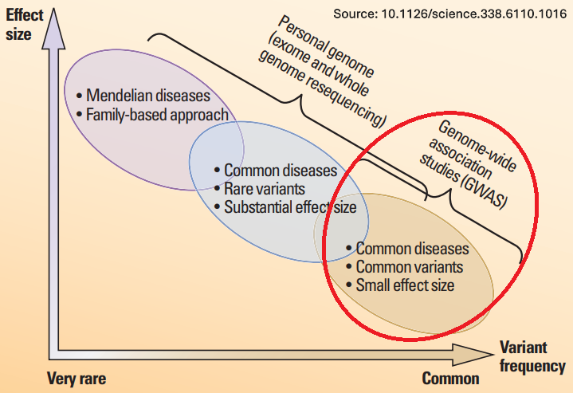
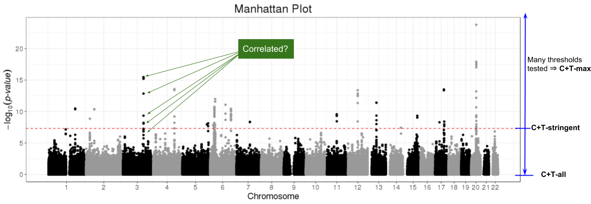
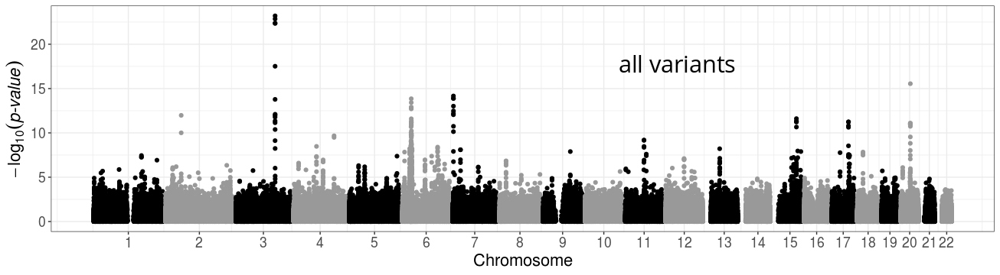
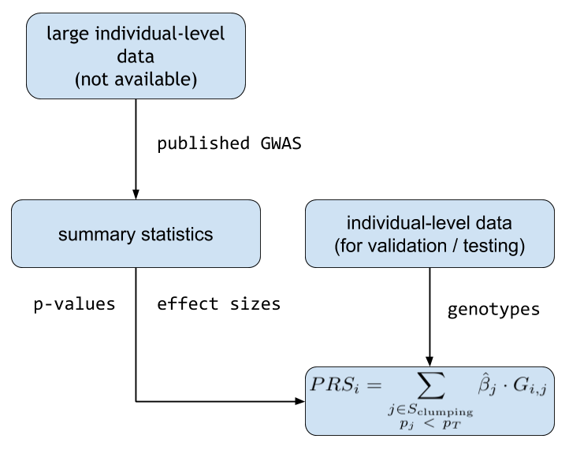
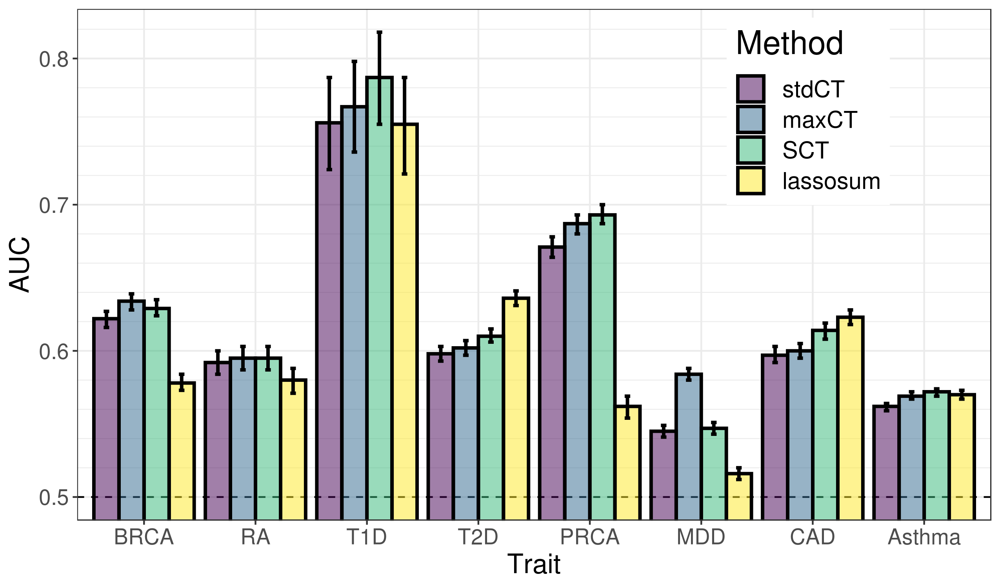
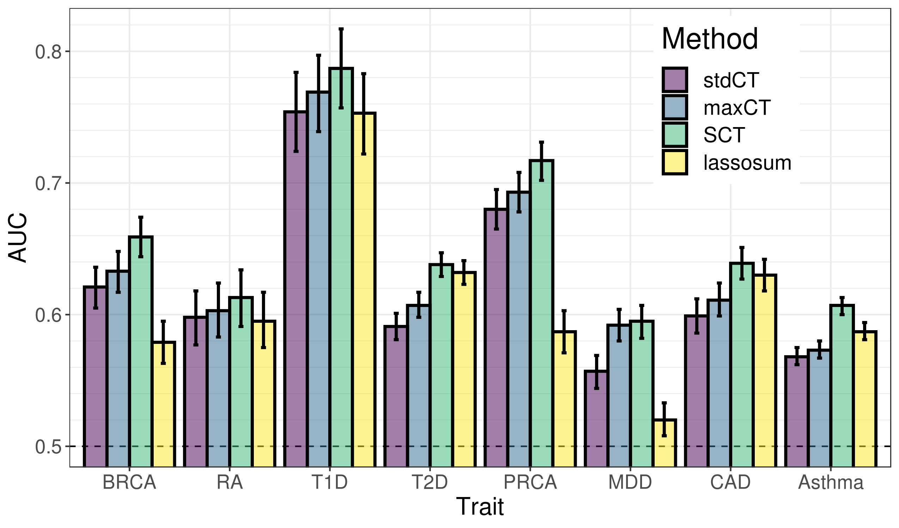

```{r setup, include=FALSE}
options(htmltools.dir.version = FALSE, width = 70)
knitr::opts_chunk$set(fig.align = 'center', dev = "svg", out.width = "70%",
                      echo = FALSE, comment = "", fig.width = 5, global.par = TRUE)
```

class: title-slide center middle inverse

<br>

# Predicting complex traits and diseases<br>from genetic data

## SMPGD 2022

<br>

### Florian Privé

#### Senior Researcher, Aarhus University (DK)

---

class: center middle inverse

# Introduction & Motivation

### Data, application and research interest 

---

## Disease architecture

<br>

```{r, out.width="70%"}

```

.footnote[Source: 10.1126/science.338.6110.1016] 

---

## Polygenic Risk Scores (PRS)

A simple model: $y_i = \sum_j \beta_j x_{i,j} + \epsilon$    
$y_i$: phenotypes, $x_{i,j}$: genotypes, $\beta_j$: effect sizes, $\epsilon$: environmental effect.

```{r, out.width="90%"}
knitr::include_graphics("figures/PRS.png")
```

---

## Identify high-risk individuals

<br>

```{r, out.width="80%"}
knitr::include_graphics("figures/PRS-utility.png")
```

.footnote[Source: 10.1093/hmg/ddz187]

---

## Interest in Polygenic Scores (PGS)

<br>

```{r, out.width="90%"}

```

---

## Data: very large genotype matrices

<br>

**Matrices** of genetic variants (DNA mutations)

counting the number of alternative alleles (**0, 1, or 2**)    
or imputed dosages (between 0 and 2)

for each individual (row) and each genome position (column)

<br>

Data I typically work with:

- [UK Biobank](https://doi.org/10.1101/166298) genotyped data: 500K x 800K (~3TB)

- [UK Biobank](https://doi.org/10.1101/166298) imputed data (common variants): 500K x 11M

---

class: center, middle, inverse

# How to predict disease status<br>based on genotypes?

<br>

## 1) using individual-level data

---

## Penalized Linear/Logistic Regression (PLR)

<br>

<Small>$$\arg\!\min_{\beta_0,~\beta}(\lambda, \alpha)\left\{  \underbrace{ \sum_{i=1}^n \left( y_i -(\beta_0 + x_i^T\beta) \right)^2 }_\text{Loss function (linear re)}   +   \underbrace{ \lambda \left((1-\alpha)\frac{1}{2}\|\beta\|_2^2 + \alpha \|\beta\|_1\right) }_\text{Penalization}  \right\}$$</Small>

<br>

- $x$ is the **genotypes** and covariates (e.g. sex and principal components), 

- $y$ is the trait / disease status we want to predict, 

- $\lambda$ is a regularization parameter that needs to be determined and

- $\alpha$ determines relative parts of the regularization $0 \le \alpha \le 1$. 

<br>

In `r icon::fa_r_project()` package {bigstatsr}, very fast implementation with automatic choice of $\lambda$ and $\alpha$ [[bit.ly/plr-bigstatsr](https://bit.ly/plr-bigstatsr)]

---

## PLR for predicting height from genotypes

- 350K individuals x 656K variants in less than one day

- Within each both males and females, 65.5% of correlation between predicted and true height

```{r, out.width="70%"}
knitr::include_graphics("https://privefl.github.io/blog/images/UKB-final-pred.png")
```
---

class: center, middle, inverse

# How to predict disease status<br>based on genotypes?

<br>

## 2) using GWAS summary statistics

---

## Standard PRS - part 1: estimating effects

### Genome-wide association studies (GWAS)

In a GWAS, each genetic variant is tested **independently**, resulting in one **effect size** $\hat\beta$ and one **p-value** $p$ for each variant. 

```{r, out.width="95%"}
knitr::include_graphics("figures/gwas-height-20K.png")
```

Easy combining: $PRS_i = \sum_j \hat\beta_j \cdot G_{i,j}$

---

## Standard PRS - part 2: restricting predictors

### <span style="color:#38761D">Clumping</span> + <span style="color:#1515FF">Thresholding</span> ("C+T" or just "PRS")

<br>

```{r, out.width="100%"}

```

<br>

$$PRS_i = \sum_{\substack{j \in S_\text{clumping} \\ p_j~<~p_T}} \hat\beta_j \cdot G_{i,j}$$

---

```{r}

```
--
```{r}
knitr::include_graphics("figures/fig-GWAS-C+T-clumping.jpg")
```
--
```{r}
knitr::include_graphics("figures/fig-GWAS-C+T-clumping-thresholding.jpg")
```

---

### Using summary statistics from large GWAS

```{r, out.width="85%"}

```

---

## Predictive methods based on summary statistics

<br>

When you have only summary statistics (and a small individual-level dataset), you can use:

- C+T

<!-- -- -->

- LDpred (*Vilhjálmsson, Bjarni J., et al. "Modeling linkage disequilibrium increases accuracy of polygenic risk scores." The American Journal of Human Genetics 97.4 (2015): 576-592*).

<!-- -- -->

- lassosum (*Mak, Timothy Shin Heng, et al. "Polygenic scores via penalized regression on summary statistics." Genetic epidemiology 41.6 (2017): 469-480.*)

<!-- -- -->

- Other methods in development, such as NPS, PRS-CS and SBayesR.

<!-- -- -->

The idea of LDpred, lassosum and the other methods is to use a reference panel to **account for correlation** between variants, instead of clumping (removing) variants.

---

### Making the most of C+T

#### Hyper-parameters in C+T

<!-- -- -->

- threshold of imputation quality score ( $INFO_T \sim 0.3$ )

<!-- -- -->

- threshold on squared correlation of clumping ( $r_c^2 \sim 0.2$ ) and    
window size for LD computation ( $w_c \sim 500 kb$ )

<!-- -- -->

- p-value threshold ( $p_T$ between $1$ and $10^{-8}$ and choose the best one )

<!-- -- -->

$\Longrightarrow$ *stdCT* (standard C+T)

--

#### Our contribution

- an efficient implementation to compute many C+T scores for different hyper-parameters (**5600 sets of hyper-parameters** $\times$ 22 chromosomes)    
$\Longrightarrow$ *maxCT* (maximized C+T)

<!-- -- -->

- going further by **stacking** (*Breiman, Leo. "Stacked regressions." Machine learning 24.1 (1996): 49-64.*) with a linear combination of all C+T models (instead of just choosing the best model)    
$\Longrightarrow$ *SCT* (Stacked C+T)

---

## Grid of hyper-parameters and Stacking

We compute C+T scores *for each chromosome separately* and for several parameters:

- **Threshold on imputation** INFO score $\text{INFO}_T$ within **\{0.3, 0.6, 0.9, 0.95\}**.

<!-- -- -->

- Squared correlation **threshold of clumping** $r_c^2$ within **\{0.01, 0.05, 0.1, 0.2, 0.5, 0.8, 0.95\}**.

<!-- -- -->

- Base **size of clumping window** within \{50, 100, 200, 500\}. The window size $w_c$ is then computed as the base size divided by $r_c^2$. For example, for $r_c^2 = 0.2$, we test values of $w_c$ within \{250, 500, 1000, 2500\} (in kb).

<!-- -- -->

- A sequence of **50 thresholds on p-values** between the least and the most significant p-values, equally spaced on a log-log scale.

--

<br>

Then, we **stack these 123,200 C+T scores** by using them as variables in the efficient penalized regressions we implemented previously.

---

## Data (simulations)

#### Real genotypes

UK Biobank data for 1M variants and:

- 315,609 individuals for computing summary
statistics (GWAS), 

- a set of 10,000 individuals for training hyper-parameters and lastly 

- a test set of
10,000 individuals for evaluating models.

--

#### Simulate new phenotypes

- 100, 10K, or 1M random causal variants with Gaussian effects

- Three additional scenarios with more complex architectures:

    - "2chr": 100 variants of chromosome 1 and all variants of chromosome 2 are causal
    - "err": (not presented)
    - "HLA": 7105 causal variants are chosen in one long-range LD region

---

## Results (simulations)

```{r}
knitr::include_graphics("figures/SCT-AUC-simus.png")
```

---

## Data (real phenotypes)

<br>

- Include 8 common disorders

- Real genotypes + phenotypes (UK Biobank) for training/validation/test

- External published summary statistics (that did not use UK Biobank)

--

<br>

```{r}
knitr::include_graphics("figures/data-SCT.png")
```

---

## Results (small training set)

500 cases and 2000 controls in training

```{r}

```

---

## Results (large training set)

Between 120K and 350K individuals in training

```{r}

```

---

## Summary

<br>

- We improved C+T by tuning more hyper-parameters

<!-- -- -->

- maxCT is on par with lassosum, while being more robust (no model)

--

- stacking makes C+T more flexible and potentially much more predictive

<!-- -- -->

- predictive power of SCT is increasing with sample size

--

- can extend SCT to account for other parameters (e.g. MAF)

<!-- -- -->

- can extend SCT to use multiple summary statistics


---
class: center, middle, inverse

# Conclusion

---

## My thesis work

<br>

1. Developping two `r icon::fa_r_project()` packages for the analysis of large-scale genomic data.    

    (https://doi.org/10.1093/bioinformatics/bty185) 
    
    Package bigstatsr can be used for any data encoded as matrices.

--
2. Including an implementation (in bigstatsr) of penalized regression for very large individual-level datasets \+ assess the potential gain in prediction over the simple standard model (C+T).
    
    (https://doi.org/10.1534/genetics.119.302019) 

--
3. Extending the set of parameters tested in C+T (implemented in bigsnpr) to achieve higher predictive performance with C+T. Extension via stacking. Comparison with standard C+T, lassosum (and LDpred).

    (https://doi.org/10.1101/653204)

---

## Directions of future work

- Revisions for C+T/SCT paper

    - add LDpred to the comparisons
    - investigate MAF parameter

--

- Coding in bigsnpr

    - clumping and PCA directly on PLINK files with missing values
    - improving autoSVD algorithm, including automatic detection of outlier samples on top of long-range LD regions

--

- multi-phenotype prediction with SCT (e.g. for schizophrenia, bipolar disorder and depression)

<!-- -- -->

- testing of different scaling functions in penalized regressions

<!-- -- -->

- inclusion of summary statistics information in penalized regressions

<!-- -- -->

- coding of penalized Cox regression

<!-- -- -->

- comparison of PRS methods (via data challenge?)

---

class: inverse, center, middle

# Thanks!

<br>

Presentation available at    
https://privefl.github.io/thesis-docs/spmgd22.html

<br>

<br>

`r icon::fa("twitter")` [privefl](https://twitter.com/privefl) &nbsp;&nbsp;&nbsp;&nbsp; `r icon::fa("github")` [privefl](https://github.com/privefl) &nbsp;&nbsp;&nbsp;&nbsp; `r icon::fa("stack-overflow")` [F. Privé](https://stackoverflow.com/users/6103040/f-priv%c3%a9)

.footnote[Slides created via the R package [**xaringan**](https://github.com/yihui/xaringan).]

