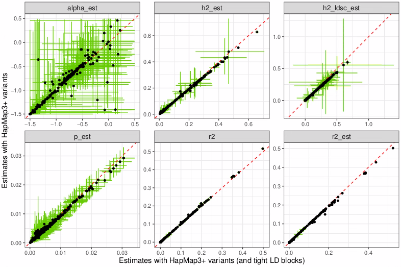
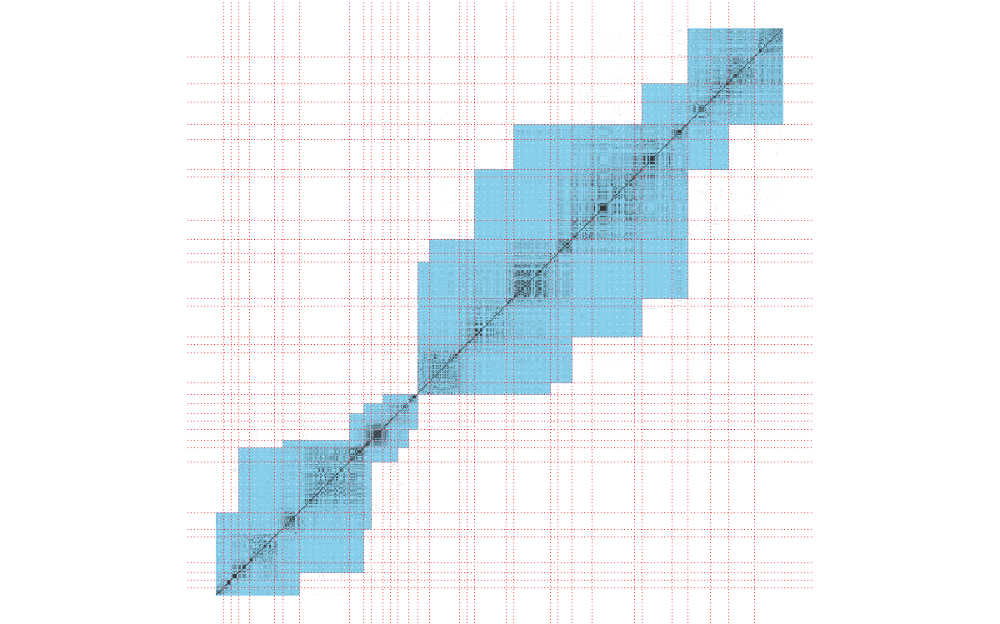

```{r setup, include=FALSE}
options(htmltools.dir.version = FALSE, width = 70)
knitr::opts_chunk$set(fig.align = 'center', dev = "svg", out.width = "80%",
                      echo = FALSE, comment = "", fig.width = 5, global.par = TRUE)
```

class: title-slide center middle inverse

<br>

# LD matrices for LDpred2

<br>

## sparsity and robustness

---

### LDpred2 and correlation matrices

<br>

LDpred2 (and lassosum2) only needs to compute $$\omega_j = {R_{.,j}}^T \beta,$$ where $R_{.,j}$ is the $j$-th column of the correlation (LD) matrix and $\beta$ is a sampled vector of (scaled) effect sizes.

--

<br>

In practice, we keep track of the vector $\Omega$ (of all $\omega_j$), and update it using $$\Omega = \Omega + R_{.,j} \cdot (\beta_j^\text{new} - \beta_j^\text{old}).$$
Often $\beta_j^\text{new} = \beta_j^\text{old} = 0$, then there is no update needed.
Moreover, the update needs to happen only for indices such that $R_{.,j} \neq 0$.

---

### Sparsity of LD matrices

<br>

- We consider that two variants further away than 3 cM are not correlated, which gives a sparse LD matrix with values around the diagonal only.

- We have introduced a *compact* sparse format where, for all $j$, we only store the first $i$ such that $R_{i,j} \neq 0$, and then store all non-zero $R_{i,j}$.

- We also use an optimal algorithm to detect independent blocks in the LD matrix; it adds a bit of sparsity (e.g. keeping 80% of non-zero values). It also improves robustness of LDpred2 (probably because small errors cannot accumulate/propagate outside of the blocks).

--

<br>

In practice, it leads to a ~15 GB data for 1,054,330 HapMap3 variants and ~30 GB data for 1,444,196 variants.

LDpred2 is currently fast enough (it generally takes less than one hour). The main issue if we want to use many more variants will probably be the memory required.

---

class: center middle inverse

##  How to use even more variants?

---

### Use a more stringent LD splitting? (1/)

By making smaller blocks, we can reduce the size by 50%. It also makes LDpred2 more robust, but also reduces its predictive performance when robustness is not an issue.

```{r, out.width = "85%"}

```

---

### Use (smaller) sliding blocks? (2/)

```{r, out.width = "85%"}

```

It can reduces the size of the LD matrix by up to $7\times$. But leads to divergence issues for half of the phenotypes tested. This is expected given the smallest eigenvalue of the LD matrix becomes much smaller than 0.

---

### Use an eigen decomposition of the LD? (3/)

<br>

This is used in SBayesRC, and they choose K (the number of eigenvectors kept) to reach 99.5% variance explained, which leads to a large K (they say 20% of M, where M is the size of a block).

Moreover, $R = W W^T$ in the corresponding block. Then it means we need to compute a matrix-vector product each time we want to access a column of $R$.

I cannot see how this could be a good solution for LDpred2.

---

### Store LD with 2 bytes (instead of 8)? (4/)

<br>

Can store 65536 different values with 2 bytes, so why not values between -1 and 1 with good enough precision? 

- This would reduce the size of the data by $4\times$

- Can use [0; 65535] -> [-1; 1] with f(x) = 2 / 65535 * x - 1

- Should probably use something centered around 0, so from 0 to 65534

- The precision of the rounding is then a bit more than 4 decimal places

This rounding seems fine since it does not seem to change much the eigenvalues of the LD matrix.

---

### Use very sparse inverse of the LD matrix?

<br> 

- Bjarni covered the LDGMs very recently in a JC


---

class: inverse, center, middle

# Thanks!

<br>

Presentation available at    
https://privefl.github.io/thesis-docs/spLD.html

<br>

<br>

`r icons::icon_style(fill = "white", icons::fontawesome$brands$twitter)` `r icons::icon_style(fill = "white", icons::fontawesome$brands$github)` privefl

.footnote[Slides created via the R package [**xaringan**](https://github.com/yihui/xaringan)]

