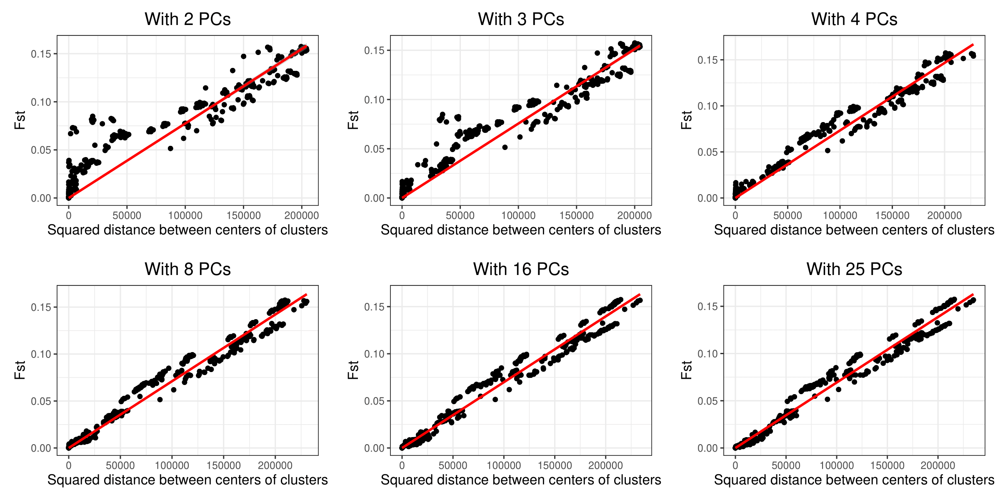
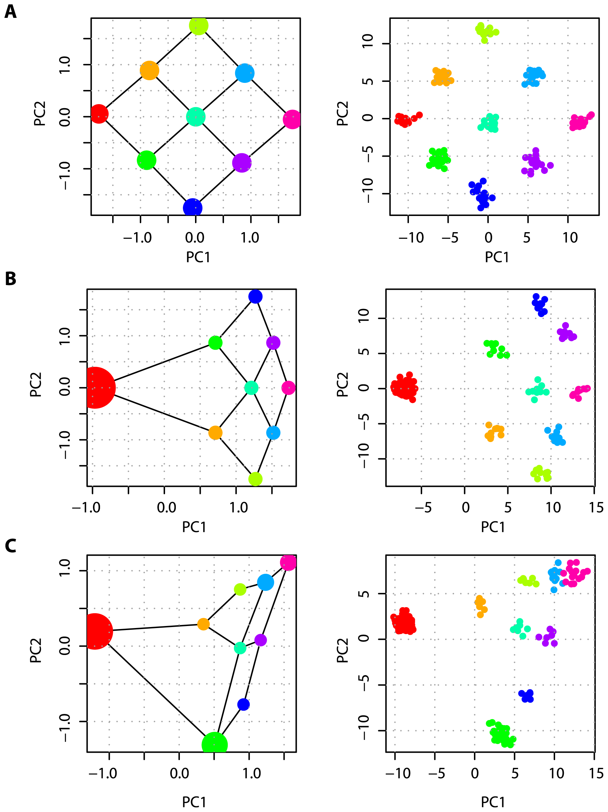
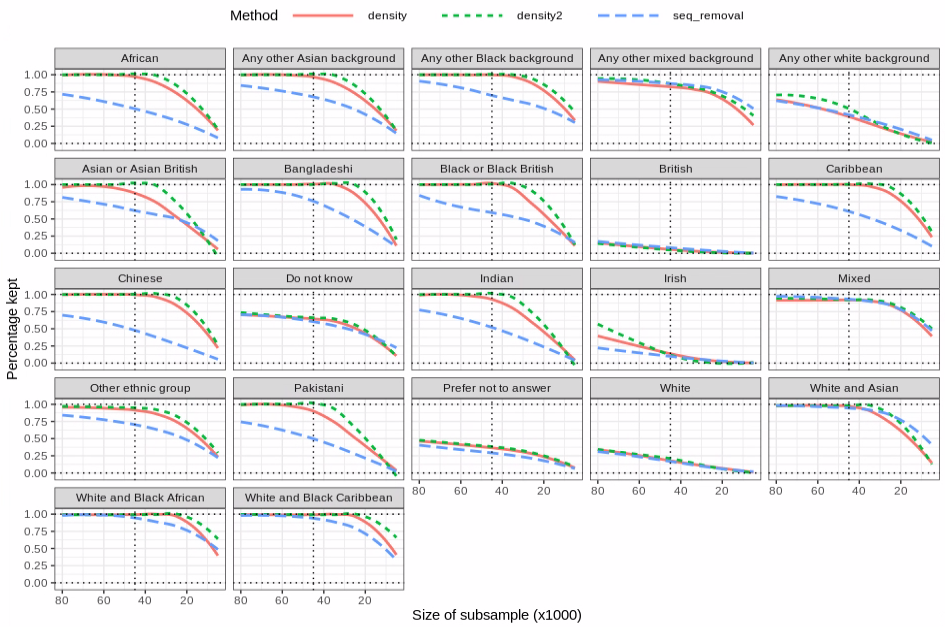

```{r setup, include=FALSE}
# renderthis::to_pdf("ldpred2-wcpg2023.Rmd", partial_slides = TRUE)
options(htmltools.dir.version = FALSE, width = 70)
knitr::opts_chunk$set(fig.align = 'center', dev = "svg", out.width = "70%",
                      echo = FALSE, comment = "", fig.width = 5, global.par = TRUE)
ICON_R_PROJECT <- icons::fontawesome$brands$`r-project`
ICON_TRI_EXCL  <- icons::fontawesome$solid$`exclamation-triangle`
ICON_INFO      <- icons::fontawesome$solid$`info-circle`
```

class: title-slide center middle inverse

<br>

# Automated Subsampling<br>for Balancing Overrepresented Groups<br>in Principal Component Analysis

<br>

<br>

## Florian Privé 
### NCRR
#### `r icons::icon_style(fill = "white", icons::fontawesome$brands$twitter)` `r icons::icon_style(fill = "white", icons::fontawesome$brands$github)` privefl

---

### PCA of genetic data captures continental population structure

<br>

```{r, out.width="100%"}
knitr::include_graphics("figures/PCA-UKBB-Bycroft.png")
```

---

### PCA also captures sub-continental population structure

```{r, out.width="80%"}
knitr::include_graphics("figures/PCA-POPRES-EUR.png")
```

---

### Distance in PCA measures genetic distance

<br>

```{r, out.width="100%"}

```

---

class: inverse, center, middle

# Distortion in PCA

---

### The effect of uneven sampling on PCA ([McVean 2009](https://doi.org/10.1371/journal.pgen.1000686))

```{r, out.width="52%"}

```

---

### Two solutions to this problem

--

<br>

- weighted PCA    
(less straightforward to compute)

- subsampling of overrepresented group(s)    
(what I tried)

---

class: inverse, center, middle

# Capturing more population structure
# with less individuals

---

```{r, out.width="100%"}
knitr::include_graphics("figures/paper4-2.png")
```

--

<br>

In the UK Biobank,

- only 16 PCs actually capture population structure 

- PC 19--40 capture LD; do not use these!

- can use 40 PCs when subsampling British and Irish individuals 

---

### Subsampling in the UK Biobank

- Subsampling 10,000 British individuals (2.3%) 
- and 5000 Irish individuals (39,2%), 
- while keeping all indiv with other or unknown self-reported ancestry.

```{r, out.width="100%"}
knitr::include_graphics("https://github.com/privefl/paper4-bedpca/blob/master/UKBB-scores-restricted.png?raw=true")
```

---

### Can we do better than this?

<br>

- the numbers kept are a bit arbitrary

- what if the self-reported ancestry is missing or inaccurate?

<br>

$\Longrightarrow$ design an algorithm that does not use this information

---

### First idea: iteratively merging and discarding

Using 16 PCs in the UK Biobank,

1. Start with each point as its own group

2. Find the minimum distance between pairs of points/groups

2. Merge these two points/groups as a new one

3. Iterate 2. and 3. until N groups are left

4. Within each group, find the initial point closest to the merged one

--

### Second idea: estimate some density for all points

Using the previous algorithm (until all points are merged),

1. For each point, store the size of the group it belongs to

1. Average the sizes for all iterations, to get a density estimator

1. Subsample using the inverse (squared) densities as weights

---

### Ancestry composition of subsamples

```{r, out.width="100%"}

```

---

### Ancestry composition of the much reduced subsamples

```{r, out.width="100%"}

```

---

### Density and subsample of "Prefer not to answer" individuals 

```{r, out.width="100%"}

```

---

### Density and subsample of "White" individuals 

```{r, out.width="100%"}

```

---

---

---

class: inverse, center, middle

## Thank you for your attention

<br>

### Is this interesting?
### Is this enough for a paper?

<br>
<br>

`r icons::icon_style(fill = "white", icons::fontawesome$brands$twitter)` `r icons::icon_style(fill = "white", icons::fontawesome$brands$github)` privefl
