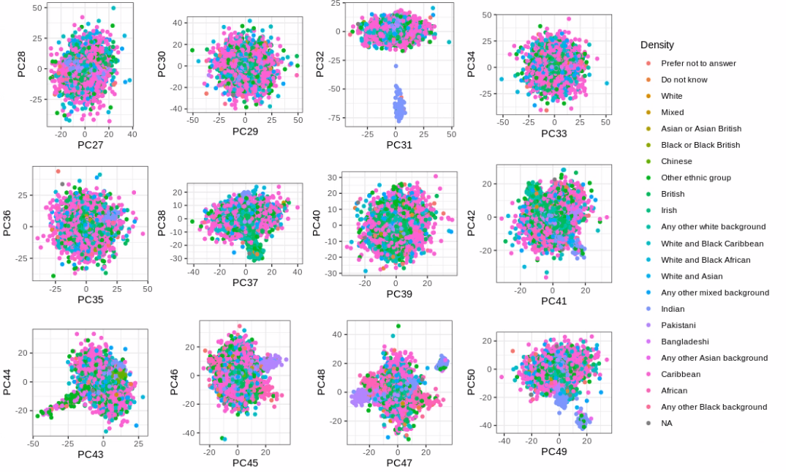

```{r setup, include=FALSE}
# renderthis::to_pdf("ldpred2-wcpg2023.Rmd", partial_slides = TRUE)
options(htmltools.dir.version = FALSE, width = 70)
knitr::opts_chunk$set(fig.align = 'center', dev = "svg", out.width = "70%",
                      echo = FALSE, comment = "", fig.width = 5, global.par = TRUE)
ICON_R_PROJECT <- icons::fontawesome$brands$`r-project`
ICON_TRI_EXCL  <- icons::fontawesome$solid$`exclamation-triangle`
ICON_INFO      <- icons::fontawesome$solid$`info-circle`
```

class: title-slide center middle inverse

<br>

# Automated Subsampling<br>for Balancing Overrepresented Groups<br>in Principal Component Analysis

<br>

<br>

## Florian Privé 
### Aarhus University (DK)
#### `r icons::icon_style(fill = "white", icons::fontawesome$brands$twitter)` `r icons::icon_style(fill = "white", icons::fontawesome$brands$github)` privefl

---

### PCA of genetic data captures continental population structure

<br>

```{r, out.width="100%"}
knitr::include_graphics("figures/PCA-UKBB-Bycroft.png")
```

---

### PCA also captures sub-continental population structure

```{r, out.width="80%"}
knitr::include_graphics("figures/PCA-POPRES-EUR.png")
```

---

### Distance in PCA measures genetic distance

<br>

```{r, out.width="100%"}
knitr::include_graphics("figures/compare-Euclidean-to-Fst.png")
```

.footnote[Source: https://doi.org/10.1016/j.ajhg.2021.11.008]

---

class: inverse, center, middle

# Distortion in PCA

---

### The effect of uneven sampling on PCA ([McVean 2009](https://doi.org/10.1371/journal.pgen.1000686))

```{r, out.width="52%"}
knitr::include_graphics("figures/PCA-distortion.png")
```

---

### Two solutions to this problem

--

<br>

- weighted PCA    
(less straightforward to compute)

- subsampling of overrepresented group(s)    
(what I tried)

---

class: inverse, center, middle

# Capturing more population structure
# with less individuals

---

```{r, out.width="100%"}
knitr::include_graphics("figures/paper4-2.png")
```

--

<br>

In the UK Biobank,

- only 16 PCs actually capture population structure 

- PC 19--40 capture LD; do not use these!

--

<br>

When subsampling British and Irish individuals 

- can obtain 40 PCs that capture some population structure

---

### PCA after subsampling, in the UK Biobank

- Subsampling 10,000 British individuals (2.3%) 
- and 5000 Irish individuals (39,2%), 
- while keeping all indiv with other or unknown self-reported ancestry.

```{r, out.width="100%"}
knitr::include_graphics("https://github.com/privefl/paper4-bedpca/blob/master/UKBB-scores-restricted.png?raw=true")
```

---

### Can we do better than this?

<br>

- the numbers kept are a bit arbitrary

- what if the self-reported ancestry is missing or inaccurate?

<br>

$\Longrightarrow$ design an algorithm that does not use this information

---

### Idea: discard points/individuals in dense regions

<br>

Using 16 PCs in the UK Biobank,

1. Compute densities of all points    
as the sum of inverse of squared Euclidean distances with all other points

2. Discard the point (individual) with the largest density

3. Update the densities 

4. Iterate 2. and 3. until N points are left

---

### Ancestry composition of subsamples

<br>

```{r, out.width="100%"}
knitr::include_graphics("figures/subsample_ancestry_ukbb2.png")
```

---

### Density and subsample of "Prefer not to answer" individuals 

<br>

```{r, out.width="100%"}
knitr::include_graphics("figures/subsample_NoAnswer_ukbb2.png")
```

---

### Density and subsample of "White" individuals 

<br>

```{r, out.width="100%"}
knitr::include_graphics("figures/subsample_White_ukbb2.png")
```

---

### PCA after subsampling, in the UK Biobank (2.1)

<br>

```{r, out.width="100%"}
knitr::include_graphics("figures/PCA2-restricted3-26.png")
```

---

### PCA after subsampling, in the UK Biobank (2.2)

<br>

```{r, out.width="100%"}

```

---

### Future work

<br>

- understand why I get less added population structure

- consider infinity distance and scaling

- have some other criterion for assessing the "amount" of ancestry captured

---

class: inverse, center, middle

## Thank you for your attention

<br>
<br>
<br>

`r icons::icon_style(fill = "white", icons::fontawesome$brands$twitter)` `r icons::icon_style(fill = "white", icons::fontawesome$brands$github)` privefl
