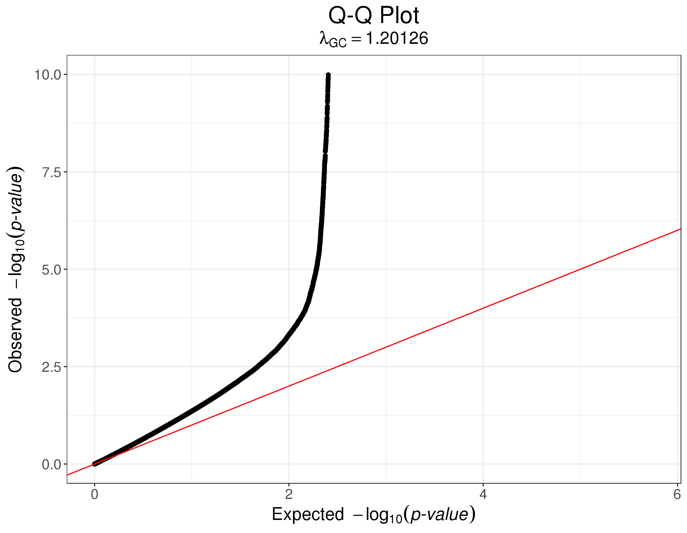
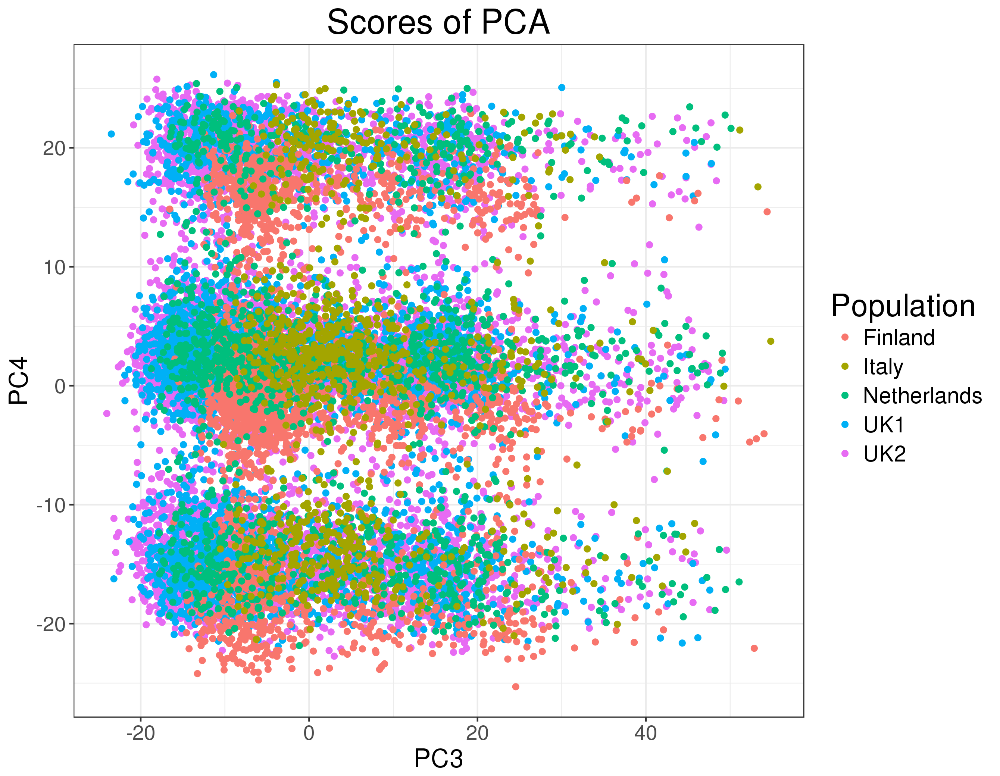
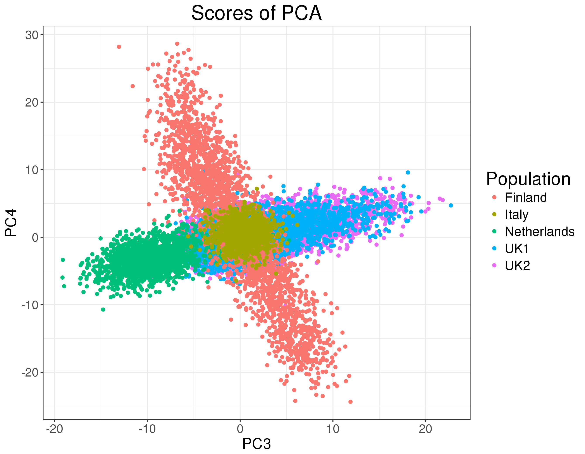

```{r setup, include=FALSE}
options(htmltools.dir.version = FALSE)
knitr::opts_chunk$set(fig.align = "center", dev = "svg",
                      fig.asp = 0.7, out.width = "80%", echo = FALSE)
```

## Outline 

1. Main objective of the thesis

2. Data analyzed

3. R packages

4. Future work

---

class: center, middle, inverse

# Main objective

---

## Compute polygenic risk scores 
### in order to differentiate a healthy person from a diseased person

```{r}
knitr::include_graphics("figures/density-scores.jpeg")
```

---

## Usefulness

### Precision medecine

```{r, out.width="100%"}
knitr::include_graphics("https://www.ucdmc.ucdavis.edu/precision-medicine/images/pmSlide1.jpg")
```

.footnote[Source: https://www.ucdmc.ucdavis.edu/precision-medicine/]

---

## Data analyzed for now

### case/control cohort for the celiac disease

---

## Celiac disease

### Intolerance to gluten

```{r, out.width="60%"}
knitr::include_graphics("http://www.strettoweb.com/wp-content/uploads/2016/12/celiaci.jpg")
```

<center>is the only treatment.

---

## Celiac disease

### Prevalence of 1% in western countries but..

```{r, out.width="100%"}
knitr::include_graphics("https://www.beyondceliac.org/SiteData/images/FastFacts2/413d26a2a7026920/FastFacts_2.png")
```

.footnote[Source: https://www.beyondceliac.org/celiac-disease/facts-and-figures/]

---

## Celiac disease

### The dataset: SNP array with

</br>
```{r}
celiac.data <- tibble::tribble(
  ~Population,   ~UK, ~Finland, ~Netherlands, ~Italy, ~Total,
      "Cases",  2586,      647,          803,    497,   4533,
   "Controls",  7532,     1829,          846,    543,  10750,
      "Total", 10118,     2476,         1649,   1040,  15283
)
knitr::kable(celiac.data, format = "html", align = "lccccr")
```

</br>

<center>over ~300K SNPs</center>

</br>

This data would take **32GB** if stored in RAM as a standard R matrix.

---

class: center, middle, inverse

# Polygenic Risk Scores

---

## Standard model used in the human litterature

### P+T procedure, begins with a GWAS

```{r, out.width="90%"}
knitr::include_graphics("figures/celiac-gwas-cut.png")
```

<center>+ Pruning and Thresholding

---

### All steps required in the P+T procedure.

```{r}
knitr::include_graphics("figures/steps-PT.svg")
```

---

### PCA in GWAS?

<br><br>

```{r, out.width="70%", fig.cap="Inflated Q-Q plot when not correcting for population structure."}

```

---

### PCA in GWAS?

Principal Components to adjust for the condounding effect of population structure (Patterson,
Price, and Reich 2006).

```{r, out.width="70%", fig.cap="Less inflated Q-Q plot when correcting for population structure."}
knitr::include_graphics("figures/qqplot2.png")
```

---

## How to perform PCA for genetic data?

### On the whole (scaled) matrix

```{r, out.width="70%"}
knitr::include_graphics("figures/PC-1-2.png")
```

---

## How to perform PCA for genetic data?

### On the whole (scaled) matrix

```{r, out.width="70%"}

```

---

## How to perform PCA for genetic data?

### On the whole (scaled) matrix **with pruning** (Abdellaoui et al. 2013)

```{r, out.width="70%"}

```

---

## How to perform PCA for genetic data?

### On the whole (scaled) matrix **with pruning**

```{r, out.width="70%"}
knitr::include_graphics("figures/PC3-3-4.png")
```

---

## How to perform PCA for genetic data?

### Capture long-range LD regions of chromosomes 6 and 8

```{r, out.width="70%"}

```

---

### Long-range LD regions for the human genome (Price et al. 2008)

```{r}
DT::datatable(bigsnpr::LD.wiki34, rownames = FALSE, 
              options = list(pageLength = 7))
```


.Footnote[Source: https://goo.gl/wTPY7n]

---

## How to perform PCA for genetic data?

### When removing long-range LD regions and pruning

```{r, out.width="70%"}

```

.Footnote[Source: https://goo.gl/wTPY7n]

---

## Not sure that people always do it correctly

- Importance of PCA in genetic association studies: 

```{r}

```

- Importance of pruning in computing PCA:

```{r}

```

Maybe not make another paper about it, but certainly a vignette for the package.

---

class: center, middle, inverse

# Polygenic Risk Scores

## Another approach

---

## Recall of what we want to achieve

### Predict a phenotype: pitfalls of the P+T model

- Weigths learned independently

- Correlation taken care of heuristically (with pruning)

- Regularization taken care of heuristically (with thresholding)

### A better solution?

For example, for binary outcomes, why not using

- logistic regression 

- Support Vector Machine (SVM)

on the whole matrix (+ PCs)?

---

class: center, middle, inverse

# Big Data

### Simpler solutions are easier to implement

---

## My first paper (as a preprint)

```{r, fig.asp=0.9}
knitr::include_graphics("figures/mypaper.png")
```


---

class: center, middle, inverse

# Thanks!

### Presentation available at
### https://privefl.github.io/thesis-docs/suivi-these.html

.footnote[Slides created via the R package [**xaringan**](https://github.com/yihui/xaringan).]
