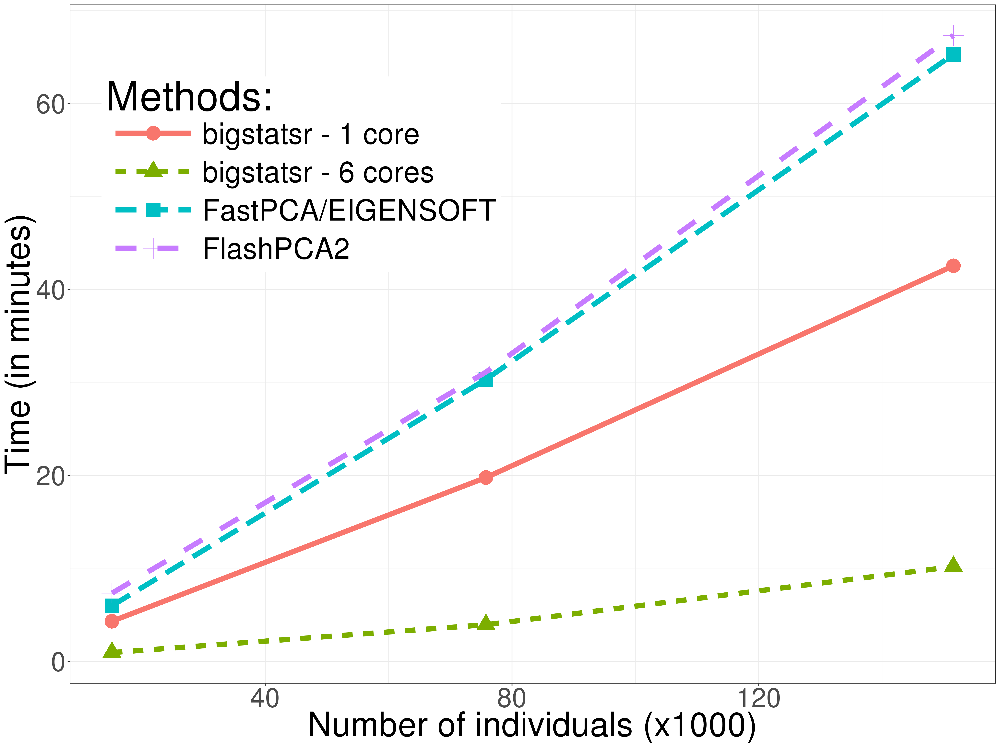
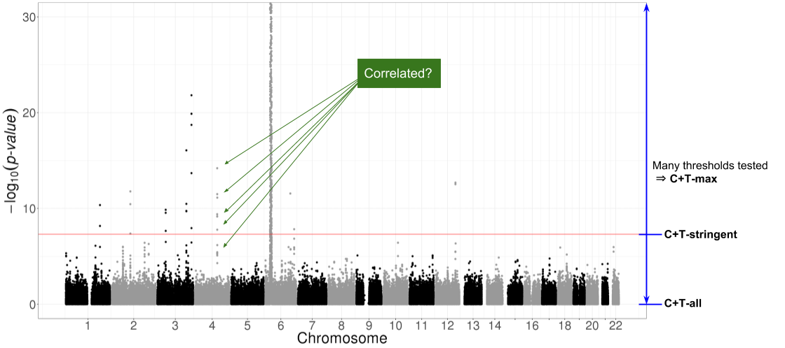
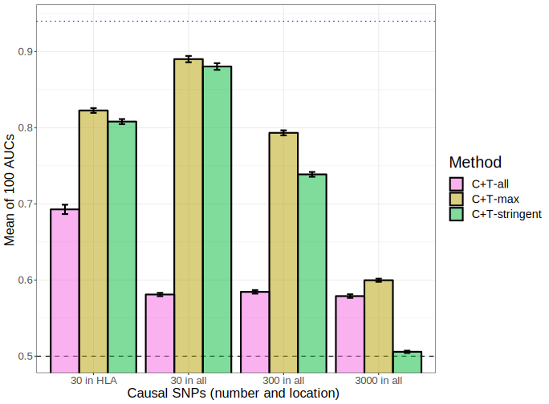
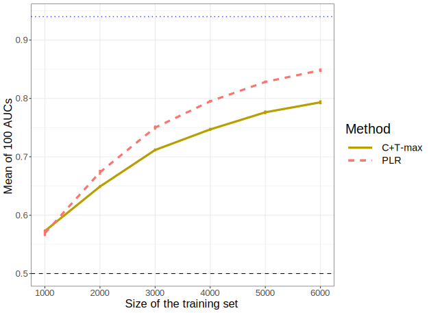
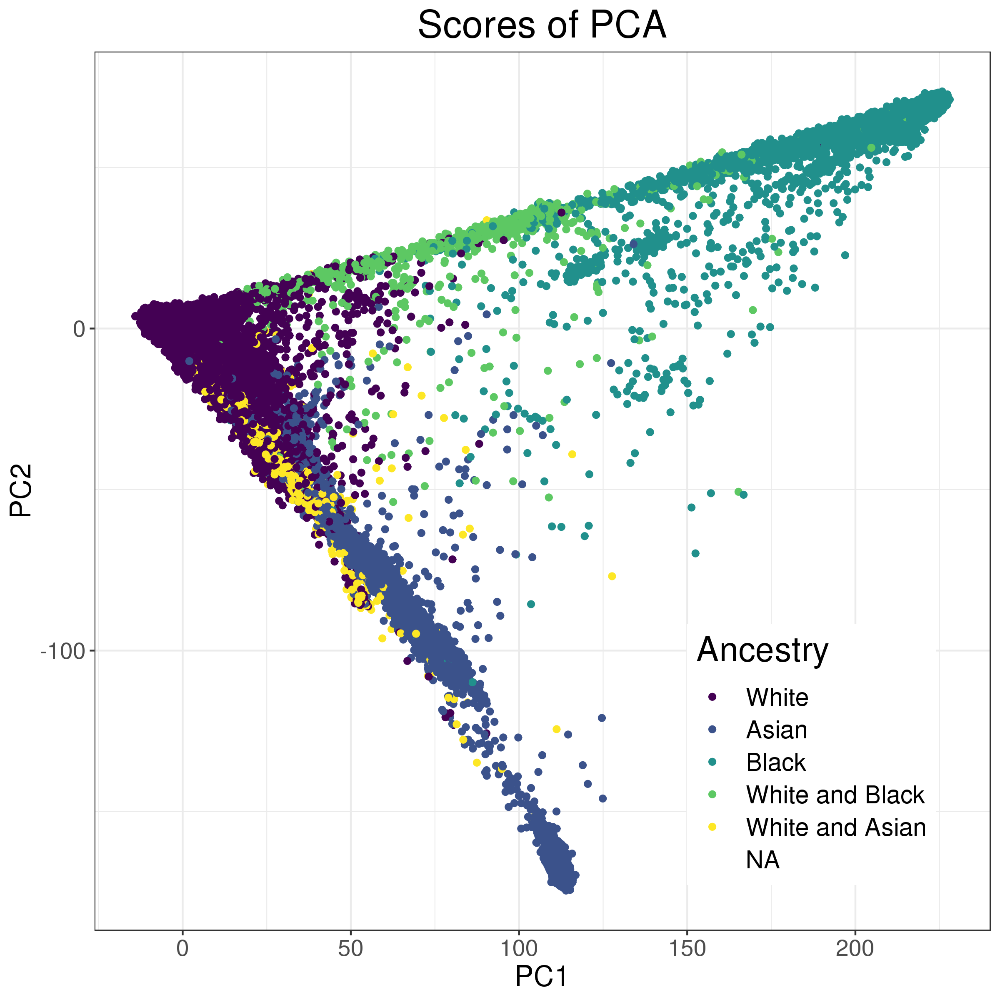
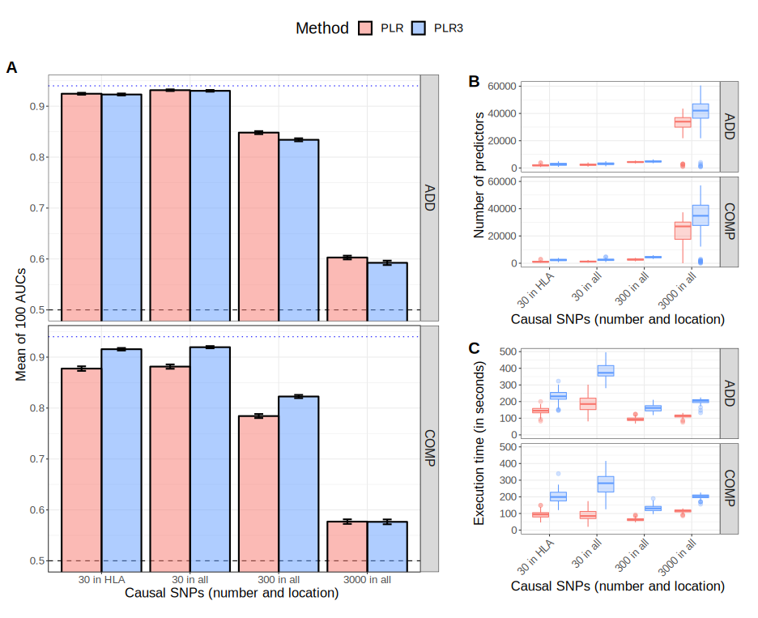
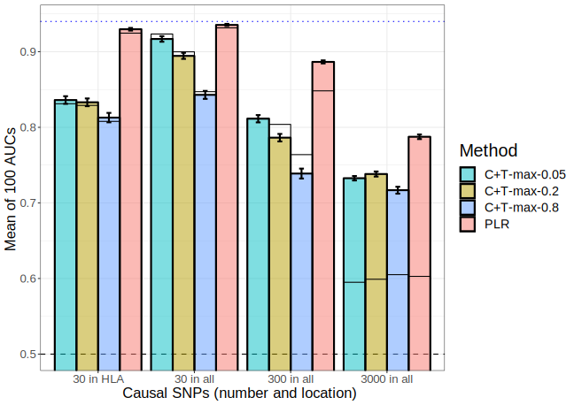

```{r setup, include=FALSE}
options(htmltools.dir.version = FALSE)
knitr::opts_chunk$set(fig.align = "center", dev = "svg",
                      fig.asp = 0.7, out.width = "80%", echo = FALSE)
```

## Outline

<br>

### Introduction 

### Recall of 1st year

### Results of 2nd year

### Planning for 3rd year

---

class: center, middle, inverse

# Introduction

---

## Disease architectures

```{r, out.width="75%", fig.cap = "<small>Source: 10.1126/science.338.6110.1016</small>"}
knitr::include_graphics("figures/disease-archi.gif")
```

---

## Disease architectures

```{r, out.width="76%"}
knitr::include_graphics("figures/disease-archi.png")
```

.footnote2[How to derive a genetic risk score for common diseases based on common variants with small effects?] 

---

## Interest in prediction: polygenic risk scores (PRS)

- Wray, Naomi R., Michael E. Goddard, and Peter M. Visscher. "**Prediction of individual genetic risk** to disease from genome-wide association studies." Genome research 17.10 (**2007**): 1520-1528.

- Wray, Naomi R., et al. "Pitfalls of **predicting complex traits** from SNPs." Nature Reviews Genetics 14.7 (**2013**): 507.

- Dudbridge, Frank. "Power and **predictive accuracy of polygenic risk scores**." PLoS genetics 9.3 (**2013**): e1003348.

- Chatterjee, Nilanjan, Jianxin Shi, and Montserrat García-Closas. "Developing and evaluating **polygenic risk prediction** models for stratified disease prevention." Nature Reviews Genetics 17.7 (**2016**): 392.

- Martin, Alicia R., et al. "Human demographic history impacts **genetic risk prediction** across diverse populations." The American Journal of Human Genetics 100.4 (**2017**): 635-649.

.footnote2[Still a gap between current predictions and clinical utility.</br>Need more optimal predictions + larger sample sizes.]

---

class: center, middle, inverse

# Recall of 1st year

### Developing tools to help

### researchers (me!) in their analysis

---

## What I want to be able to do

### Data analysis on large-scale genotype matrices!

- Be fast to test many ideas quickly

    - code should be fast
    - I shouldn't have to make many conversions between formats
    - easily combine multiple functions
    
- Not be restricted in my analysis
   
    - Basically use all I already know in `r icon::fa_r_project()`
    
- Work on my computer (interactively)

    - I have 64 GB of RAM and 12 cores
    - Working on a server is not as easy as on my computer

<br><center>**Smooth and fast analysis!**

---

## Memory solution when working in `r icon::fa_r_project()`

<br>

```{r}
knitr::include_graphics("https://privefl.github.io/RR18/memory-solution.svg")
```

---

## My first paper

<a href="https://doi.org/10.1093/bioinformatics/bty185" target="_blank">
```{r, fig.asp=0.9}
knitr::include_graphics("figures/bty185.png")
```
</a>

<br>

### Two R packages: {bigstatsr} and {bigsnpr}

<br>

- {bigstatsr} for many types of matrix, to be used by any field of research

- {bigsnpr} for functions which are specific to the analysis of SNP arrays


.footnote[I've presented {bigstatsr} at 3 `r icon::fa_r_project()` conferences.]

---

## Comparative performance

### Computing partial SVD

```{r}

```

---

class: center, middle, inverse

# Results of 2nd year

### Comparing models for computing

### Polygenic Risk Scores (PRS)

---

## Standard PRS - part 1: estimating effects

### Genome-wide association studies (GWAS)

In a GWAS, each single-nucleotide polymorphism (SNP) is tested **independently**, resulting in one **effect size** $\hat\beta$ and one **p-value** $p$ for each SNP. 

```{r, out.width="75%"}
knitr::include_graphics("figures/celiac-gwas-cut.png")
```

Easy combining: $PRS_i = \sum \hat\beta_j \cdot G_{i,j}$

---

## Standard PRS - part 2: restricting predictors

### <span style="color:#38761D">Clumping</span> + <span style="color:#1515FF">Thresholding</span> (<span style="color:#38761D">C</span>+<span style="color:#1515FF">T</span>)

<br>

```{r, out.width="90%"}

```

$$PRS_i = \sum_{\substack{j \in S_\text{clumping} \\ p_j~<~p_T}} \hat\beta_j \cdot G_{i,j}$$

---

## A more optimal approach to computing PRS?

In C+T: weights learned independently and heuristics for correlation and regularization.

#### Statistical learning

- joint models of all SNPs at once

- use regularization to account for correlated and null effects

- already proved useful in the litterature (Abraham et al. 2013; Okser et al. 2014; Spiliopoulou et al. 2015)

#### Our contribution

- a memory- and computation-efficient implementation to be used for biobank-scale data

- an automatic choice of the regularization hyper-parameter

- a comprehensive comparison for different disease architectures

---

class: center, middle, inverse

# Methods

---

## Penalized Logistic Regression (PLR)

<br>

<Small>$$\arg\!\min_{\beta_0,~\beta}(\lambda, \alpha)\left\{  \underbrace{ -\sum_{i=1}^n \left( y_i \log\left(p_i\right) + (1 - y_i) \log\left(1 - p_i\right) \right) }_\text{Loss function}   +   \underbrace{ \lambda \left((1-\alpha)\frac{1}{2}\|\beta\|_2^2 + \alpha \|\beta\|_1\right) }_\text{Penalization}  \right\}$$</Small>

<br>

***

- $p_i=1/\left(1+\exp\left(-(\beta_0 + x_i^T\beta)\right)\right)$

- $x$ is denoting the genotypes and covariables (e.g. principal components), 

- $y$ is the disease status we want to predict, 

- $\lambda$ is a regularization parameter that needs to be determined and

- $\alpha$ determines relative parts of the regularization $0 \le \alpha \le 1$. 

---

### Efficient algorithm

- sequential strong rules for discarding predictors in lasso-type problems (Tibshirani et al. 2012; Zeng et al. 2017)

- implemented in our R package {bigstatsr} 

<a href="https://doi.org/10.1093/bioinformatics/bty185" target="_blank">
```{r, out.width="65%"}
knitr::include_graphics("figures/bty185.png")
```
</a>

<br>

#### Our implementation

- uses memory-mapping to matrices stored on disk

- functioning choice of the hyper-parameter $\lambda$ + embedded grid-search for $\alpha$

- early stopping criterion to fasten the overall procedure

---

### Choice of the hyper-parameter $\lambda$ 

```{r, out.width="80%"}
knitr::include_graphics("figures/simple-CMSA.png")
```

---

## Comprehensive simulations: varying many parameters

#### Simulation models

```{r, out.width="80%"}
knitr::include_graphics("figures/table2-simus.png")
```

#### Methods

- C+T: 
    - C+T-all (no p-value thresholding), 
    - C+T-stringent (GWAS threshold of significance) and
    - C+T-max (best prediction for all thresholds, considered as an upper-bound)

- PLR: penalized logistic regression with automatic selection of hyper-parameters

---

## Predictive performance measures

**AUC** (Area Under the ROC Curve) and partial AUC (FPR < 10%) are used.

```{r, out.width="50%"}
knitr::include_graphics("https://i.stack.imgur.com/5x3Xj.png")
```

<br>

$$\text{AUC} = P(S_\text{case} > S_\text{control})$$

---

class: center, middle, inverse

# Results

---

### Higher predictive performance with PLR

```{r, out.width="75%"}
knitr::include_graphics("figures/pres2-AUC-logit.svg")
```

.footnote2[Penalized logistic regression consistently provides higher predictive performance, especially when there are correlated variables.]

---

### Predictive performance of C+T method varies with threshold

```{r, out.width="75%"}

```

.footnote2[Recall that prediction of C+T-max is an upper-bound of the prediction provided by the C+T method.]

---

### Prediction with PLR is improving faster (Scenario #3)

```{r, out.width="75%"}

```

.footnote2[Performance of methods improve with larger sample size. Yet, PLR is improving faster than C+T.]

---

## Real data

<br>

#### Celiac disease

- intolerance to gluten

- only treatment: gluten-free diet

- heritability: 57-87% (Nisticò et al. 2006)

- prevalence: 1-6%

<br>

#### Case-control study for the celiac disease (WTCCC, Dubois et al. 2010)

- ~15,000 individuals

- ~280,000 SNPs

- ~30% cases

---

### Results: real Celiac phenotypes

```{r, out.width="95%"}
knitr::include_graphics("figures/results-celiac2.png")
```

```{r, out.width="55%"}
knitr::include_graphics("figures/celiac-roc2.svg")
```

---

class: center, middle, inverse

# Discussion

---

### Summary of our penalized regression as compared to the C+T method

- A more **optimal** approach for predicting complex diseases

- models that are **linear** and very **sparse** 

- very **fast**

- **automatic choice** for the regularization parameter

- can be extended to capture also recessive and dominant effects

<br>

### Prospects: future work using the UK Biobank

- use of external summary statistics to improve models

- better generalization to multiple populations

- integration of clinical and environmental data

---

class: center, middle, inverse

# Planning for 3rd year

### + early results usink the UK biobank

---

### Planning for 3rd year

#### End of 2018

- Publication of second paper
- Exploratory analysis for 3rd paper
- Starting thesis writing

#### Early 2019

- Teaching (Advanced R for doctoral school + statistics at ENSIMAG)
- Final analysis + wirting of third paper
- Getting my DNA sequenced and analyzing it!

#### Until July 2019

- Submission of 3rd paper
- Finishing writing thesis
- International R Conference useR!2019 in Toulouse

#### The end

- Answer reviews for 3rd paper
- Thesis defense

---

class: center, middle, inverse

# Pitfalls of penalized regression

---

## Penalization is too strong when there are large effects (sex for height)

$$\text{height} \sim \text{SNPs} + \text{PCs} + \text{sex}$$

```{r, out.width="70%"}
knitr::include_graphics("figures/pred-with-sex.png")
```

---

## Better prediction, but still too conservative

$$\text{height} \sim \text{base} + \text{SNPs} + \text{PCs} + \text{sex}$$
$$\text{base:}~~\text{height} \sim \text{sex}$$

.footnote[A solution is to adjust for these strong effects before fitting the model (as a base prediction).]

---

class: center, middle, inverse

# How to combine the information<br>of multiple studies?

## (possibly of different populations)

---

## Genetics are different between populations

```{r, out.width="60%"}

```

.footnote[Produced with our R packages (450K people from the UK biobank)]

---

## which makes predictions fail on external populations

```{r, out.width="63%", fig.cap="<small>Source: 10.1016/j.ajhg.2017.03.004</small>"}
knitr::include_graphics("figures/pred-pops.jpg")
```

---

## Genomics is failing on diversity

```{r, out.width="70%", fig.cap="<small>Source: 10.1038/538161a</small>"}
knitr::include_graphics("figures/Genomics_ethnicity_2016_COMMENT_WEB.jpg")
```

---

## What can we do about it?

<br>

We can use information from other studies (possibly in other populations)

<br>

```{r, out.width="95%"}
knitr::include_graphics("figures/update-base-pred.png")
```

<br>

**Will this improve prediction?**

<!-- .footnote[This is the topic of our next paper.] -->

---

class: center, middle, inverse

# Thanks!

<br>

Presentation: https://privefl.github.io/thesis-docs/suivi-these2.html

R package {bigstatsr}: https://github.com/privefl/bigstatsr

R package {bigsnpr}: https://github.com/privefl/bigsnpr

<br>

`r icon::fa("twitter")` [privefl](https://twitter.com/privefl) &nbsp;&nbsp;&nbsp;&nbsp; `r icon::fa("github")` [privefl](https://github.com/privefl) &nbsp;&nbsp;&nbsp;&nbsp; `r icon::fa("stack-overflow")` [F. Privé](https://stackoverflow.com/users/6103040/f-priv%c3%a9)

.footnote[Slides created via the R package [**xaringan**](https://github.com/yihui/xaringan).]


---

## Real genotype data

Use real data from a case-control study for the Celiac disease.

```{r, out.width="95%"}
knitr::include_graphics("figures/PC1-4.png")
```

Keep only **controls** from the **UK** and **not deviating from the robust Malahanobis distance**.

---

## Simulate new phenotypes

### The liability-threshold model

```{r, out.width="65%"}
knitr::include_graphics("figures/LTM.png")
```

---

### Two models of liability

#### Model "ADD"

$$y_i = \underbrace{\sum_{j\in S_\text{causal}} w_j \cdot \widetilde{G_{i,j}}}_\text{genetic effect} + \underbrace{\epsilon_i}_\text{environmental effect}$$ 

#### Model "COMP"

$$y_i = \underbrace{\sum_{j\in S_\text{causal}^{(1)}} w_j \cdot \widetilde{G_{i,j}}}_\text{linear} + \underbrace{\sum_{j\in S_\text{causal}^{(2)}} w_j \cdot \widetilde{D_{i,j}}}_\text{dominant} + \underbrace{\sum_{\substack{k=1 \\ j_1=e_k^{(3.1)} \\ j_2=e_k^{(3.2)}}}^{k=\left|S_\text{causal}^{(3.1)}\right|} w_{j_1} \cdot \widetilde{G_{i,j_1} G_{i,j_2}}}_\text{interaction} + \epsilon_i$$ 

***

- $w_j$ are **weights** (generated with a Gaussian or a Laplace distribution)
- $G_{i,j}$ is the **allele count** of individual $i$ for SNP $j$
- $D_{i,j} = \mathbf{1}\left\{G_{i,j} \neq 0\right\}$

---

### Extension via feature engineering

<br>

We construct a separate dataset with, for each SNP variable, two more variables coding for recessive and dominant effects.

<br>

```{r, out.width="100%"}
knitr::include_graphics("figures/triple.png")
```

.footnote[We call these two methods "PLR" and "PLR3".]

---

### Feature engineering improves prediction

```{r, out.width="90%"}

```

---

### Prediction with PLR is improving faster (Scenario #2)

<br>

```{r}

```

<!-- .footnote[Aims at increasing the polygenicity of the simulated models and at virtually increasing the sample size.] -->
