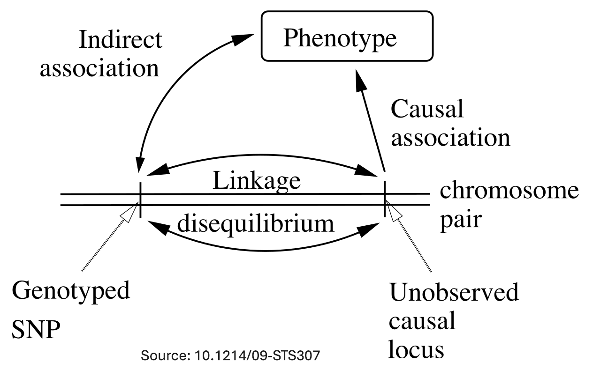

```{r setup, include=FALSE}
# renderthis::to_pdf("ldpred2-wcpg2023.Rmd", partial_slides = TRUE)
options(htmltools.dir.version = FALSE, width = 70)
knitr::opts_chunk$set(fig.align = 'center', dev = "svg", out.width = "70%",
                      echo = FALSE, comment = "", fig.width = 5, global.par = TRUE)
ICON_R_PROJECT <- icons::fontawesome$brands$`r-project`
ICON_TRI_EXCL  <- icons::fontawesome$solid$`exclamation-triangle`
ICON_INFO      <- icons::fontawesome$solid$`info-circle`
```

class: title-slide center middle inverse

<br>

# &mdash;**MAGNIFIC**&mdash;
# <u>Ma</u>ximizing <u>G</u>e<u>n</u>et<u>i</u>c <u>F</u>indings and Pred<u>ic</u>tion

<br>

<br>

## Florian Privé 
### Aarhus University (DK)
#### <svg xmlns="http://www.w3.org/2000/svg" viewBox="0 0 576 512" width="1em" height="1em"><path d="M407.8 294.7c-3.3-.4-6.7-.8-10-1.3c3.4 .4 6.7 .9 10 1.3zM288 227.1C261.9 176.4 190.9 81.9 124.9 35.3C61.6-9.4 37.5-1.7 21.6 5.5C3.3 13.8 0 41.9 0 58.4S9.1 194 15 213.9c19.5 65.7 89.1 87.9 153.2 80.7c3.3-.5 6.6-.9 10-1.4c-3.3 .5-6.6 1-10 1.4C74.3 308.6-9.1 342.8 100.3 464.5C220.6 589.1 265.1 437.8 288 361.1c22.9 76.7 49.2 222.5 185.6 103.4c102.4-103.4 28.1-156-65.8-169.9c-3.3-.4-6.7-.8-10-1.3c3.4 .4 6.7 .9 10 1.3c64.1 7.1 133.6-15.1 153.2-80.7C566.9 194 576 75 576 58.4s-3.3-44.7-21.6-52.9c-15.8-7.1-40-14.9-103.2 29.8C385.1 81.9 314.1 176.4 288 227.1z" fill="white"/></svg> `r icons::icon_style(fill = "white", icons::fontawesome$brands$github)` privefl

---

### About me

<br>

--

- [2013&#8211;2016] Engineer in Informatics and Applied Mathematics (ENSIMAG)

--

- [2016&#8211;2019] PhD with Michael Blum (TIMC, Grenoble)     
$~~~~$and Hugues Aschard (Institut Pasteur, Paris),    
$~~~~$developing statistical learning methods in human genetics

--

- [2017&#8211;2019] Founder and organizer of the R user group of Grenoble

--

- [2018&#8211;] Teaching an advanced R course for PhD students

--

- [2019&#8211;2022] Postdoc at Aarhus University (Denmark)

- [2022&#8211;] Senior Researcher (same place)

--

- [2021&#8211;] Working remotely from France (near Lyon)

--

- Plan to apply to be a CRCN

---

class: center middle inverse

# Introduction & Motivation

---

### Personalized medicine: best predict disease risk 

<br>

```{r, out.width="100%"}
knitr::include_graphics("figures/personalized-medicine.png")
```

---

### Polygenic (Risk) Scores (PGS or PRS)

An additive model: $y_i = \sum_j \beta_j x_{i,j} + \epsilon$    
$y_i$: phenotypes &ndash; $x_{i,j}$: genotypes &ndash; $\beta_j$: PGS effect sizes &ndash; $\epsilon$: environmental effect

```{r, out.width="95%"}
knitr::include_graphics("figures/PRS.png")
```

---

### Using PGS to modify risk assessment from traditional risk factors

<br>

```{r, out.width="100%"}
knitr::include_graphics("figures/PRS-risk.PNG")
```

---

### Modification of Lifetime Breast Cancer Risk for Pathogenic Variant Carriers and Noncarriers by an 86–Single-Nucleotide Variant Score

<br>

```{r, out.width="85%"}
knitr::include_graphics("figures/PRS-cancer-risk.png")
```

---

class: center, middle, inverse

# A major limitation of polygenic scores:

# their poor portability across ancestries

---

### Predictive performance drops with genetic distance to training

```{r, out.width="88%"}
knitr::include_graphics("figures/ratio-dist-2.png")
```

<!-- <span class="footnote">Recall: $\text{dist}_{PC}^2 \propto F_{ST}$</span> -->

---

### One possible explanation: different tagging

<br>

```{r, out.width="75%"}

```

<br>

***

Linkage disequilibrium = correlation between genetic variants    
(can be much different across populations)

---

class: center, middle, inverse

# Conclusion

---

### Take-home messages

<br>

- We can predict traits and diseases from genetic data    
(up to the heritability)

--

- One can use supervised learning methods when individual-level data is available (but, beware scalability)

--

- Many methods using summary statistics only have been developed (because we can easily obtain larger sample sizes through meta-analysis)

--

- For some traits, we have large sample sizes (e.g. 5M for height), but we still need larger sample sizes for most complex traits and diseases

--

- We still need to address the concern of providing PGS that work well in ALL ancestries    
This could be achieved by recruiting more people from non-European ancestries, and developing new methods for multi-ancestry training

---

class: inverse, center, middle

## Thank you for your attention

<br>
<br>
<br>

<svg xmlns="http://www.w3.org/2000/svg" viewBox="0 0 576 512" width="1em" height="1em"><path d="M407.8 294.7c-3.3-.4-6.7-.8-10-1.3c3.4 .4 6.7 .9 10 1.3zM288 227.1C261.9 176.4 190.9 81.9 124.9 35.3C61.6-9.4 37.5-1.7 21.6 5.5C3.3 13.8 0 41.9 0 58.4S9.1 194 15 213.9c19.5 65.7 89.1 87.9 153.2 80.7c3.3-.5 6.6-.9 10-1.4c-3.3 .5-6.6 1-10 1.4C74.3 308.6-9.1 342.8 100.3 464.5C220.6 589.1 265.1 437.8 288 361.1c22.9 76.7 49.2 222.5 185.6 103.4c102.4-103.4 28.1-156-65.8-169.9c-3.3-.4-6.7-.8-10-1.3c3.4 .4 6.7 .9 10 1.3c64.1 7.1 133.6-15.1 153.2-80.7C566.9 194 576 75 576 58.4s-3.3-44.7-21.6-52.9c-15.8-7.1-40-14.9-103.2 29.8C385.1 81.9 314.1 176.4 288 227.1z" fill="white"/></svg> `r icons::icon_style(fill = "white", icons::fontawesome$brands$github)` privefl
