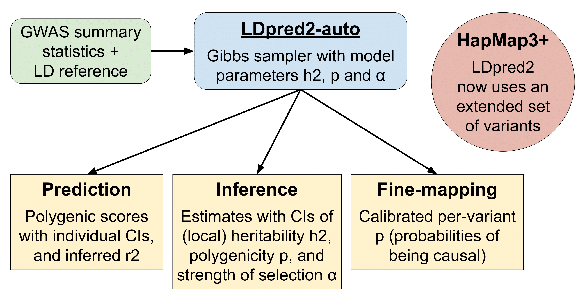
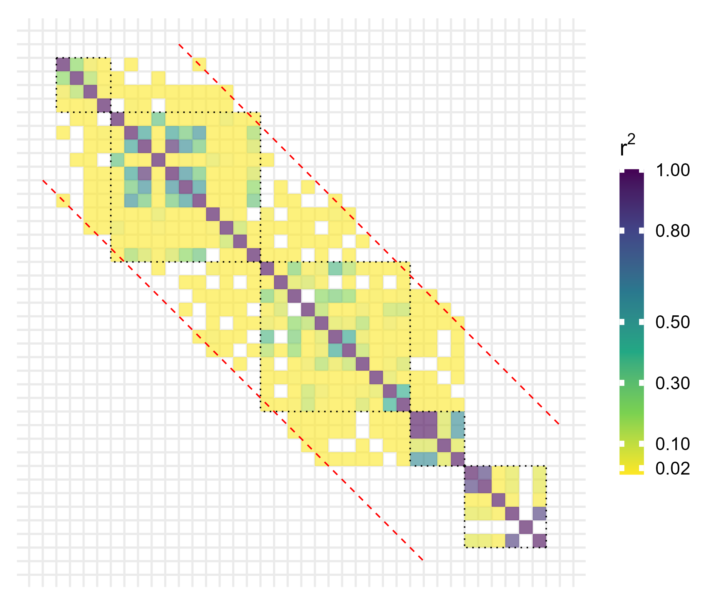
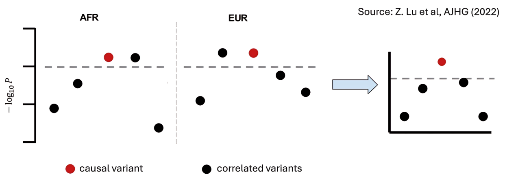

```{r setup, include=FALSE}
# renderthis::to_pdf("ldpred2-wcpg2023.Rmd", partial_slides = TRUE)
options(htmltools.dir.version = FALSE, width = 70)
knitr::opts_chunk$set(fig.align = 'center', dev = "svg", out.width = "70%",
                      echo = FALSE, comment = "", fig.width = 5, global.par = TRUE)
ICON_R_PROJECT <- icons::fontawesome$brands$`r-project`
ICON_TRI_EXCL  <- icons::fontawesome$solid$`exclamation-triangle`
ICON_INFO      <- icons::fontawesome$solid$`info-circle`
```

class: title-slide center middle inverse

<br>

# &mdash;**MAGNIFIC**&mdash;
# <u>Ma</u>ximizing <u>G</u>e<u>n</u>et<u>i</u>c <u>F</u>indings and Pred<u>ic</u>tion

<br>

<br>

## Florian Privé 
### Aarhus University (DK)
#### <svg xmlns="http://www.w3.org/2000/svg" viewBox="0 0 576 512" width="1em" height="1em"><path d="M407.8 294.7c-3.3-.4-6.7-.8-10-1.3c3.4 .4 6.7 .9 10 1.3zM288 227.1C261.9 176.4 190.9 81.9 124.9 35.3C61.6-9.4 37.5-1.7 21.6 5.5C3.3 13.8 0 41.9 0 58.4S9.1 194 15 213.9c19.5 65.7 89.1 87.9 153.2 80.7c3.3-.5 6.6-.9 10-1.4c-3.3 .5-6.6 1-10 1.4C74.3 308.6-9.1 342.8 100.3 464.5C220.6 589.1 265.1 437.8 288 361.1c22.9 76.7 49.2 222.5 185.6 103.4c102.4-103.4 28.1-156-65.8-169.9c-3.3-.4-6.7-.8-10-1.3c3.4 .4 6.7 .9 10 1.3c64.1 7.1 133.6-15.1 153.2-80.7C566.9 194 576 75 576 58.4s-3.3-44.7-21.6-52.9c-15.8-7.1-40-14.9-103.2 29.8C385.1 81.9 314.1 176.4 288 227.1z" fill="white"/></svg> `r icons::icon_style(fill = "white", icons::fontawesome$brands$github)` privefl

---

```{css}
.footnote2 {
  position: absolute;
  bottom: 2em;
  padding-right: 4em;
  font-size: 16px;
}
```

### About me

<br>

--

- [2013&#8211;2016] Engineer in Informatics and Applied Mathematics (ENSIMAG)

--

- [2016&#8211;2019] PhD with Michael Blum (TIMC, Grenoble)     
$~~~~$and Hugues Aschard (Institut Pasteur, Paris),    
$~~~~$developing statistical learning methods in human genetics

--

- [2017&#8211;2019] Founder and organizer of the R user group of Grenoble

--

- [2018&#8211;] Teaching an advanced R course for PhD students

--

- [2019&#8211;2022] Postdoc at Aarhus University (Denmark)

- [2022&#8211;] Senior Researcher (same place)

--

- [2021&#8211;] Working remotely from France (near Lyon)

--

- Plan to apply to be a CRCN

---

class: center middle inverse

# Introduction & Motivation

---

### Personalized medicine: best predict disease risk 

#### A polygenic score is a new risk factor (a very interesting one!)

```{r, out.width="100%"}
knitr::include_graphics("figures/personalized-medicine.png")
```

---

### Disease genetic architecture

```{r, out.width="65%"}
knitr::include_graphics("figures/disease-archi.png")
```

--

- many common genetic variants contribute to the risk of common diseases

- but, they usually have a very small effect on their own

- however, a (weighted) sum of small effects can result in a very large effect

- this is called a polygenic (risk) score (PGS or PRS)

---

### Using PGS to modify risk assessment from traditional risk factors

<br>

```{r, out.width="100%"}
knitr::include_graphics("figures/PRS-risk.PNG")
```

---

### Modification of Lifetime Breast Cancer Risk for Pathogenic Variant Carriers and Noncarriers by an 86–Single-Nucleotide Variant Score

<br>

```{r, out.width="85%"}
knitr::include_graphics("figures/PRS-cancer-risk.png")
```

---

### LDpred2-auto: a widely-used PGS (and inference) method

```{r, out.width="95%"}

```

.footnote2[
**Privé, F.**, Arbel, J., & Vilhjálmsson, B.J. (2020). LDpred2: better, faster, stronger. *Bioinformatics*.

**Privé, F.**, Albiñana, C., Arbel, J., Pasaniuc, B., & Vilhjálmsson, B.J. (2023). Inferring disease architecture and predictive ability with LDpred2-auto. *The American Journal of Human Genetics*.
]

---

class: center, middle, inverse

# A major limitation of polygenic scores:

# their poor portability across ancestries

---

### Predictive performance drops with genetic distance to training

```{r, out.width="78%"}
knitr::include_graphics("figures/ratio-dist-2.png")
```

.footnote2[**Privé, F.**, Aschard, H., Carmi, S., Folkersen, L., Hoggart, C., O'Reilly, P.F., & Vilhjálmsson, B.J. (2022). Portability of 245 polygenic scores when derived from the UK Biobank and applied to 9 ancestry groups from the same cohort. *The American Journal of Human Genetics*.]

---

### Also at the individual level (instead of the group level)

```{r, out.width="95%"}

```

.footnote2[Ding, Y., Hou, K., Xu, Z., Pimplaskar, A., Petter, E., Boulier, K., **Privé, F.**, Vilhjálmsson, B.J., Loohuis, L.O. and Pasaniuc, B. (2023). Polygenic scoring accuracy varies across the genetic ancestry continuum in all human populations. *Nature*.]

---

### How to explain this drop in performance?

<br>

It has been recently shown that 

- causal variants are mostly similar across many populations

- their effect sizes are also very similar

--

<br>

The issue: 

- in practice, we often don't use causal variants 

- instead, we use tagging variants,    
highly correlated with the causal variants **in the training population**

--

- but correlations between tagging and causal variants **varies across populations**
  
- which reduces the predictive power of tagging variants **in other populations**.

---

class: center, middle, inverse

# The solution:

# Precisely identifying causal variants

---

### WP1: Using millions of genetic variants (problem)

- Causal variants need to be in the input data    
(around 10M common variants)

- The methods use the LD matrix (pairwise correlations between variants)

- This is a sparse matrix: banded or block-diagonal

- Takes 30 GB for 1M variants $\longrightarrow$ would take 3000 GB for 10M variants

```{r, out.width="52%"}

```

---

### WP1: Using millions of genetic variants (possible solutions)

<br>

- compact sparse format (divide size by 2)

- storing correlations with two bytes only (divide size by 4)

- matrix seriation $\longrightarrow$ reordering variants to make blocks smaller

- eigendecomposition or compression of the matrix

- adapt methods to use very sparse *inverse* covariance matrices 

---

### WP2: Leveraging functional annotations

#### How can functional categories be useful?

<br>

```{r, out.width="78%"}
knitr::include_graphics("figures/anno-enrich.png")
```

<br>
    
Can be used to modify prior probabilities of being causal in LDpred2-auto. 
     
---

### Functional annotations: the importance of using millions of variants

<br>

We must use many variants (WP1) to keep annotations useful

<br>

```{r, out.width="95%"}

```

---

### WP3: Leveraging multi-ancestry data

<br>

```{r, out.width="100%"}

```

<br>

Again, we need to make methods more scalable (WP1), to use multiple datasets here.

---

### WP4: Ensuring the quality and coverage of the training data

<br>

- there are lots of problems with the input data (GWAS summary statistics)

- which can causes lots of misspecifications and biases in the methods

.footnote2[**Privé, F.**, Arbel, J., Aschard, H., & Vilhjálmsson, B. J. (2022). Identifying and correcting for misspecifications in GWAS summary statistics and polygenic scores. *Human Genetics and Genomics Advances*.]

--

<br>

```{r, out.width="85%"}
knitr::include_graphics("figures/Imputation-QC-method-v2.png")
```

- I propose to implement a QC and imputation method (synergistic)

- and to provide a set of highly refined GWAS summary statistics

---

### Outputs from this project

- Better polygenic scores for all populations

- Identification of causal variants to better understand disease etiology

- More robust genetic findings thanks to better QC and imputation

<br>

--

<br>

### Why me?

- Background in Mathematics, Statistics, and Computer Science 

- Already developed many state-of-the-art methods in past 8.5 years    
(recognized internationally)

- Published 9 first-author, 2 sole-author and 4 co-senior-author papers

- Already found many collaborators for these work packages

---

class: inverse, center, middle

## Thank you for your attention

<br>
<br>
<br>

<svg xmlns="http://www.w3.org/2000/svg" viewBox="0 0 576 512" width="1em" height="1em"><path d="M407.8 294.7c-3.3-.4-6.7-.8-10-1.3c3.4 .4 6.7 .9 10 1.3zM288 227.1C261.9 176.4 190.9 81.9 124.9 35.3C61.6-9.4 37.5-1.7 21.6 5.5C3.3 13.8 0 41.9 0 58.4S9.1 194 15 213.9c19.5 65.7 89.1 87.9 153.2 80.7c3.3-.5 6.6-.9 10-1.4c-3.3 .5-6.6 1-10 1.4C74.3 308.6-9.1 342.8 100.3 464.5C220.6 589.1 265.1 437.8 288 361.1c22.9 76.7 49.2 222.5 185.6 103.4c102.4-103.4 28.1-156-65.8-169.9c-3.3-.4-6.7-.8-10-1.3c3.4 .4 6.7 .9 10 1.3c64.1 7.1 133.6-15.1 153.2-80.7C566.9 194 576 75 576 58.4s-3.3-44.7-21.6-52.9c-15.8-7.1-40-14.9-103.2 29.8C385.1 81.9 314.1 176.4 288 227.1z" fill="white"/></svg> `r icons::icon_style(fill = "white", icons::fontawesome$brands$github)` privefl
